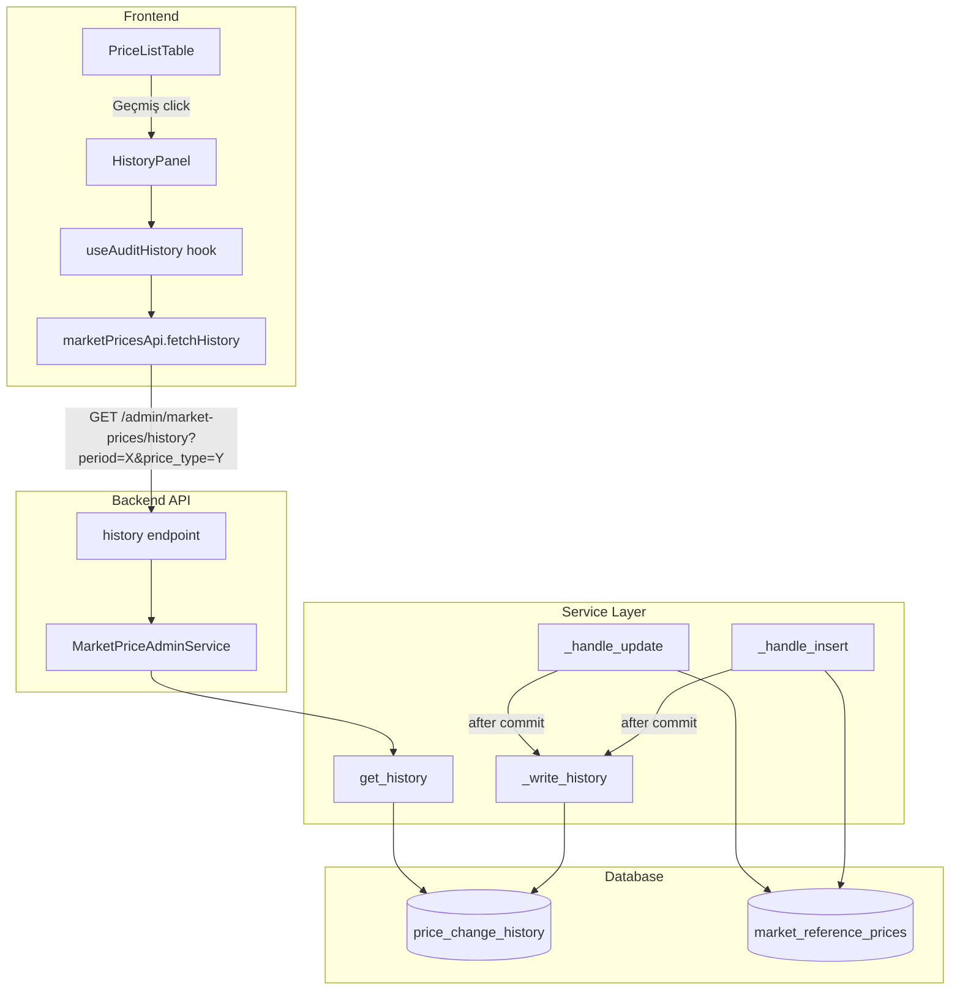

# Design Document: Audit History

## Overview

Piyasa fiyat kayıtlarının değişiklik geçmişini izlemek için append-only bir `price_change_history` tablosu eklenir. Mevcut `MarketPriceAdminService._handle_insert()` ve `_handle_update()` metotlarına history write entegre edilir. `bulk_upsert()` zaten `upsert_price()` üzerinden çalıştığı için ayrı bir entegrasyon gerekmez. Frontend'de tablo satırlarına "Geçmiş" butonu eklenerek bir panel/modal ile geçmiş görüntülenir.

## Architecture



### Entegrasyon Stratejisi

History write, `_handle_insert()` ve `_handle_update()` metotlarının **commit sonrası** başarılı path'ine eklenir. Bu yaklaşımın avantajları:

1. `bulk_upsert()` → `upsert_price()` → `_handle_insert()`/`_handle_update()` zinciri sayesinde bulk import otomatik olarak history alır
2. No-op detection (`old_value == new_value and old_status == new_status`) zaten `_handle_update()` içinde erken return yapıyor, dolayısıyla history yazılmaz
3. Hata durumunda (rollback path) history yazılmaz çünkü commit sonrası bloğa ulaşılmaz

### Tutarlılık Politikası (Locked Invariant)

Audit/history yazımı **best-effort** olarak çalışır. İki ayrı commit ile gerçekleştirilir:

- **Commit #1**: Primary write (price upsert) — başarılı olursa devam
- **Commit #2**: Audit history write — başarısız olursa `db.rollback()` + `logger.warning()`, primary write geri alınmaz

Bu demektir ki:
- Audit fail → primary success devam eder (commit #1 success, commit #2 fail)
- Primary fail → audit'e hiç ulaşılmaz (commit #1 fail → rollback → return)
- Audit failure metric/log ile görünür, sessizce kaybolmaz

**Fail-closed alternatifi bilinçli olarak reddedilmiştir.** Tek transaction'da audit + primary yazmak, audit tablosu sorunlarında (disk full, schema migration, vb.) primary write'ları da bloklar. Observability yüzünden prod'u bozma kuralı burada da geçerlidir.

## Components and Interfaces

### Backend Components

#### 1. `PriceChangeHistory` SQLAlchemy Model (`backend/app/database.py`)

```python
class PriceChangeHistory(Base):
    __tablename__ = "price_change_history"

    id = Column(Integer, primary_key=True, index=True)
    price_record_id = Column(Integer, ForeignKey("market_reference_prices.id"), nullable=False, index=True)
    price_type = Column(String(20), nullable=False)
    period = Column(String(7), nullable=False)
    action = Column(String(10), nullable=False)  # "INSERT" | "UPDATE"
    old_value = Column(Float, nullable=True)      # NULL for INSERT
    new_value = Column(Float, nullable=False)
    old_status = Column(String(20), nullable=True) # NULL for INSERT
    new_status = Column(String(20), nullable=False)
    change_reason = Column(Text, nullable=True)
    updated_by = Column(String(100), nullable=True)
    source = Column(String(30), nullable=True)
    created_at = Column(DateTime, default=datetime.utcnow)
```

#### 2. `_write_history()` Private Method (`MarketPriceAdminService`)

```python
def _write_history(
    self,
    db: Session,
    record: MarketReferencePrice,
    action: str,           # "INSERT" | "UPDATE"
    old_value: Optional[float],
    new_value: float,
    old_status: Optional[str],
    new_status: str,
    change_reason: Optional[str],
    updated_by: Optional[str],
    source: Optional[str],
) -> None:
    """Append-only history write. Errors are logged, never raised."""
```

#### 3. `get_history()` Method (`MarketPriceAdminService`)

```python
def get_history(
    self,
    db: Session,
    period: str,
    price_type: str = "PTF",
) -> Optional[list[PriceChangeHistory]]:
    """
    Returns history records for a period+price_type.
    Returns None if the price record doesn't exist (→ 404).
    Returns [] if record exists but no history (→ 200 with empty list).
    """
```

#### 4. History API Endpoint (`backend/app/main.py`)

```python
@app.get("/admin/market-prices/history")
async def get_price_history(
    period: str,
    price_type: str = "PTF",
    db: Session = Depends(get_db),
    _: str = Depends(require_admin_key),
):
    """
    GET /admin/market-prices/history?period=2025-01&price_type=PTF
    
    Returns:
      200: { status: "ok", period, price_type, history: [...] }
      404: { status: "error", error_code: "RECORD_NOT_FOUND", message: "..." }
    """
```

### Frontend Components

#### 5. `AuditHistoryEntry` TypeScript Interface (`types.ts`)

```typescript
export interface AuditHistoryEntry {
  id: number;
  action: 'INSERT' | 'UPDATE';
  old_value: number | null;
  new_value: number;
  old_status: string | null;
  new_status: string;
  change_reason: string | null;
  updated_by: string | null;
  source: string | null;
  created_at: string;  // ISO 8601
}

export interface AuditHistoryResponse {
  status: 'ok';
  period: string;
  price_type: string;
  history: AuditHistoryEntry[];
}
```

#### 6. `fetchHistory()` API Function (`marketPricesApi.ts`)

```typescript
export async function fetchHistory(
  period: string,
  priceType: string = 'PTF',
  signal?: AbortSignal,
): Promise<AuditHistoryResponse> {
  const response = await adminApi.get<AuditHistoryResponse>(
    '/admin/market-prices/history',
    { params: { period, price_type: priceType }, signal },
  );
  return response.data;
}
```

#### 7. `useAuditHistory` Hook (`hooks/useAuditHistory.ts`)

Mevcut `useMarketPricesList` pattern'ini takip eder: `useState` + `useEffect` + `AbortController`. Period ve priceType parametreleri ile tetiklenir.

```typescript
export function useAuditHistory(period: string | null, priceType: string) {
  // Returns: { history, loading, error }
  // Fetches when period is non-null
}
```

#### 8. `HistoryPanel` Component (`HistoryPanel.tsx`)

Modal veya slide-over panel olarak açılır. Her Change_Event'i bir kart/satır olarak gösterir:
- Action badge (INSERT → yeşil, UPDATE → mavi)
- Eski değer → Yeni değer (ok ile)
- Status değişikliği
- Değişiklik nedeni
- Kim tarafından, ne zaman

#### 9. `PriceListTable` Entegrasyonu

`renderCell()` fonksiyonundaki `action` sütununa "Geçmiş" butonu eklenir. `PriceListTableProps`'a `onHistory: (record: MarketPriceRecord) => void` callback eklenir.

#### 10. `MarketPricesTab` Entegrasyonu

History panel state yönetimi eklenir: `selectedHistoryRecord` state + `handleHistory` callback.

## Data Models

### price_change_history Table

| Column | Type | Nullable | Description |
|--------|------|----------|-------------|
| id | Integer (PK) | No | Auto-increment |
| price_record_id | Integer (FK) | No | → market_reference_prices.id |
| price_type | String(20) | No | Denormalized for query performance |
| period | String(7) | No | Denormalized for query performance |
| action | String(10) | No | "INSERT" or "UPDATE" |
| old_value | Float | Yes | NULL for INSERT |
| new_value | Float | No | Yeni PTF değeri (TL/MWh) |
| old_status | String(20) | Yes | NULL for INSERT |
| new_status | String(20) | No | Yeni status |
| change_reason | Text | Yes | Değişiklik nedeni |
| updated_by | String(100) | Yes | İşlemi yapan kullanıcı |
| source | String(30) | Yes | epias_manual, epias_api, etc. |
| created_at | DateTime | No | History kaydının oluşturulma zamanı |

### Denormalization Kararı

`price_type` ve `period` alanları `market_reference_prices` tablosunda zaten mevcut olmasına rağmen `price_change_history` tablosunda da tutulur. Sebep: History sorgusu `price_record_id` üzerinden JOIN yapmak yerine doğrudan `price_type + period` ile filtreleme yapabilir. Bu, sorgu performansını artırır ve API endpoint'ini basitleştirir.


## Correctness Properties

*A property is a characteristic or behavior that should hold true across all valid executions of a system — essentially, a formal statement about what the system should do. Properties serve as the bridge between human-readable specifications and machine-verifiable correctness guarantees.*

### Property 1: Upsert history write correctness

*For any* valid market price input (insert or update), if the upsert operation succeeds with `changed=True`, then exactly one new `PriceChangeHistory` record SHALL exist with: correct `action` ("INSERT" for creates, "UPDATE" for updates), `new_value` matching the submitted value, `new_status` matching the submitted status, and for updates, `old_value` and `old_status` matching the previous record state.

**Validates: Requirements 1.1, 1.2**

### Property 2: No-op produces no history

*For any* existing Price_Record, if an upsert is submitted with the same value and same status as the current record, the total count of `PriceChangeHistory` records for that period+price_type SHALL remain unchanged.

**Validates: Requirements 1.3**

### Property 3: History ordering invariant

*For any* period+price_type combination with N history records, the History_API response SHALL return records where for all consecutive pairs (i, i+1), `history[i].created_at >= history[i+1].created_at` (descending order).

**Validates: Requirements 3.1**

### Property 4: History panel renders all required fields

*For any* `AuditHistoryEntry` object, the rendered History_Panel output SHALL contain the action type, old_value (if UPDATE), new_value, old_status (if UPDATE), new_status, change_reason (if present), updated_by, and created_at timestamp.

**Validates: Requirements 4.2**

## Error Handling

| Senaryo | Davranış |
|---------|----------|
| History write DB hatası | Log error, parent upsert başarılı döner (Req 1.5) |
| GET /history — kayıt yok | 404 `RECORD_NOT_FOUND` (Req 3.3) |
| GET /history — geçmiş yok | 200 `{ history: [] }` (Req 3.4) |
| GET /history — X-Admin-Key eksik | 401 Unauthorized (Req 3.5) |
| GET /history — geçersiz period formatı | 400 `INVALID_PERIOD` |
| Frontend API hatası | History_Panel hata mesajı gösterir (Req 4.4) |

## Testing Strategy

### Property-Based Testing (Hypothesis — Python)

Proje zaten Hypothesis kullanıyor (`.hypothesis/` dizini mevcut). Her property testi minimum 100 iterasyon çalıştırılır.

| Test | Property | Konfigürasyon |
|------|----------|---------------|
| `test_upsert_creates_history` | Property 1 | `@given(valid_price_input())` — INSERT ve UPDATE path'leri |
| `test_noop_no_history` | Property 2 | `@given(existing_record_with_same_input())` |
| `test_history_ordering` | Property 3 | `@given(period_with_multiple_changes())` |

Her test, design property referansı ile tag'lenir:
```python
# Feature: audit-history, Property 1: Upsert history write correctness
```

### Unit Testing

**Backend (pytest):**
- `_write_history()` INSERT path — doğru alanlar yazılıyor mu
- `_write_history()` UPDATE path — old/new değerler doğru mu
- `_write_history()` hata durumu — exception yakalanıp loglanıyor mu
- `get_history()` — kayıt yok → None, geçmiş yok → [], geçmiş var → sıralı liste
- API endpoint — 404, 200 empty, 200 with data, 401 unauthorized
- `price_type` default "PTF" davranışı

**Frontend (vitest):**
- `useAuditHistory` hook — loading, success, error states
- `HistoryPanel` — renders entries, loading state, error state, empty state
- `PriceListTable` — "Geçmiş" butonu render ve click callback
- `fetchHistory()` — doğru URL ve parametreler

### Test Dosya Yapısı

```
backend/tests/test_audit_history.py          # Unit tests
backend/tests/test_audit_history_properties.py  # Property-based tests
frontend/src/market-prices/__tests__/HistoryPanel.test.tsx
frontend/src/market-prices/__tests__/useAuditHistory.test.ts
```
