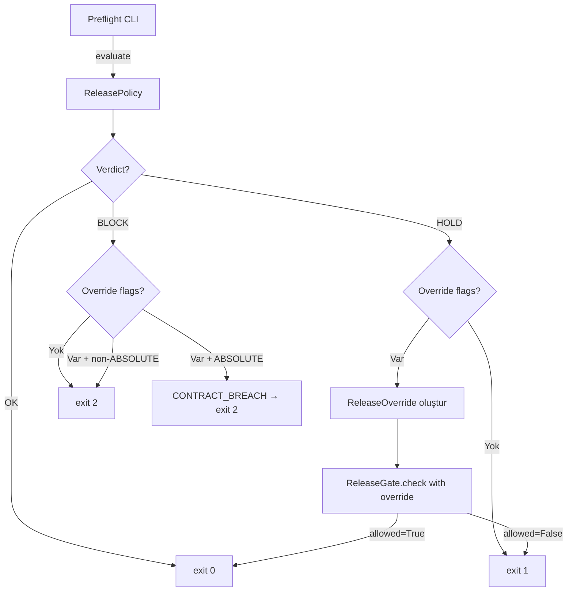

# Tasarım: CI Enforcement Mode — PR-16

## Genel Bakış

PR-16, release governance preflight kontrolünü CI'da raporlama modundan zorunlu (enforcing) moda geçirir. Mevcut `continue-on-error: true` kaldırılır; preflight exit code'u doğrudan job başarı/başarısızlığını belirler. HOLD verdict'leri için CLI override mekanizması eklenir; BLOCK verdict'leri (özellikle ABSOLUTE_BLOCK_REASONS) asla override edilemez.

Tasarım felsefesi: yeni karar mantığı yok. Mevcut ReleaseGate override mekanizması CLI katmanına taşınır. Preflight CLI thin wrapper olmaya devam eder.

## Mimari

### Mevcut Zincir (PR-15)

```
ReleasePolicy.evaluate(input)
    → ReleasePolicyResult (verdict + reasons)
        → ReleaseReportGenerator.generate(result, input)
            → ReleaseReport (artifact)
                → ReleaseGate.check(result, scope, now_ms)
                    → GateDecision (allowed/denied)
                        → stdout + exit code
```

### PR-16 Değişiklik

```
Preflight CLI (PR-16 genişletme)
    ├── Mevcut akış (override yok) → aynı davranış
    └── Override akışı (--override-reason/scope/by sağlandığında):
        ├── verdict == OK → override yok sayılır, exit 0
        ├── verdict == HOLD → ReleaseOverride oluştur → ReleaseGate.check(override=...) → exit 0/1
        └── verdict == BLOCK + ABSOLUTE → override reddedilir, CONTRACT_BREACH, exit 2
```

### Bileşen Diyagramı



## Bileşenler ve Arayüzler

### 1. Preflight CLI Genişletmesi (`release_preflight.py`)

Mevcut `run_preflight()` fonksiyonuna override parametreleri eklenir:

```python
def run_preflight(
    json_mode: bool = False,
    output_dir: str | None = None,
    override_reason: str | None = None,   # YENİ
    override_scope: str | None = None,    # YENİ
    override_by: str | None = None,       # YENİ
) -> int:
```

**Override akışı:**

```python
# Mevcut akış: policy evaluate → report generate → gate check
# ...mevcut kod...

# PR-16 ekleme: override flag'leri sağlandıysa ve verdict HOLD ise
override = _build_override(override_reason, override_scope, override_by)
if override is not None and result.verdict == ReleaseVerdict.RELEASE_HOLD:
    decision = gate.check(result, override=override, release_scope="preflight", now_ms=now_ms)
    if decision.allowed:
        exit_code = _EXIT_OK
    # else: exit_code zaten _EXIT_HOLD

# BLOCK + override → CONTRACT_BREACH kontrolü (ReleaseGate zaten yapıyor)
if override is not None and result.verdict == ReleaseVerdict.RELEASE_BLOCK:
    decision = gate.check(result, override=override, release_scope="preflight", now_ms=now_ms)
    # exit_code her zaman _EXIT_BLOCK kalır (BLOCK asla override edilemez)
```

**Yeni yardımcı fonksiyon:**

```python
def _build_override(
    reason: str | None,
    scope: str | None,
    created_by: str | None,
) -> ReleaseOverride | None:
    """Üç flag da sağlandıysa ReleaseOverride oluştur, aksi halde None."""
    if not all([reason, scope, created_by]):
        return None
    return ReleaseOverride(
        ttl_seconds=3600,       # 1 saat — CI override için yeterli
        created_at_ms=_now_ms(),
        scope=scope,
        reason=reason,
        created_by=created_by,
    )
```

**Yeni argparse flag'leri:**

```python
parser.add_argument("--override-reason", type=str, default=None)
parser.add_argument("--override-scope", type=str, default=None)
parser.add_argument("--override-by", type=str, default=None)
```

### 2. CI Workflow Güncellemesi (`release-governance.yml`)

**Değişiklik 1:** `continue-on-error: true` kaldırılır.

**Değişiklik 2:** `workflow_dispatch` event'i ve input'ları eklenir:

```yaml
on:
  workflow_dispatch:
    inputs:
      override_reason:
        description: 'HOLD override nedeni'
        required: false
        type: string
      override_scope:
        description: 'Override kapsamı (release identifier)'
        required: false
        type: string
      override_by:
        description: 'Override onaylayan kişi'
        required: false
        type: string
  push:
    paths: [...]
  pull_request:
    paths: [...]
```

**Değişiklik 3:** Preflight adımı override flag'lerini iletir:

```yaml
- name: Run preflight (enforcement mode)
  id: preflight
  run: |
    OVERRIDE_ARGS=""
    if [ -n "${{ github.event.inputs.override_reason }}" ]; then
      OVERRIDE_ARGS="--override-reason '${{ github.event.inputs.override_reason }}'"
      OVERRIDE_ARGS="$OVERRIDE_ARGS --override-scope '${{ github.event.inputs.override_scope }}'"
      OVERRIDE_ARGS="$OVERRIDE_ARGS --override-by '${{ github.event.inputs.override_by }}'"
    fi
    python -m backend.app.testing.release_preflight \
      --json \
      --output-dir artifacts/ \
      $OVERRIDE_ARGS
```

**Değişiklik 4:** Step summary'ye override bilgisi eklenir.

### 3. JSON Çıktı Genişletmesi

Override kullanıldığında JSON çıktıya ek alanlar:

```json
{
  "verdict": "release_hold",
  "exit_code": 0,
  "override_applied": true,
  "override_by": "user@example.com",
  "override_reason": "Flaky test bilinen sorun, hotfix gerekli",
  "contract_breach": false
}
```

BLOCK + override girişiminde:

```json
{
  "verdict": "release_block",
  "exit_code": 2,
  "override_applied": false,
  "contract_breach": true,
  "contract_breach_detail": "CONTRACT_BREACH_NO_OVERRIDE: GUARD_VIOLATION, OPS_GATE_FAIL"
}
```

## Veri Modelleri

### Mevcut (değişiklik yok)

- `ReleaseOverride` (release_gate.py) — ttl_seconds, created_at_ms, scope, reason, created_by
- `GateDecision` (release_gate.py) — allowed, verdict, reasons, override_applied, audit_detail
- `ReleasePolicyResult` (release_policy.py) — verdict, reasons, required_actions, details

### Yeni Sabitler (release_preflight.py)

```python
_OVERRIDE_TTL_SECONDS = 3600  # CI override için varsayılan TTL
```

### JSON Çıktı Şeması Genişletmesi

Mevcut alanlar korunur, yeni alanlar eklenir:

| Alan | Tip | Açıklama | Koşul |
|---|---|---|---|
| `override_applied` | bool | Override uygulandı mı | Her zaman |
| `override_by` | string \| null | Override onaylayan | Override sağlandığında |
| `override_reason` | string \| null | Override nedeni | Override sağlandığında |
| `contract_breach` | bool | Sözleşme ihlali var mı | Her zaman |
| `contract_breach_detail` | string \| null | İhlal detayı | contract_breach=true |


## Doğruluk Özellikleri (Correctness Properties)

*Bir özellik (property), bir sistemin tüm geçerli yürütmelerinde doğru olması gereken bir davranış veya karakteristiktir — esasen, sistemin ne yapması gerektiğine dair biçimsel bir ifadedir. Özellikler, insan tarafından okunabilir spesifikasyonlar ile makine tarafından doğrulanabilir doğruluk garantileri arasındaki köprüdür.*

### Property 1: Kısmi override flag'leri override'ı tetiklemez

*Herhangi bir* override flag alt kümesi için (üçünden azı sağlandığında), preflight'ın döndürdüğü exit code, hiç override flag'i sağlanmamış durumla aynı olmalıdır.

**Validates: Requirements 2.4**

### Property 2: BLOCK verdict'i override'dan bağımsızdır

*Herhangi bir* BLOCK verdict'i üreten input için, override flag'lerinin varlığı veya yokluğundan bağımsız olarak, preflight her zaman exit code 2 döndürmelidir.

**Validates: Requirements 3.3**

## Hata Yönetimi

### Override Flag Hataları

| Durum | Davranış |
|---|---|
| Kısmi flag (1 veya 2 tanesi sağlanmış) | Override yok sayılır, normal akış devam eder |
| Boş string flag değeri | Flag sağlanmamış gibi davranılır |
| Üç flag da sağlanmış + verdict OK | Override yok sayılır (gereksiz) |
| Üç flag da sağlanmış + verdict BLOCK | Override reddedilir, CONTRACT_BREACH (ABSOLUTE ise) veya yok sayılır |

### Exit Code Sözleşmesi (Değişiklik Yok)

| Exit Code | Anlam | Override Etkisi |
|---|---|---|
| 0 | RELEASE_OK | Override gereksiz |
| 1 | RELEASE_HOLD | Override ile 0'a dönebilir |
| 2 | RELEASE_BLOCK | Override ile değişmez |
| 64 | Usage error | Override ile ilgisiz |

### CONTRACT_BREACH Senaryosu

BLOCK + ABSOLUTE_BLOCK_REASONS + override flag'leri sağlandığında:
1. ReleaseGate.check() `CONTRACT_BREACH_NO_OVERRIDE` audit kaydı oluşturur
2. Preflight çıktısında `contract_breach: true` ve detay gösterilir
3. Exit code 2 kalır — değişmez

## Test Stratejisi

### Genel Yaklaşım

Bu PR ince bir CI entegrasyon katmanıdır. Yeni karar mantığı yoktur — mevcut ReleaseGate override mekanizması CLI'ya taşınır. Bu nedenle:

- **Unit testler**: Spesifik senaryolar, edge case'ler, hata koşulları
- **Property testler**: Bu PR için gerekli değil (PBT kütüphanesi kullanılmayacak). İki property, parametrize edilmiş pytest testleri ile doğrulanacak.

### Test Dosyası

Mevcut `backend/tests/test_release_preflight.py` dosyasına yeni test sınıfları eklenir.

### Test Planı

**Unit Testler (example-based):**

1. HOLD verdict + tam override → exit 0 (Req 2.2, 2.3)
2. HOLD verdict + override yok → exit 1 (Req 5.2)
3. BLOCK + ABSOLUTE + override → exit 2 + CONTRACT_BREACH (Req 3.1, 3.2)
4. OK verdict + override → exit 0, override yok sayılır (Req 2.5)
5. YAML: continue-on-error kaldırılmış (Req 1.4)
6. YAML: workflow_dispatch input'ları mevcut (Req 4.1)
7. YAML: artifact upload korunmuş (Req 1.5)

**Parametrize Testler (property-like):**

8. Kısmi override flag kombinasyonları → override yok sayılır (Property 1, Req 2.4)
   - Parametreler: (reason, None, None), (None, scope, None), (None, None, by), (reason, scope, None), (reason, None, by), (None, scope, by)
9. BLOCK verdict + çeşitli override durumları → her zaman exit 2 (Property 2, Req 3.3)
   - Parametreler: override yok, tam override, kısmi override

### Test Konfigürasyonu

- Framework: pytest
- Mocking: HOLD verdict üretmek için `_build_dry_run_input` yerine kontrollü input kullanılacak
- YAML testleri: `yaml.safe_load` ile parse edip yapısal doğrulama
