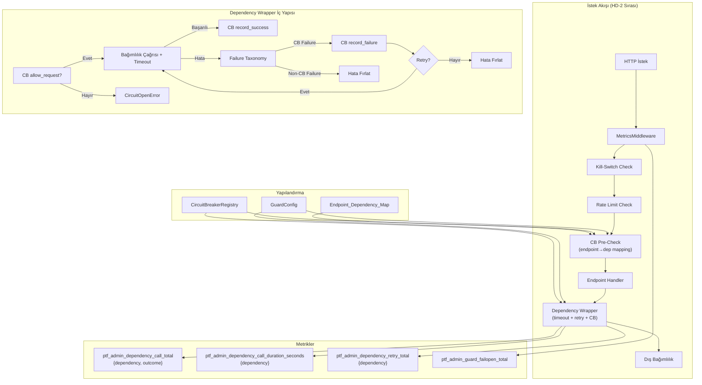

# Tasarım Dokümanı — Dependency Wrappers

## Genel Bakış

Dependency Wrappers, PTF Admin sistemindeki dış bağımlılık çağrılarını (DB, external API, cache) standart bir sarmalayıcı katmanla koruma altına alır. Mevcut `CircuitBreaker` ve `CircuitBreakerRegistry` altyapısını istek yoluna bağlar, endpoint→dependency eşlemesi oluşturur ve iki seviyeli koruma sağlar:

1. **Middleware CB Pre-Check**: İstek geldiğinde endpoint'in bağımlılıklarının CB durumunu kontrol eder; OPEN ise 503 döner
2. **Handler-Level Wrapper**: Gerçek bağımlılık çağrısını sarar; timeout, retry, CB record_success/record_failure entegrasyonu

Mevcut ops-guard tasarım kararları (HD-1 ile HD-7) korunur. Guard zinciri sırası değişmez: KillSwitch → RateLimiter → CircuitBreaker → Handler.

---

## Kilitlenmiş Tasarım Kararları (Dependency Wrappers)

### DW-1: Retry Sadece İdempotent Operasyonlarda

Retry yalnızca read/idempotent operasyonlarda (GET) aktiftir. Write/transaction path'lerde (POST, PUT, DELETE, PATCH) retry default kapalıdır (`wrapper_retry_on_write=False`). Aksi halde double-write riski oluşur.

Max retry küçük tutulur (1–2) ve exponential backoff + jitter uygulanır (fırtına etkisi önlenir).

### DW-2: CB Pre-Check Flag ile Kontrollü

`OPS_GUARD_CB_PRECHECK_ENABLED=true/false` (default: `true`).

Koşullu dependency seçimi olan endpoint'lerde (örn. cache hit/miss'e göre DB'ye giden/gitmeyen) pre-check yanlış deny üretebilir. Flag kapalıyken sadece wrapper-level enforcement kalır.

Pre-check yalnızca deterministik mapping endpoint'lerinde güvenlidir.

### DW-3: Wrapper İç Hatası → Fail-Open + Metrik

Wrapper'ın kendi kodu (CB entegrasyonu, metrik yazımı vb.) exception fırlatırsa:
- İsteği engelleme (fail-open)
- `ptf_admin_guard_failopen_total` counter artır
- `ERROR` seviyesinde log yaz

CB OPEN → `CircuitOpenError` (beklenen, tasarım gereği) ile wrapper bug → fail-open (beklenmeyen) ayrımı net tutulur.

### DW-4: Failure Taxonomy Tek Dosyada Kilitli

Tüm exception→CB failure sınıflandırması `backend/app/guards/failure_taxonomy.py`'de merkezileştirilir. Wrapper'lar kendi sınıflandırması yapmaz; her zaman `is_cb_failure()` fonksiyonunu çağırır.

Bu, taxonomy değişikliğinin tek noktadan yapılmasını ve test edilmesini sağlar.

---

## Mimari



## Bileşenler ve Arayüzler

### 1. Endpoint Dependency Map (`backend/app/guards/endpoint_dependency_map.py`)

Statik eşleme: hangi endpoint şablonu hangi `Dependency` enum değerlerine bağlı.

```python
from .circuit_breaker import Dependency

# Endpoint şablonu → bağımlılık listesi
ENDPOINT_DEPENDENCY_MAP: dict[str, list[Dependency]] = {
    # Market prices CRUD — DB primary
    "/admin/market-prices": [Dependency.DB_PRIMARY],
    "/admin/market-prices/{period}": [Dependency.DB_PRIMARY],
    
    # Import — DB primary + import worker
    "/admin/market-prices/import/preview": [Dependency.DB_PRIMARY, Dependency.IMPORT_WORKER],
    "/admin/market-prices/import/apply": [Dependency.DB_PRIMARY, Dependency.IMPORT_WORKER],
    
    # Lookup — DB replica + cache
    "/admin/market-prices/lookup": [Dependency.DB_REPLICA, Dependency.CACHE],
    
    # Invoice analysis — external API (OpenAI)
    "/analyze-invoice": [Dependency.EXTERNAL_API],
    "/calculate-offer": [Dependency.DB_PRIMARY],
}


def get_dependencies(endpoint_template: str) -> list[Dependency]:
    """
    Endpoint şablonuna göre bağımlılık listesini döndür.
    Bilinmeyen endpoint → boş liste (CB pre-check'ten muaf).
    """
    return ENDPOINT_DEPENDENCY_MAP.get(endpoint_template, [])
```

Tasarım kararları:
- Statik dict, runtime'da değişmez
- Bilinmeyen endpoint → boş liste → CB pre-check atlanır (fail-open)
- Yalnızca mevcut `Dependency` enum değerleri kullanılır (HD-5)

### 2. Failure Taxonomy (`backend/app/guards/failure_taxonomy.py`)

Merkezi hata sınıflandırması: hangi exception'lar CB failure sayılır.

```python
import httpx  # veya kullanılan HTTP client

# CB failure olarak sayılan exception türleri
CB_FAILURE_EXCEPTIONS: tuple[type[Exception], ...] = (
    TimeoutError,
    ConnectionError,
    ConnectionRefusedError,
    OSError,  # ConnectionError'ın parent'ı, socket hataları
)

# CB failure olarak SAYILMAYAN HTTP status code'ları
CB_NON_FAILURE_STATUS_CODES: frozenset[int] = frozenset({
    400, 401, 403, 404, 405, 409, 422,  # Client hataları
    429,  # Rate-limited — mevcut tasarım kararı
})


def is_cb_failure(exc: Exception) -> bool:
    """
    Exception'ın CB failure olarak sayılıp sayılmayacağını belirle.
    
    CB failure: TimeoutError, ConnectionError, ConnectionRefusedError, HTTP 5xx
    CB non-failure: HTTP 4xx (429 dahil), ValueError, ValidationError
    """
    if isinstance(exc, CB_FAILURE_EXCEPTIONS):
        return True
    
    # HTTP yanıt hatası kontrolü (httpx veya benzeri)
    if hasattr(exc, 'response') and hasattr(exc.response, 'status_code'):
        status = exc.response.status_code
        if status >= 500:
            return True
        return False
    
    return False


def is_cb_failure_status(status_code: int) -> bool:
    """HTTP status code'a göre CB failure kontrolü."""
    if status_code >= 500:
        return True
    return False
```

### 3. Dependency Wrapper Base (`backend/app/guards/dependency_wrapper.py`)

Tüm wrapper'ların ortak davranışını tanımlayan base sınıf.

```python
import asyncio
import time
import logging
from typing import TypeVar, Callable, Awaitable

from .circuit_breaker import CircuitBreaker, CircuitBreakerRegistry, Dependency
from .failure_taxonomy import is_cb_failure
from ..guard_config import GuardConfig
from ..ptf_metrics import PTFMetrics

logger = logging.getLogger(__name__)
T = TypeVar("T")


class CircuitOpenError(Exception):
    """CB OPEN durumunda fırlatılır."""
    def __init__(self, dependency: str):
        self.dependency = dependency
        super().__init__(f"Circuit breaker open for {dependency}")


class DependencyWrapper:
    """
    Dış bağımlılık çağrılarını saran base sınıf.
    
    Sorumluluklar:
    - CB allow_request kontrolü
    - Timeout uygulaması
    - Retry politikası (exponential backoff)
    - CB record_success / record_failure
    - Metrik kaydı
    """

    def __init__(
        self,
        dependency: Dependency,
        cb_registry: CircuitBreakerRegistry,
        config: GuardConfig,
        metrics: PTFMetrics,
    ) -> None:
        self._dependency = dependency
        self._cb = cb_registry.get(dependency.value)
        self._config = config
        self._metrics = metrics

    @property
    def dependency_name(self) -> str:
        return self._dependency.value

    def _get_timeout(self) -> float:
        """Bağımlılık türüne göre timeout değerini döndür."""
        timeouts = {
            Dependency.DB_PRIMARY: self._config.wrapper_timeout_db,
            Dependency.DB_REPLICA: self._config.wrapper_timeout_db,
            Dependency.CACHE: self._config.wrapper_timeout_cache,
            Dependency.EXTERNAL_API: self._config.wrapper_timeout_external_api,
            Dependency.IMPORT_WORKER: self._config.wrapper_timeout_db,
        }
        return timeouts.get(self._dependency, 5.0)

    async def call(
        self, fn: Callable[..., Awaitable[T]], *args, is_write: bool = False, **kwargs
    ) -> T:
        """
        Bağımlılık çağrısını sar: CB check → timeout → retry → metrik.

        DW-1: is_write=True ve wrapper_retry_on_write=False ise retry yapılmaz.
        DW-3: Wrapper iç hatası → fail-open + metrik.
        DW-4: Failure taxonomy is_cb_failure() ile merkezileştirilmiş.
        """
        try:
            return await self._call_inner(fn, *args, is_write=is_write, **kwargs)
        except (CircuitOpenError, asyncio.TimeoutError):
            raise  # Beklenen hatalar — fail-open uygulanmaz
        except Exception as exc:
            # Wrapper iç hatası mı, yoksa dependency hatası mı?
            if is_cb_failure(exc) or isinstance(exc, (TimeoutError, ConnectionError)):
                raise  # Dependency hatası — yukarı fırlat
            # Wrapper bug → fail-open (DW-3)
            logger.error(f"[DEP-WRAPPER] {self.dependency_name} internal error, failing open: {exc}")
            try:
                self._metrics.inc_guard_failopen()
            except Exception:
                pass
            raise

    async def _call_inner(
        self, fn: Callable[..., Awaitable[T]], *args, is_write: bool = False, **kwargs
    ) -> T:
        """İç çağrı döngüsü: CB check → timeout → retry."""
        # DW-1: Write path'te retry kapalı (double-write riski)
        can_retry = not is_write or self._config.wrapper_retry_on_write
        max_retries = self._config.wrapper_max_retries if can_retry else 0
        base_delay = self._config.wrapper_retry_base_delay
        timeout = self._get_timeout()
        last_exc: Exception | None = None

        for attempt in range(1 + max_retries):
            # CB pre-check
            if not self._cb.allow_request():
                self._metrics.inc_dependency_call(self.dependency_name, "circuit_open")
                raise CircuitOpenError(self.dependency_name)

            start = time.monotonic()
            try:
                result = await asyncio.wait_for(fn(*args, **kwargs), timeout=timeout)
                duration = time.monotonic() - start
                self._cb.record_success()
                self._metrics.inc_dependency_call(self.dependency_name, "success")
                self._metrics.observe_dependency_call_duration(self.dependency_name, duration)
                return result

            except asyncio.TimeoutError as exc:
                duration = time.monotonic() - start
                self._metrics.observe_dependency_call_duration(self.dependency_name, duration)
                self._cb.record_failure()
                self._metrics.inc_dependency_call(self.dependency_name, "timeout")
                last_exc = exc

            except Exception as exc:
                duration = time.monotonic() - start
                self._metrics.observe_dependency_call_duration(self.dependency_name, duration)

                if is_cb_failure(exc):
                    self._cb.record_failure()
                    self._metrics.inc_dependency_call(self.dependency_name, "failure")
                    last_exc = exc
                else:
                    # Non-CB failure → retry yapma, direkt fırlat
                    self._metrics.inc_dependency_call(self.dependency_name, "failure")
                    raise

            # Retry kontrolü
            if attempt < max_retries:
                # CB hala açık mı kontrol et
                if not self._cb.allow_request():
                    self._metrics.inc_dependency_call(self.dependency_name, "circuit_open")
                    raise CircuitOpenError(self.dependency_name)

                # Exponential backoff + jitter
                import random
                jitter = random.uniform(0, base_delay * 0.1)
                delay = base_delay * (2 ** attempt) + jitter
                self._metrics.inc_dependency_retry(self.dependency_name)
                logger.warning(
                    f"[DEP-WRAPPER] {self.dependency_name} retry {attempt + 1}/{max_retries}, "
                    f"delay={delay:.2f}s"
                )
                await asyncio.sleep(delay)

        # Tüm retry'lar tükendi
        raise last_exc  # type: ignore[misc]
```

### 4. Concrete Wrapper Sınıfları

Her bağımlılık türü için özelleştirilmiş wrapper. Base sınıftan türer, ek davranış gerekmez (şimdilik). İleride bağımlılık-spesifik logic eklenebilir.

```python
class DBClientWrapper(DependencyWrapper):
    """DB Primary/Replica çağrıları için wrapper."""
    pass

class ExternalAPIClientWrapper(DependencyWrapper):
    """External API (OpenAI vb.) çağrıları için wrapper."""
    pass

class CacheClientWrapper(DependencyWrapper):
    """Cache çağrıları için wrapper."""
    pass
```

Bu sınıflar factory fonksiyonu ile oluşturulur:

```python
def create_wrapper(
    dependency: Dependency,
    cb_registry: CircuitBreakerRegistry,
    config: GuardConfig,
    metrics: PTFMetrics,
) -> DependencyWrapper:
    """Bağımlılık türüne göre uygun wrapper oluştur."""
    wrapper_classes = {
        Dependency.DB_PRIMARY: DBClientWrapper,
        Dependency.DB_REPLICA: DBClientWrapper,
        Dependency.CACHE: CacheClientWrapper,
        Dependency.EXTERNAL_API: ExternalAPIClientWrapper,
        Dependency.IMPORT_WORKER: DBClientWrapper,
    }
    cls = wrapper_classes.get(dependency, DependencyWrapper)
    return cls(dependency, cb_registry, config, metrics)
```

### 5. CB Pre-Check Middleware Entegrasyonu

Mevcut `OpsGuardMiddleware._evaluate_guards()` içindeki yorum satırı aktifleştirilir:

```python
# Mevcut kod (yorum satırı):
# CB is dependency-scoped; pre-check uses endpoint→dependency mapping
# For now: no pre-check wiring (dependencies are call-site wrapped)

# Yeni kod:
def _check_circuit_breaker(self, endpoint_template: str) -> Optional[GuardDenyReason]:
    """CB pre-check: endpoint'in bağımlılıklarının CB durumunu kontrol et."""
    try:
        from .guard_config import get_guard_config
        config = get_guard_config()
        
        # DW-2: Flag kapalıysa pre-check atla
        if not config.cb_precheck_enabled:
            return None
        
        from .guards.endpoint_dependency_map import get_dependencies
        from .main import _get_cb_registry
        
        dependencies = get_dependencies(endpoint_template)
        if not dependencies:
            return None  # Bilinmeyen endpoint → CB pre-check atla
        
        registry = _get_cb_registry()
        for dep in dependencies:
            cb = registry.get(dep.value)
            if not cb.allow_request():
                return GuardDenyReason.CIRCUIT_OPEN
        
        return None  # Tüm CB'ler geçiyor
        
    except Exception as exc:
        # CB pre-check hatası → fail-open + metrik (DW-3)
        logger.error(f"[OPS-GUARD] CB pre-check error, failing open: {exc}")
        try:
            from .ptf_metrics import get_ptf_metrics
            get_ptf_metrics().inc_guard_failopen()
        except Exception:
            pass
        return None
```

### 6. Middleware Fail-Open Metriği

Mevcut `dispatch()` catch-all bloğuna metrik eklenir:

```python
except Exception as exc:
    logger.error(f"[OPS-GUARD] Middleware internal error, failing open: {exc}")
    # YENİ: Fail-open metriği
    try:
        from .ptf_metrics import get_ptf_metrics
        get_ptf_metrics().inc_guard_failopen()
    except Exception:
        pass  # metrik hatası non-fatal
    deny_reason = None
```

### 7. Guard Config Genişletmesi

Mevcut `GuardConfig`'e wrapper ayarları eklenir:

```python
class GuardConfig(BaseSettings):
    # ... mevcut alanlar ...
    
    # Dependency Wrapper Timeout (saniye)
    wrapper_timeout_db: float = 5.0
    wrapper_timeout_external_api: float = 10.0
    wrapper_timeout_cache: float = 2.0
    
    # Retry Politikası
    wrapper_max_retries: int = 2          # toplam 3 deneme
    wrapper_retry_base_delay: float = 0.5  # exponential backoff base (0.5s, 1.0s)
    wrapper_retry_on_write: bool = False   # DW-1: write path'te retry kapalı
    
    # CB Pre-Check
    cb_precheck_enabled: bool = True       # DW-2: flag ile kontrollü
```

### 8. Yeni PTFMetrics Metrikleri

Mevcut `PTFMetrics` sınıfına eklenen yeni metrikler:

```python
# Dependency Wrapper (HD-5: dependency sabit enum, outcome sabit enum)
ptf_admin_dependency_call_total{dependency, outcome}           # Counter
    # outcome: success | failure | timeout | circuit_open
ptf_admin_dependency_call_duration_seconds{dependency}         # Histogram
ptf_admin_dependency_retry_total{dependency}                   # Counter

# Middleware fail-open (label'sız)
ptf_admin_guard_failopen_total                                 # Counter
```

Kardinalite bütçesi (HD-5):
| Metrik | Label'lar | Max Kardinalite |
|---|---|---|
| `ptf_admin_dependency_call_total` | `dependency` (5) × `outcome` (4) | 20 |
| `ptf_admin_dependency_call_duration_seconds` | `dependency` (5) | 5 |
| `ptf_admin_dependency_retry_total` | `dependency` (5) | 5 |
| `ptf_admin_guard_failopen_total` | (yok) | 1 |

## Veri Modelleri

### Endpoint Dependency Map (Statik Dict)

```python
ENDPOINT_DEPENDENCY_MAP: dict[str, list[Dependency]] = {
    "/admin/market-prices": [Dependency.DB_PRIMARY],
    "/admin/market-prices/{period}": [Dependency.DB_PRIMARY],
    "/admin/market-prices/import/preview": [Dependency.DB_PRIMARY, Dependency.IMPORT_WORKER],
    "/admin/market-prices/import/apply": [Dependency.DB_PRIMARY, Dependency.IMPORT_WORKER],
    "/admin/market-prices/lookup": [Dependency.DB_REPLICA, Dependency.CACHE],
    "/analyze-invoice": [Dependency.EXTERNAL_API],
    "/calculate-offer": [Dependency.DB_PRIMARY],
}
```

### Failure Taxonomy Kuralları

| Exception / Status | CB Failure? | Gerekçe |
|---|---|---|
| `TimeoutError` | Evet | Bağımlılık yanıt vermiyor |
| `ConnectionError` | Evet | Bağımlılık erişilemez |
| `ConnectionRefusedError` | Evet | Bağımlılık reddediyor |
| HTTP 5xx | Evet | Bağımlılık sunucu hatası |
| HTTP 429 | Hayır | Rate-limited, bağımlılık hatası değil |
| HTTP 4xx (429 hariç) | Hayır | İstemci hatası |
| `ValueError` | Hayır | Uygulama hatası |
| `ValidationError` | Hayır | Uygulama hatası |

### GuardConfig Yeni Alanları

```python
# Ortam değişkeni → GuardConfig alanı
OPS_GUARD_WRAPPER_TIMEOUT_DB       → wrapper_timeout_db: float = 5.0
OPS_GUARD_WRAPPER_TIMEOUT_EXTERNAL_API → wrapper_timeout_external_api: float = 10.0
OPS_GUARD_WRAPPER_TIMEOUT_CACHE    → wrapper_timeout_cache: float = 2.0
OPS_GUARD_WRAPPER_MAX_RETRIES      → wrapper_max_retries: int = 2
OPS_GUARD_WRAPPER_RETRY_BASE_DELAY → wrapper_retry_base_delay: float = 0.5
OPS_GUARD_WRAPPER_RETRY_ON_WRITE   → wrapper_retry_on_write: bool = False  (DW-1)
OPS_GUARD_CB_PRECHECK_ENABLED      → cb_precheck_enabled: bool = True      (DW-2)
```


## Doğruluk Özellikleri (Correctness Properties)

*Bir özellik (property), sistemin tüm geçerli çalışmalarında doğru kalması gereken bir davranış veya karakteristiktir — esasen, sistemin ne yapması gerektiğine dair biçimsel bir ifadedir. Özellikler, insan tarafından okunabilir spesifikasyonlar ile makine tarafından doğrulanabilir doğruluk garantileri arasında köprü görevi görür.*

### Property 1: Endpoint Dependency Map Geçerliliği

*For any* endpoint şablonu Endpoint_Dependency_Map'te tanımlıysa, dönen bağımlılık listesindeki her eleman geçerli bir `Dependency` enum üyesi olmalı ve liste boş olmamalıdır. Map'te tanımlı olmayan endpoint'ler için boş liste dönmelidir.

**Validates: Requirements 1.1, 1.2, 1.3**

### Property 2: CB Pre-Check Karar Doğruluğu

*For any* endpoint şablonu ve bağımlılık CB durumu kombinasyonu, CB pre-check şu kurala uymalıdır: endpoint'in bağımlılıklarından herhangi birinin CB'si OPEN ise → `CIRCUIT_OPEN` deny reason dönmeli; tüm CB'ler CLOSED veya HALF_OPEN ise → `None` dönmeli (istek geçmeli).

**Validates: Requirements 2.1, 2.2, 2.3**

### Property 3: Guard Zinciri Sırası Korunması

*For any* istek, KillSwitch deny döndüğünde CB pre-check çağrılmamalı; RateLimiter deny döndüğünde CB pre-check çağrılmamalı. CB pre-check yalnızca KillSwitch ve RateLimiter geçtikten sonra çalışmalıdır.

**Validates: Requirements 2.5**

### Property 4: Wrapper CB Entegrasyonu

*For any* dependency wrapper çağrısı, başarılı çağrıda `record_success()` çağrılmalı, Failure_Taxonomy'de CB failure olarak sınıflandırılan hatalarda `record_failure()` çağrılmalı, CB OPEN durumunda çağrı yapılmadan `CircuitOpenError` fırlatılmalıdır.

**Validates: Requirements 3.2, 3.3, 3.4**

### Property 5: Failure Taxonomy Sınıflandırma Tutarlılığı

*For any* exception türü, `is_cb_failure()` fonksiyonu şu kurala uymalıdır: `TimeoutError`, `ConnectionError`, `ConnectionRefusedError` ve HTTP 5xx → `True`; HTTP 4xx (429 dahil), `ValueError`, `ValidationError` → `False`.

**Validates: Requirements 4.1, 4.2, 4.3, 4.4**

### Property 6: Retry Politikası Doğruluğu

*For any* dependency wrapper çağrısı ve CB failure hatası, wrapper en fazla `max_retries` kez retry yapmalı (toplam `1 + max_retries` deneme). CB OPEN durumuna geçildiğinde retry durdurulmalı. Her retry'da `ptf_admin_dependency_retry_total` sayacı artmalıdır.

**Validates: Requirements 5.1, 5.2, 5.4, 5.5**

### Property 7: Wrapper Metrik Kaydı

*For any* dependency wrapper çağrısı, çağrı sonucuna göre `ptf_admin_dependency_call_total{dependency, outcome}` sayacı doğru outcome değeriyle artmalı (`success`, `failure`, `timeout`, `circuit_open`) ve `ptf_admin_dependency_call_duration_seconds{dependency}` histogram'ı güncellenmeli.

**Validates: Requirements 3.6, 3.7**

### Property 8: Guard Config Wrapper Ayarları Round-Trip

*For any* geçerli timeout ve retry değerleri, ilgili ortam değişkenleri (`OPS_GUARD_WRAPPER_*`) set edildiğinde GuardConfig bu değerleri doğru yüklemelidir.

**Validates: Requirements 7.1, 7.2**

## Hata Yönetimi

### CB Pre-Check Hatası
- **Davranış**: Fail-open — istek handler'a iletilir (CB pre-check hatası sistemi durdurmamalı)
- **Log**: `ERROR` seviyesinde hata loglanır
- **Metrik**: `ptf_admin_guard_failopen_total` counter artırılır

### Dependency Wrapper Timeout
- **Davranış**: `asyncio.TimeoutError` yakalanır, CB `record_failure()` çağrılır, retry politikasına göre tekrar denenir
- **Metrik**: `ptf_admin_dependency_call_total{dependency, outcome="timeout"}` artırılır

### Dependency Wrapper CB OPEN
- **Davranış**: `CircuitOpenError` fırlatılır, çağrı yapılmaz
- **Metrik**: `ptf_admin_dependency_call_total{dependency, outcome="circuit_open"}` artırılır

### Dependency Wrapper CB Failure
- **Davranış**: CB `record_failure()` çağrılır, retry politikasına göre tekrar denenir
- **Metrik**: `ptf_admin_dependency_call_total{dependency, outcome="failure"}` artırılır

### Dependency Wrapper Non-CB Failure
- **Davranış**: Exception direkt fırlatılır, retry yapılmaz, CB'ye bildirilmez
- **Metrik**: `ptf_admin_dependency_call_total{dependency, outcome="failure"}` artırılır

### Middleware Catch-All Fail-Open
- **Davranış**: Mevcut fail-open davranışı korunur + metrik eklenir
- **Log**: `ERROR` seviyesinde hata loglanır (mevcut)
- **Metrik**: `ptf_admin_guard_failopen_total` counter artırılır (yeni)

### Guard Config Geçersiz Değer
- **Davranış**: Pydantic varsayılan değerlerle devam edilir (HD-4: ASLA reject etme)
- **Log**: `WARNING` seviyesinde config yükleme hatası loglanır
- **Metrik**: `ptf_admin_guard_config_fallback_total` counter artırılır

## Test Stratejisi

### İkili Test Yaklaşımı

**Property-Based Testler** (Hypothesis — Python):
- Her correctness property için ayrı bir property-based test
- Minimum 100 iterasyon per test
- Her test, tasarım dokümanındaki property numarasını referans eder
- Tag formatı: `Feature: dependency-wrappers, Property N: {property_text}`
- Kütüphane: `hypothesis` (Python backend)
- PBT Perf Rule: `st.from_regex(...)` kullanılmaz; küçük boyut limitleri ile kompozisyonel stratejiler tercih edilir

**Unit Testler** (pytest):
- Spesifik örnekler ve edge case'ler
- Timeout davranışı testi (mock sleep)
- Exponential backoff doğrulaması
- Middleware fail-open metrik testi
- Guard config geçersiz değer fallback testi

### Test Dosya Yapısı

```
backend/tests/
  test_endpoint_dependency_map.py    # Property 1 + unit tests
  test_failure_taxonomy.py           # Property 5 + unit tests
  test_dependency_wrapper.py         # Property 4, 6, 7 + unit tests
  test_cb_precheck.py               # Property 2, 3 + unit tests
  test_guard_config.py              # Property 8 + unit tests (mevcut dosya genişletilir)
  test_ops_guard_middleware.py       # Fail-open metrik testi (mevcut dosya genişletilir)
```

### Property-Based Test Konfigürasyonu

```python
from hypothesis import given, settings, strategies as st

@settings(max_examples=100)
@given(
    dependency=st.sampled_from(list(Dependency)),
    call_succeeds=st.booleans(),
    cb_is_open=st.booleans(),
)
def test_wrapper_cb_integration(dependency, call_succeeds, cb_is_open):
    """Feature: dependency-wrappers, Property 4: Wrapper CB Entegrasyonu"""
    # ... test implementation
```
