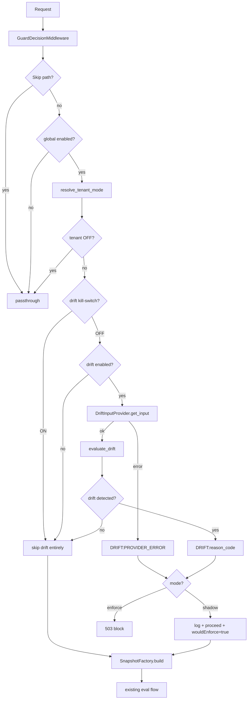

# Tasarım: Drift Guard for Guard Decision Middleware

## Genel Bakış

Mevcut Guard Decision Middleware pipeline'ına drift detection adımı eklenir. Drift guard, request bazında "beklenen davranıştan sapma" tespit eder. Kill-switch ile tamamen devre dışı bırakılabilir (0 call garantisi — side-effect yok).

Değişen/eklenen dosyalar:
- `backend/app/guards/drift_guard.py` — DriftInputProvider, evaluate_drift, DriftDecision, DriftReasonCode
- `backend/app/guard_config.py` — `drift_guard_enabled`, `drift_guard_killswitch` config alanları
- `backend/app/guards/guard_decision_middleware.py` — drift step wiring
- `backend/app/ptf_metrics.py` — `ptf_admin_drift_evaluation_total` counter
- `backend/tests/test_drift_guard.py` — unit + integration testleri

Mevcut dosyalar davranış olarak KORUNUR:
- `SnapshotFactory.build()` — aynı kalır
- `evaluate()` — aynı kalır
- Mevcut PBT'ler (P1–P3, EP-1..EP-3) — geçerliliğini korur

## Mimari



**Kritik tasarım kararı:** Kill-switch check pipeline'ın EN ÜSTÜNDEDİR. "DRIFT:* yok" yetmez — "0 call" şartı burada tasarım seviyesinde garanti edilir. Provider çağrılmaz, evaluator çağrılmaz, metrik basılmaz, telemetry enrichment yapılmaz.

## Bileşenler ve Arayüzler

### 1. DriftReasonCode Enum (`drift_guard.py`)

```python
class DriftReasonCode(str, Enum):
    """Kapalı küme — drift reason code'ları. DRIFT: prefix'i ile kullanılır."""
    PROVIDER_ERROR = "DRIFT:PROVIDER_ERROR"
    THRESHOLD_EXCEEDED = "DRIFT:THRESHOLD_EXCEEDED"
    INPUT_ANOMALY = "DRIFT:INPUT_ANOMALY"
```

3 değer, bounded cardinality. Tüm reason code'lar `DRIFT:` prefix'i taşır.

### 2. DriftInput Dataclass (`drift_guard.py`)

```python
@dataclass(frozen=True)
class DriftInput:
    """Provider'dan gelen drift evaluation input'u. Frozen."""
    endpoint: str
    method: str
    tenant_id: str
    request_signature: str  # request'in normalize edilmiş temsili
    timestamp_ms: int
```

### 3. DriftDecision Dataclass (`drift_guard.py`)

```python
@dataclass(frozen=True)
class DriftDecision:
    """Drift evaluation sonucu. Frozen."""
    is_drift: bool
    reason_code: DriftReasonCode | None = None
    detail: str = ""
    would_enforce: bool = False  # shadow modda "enforce olsaydı block olurdu"
```

### 4. DriftInputProvider Protocol (`drift_guard.py`)

```python
class DriftInputProvider(Protocol):
    def get_input(self, request: Request, endpoint: str, method: str, tenant_id: str) -> DriftInput:
        """Request'ten drift input üretir. Exception → DRIFT:PROVIDER_ERROR."""
        ...
```

Stub implementasyon: `StubDriftInputProvider` — her zaman geçerli `DriftInput` döner (no-drift baseline).

### 5. evaluate_drift Fonksiyonu (`drift_guard.py`)

```python
def evaluate_drift(drift_input: DriftInput) -> DriftDecision:
    """
    Pure function: DriftInput → DriftDecision.
    Stub: her zaman is_drift=False döner.
    Gerçek implementasyon ileride threshold-based olacak.
    """
```

### 6. GuardConfig Güncellemesi

```python
class GuardConfig(BaseSettings):
    # ... mevcut alanlar ...
    drift_guard_enabled: bool = False          # Varsayılan OFF
    drift_guard_killswitch: bool = False       # Kill-switch (ON → 0 call)
```

### 7. Middleware Drift Step Wiring

```python
# guard_decision_middleware.py — _evaluate_decision() içinde
# Tenant mode OFF check'inden SONRA, snapshot build'den ÖNCE:

# ── Drift guard step ──────────────────────────────────────────
drift_reason_codes: list[str] = []
drift_would_enforce = False

if not config.drift_guard_killswitch and config.drift_guard_enabled:
    try:
        drift_input = drift_provider.get_input(request, endpoint, method, tenant_id)
        drift_decision = evaluate_drift(drift_input)
        if drift_decision.is_drift:
            drift_reason_codes.append(drift_decision.reason_code.value)
            drift_would_enforce = True
            _emit_drift_metric(current_mode, "drift_detected")
    except Exception as exc:
        drift_reason_codes.append(DriftReasonCode.PROVIDER_ERROR.value)
        drift_would_enforce = True
        _emit_drift_metric(current_mode, "provider_error")

    # Mode dispatch
    if drift_reason_codes:
        if not is_shadow:  # enforce
            return _build_block_response("OPS_GUARD_DRIFT", drift_reason_codes)
        # shadow: log + proceed
        logger.info(f"[GUARD-DECISION] SHADOW drift: {drift_reason_codes}")
```

### 8. Metrik Güncellemesi

```python
# ptf_metrics.py
self._drift_evaluation_total = Counter(
    "ptf_admin_drift_evaluation_total",
    "Drift guard evaluation outcomes",
    labelnames=["mode", "outcome"],
    registry=self._registry,
)
# outcome: "no_drift" | "drift_detected" | "provider_error"
# mode: "shadow" | "enforce"
# Bounded: 2 × 3 = 6 zaman serisi
```

## Kill-Switch Short-Circuit Garantisi (Hard Invariant)

Kill-switch ON iken drift subsystem tamamen görünmez:

| Bileşen | Kill-switch ON | Disabled | Aktif |
|---|---|---|---|
| `provider.get_input()` | 0 call | 0 call | 1 call |
| `evaluate_drift()` | 0 call | 0 call | 0-1 call |
| drift metrikleri | 0 call | 0 call | 1 call |
| drift telemetry | 0 call | 0 call | 0-1 call |
| `DRIFT:*` reason codes | yok | yok | 0-N |
| `wouldEnforce` (drift kaynaklı) | false | false | true/false |

Bu tablo 4'lü spy testi ile doğrulanır (Task 4.11).

## Hata Yönetimi

| Hata Durumu | Shadow | Enforce | Kill-switch ON |
|---|---|---|---|
| Provider exception | proceed + DRIFT:PROVIDER_ERROR | 503 block | N/A (provider çağrılmaz) |
| Evaluator exception | proceed + DRIFT:PROVIDER_ERROR | 503 block | N/A (evaluator çağrılmaz) |
| Drift detected | proceed + log + wouldEnforce | 503 block | N/A |
| No drift | proceed | proceed | proceed |

## Test Stratejisi

### Unit Test Odağı

- Kill-switch 4'lü spy: provider/evaluator/metrics/telemetry hepsi 0 call
- Provider failure: shadow → proceed + reason, enforce → 503
- Disabled: provider çağrılmaz
- Mode dispatch: shadow log + proceed, enforce 503
- Reason code kapalı küme: sadece DRIFT:* prefix
- wouldEnforce semantiği: shadow+drift → true, disabled → false, kill-switch → false

### Property-Based Testing (opsiyonel)

- DP-1: Kill-switch ON → 0 side-effect (provider/eval/metric/telemetry)
- DP-2: Reason code prefix invariant: tüm drift reason'lar DRIFT: ile başlar
- DP-3: Monotonic safety: drift guard hiçbir koşulda mevcut guard kararını "daha agresif" yapamaz
