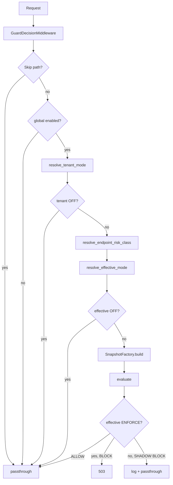

# Tasarım: Endpoint-Class Policy — Risk Sınıfına Göre Kademeli Enforcement

## Genel Bakış

Mevcut Guard Decision Layer'ın tenant-mode çözümlemesinin üzerine endpoint risk sınıfı katmanı eklenir. Tenant mode + risk class birlikte "efektif mod" üretir. Bu, rollout'u gerçek risk seviyesine göre kademelendirmeyi sağlar.

Değişen/eklenen dosyalar:
- `backend/app/guard_config.py` — yeni config alanı (`decision_layer_endpoint_risk_map_json`)
- `backend/app/guards/guard_decision.py` — RiskClass enum, `parse_endpoint_risk_map()`, `resolve_endpoint_risk_class()`, `resolve_effective_mode()`, snapshot güncellemesi
- `backend/app/guards/guard_decision_middleware.py` — efektif mod kullanımı, normalization üzerinden risk class çözümlemesi
- `backend/app/ptf_metrics.py` — `risk_class` label eklenmesi (guard_decision_requests_total, guard_decision_block_total)
- `backend/tests/` — unit + property testleri

Mevcut dosyalar DEĞİŞTİRİLMEZ (davranış korunur):
- `resolve_tenant_mode()` — aynı kalır
- `parse_tenant_modes()` — aynı kalır
- Mevcut PBT'ler (P1–P3, P-C1–P-C5) — geçerliliğini korur

## Mimari



## Bileşenler ve Arayüzler

### 1. RiskClass Enum (`guard_decision.py`)

```python
class RiskClass(str, Enum):
    HIGH = "high"
    MEDIUM = "medium"
    LOW = "low"
```

3 değer, bounded cardinality. Metrik label olarak güvenle kullanılabilir.

### 2. parse_endpoint_risk_map (`guard_decision.py`)

```python
def parse_endpoint_risk_map(raw_json: str) -> dict[str, RiskClass]:
    """
    JSON string → endpoint template → RiskClass eşlemesi.
    
    Fail-open:
    - Geçersiz JSON → boş dict + log
    - Geçersiz risk class değeri → entry atlanır + log
    - Boş/None → boş dict
    
    Mevcut parse_tenant_modes pattern'ini takip eder.
    """
```

```python
def resolve_endpoint_risk_class(
    endpoint: str,
    risk_map: dict[str, RiskClass],
) -> RiskClass:
    """
    Normalized endpoint template → RiskClass çözümlemesi.
    
    Precedence (sabit sıra):
      1. Exact match: endpoint == key
      2. Longest prefix match: key, endpoint'in prefix'i (en uzun kazanır)
      3. Default: LOW
    
    Endpoint key'leri normalize_endpoint() çıktısı (template) üzerinden
    çözülür — raw path asla kullanılmaz.
    
    Aynı endpoint birden fazla pattern'e match olduğunda precedence
    sırası deterministik sonuç üretir.
    """
```

Config alanı: `OPS_GUARD_DECISION_LAYER_ENDPOINT_RISK_MAP_JSON`

Örnek:
```json
{
  "/admin/market-prices/upsert": "high",
  "/admin/market-prices/import": "high",
  "/admin/market-prices/{id}": "medium",
  "/admin/market-prices": "low"
}
```

Precedence örneği:
- `/admin/market-prices/upsert` → exact match → `HIGH`
- `/admin/market-prices/import/apply` → longest prefix `/admin/market-prices/import` → `HIGH`
- `/admin/market-prices/list` → longest prefix `/admin/market-prices` → `LOW`
- `/health` → no match → `LOW` (default)

### 3. resolve_effective_mode (`guard_decision.py`)

```python
def resolve_effective_mode(
    tenant_mode: TenantMode,
    risk_class: RiskClass,
) -> TenantMode:
    """
    Pure function: tenant_mode × risk_class → efektif TenantMode.
    
    Resolve tablosu (varsayılan):
    ┌──────────────┬──────────┬──────────┬──────────┐
    │ tenant_mode  │ HIGH     │ MEDIUM   │ LOW      │
    ├──────────────┼──────────┼──────────┼──────────┤
    │ OFF          │ OFF      │ OFF      │ OFF      │
    │ SHADOW       │ SHADOW   │ SHADOW   │ SHADOW   │
    │ ENFORCE      │ ENFORCE  │ ENFORCE  │ SHADOW   │
    └──────────────┴──────────┴──────────┴──────────┘
    
    Tek fark: ENFORCE + LOW → SHADOW (düşük risk enforce'a yükseltilmez).
    Diğer tüm kombinasyonlar tenant_mode'u olduğu gibi döner.
    """
```

### 4. GuardDecisionSnapshot Güncellemesi

```python
@dataclass(frozen=True)
class GuardDecisionSnapshot:
    # ... mevcut alanlar ...
    tenant_mode: TenantMode = TenantMode.SHADOW
    risk_class: RiskClass = RiskClass.LOW          # YENİ
    effective_mode: TenantMode = TenantMode.SHADOW  # YENİ
```

### 5. SnapshotFactory.build Güncellemesi

```python
def build(
    ...,
    risk_class: RiskClass = RiskClass.LOW,  # YENİ parametre
) -> GuardDecisionSnapshot | None:
    # ... mevcut mantık ...
    
    # Risk class → effective mode
    effective_mode = resolve_effective_mode(tenant_mode, risk_class)
    
    return GuardDecisionSnapshot(
        ...,
        risk_class=risk_class,
        effective_mode=effective_mode,
    )
```

### 6. GuardConfig Güncellemesi

```python
class GuardConfig(BaseSettings):
    # ... mevcut alanlar ...
    
    # Endpoint → RiskClass eşlemesi (JSON)
    decision_layer_endpoint_risk_map_json: str = ""
```

### 7. Middleware Güncellemesi

Middleware'de `tenant_mode` yerine `effective_mode` kullanılır:

```python
# Mevcut:
is_shadow = tenant_mode == TenantMode.SHADOW

# Yeni:
risk_map = parse_endpoint_risk_map(config.decision_layer_endpoint_risk_map_json)
risk_class = resolve_endpoint_risk_class(endpoint, risk_map)  # normalized template üzerinden

# Build snapshot with risk_class
snapshot = SnapshotFactory.build(
    ...,
    risk_class=risk_class,
)

# Effective mode from snapshot
effective_mode = snapshot.effective_mode
is_shadow = effective_mode == TenantMode.SHADOW
```

Efektif mod OFF → passthrough (snapshot build edilmez, erken çıkış).

### 8. Metrik Güncellemesi

Mevcut metrikler `risk_class` label'ı ile genişletilir:

```python
# guard_decision_requests_total — mode ve risk_class label'ları eklenir
guard_decision_requests_total{mode="shadow|enforce", risk_class="high|medium|low"}

# guard_decision_block_total — risk_class label'ı eklenir
guard_decision_block_total{kind="stale|insufficient", mode="shadow|enforce", risk_class="high|medium|low"}
```

Endpoint label KONMAZ — cardinality bounded kalır (3 risk_class × 2 mode × 2 kind = max 12 zaman serisi).

## Veri Modelleri

### Resolve Tablosu

| tenant_mode | risk_class | effective_mode | Gerekçe |
|---|---|---|---|
| OFF | * | OFF | Tenant OFF her zaman kazanır |
| SHADOW | * | SHADOW | Shadow tenant'ta risk class yükseltme yok |
| ENFORCE | HIGH | ENFORCE | Yüksek risk → tam enforcement |
| ENFORCE | MEDIUM | ENFORCE | Orta risk → tam enforcement |
| ENFORCE | LOW | SHADOW | Düşük risk → shadow'da kal, blast radius küçült |

### Config Örneği

```bash
OPS_GUARD_DECISION_LAYER_ENABLED=true
OPS_GUARD_DECISION_LAYER_DEFAULT_MODE=enforce
OPS_GUARD_DECISION_LAYER_ENDPOINT_RISK_MAP_JSON='{"\/admin\/market-prices\/upsert":"high","\/admin\/market-prices\/import":"high","\/admin\/market-prices\/{id}":"medium"}'
```

## Doğruluk Özellikleri (Correctness Properties)

### Property EP-1: Resolve Tablosu Determinizmi

*For any* `(tenant_mode, risk_class)` çifti, `resolve_effective_mode()` her zaman aynı `TenantMode` döner. Fonksiyon pure — side-effect yok, aynı input → aynı output.

**Validates: E4.1, E4.4**

### Property EP-2: OFF Dominasyonu Korunur

*For any* `risk_class`, `resolve_effective_mode(OFF, risk_class)` her zaman `OFF` döner. Tenant OFF her zaman kazanır.

**Validates: E1.1, E4.2**

### Property EP-3: SHADOW Yükseltme Yok

*For any* `risk_class`, `resolve_effective_mode(SHADOW, risk_class)` her zaman `SHADOW` döner. Shadow modda risk class enforcement'a yükseltme yapamaz.

**Validates: E4.2**

### Property EP-4: ENFORCE + LOW → SHADOW

`resolve_effective_mode(ENFORCE, LOW)` her zaman `SHADOW` döner. Düşük riskli endpoint'ler enforce modda bile shadow'da kalır.

**Validates: E4.2**

### Property EP-5: RiskClass Cardinality Bounded

*For any* `parse_endpoint_risk_map()` çıktısı, tüm değerler `RiskClass` enum üyesidir. Bilinmeyen değerler atlanır.

**Validates: E2.1, E2.3, E3.5, E7.1**

### Property EP-6: Bilinmeyen Endpoint → LOW Fallback

*For any* endpoint risk map ve bilinmeyen endpoint, `resolve_endpoint_risk_class()` `LOW` döner.

**Validates: E2.2, E3.3**

### Property EP-7: Mevcut P1 Korunur (Global OFF)

Mevcut tenant-enable P1 property'si geçerliliğini korur: `decision_layer_enabled=false` → katman tamamen devre dışı.

**Validates: E1.2, E8.1**

### Property EP-8: Precedence Determinizmi

*For any* endpoint risk map ve endpoint, `resolve_endpoint_risk_class()` her zaman aynı `RiskClass` döner. Exact match > longest prefix > default LOW. Aynı input → aynı output.

**Validates: E3.7, E3.8**

### Property EP-9: Exact Match Precedence

*For any* endpoint risk map'te exact match varsa, `resolve_endpoint_risk_class()` exact match'in risk class'ını döner — prefix match'ler göz ardı edilir.

**Validates: E3.7**

### Property EP-10: Normalization Üzerinden Çözümleme

*For any* endpoint, risk class çözümlemesi `normalize_endpoint()` çıktısı (template) üzerinden yapılır. Raw path ile template aynı risk class'a çözümlenir.

**Validates: E3.6**

## Hata Yönetimi

| Hata Durumu | Davranış | Gerekçe |
|---|---|---|
| Geçersiz risk map JSON | Boş map + log, tüm endpoint'ler LOW | Fail-open, mevcut parse pattern |
| Geçersiz risk class değeri | Entry atlanır + log | Bounded cardinality korunur |
| Bilinmeyen endpoint | LOW fallback (precedence 3. adım) | En güvenli varsayılan — shadow'da kalır |
| Birden fazla prefix match | Longest prefix kazanır (deterministik) | Precedence sırası sabit |
| resolve_effective_mode hatası | Fail-open, tenant_mode kullanılır | Mevcut davranış korunur |

## Test Stratejisi

### Property-Based Testing (Hypothesis)

- Kütüphane: `hypothesis` (Python)
- Her property testi en az 200 iterasyon
- Tag formatı: `# Feature: endpoint-class-policy, Property EP-N`

### Strateji Dağılımı

| Bileşen | Property Testleri | Unit Testleri |
|---|---|---|
| resolve_effective_mode | EP-1, EP-2, EP-3, EP-4 | Resolve tablosu tam doğrulama |
| parse_endpoint_risk_map | EP-5 | Geçersiz JSON, boş map, geçersiz değer |
| resolve_endpoint_risk_class | EP-6, EP-8, EP-9, EP-10 | Precedence, normalization, fallback |
| Snapshot entegrasyonu | — | risk_class alanı, effective_mode alanı |
| Middleware | EP-7 | Efektif mod gating, OFF passthrough |
| Metrikler | — | risk_class label, bounded cardinality |
| Geriye uyumluluk | — | Mevcut P1–P3, P-C1–P-C5 geçer |

### Unit Test Odağı

- Resolve tablosu: 3×3 = 9 kombinasyon (OFF/SHADOW/ENFORCE × HIGH/MEDIUM/LOW)
- parse_endpoint_risk_map: geçerli JSON, geçersiz JSON, boş string, geçersiz risk class
- resolve_endpoint_risk_class: exact match, longest prefix, default LOW, precedence sırası
- Normalization: raw path → normalized template üzerinden risk class çözümlemesi
- Snapshot: risk_class ve effective_mode alanları doğru set ediliyor
- Middleware: effective_mode OFF → passthrough, SHADOW → log, ENFORCE → 503
- Metrikler: risk_class label doğru set ediliyor, bounded cardinality
- Geriye uyumluluk: risk map boşken mevcut davranış korunur
