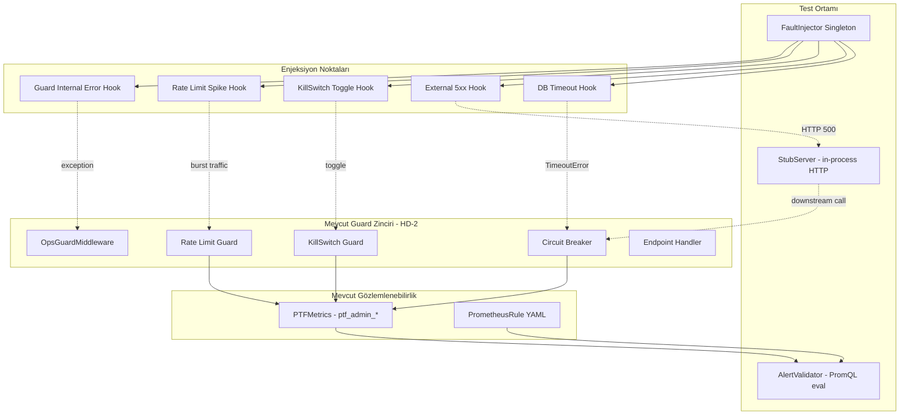
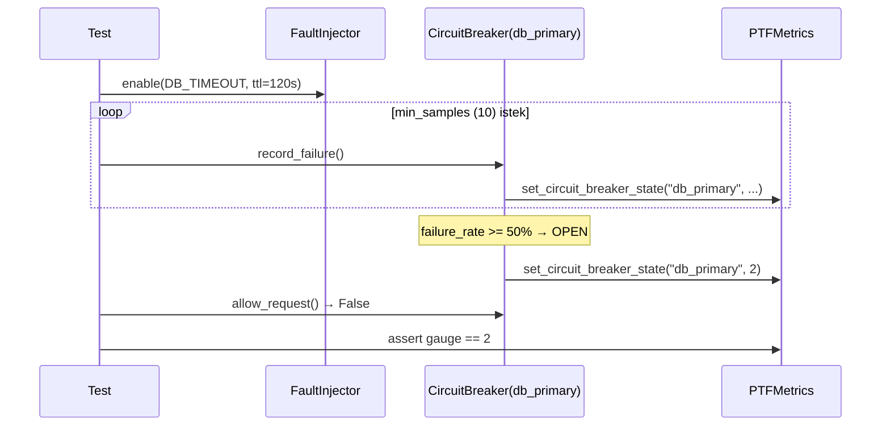
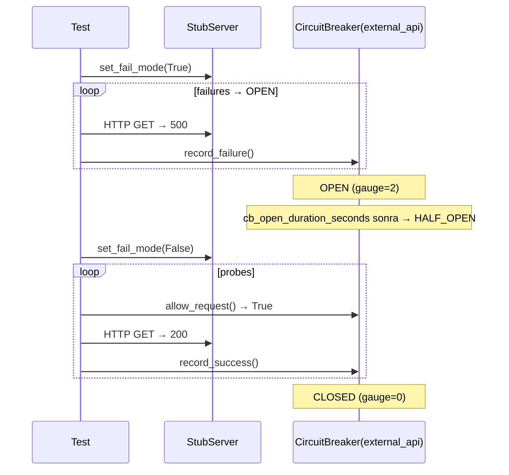

# Tasarım Dokümanı — Fault Injection

## Genel Bakış

Fault Injection, mevcut Ops-Guard koruma katmanının gerçek hata koşulları altında doğrulanmasını sağlayan test-only kaos enjeksiyon altyapısıdır. Mevcut guard zinciri (KillSwitch → RateLimiter → CircuitBreaker → Handler, HD-2) unit test ve mock'larla doğrulanmıştır; bu özellik gerçek timeout, 5xx ve iç hata koşullarında entegrasyon testleri ekler.

Beş ana bileşenden oluşur:

1. **FaultInjector** — Test-only singleton; enjeksiyon noktalarını TTL ile yöneten kontrol nesnesi
2. **StubServer** — In-process HTTP sunucusu; external API downstream simülasyonu
3. **DB Timeout Hook** — DB istemci yolunda gerçek TimeoutError üreten enjeksiyon kancası
4. **Guard Internal Error Hook** — Middleware karar zincirinde exception fırlatan enjeksiyon kancası
5. **Alert Validator** — PromQL ifadelerini deterministik olarak değerlendiren test yardımcısı

Production kodu değiştirilmez. Tüm enjeksiyon mekanizmaları `backend/app/testing/` dizininde yaşar ve yalnızca test fixture'ları aracılığıyla etkinleştirilir.

---

## Mimari



## Bileşenler ve Arayüzler

### 1. FaultInjector (`backend/app/testing/fault_injection.py`)

Test-only singleton. Enjeksiyon noktalarını TTL ile yönetir.

```python
from enum import Enum
from dataclasses import dataclass, field
import time
from typing import Any, Optional

class InjectionPoint(str, Enum):
    DB_TIMEOUT = "DB_TIMEOUT"
    EXTERNAL_5XX_BURST = "EXTERNAL_5XX_BURST"
    KILLSWITCH_TOGGLE = "KILLSWITCH_TOGGLE"
    RATE_LIMIT_SPIKE = "RATE_LIMIT_SPIKE"
    GUARD_INTERNAL_ERROR = "GUARD_INTERNAL_ERROR"

@dataclass
class InjectionState:
    enabled: bool = False
    params: dict[str, Any] = field(default_factory=dict)
    enabled_at: float = 0.0
    ttl_seconds: float = 0.0

class FaultInjector:
    """Singleton fault injector — test only."""

    _instance: Optional["FaultInjector"] = None

    def __init__(self) -> None:
        self._points: dict[InjectionPoint, InjectionState] = {
            p: InjectionState() for p in InjectionPoint
        }

    @classmethod
    def get_instance(cls) -> "FaultInjector":
        if cls._instance is None:
            cls._instance = cls()
        return cls._instance

    @classmethod
    def reset_instance(cls) -> None:
        cls._instance = None

    def enable(
        self, point: InjectionPoint, params: dict | None = None, ttl_seconds: float = 120.0
    ) -> None:
        state = self._points[point]
        state.enabled = True
        state.params = params or {}
        state.enabled_at = time.monotonic()
        state.ttl_seconds = ttl_seconds

    def disable(self, point: InjectionPoint) -> None:
        state = self._points[point]
        state.enabled = False
        state.params = {}

    def is_enabled(self, point: InjectionPoint) -> bool:
        state = self._points[point]
        if not state.enabled:
            return False
        if state.ttl_seconds > 0 and (time.monotonic() - state.enabled_at) > state.ttl_seconds:
            state.enabled = False
            return False
        return True

    def get_params(self, point: InjectionPoint) -> dict[str, Any]:
        return self._points[point].params

    def disable_all(self) -> None:
        for point in InjectionPoint:
            self.disable(point)
```

**Tasarım kararları:**
- Singleton pattern: test fixture'ları arasında paylaşılır, `reset_instance()` ile temizlenir
- TTL: monotonic clock kullanır (wall-clock drift'e bağışık)
- Production endpoint yok: yalnızca test kodundan `FaultInjector.get_instance()` ile erişilir

### 2. StubServer (`backend/app/testing/stub_server.py`)

In-process HTTP sunucusu. External API downstream simülasyonu için kullanılır.

```python
import threading
from http.server import HTTPServer, BaseHTTPRequestHandler

class StubHandler(BaseHTTPRequestHandler):
    fail_mode: bool = False
    fail_count: int = 0  # 0 = unlimited failures
    request_counter: int = 0

    def do_GET(self):
        StubHandler.request_counter += 1
        if StubHandler.fail_mode:
            if StubHandler.fail_count == 0 or StubHandler.request_counter <= StubHandler.fail_count:
                self.send_response(500)
                self.end_headers()
                self.wfile.write(b'{"error": "injected_failure"}')
                return
        self.send_response(200)
        self.end_headers()
        self.wfile.write(b'{"status": "ok"}')

    def log_message(self, format, *args):
        pass  # suppress log noise in tests

class StubServer:
    def __init__(self, host: str = "127.0.0.1", port: int = 0) -> None:
        self._server = HTTPServer((host, port), StubHandler)
        self._thread: threading.Thread | None = None

    @property
    def url(self) -> str:
        host, port = self._server.server_address
        return f"http://{host}:{port}"

    def start(self) -> None:
        self._thread = threading.Thread(target=self._server.serve_forever, daemon=True)
        self._thread.start()

    def stop(self) -> None:
        self._server.shutdown()
        if self._thread:
            self._thread.join(timeout=5)

    @staticmethod
    def set_fail_mode(enabled: bool, fail_count: int = 0) -> None:
        StubHandler.fail_mode = enabled
        StubHandler.fail_count = fail_count
        StubHandler.request_counter = 0
```

**Tasarım kararları:**
- `port=0`: OS'tan boş port alır (CI'da port çakışması önlenir)
- `daemon=True`: test bittiğinde thread otomatik temizlenir
- `fail_count`: ilk N istek 500, sonrası 200 (kurtarma simülasyonu)
- Mock değil: gerçek HTTP bağlantısı, gerçek socket I/O

### 3. DB Timeout Hook (`backend/app/testing/db_timeout_hook.py`)

DB istemci yolunda gerçek TimeoutError üreten enjeksiyon kancası.

```python
import time

def maybe_inject_db_timeout() -> None:
    """
    DB çağrısından önce çağrılır.
    DB_TIMEOUT enjeksiyonu aktifse TimeoutError fırlatır.
    """
    from .fault_injection import FaultInjector, InjectionPoint

    injector = FaultInjector.get_instance()
    if not injector.is_enabled(InjectionPoint.DB_TIMEOUT):
        return

    params = injector.get_params(InjectionPoint.DB_TIMEOUT)
    delay = params.get("delay_seconds", 0)
    if delay > 0:
        time.sleep(delay)
    raise TimeoutError(f"Injected DB timeout (delay={delay}s)")
```

**Entegrasyon yöntemi:** Test fixture'ında dependency injection ile DB client'a hook eklenir. Production kodu değiştirilmez — test, CircuitBreaker'ın `record_failure()` yolunu doğrudan tetikler veya handler'a patch uygular.

### 4. Guard Internal Error Hook (`backend/app/testing/guard_error_hook.py`)

Middleware karar zincirinde exception fırlatan enjeksiyon kancası.

```python
def maybe_inject_guard_error() -> None:
    """
    OpsGuardMiddleware._evaluate_guards() içinde çağrılır (test patch ile).
    GUARD_INTERNAL_ERROR enjeksiyonu aktifse RuntimeError fırlatır.
    """
    from .fault_injection import FaultInjector, InjectionPoint

    injector = FaultInjector.get_instance()
    if not injector.is_enabled(InjectionPoint.GUARD_INTERNAL_ERROR):
        return

    raise RuntimeError("Injected guard internal error")
```

**Entegrasyon yöntemi:** Test fixture'ında `OpsGuardMiddleware._evaluate_guards` metoduna monkey-patch uygulanır. Original metod çağrılmadan önce `maybe_inject_guard_error()` çağrılır.

### 5. AlertValidator (`backend/app/testing/alert_validator.py`)

PromQL ifadelerini deterministik olarak değerlendiren test yardımcısı.

```python
import yaml
from pathlib import Path
from dataclasses import dataclass

@dataclass
class AlertEvalResult:
    alert_name: str
    expr: str
    would_fire: bool
    metric_value: float | None
    threshold: float | None

class AlertValidator:
    """
    PromQL alert ifadelerini metrik snapshot'ları ile karşılaştırır.
    Gerçek Prometheus sunucusu gerektirmez — deterministik, CI-safe.
    """

    def __init__(self, alerts_path: str = "monitoring/prometheus/ptf-admin-alerts.yml"):
        self._alerts = self._load_alerts(alerts_path)

    def _load_alerts(self, path: str) -> dict[str, dict]:
        with open(path) as f:
            data = yaml.safe_load(f)
        alerts = {}
        for group in data["spec"]["groups"]:
            for rule in group["rules"]:
                if "alert" in rule:
                    alerts[rule["alert"]] = rule
        return alerts

    def check_circuit_breaker_open(self, metrics_snapshot: dict) -> AlertEvalResult:
        """PTFAdminCircuitBreakerOpen: max(ptf_admin_circuit_breaker_state) == 2"""
        alert = self._alerts["PTFAdminCircuitBreakerOpen"]
        cb_states = metrics_snapshot.get("circuit_breaker_states", {})
        max_state = max(cb_states.values()) if cb_states else 0
        return AlertEvalResult(
            alert_name="PTFAdminCircuitBreakerOpen",
            expr=alert["expr"],
            would_fire=max_state == 2,
            metric_value=float(max_state),
            threshold=2.0,
        )

    def check_rate_limit_spike(self, deny_rate_per_min: float) -> AlertEvalResult:
        """PTFAdminRateLimitSpike: deny rate > 5 req/min"""
        alert = self._alerts["PTFAdminRateLimitSpike"]
        return AlertEvalResult(
            alert_name="PTFAdminRateLimitSpike",
            expr=alert["expr"],
            would_fire=deny_rate_per_min > 5,
            metric_value=deny_rate_per_min,
            threshold=5.0,
        )

    def check_guard_internal_error(self, error_rate: float, fallback_rate: float) -> AlertEvalResult:
        """PTFAdminGuardInternalError: error_rate > 0 or fallback_rate > 0"""
        alert = self._alerts["PTFAdminGuardInternalError"]
        return AlertEvalResult(
            alert_name="PTFAdminGuardInternalError",
            expr=alert["expr"],
            would_fire=error_rate > 0 or fallback_rate > 0,
            metric_value=max(error_rate, fallback_rate),
            threshold=0.0,
        )
```

**Tasarım kararları:**
- Gerçek Prometheus sunucusu gerektirmez
- Alert YAML dosyasını parse eder ve PromQL ifadelerini basitleştirilmiş metrik karşılaştırmasıyla değerlendirir
- CI-safe: deterministik, dış bağımlılık yok

---

## Senaryo Tasarımları

### S1: DB Timeout → Circuit Breaker CLOSED→OPEN



**Test yaklaşımı:** CircuitBreaker'ı doğrudan kullanır (handler seviyesi değil). `record_failure()` çağrıları ile gerçek FSM geçişini tetikler. DB timeout hook, handler-level entegrasyon testlerinde kullanılır.

### S2: External 5xx Burst → CB Yaşam Döngüsü



**Test yaklaşımı:** Kısa `cb_open_duration_seconds` (örn. 0.5s) ile zaman kontrolü sağlanır. StubServer gerçek HTTP bağlantısı kullanır.

### S3: KillSwitch Runtime Toggle

**Test yaklaşımı:** `KillSwitchManager.set_switch()` ile doğrudan toggle. TestClient ile HTTP istekleri gönderilir. Metrik gauge değerleri doğrulanır.

### S4: Rate Limit Spike

**Test yaklaşımı:** Düşük limit config (5 req/window). Ardışık isteklerle limit aşılır. 429 + Retry-After doğrulanır. Metrik sayaçları kontrol edilir.

### S5: Guard Internal Error → Fail-Open

**Test yaklaşımı:** `_evaluate_guards` metoduna patch ile exception enjekte edilir. İsteğin handler'a ulaştığı doğrulanır. Metrik sayaçları kontrol edilir.

---

## Veri Modelleri

### InjectionPoint Enum

```python
class InjectionPoint(str, Enum):
    DB_TIMEOUT = "DB_TIMEOUT"
    EXTERNAL_5XX_BURST = "EXTERNAL_5XX_BURST"
    KILLSWITCH_TOGGLE = "KILLSWITCH_TOGGLE"
    RATE_LIMIT_SPIKE = "RATE_LIMIT_SPIKE"
    GUARD_INTERNAL_ERROR = "GUARD_INTERNAL_ERROR"
```

### InjectionState

```python
@dataclass
class InjectionState:
    enabled: bool = False
    params: dict[str, Any] = field(default_factory=dict)
    enabled_at: float = 0.0       # monotonic timestamp
    ttl_seconds: float = 0.0      # 0 = no expiry
```

### AlertEvalResult

```python
@dataclass
class AlertEvalResult:
    alert_name: str
    expr: str
    would_fire: bool
    metric_value: float | None
    threshold: float | None
```


## Doğruluk Özellikleri (Correctness Properties)

*Bir özellik (property), sistemin tüm geçerli çalışmalarında doğru kalması gereken bir davranış veya karakteristiktir — esasen, sistemin ne yapması gerektiğine dair biçimsel bir ifadedir. Özellikler, insan tarafından okunabilir spesifikasyonlar ile makine tarafından doğrulanabilir doğruluk garantileri arasında köprü görevi görür.*

### Property 1: FaultInjector Enable/Disable Round-Trip

*For any* InjectionPoint, enabling it and then querying `is_enabled` should return True; subsequently disabling it and querying `is_enabled` should return False.

**Validates: Requirements 1.2, 1.3, 1.5**

### Property 2: FaultInjector TTL Auto-Expiry

*For any* InjectionPoint and positive TTL value, after the TTL duration has elapsed, `is_enabled` should return False even without an explicit `disable()` call.

**Validates: Requirements 1.4**

### Property 3: StubServer Fail Count Behavior

*For any* positive integer N (fail_count), the StubServer should return HTTP 500 for the first N requests and HTTP 200 for all subsequent requests. When fail_count=0 (unlimited), all requests should return HTTP 500 while fail_mode is True.

**Validates: Requirements 2.2, 2.3**

### Property 4: DB Timeout Hook Raises TimeoutError

*For any* call to `maybe_inject_db_timeout()` while DB_TIMEOUT injection is enabled, the function should raise a `TimeoutError` exception.

**Validates: Requirements 2.4**

### Property 5: Circuit Breaker Opens Under Sufficient Failures

*For any* dependency name and failure sequence where the number of failures meets or exceeds `cb_min_samples` and the failure rate meets or exceeds `cb_error_threshold_pct`, the CircuitBreaker should transition to OPEN state.

**Validates: Requirements 3.1, 4.1**

### Property 6: Circuit Breaker Lifecycle Metric Sequence

*For any* CircuitBreaker undergoing a full lifecycle (CLOSED→OPEN→HALF_OPEN→CLOSED), the `ptf_admin_circuit_breaker_state` gauge should emit the sequence 0→2→1→0, with each transition updating the gauge exactly once.

**Validates: Requirements 4.4**

### Property 7: KillSwitch Toggle Round-Trip with Metrics

*For any* kill-switch name, enabling it should cause guarded endpoints to return HTTP 503 and the `ptf_admin_killswitch_state` gauge to be 1; disabling it should restore normal request flow and set the gauge to 0.

**Validates: Requirements 5.1, 5.2, 5.3, 5.4**

### Property 8: Rate Limit Enforcement with Metrics

*For any* endpoint and rate limit threshold N, the first N requests should be allowed (HTTP 200-range) and request N+1 should be denied (HTTP 429 with Retry-After header), with `ptf_admin_rate_limit_total{decision="rejected"}` counter incrementing for each denied request.

**Validates: Requirements 6.1, 6.3**

### Property 9: Rate Limit Determinism

*For any* identical sequence of requests with the same config snapshot, the Rate_Limiter should produce identical allow/deny decisions. Running the same scenario twice should yield the same results.

**Validates: Requirements 6.2**

---

## Hata Yönetimi

### FaultInjector Hataları
- **TTL süresi dolmuş enjeksiyon:** `is_enabled()` otomatik olarak False döndürür, hata fırlatmaz
- **Geçersiz InjectionPoint:** Python enum doğrulaması ile yakalanır (KeyError)
- **Singleton reset:** `reset_instance()` ile temiz başlangıç sağlanır; test fixture teardown'da çağrılır

### StubServer Hataları
- **Port çakışması:** `port=0` ile OS'tan boş port alınır; çakışma riski minimize edilir
- **Thread temizleme:** `daemon=True` ile test bittiğinde otomatik temizlenir; `stop()` ile graceful shutdown
- **Bağlantı hatası:** Test fixture'ında `start()` sonrası kısa bekleme ile sunucunun hazır olması sağlanır

### DB Timeout Hook Hataları
- **Enjeksiyon pasifken:** `maybe_inject_db_timeout()` hiçbir şey yapmaz (no-op)
- **FaultInjector erişim hatası:** Hook, FaultInjector singleton'ına erişemezse sessizce geçer (production güvenliği)

### Guard Internal Error Hook Hataları
- **Enjeksiyon pasifken:** `maybe_inject_guard_error()` hiçbir şey yapmaz (no-op)
- **Middleware fail-open:** OpsGuardMiddleware zaten fail-open davranışı sergiler (mevcut HD-2 tasarımı)

### AlertValidator Hataları
- **YAML parse hatası:** Alert dosyası bulunamazsa veya parse edilemezse açıklayıcı hata mesajı
- **Bilinmeyen alert adı:** KeyError ile yakalanır; test açıkça hangi alert'in eksik olduğunu gösterir

---

## Test Stratejisi

### İkili Test Yaklaşımı

**Property-Based Testler** (Hypothesis — Python):
- Her correctness property için ayrı bir property-based test
- Minimum 100 iterasyon per test
- Her test, tasarım dokümanındaki property numarasını referans eder
- Tag formatı: `Feature: fault-injection, Property N: {property_text}`
- Kütüphane: `hypothesis` (Python backend)
- PBT Performans Kuralı: `st.from_regex(...)` kullanılmaz; küçük boyut limitleri ile kompozisyonel stratejiler tercih edilir

**Unit / Entegrasyon Testler** (pytest):
- Spesifik senaryolar (S1-S5) için entegrasyon testleri
- Alert PromQL doğrulama testleri (S1/S4/S5 metrik çıktıları)
- Edge case'ler ve hata koşulları

### Test Dosya Yapısı

```
backend/app/testing/
  __init__.py
  fault_injection.py          # FaultInjector singleton + InjectionPoint enum
  stub_server.py              # In-process HTTP stub server
  db_timeout_hook.py          # DB timeout injection hook
  guard_error_hook.py         # Guard internal error injection hook
  alert_validator.py          # PromQL alert evaluation helper

backend/tests/
  test_fault_injection.py     # Property 1, 2 + unit tests (FaultInjector)
  test_stub_server.py         # Property 3 + unit tests (StubServer)
  test_fi_db_timeout.py       # Property 4, 5 + S1 entegrasyon testi
  test_fi_cb_lifecycle.py     # Property 6 + S2 entegrasyon testi
  test_fi_killswitch.py       # Property 7 + S3 entegrasyon testi
  test_fi_rate_limit.py       # Property 8, 9 + S4 entegrasyon testi
  test_fi_guard_error.py      # S5 entegrasyon testi
  test_fi_alert_validation.py # Alert PromQL doğrulama testleri (S1/S4/S5)
```

### Property-Based Test Konfigürasyonu

```python
from hypothesis import given, settings, strategies as st

@settings(max_examples=100)
@given(
    point=st.sampled_from(list(InjectionPoint)),
    ttl=st.floats(min_value=0.001, max_value=1.0),
)
def test_enable_disable_round_trip(point, ttl):
    """Feature: fault-injection, Property 1: FaultInjector Enable/Disable Round-Trip"""
    injector = FaultInjector()
    injector.enable(point, ttl_seconds=ttl)
    assert injector.is_enabled(point) is True
    injector.disable(point)
    assert injector.is_enabled(point) is False
```

### Senaryo Test Süresi Hedefleri

| Senaryo | Hedef Süre | Yaklaşım |
|---------|-----------|----------|
| S1: DB Timeout → CB Open | < 30s | Doğrudan CB API, kısa window |
| S2: External 5xx → CB Lifecycle | < 60s | Kısa open_duration (0.5s) |
| S3: KillSwitch Toggle | < 15s | Doğrudan toggle + HTTP |
| S4: Rate Limit Spike | < 30s | Düşük limit (5 req/window) |
| S5: Guard Internal Error | < 15s | Patch + HTTP |
| Alert Validation | < 10s | Deterministik YAML eval |
| **Toplam** | **< 3 dakika** | CI-safe |
