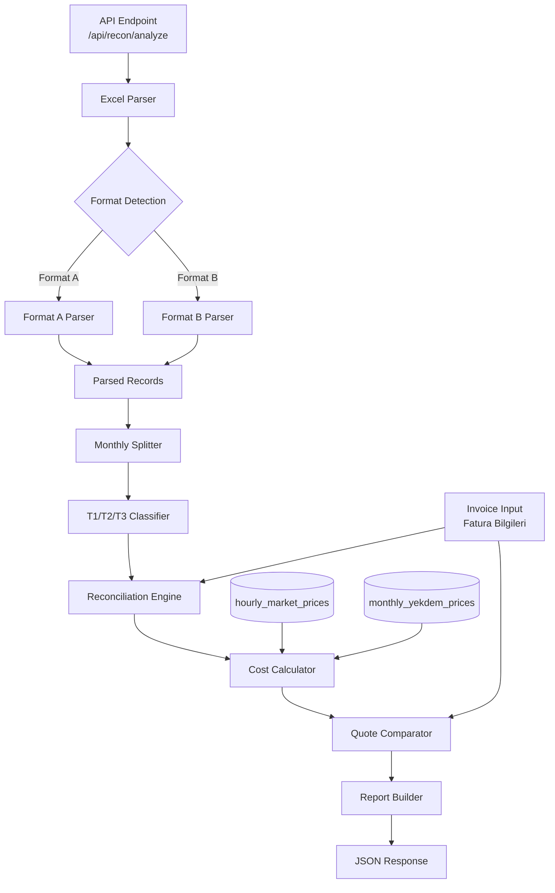

# Design Document: Invoice Reconciliation Engine (Phase 1)

## Overview

Fatura Mutabakat Motoru, dağıtım portallarından indirilen saatlik tüketim Excel dosyalarını parse ederek fatura doğrulaması ve maliyet karşılaştırması yapan bir backend modülüdür. İki farklı Excel formatını (Format A — büyük tüketici, Format B — küçük tüketici) otomatik algılar, aylara böler, T1/T2/T3 zaman dilimi hesaplaması yapar, fatura beyan değerleriyle mutabakat kontrolü gerçekleştirir ve saatlik PTF verileriyle piyasa bazlı maliyet hesaplayarak Gelka teklifi ile karşılaştırma sunar.

### Tasarım Kararları

1. **Mevcut modüllerin yeniden kullanımı**: `time_zones.py::classify_hour()` T1/T2/T3 sınıflandırması için doğrudan kullanılır. `distribution_tariffs.py` dağıtım bedeli lookup'ı için kullanılır.
2. **SoT uyumu**: PTF verisi `hourly_market_prices` tablosundan, YEKDEM verisi `monthly_yekdem_prices` tablosundan okunur. `market_reference_prices` kullanılmaz.
3. **Fail-closed teklif üretimi**: PTF/YEKDEM eksikliğinde teklif üretimi engellenir ancak parse + mutabakat raporu yine döner (Hybrid-C politikası).
4. **Çarpan (multiplier) metadata-only**: Format A'daki Çarpan kolonu saklanır ama hesaplamalarda kullanılmaz — değerler zaten nihai.
5. **Modüler pipeline**: Parse → Split → Classify → Reconcile → Cost → Compare adımları bağımsız fonksiyonlar olarak tasarlanır.

### Implementation Constraints (Kritik Direktifler)

> Bu kısıtlar tüm implementasyon task'larında zorunludur. İhlal eden kod review'da reddedilir.

**IC-1: Decimal aritmetik**
Tüm iç hesaplamalar `decimal.Decimal` kullanmalıdır, `float` kullanılmamalıdır. Yalnızca API response serialization aşamasında `float`'a dönüşüm yapılır. Gerekçe: kWh ve TL değerlerinde kümülatif yuvarlama hatası önlenir.

**IC-2: Europe/Istanbul timezone normalizasyonu**
Tüm timestamp'lar T1/T2/T3 sınıflandırmasından önce `Europe/Istanbul` timezone'una normalize edilmelidir. Excel'den gelen naive datetime'lar `Europe/Istanbul` olarak kabul edilir. `zoneinfo.ZoneInfo("Europe/Istanbul")` kullanılır.

**IC-3: DST-aware saat sayısı doğrulaması**
Month splitting aşamasında beklenen saat sayısı DST geçişlerini hesaba katmalıdır:
- Normal ay: `gün_sayısı × 24`
- DST ileri geçiş ayı (Mart): bir gün 23 saat (toplam `gün_sayısı × 24 - 1`)
- DST geri geçiş ayı (Ekim/Kasım): bir gün 25 saat (toplam `gün_sayısı × 24 + 1`)
Eksik/fazla saat tespiti bu kurala göre yapılır.

**IC-4: Reconciliation output zorunlu alanları**
Her reconciliation çıktısı şu alanları expose etmelidir:
- `excel_total_kwh` — Excel'den hesaplanan toplam
- `invoice_total_kwh` — Faturada beyan edilen toplam
- `delta_kwh` — Fark (excel - invoice)
- `delta_pct` — Yüzdesel fark
- `severity` — LOW / WARNING / CRITICAL

**IC-5: Pluggable provider format mimarisi**
Parser, provider format'larını plugin olarak desteklemelidir:
- Her format bir `BaseFormatProvider` abstract class'ından türer
- `provider_format_a` ve `provider_format_b` ilk iki implementasyon
- Yeni provider eklemek core parser mantığını değiştirmemelidir (Open/Closed Principle)
- Format registry: `PROVIDER_REGISTRY: dict[str, type[BaseFormatProvider]]`

## Architecture



### Katman Yapısı

```
backend/app/recon/
├── __init__.py
├── router.py          # FastAPI router — /api/recon/*
├── schemas.py         # Pydantic request/response modelleri
├── parser.py          # Excel parse + format detection
├── splitter.py        # Aylık bölme (monthly split)
├── classifier.py      # T1/T2/T3 sınıflandırma (classify_hour wrapper)
├── reconciler.py      # Fatura mutabakat doğrulaması
├── cost_engine.py     # PTF/YEKDEM maliyet hesaplama
├── comparator.py      # Fatura vs Gelka teklifi karşılaştırma
└── report_builder.py  # Rapor birleştirme ve formatlama
```

## Components and Interfaces

### 1. Excel Parser (`parser.py`)

Sorumluluğu: Excel dosyasını okuma, format algılama, satır bazlı parse.

```python
def detect_format(workbook: Workbook) -> ExcelFormat:
    """Kolon başlıklarından Format A veya Format B algıla."""

def parse_excel(file_bytes: bytes) -> ParseResult:
    """Ana parse fonksiyonu — format algıla ve uygun parser'ı çağır."""

def parse_format_a(sheet: Worksheet) -> list[HourlyRecord]:
    """Format A: 'Profil Tarihi' + 'Tüketim (Çekiş)' + 'Çarpan'"""

def parse_format_b(sheet: Worksheet) -> list[HourlyRecord]:
    """Format B: 'Tarih' + 'Aktif Çekiş'"""

def parse_datetime(value: Any) -> datetime:
    """DD/MM/YYYY HH:MM:SS string veya Excel native datetime parse."""

def parse_kwh_value(value: Any) -> float:
    """String kWh → float. Türkçe format desteği (virgül ondalık)."""
```

### 2. Monthly Splitter (`splitter.py`)

```python
def split_by_month(records: list[HourlyRecord]) -> dict[str, list[HourlyRecord]]:
    """Kayıtları YYYY-MM dönemlerine göre grupla."""

def validate_period_completeness(period: str, records: list[HourlyRecord]) -> PeriodStats:
    """Dönem için beklenen saat sayısı vs mevcut kontrol."""
```

### 3. T1/T2/T3 Classifier (`classifier.py`)

```python
def classify_period_records(records: list[HourlyRecord]) -> TimeZoneSummary:
    """Dönem kayıtlarını T1/T2/T3'e sınıflandır ve topla."""
    # Dahili olarak pricing.time_zones.classify_hour() kullanır
```

### 4. Reconciler (`reconciler.py`)

```python
def reconcile_consumption(
    calculated: TimeZoneSummary,
    invoice_declared: InvoiceDeclaredValues,
    config: ToleranceConfig,
) -> ReconciliationResult:
    """Hesaplanan vs beyan edilen değerleri karşılaştır."""
```

### 5. Cost Engine (`cost_engine.py`)

```python
def calculate_ptf_cost(
    records: list[HourlyRecord],
    period: str,
    db: Session,
) -> PtfCostResult:
    """Saatlik PTF ile maliyet hesapla."""

def get_yekdem_cost(period: str, total_kwh: float, db: Session) -> YekdemCostResult:
    """YEKDEM bedelini hesapla."""
```

### 6. Comparator (`comparator.py`)

```python
def compare_costs(
    invoice_cost: InvoiceCostInput,
    gelka_cost: GelkaCostInput,
    config: ComparisonConfig,
) -> ComparisonResult:
    """Fatura maliyeti vs Gelka teklifi karşılaştır."""
```

### 7. Report Builder (`report_builder.py`)

```python
def build_report(
    parse_stats: ParseResult,
    period_results: list[PeriodResult],
) -> ReconReport:
    """Tüm sonuçları birleştirip final rapor üret."""
```

## Data Models

### Pydantic Schemas (`schemas.py`)

```python
from enum import Enum
from typing import Optional
from pydantic import BaseModel, Field


# ═══════════════════════════════════════════════════════════════════════════════
# Enums
# ═══════════════════════════════════════════════════════════════════════════════

class ExcelFormat(str, Enum):
    FORMAT_A = "format_a"  # Büyük tüketici: Profil Tarihi + Tüketim (Çekiş) + Çarpan
    FORMAT_B = "format_b"  # Küçük tüketici: Tarih + Aktif Çekiş

class Severity(str, Enum):
    LOW = "LOW"
    WARNING = "WARNING"
    CRITICAL = "CRITICAL"

class ReconciliationStatus(str, Enum):
    MATCH = "UYUMLU"
    MISMATCH = "UYUMSUZ"
    NOT_CHECKED = "KONTROL_EDILMEDI"  # Beyan değeri girilmemiş


# ═══════════════════════════════════════════════════════════════════════════════
# Internal Models
# ═══════════════════════════════════════════════════════════════════════════════

class HourlyRecord(BaseModel):
    """Tek saatlik tüketim kaydı — parse sonrası iç model."""
    timestamp: datetime
    date: str          # YYYY-MM-DD
    hour: int          # 0–23
    period: str        # YYYY-MM
    consumption_kwh: float
    multiplier: Optional[float] = None  # Format A metadata, hesaplamada kullanılmaz

class ParseError(BaseModel):
    """Parse edilemeyen satır bilgisi."""
    row_number: int
    column: str
    raw_value: str
    error: str

class ParseResult(BaseModel):
    """Excel parse sonucu."""
    success: bool
    format_detected: ExcelFormat
    records: list[HourlyRecord]
    errors: list[ParseError]
    total_rows: int
    successful_rows: int
    failed_rows: int
    warnings: list[str]

class PeriodStats(BaseModel):
    """Dönem tamamlılık istatistikleri."""
    period: str
    record_count: int
    expected_hours: int  # gün_sayısı × 24
    missing_hours: list[str]  # "YYYY-MM-DD HH:00" formatında
    duplicate_hours: list[str]
    has_gaps: bool

class TimeZoneSummary(BaseModel):
    """Dönem T1/T2/T3 özeti."""
    period: str
    t1_kwh: float
    t2_kwh: float
    t3_kwh: float
    total_kwh: float
    t1_pct: float
    t2_pct: float
    t3_pct: float


# ═══════════════════════════════════════════════════════════════════════════════
# API Request Models
# ═══════════════════════════════════════════════════════════════════════════════

class InvoiceInput(BaseModel):
    """Fatura bilgisi girişi — dönem bazlı."""
    period: str = Field(description="Fatura dönemi YYYY-MM")
    supplier_name: Optional[str] = None
    tariff_group: Optional[str] = None
    unit_price_tl_per_kwh: Optional[float] = Field(default=None, ge=0)
    discount_pct: Optional[float] = Field(default=None, ge=0, le=100)
    distribution_unit_price_tl_per_kwh: Optional[float] = Field(default=None, ge=0)
    declared_t1_kwh: Optional[float] = Field(default=None, ge=0)
    declared_t2_kwh: Optional[float] = Field(default=None, ge=0)
    declared_t3_kwh: Optional[float] = Field(default=None, ge=0)
    declared_total_kwh: Optional[float] = Field(default=None, ge=0)
    declared_total_tl: Optional[float] = Field(default=None, ge=0)

class ToleranceConfig(BaseModel):
    """Mutabakat tolerans konfigürasyonu."""
    pct_tolerance: float = Field(default=1.0, ge=0, description="Yüzdesel tolerans (%)")
    abs_tolerance_kwh: float = Field(default=1.0, ge=0, description="Mutlak tolerans (kWh)")

class ComparisonConfig(BaseModel):
    """Gelka teklif karşılaştırma konfigürasyonu."""
    gelka_margin_multiplier: float = Field(default=1.05, ge=1.0, description="Gelka marj katsayısı")

class ReconRequest(BaseModel):
    """Ana mutabakat analizi isteği."""
    invoices: list[InvoiceInput] = Field(default_factory=list)
    tolerance: ToleranceConfig = Field(default_factory=ToleranceConfig)
    comparison: ComparisonConfig = Field(default_factory=ComparisonConfig)


# ═══════════════════════════════════════════════════════════════════════════════
# API Response Models
# ═══════════════════════════════════════════════════════════════════════════════

class ReconciliationItem(BaseModel):
    """Tek alan mutabakat sonucu."""
    field: str  # "t1_kwh", "t2_kwh", "t3_kwh", "total_kwh"
    calculated: float
    declared: float
    diff_kwh: float
    diff_pct: float
    status: ReconciliationStatus
    severity: Optional[Severity] = None

class PtfCostResult(BaseModel):
    """PTF maliyet hesaplama sonucu."""
    total_ptf_cost_tl: float
    weighted_avg_ptf_tl_per_mwh: float
    hours_matched: int
    hours_missing_ptf: int
    missing_ptf_pct: float
    ptf_data_sufficient: bool
    warning: Optional[str] = None

class YekdemCostResult(BaseModel):
    """YEKDEM maliyet sonucu."""
    yekdem_tl_per_mwh: float
    total_yekdem_cost_tl: float
    available: bool

class CostComparison(BaseModel):
    """Fatura vs Gelka maliyet karşılaştırması."""
    invoice_energy_tl: float
    invoice_distribution_tl: float
    invoice_total_tl: float
    gelka_energy_tl: float
    gelka_distribution_tl: float
    gelka_total_tl: float
    diff_tl: float
    diff_pct: float
    message: str  # "Tasarruf potansiyeli: X TL (%Y)" veya "Mevcut tedarikçi avantajlı: ..."

class PeriodResult(BaseModel):
    """Tek dönem mutabakat sonucu."""
    period: str
    total_kwh: float
    t1_kwh: float
    t2_kwh: float
    t3_kwh: float
    t1_pct: float
    t2_pct: float
    t3_pct: float
    missing_hours: int
    duplicate_hours: int
    reconciliation: list[ReconciliationItem]
    overall_status: ReconciliationStatus
    overall_severity: Optional[Severity] = None
    ptf_cost: Optional[PtfCostResult] = None
    yekdem_cost: Optional[YekdemCostResult] = None
    cost_comparison: Optional[CostComparison] = None
    quote_blocked: bool = False
    quote_block_reason: Optional[str] = None
    warnings: list[str] = Field(default_factory=list)

class ReconReport(BaseModel):
    """Tam mutabakat raporu — API response."""
    status: str = "ok"
    format_detected: ExcelFormat
    parse_stats: dict  # total_rows, successful_rows, failed_rows
    periods: list[PeriodResult]
    summary: Optional[dict] = None  # Çoklu dönem toplam özeti
    warnings: list[str] = Field(default_factory=list)
    multiplier_metadata: Optional[float] = None  # Format A çarpan değeri (bilgi amaçlı)
```

## Algorithm Details

### 1. Format Detection Algorithm

```
1. Excel dosyasını openpyxl ile aç
2. İlk sheet'i al (veya tüketim verisi içeren sheet'i bul)
3. İlk 10 satırda kolon başlıklarını tara:
   - "Profil Tarihi" VE "Tüketim (Çekiş)" bulunursa → Format A
   - "Tarih" VE "Aktif Çekiş" bulunursa → Format B
   - Hiçbiri bulunamazsa → UnknownFormatError
4. Format A'da "Çarpan" kolonu varsa indeksini kaydet (metadata)
```

### 2. Date/Value Parsing Algorithm

```
parse_datetime(value):
  1. value bir datetime nesnesi ise → doğrudan döndür
  2. String ise:
     a. DD/MM/YYYY HH:MM:SS regex ile eşleştir
     b. strptime ile parse et
     c. Saat değerini 0–23 aralığında doğrula
  3. Parse edilemezse → ParseError

parse_kwh_value(value):
  1. value float/int ise → doğrudan döndür
  2. String ise:
     a. Boşluk ve binlik ayırıcı noktaları temizle: "1.234,56" → "1234,56"
     b. Virgülü noktaya çevir: "1234,56" → "1234.56"
     c. float() ile dönüştür
  3. Dönüştürülemezse → ParseError
```

### 3. Monthly Split Algorithm

```
split_by_month(records):
  1. Her kayıt için period = timestamp.strftime("%Y-%m")
  2. dict[period] → list[HourlyRecord] olarak grupla
  3. Her dönem için:
     a. Beklenen saat = calendar.monthrange(year, month)[1] × 24
     b. Mevcut saatleri set olarak topla
     c. Eksik saatleri hesapla
     d. Duplike saatleri tespit et
  4. Dönemleri kronolojik sırala
```

### 4. T1/T2/T3 Classification Algorithm

```
classify_period_records(records):
  1. t1_sum, t2_sum, t3_sum = 0.0, 0.0, 0.0
  2. Her kayıt için:
     zone = classify_hour(record.hour)  # pricing.time_zones'dan
     if zone == T1: t1_sum += record.consumption_kwh
     elif zone == T2: t2_sum += record.consumption_kwh
     else: t3_sum += record.consumption_kwh
  3. total = t1_sum + t2_sum + t3_sum
  4. Yüzdeleri hesapla: t1_pct = t1_sum / total × 100
  5. Invariant: |t1_sum + t2_sum + t3_sum - total| < 0.01
```

### 5. Reconciliation Algorithm

```
reconcile_consumption(calculated, declared, config):
  results = []
  for field in [t1, t2, t3, total]:
    if declared[field] is None: skip (NOT_CHECKED)
    diff_kwh = calculated[field] - declared[field]
    diff_pct = diff_kwh / declared[field] × 100 (if declared > 0)
    
    if |diff_pct| <= config.pct_tolerance AND |diff_kwh| <= config.abs_tolerance_kwh:
      status = MATCH
    else:
      status = MISMATCH
      severity = classify_severity(diff_pct, diff_kwh)
    
    results.append(ReconciliationItem(...))

classify_severity(diff_pct, diff_kwh):
  if |diff_pct| > 5 or |diff_kwh| > 20: return CRITICAL
  if |diff_pct| > 2 or |diff_kwh| > 5: return WARNING
  return LOW
```

### 6. PTF Cost Calculation Algorithm

```
calculate_ptf_cost(records, period, db):
  1. hourly_market_prices tablosundan period'a ait PTF verilerini çek
  2. (date, hour) → ptf_tl_per_mwh index oluştur
  3. Her kayıt için:
     ptf = index.get((record.date, record.hour))
     if ptf is None: missing_count += 1; continue
     hour_cost = record.consumption_kwh × (ptf / 1000)
     total_cost += hour_cost
     total_kwh_matched += record.consumption_kwh
  4. weighted_avg_ptf = total_cost / total_kwh_matched × 1000
  5. missing_pct = missing_count / total_records × 100
  6. if missing_pct > 10: warning = "Yetersiz PTF verisi"
  7. ptf_data_sufficient = (missing_pct <= 100)  # tamamen eksik değilse
```

### 7. Quote Comparison Algorithm

```
compare_costs(invoice_input, ptf_cost, yekdem_cost, config):
  # Fatura maliyeti
  effective_price = unit_price × (1 - discount/100)
  invoice_energy = total_kwh × effective_price
  invoice_distribution = total_kwh × distribution_unit_price
  invoice_total = invoice_energy + invoice_distribution

  # Gelka teklifi
  gelka_energy = (ptf_cost + yekdem_cost) × config.gelka_margin_multiplier
  gelka_distribution = invoice_distribution  # Aynı dağıtım bedeli
  gelka_total = gelka_energy + gelka_distribution

  # Karşılaştırma
  diff = invoice_total - gelka_total
  diff_pct = diff / invoice_total × 100
  
  if diff > 0:
    message = f"Tasarruf potansiyeli: {diff:.2f} TL (%{diff_pct:.1f})"
  else:
    message = f"Mevcut tedarikçi avantajlı: {abs(diff):.2f} TL (%{abs(diff_pct):.1f})"
```

## Error Handling

### Error Categories

| Kategori | HTTP Code | Davranış |
|----------|-----------|----------|
| Dosya format hatası | 400 | Açıklayıcı hata mesajı |
| Boş dosya | 400 | "Dosya boş veya tüketim verisi bulunamadı" |
| Dosya boyutu aşımı (>50MB) | 400 | Boyut limiti hatası |
| Tanınmayan format | 400 | Beklenen kolon listesi ile hata |
| Parse hataları (satır bazlı) | 200 | Hatalı satırlar raporlanır, işlem devam eder |
| PTF verisi eksik (kısmi) | 200 | Uyarı ile rapor döner |
| PTF/YEKDEM tamamen eksik | 200 | quote_blocked=true, parse+recon raporu döner |
| DB bağlantı hatası | 500 | Internal server error |

### Error Response Schema

```python
class ErrorResponse(BaseModel):
    error: str          # Hata kodu: "empty_file", "unknown_format", "file_too_large"
    message: str        # Türkçe açıklayıcı mesaj
    details: Optional[dict] = None  # Ek bilgi (beklenen kolonlar vb.)
```

### Graceful Degradation

- **Satır bazlı hatalar**: Hatalı satırlar atlanır, başarılı satırlarla devam edilir. Hata listesi raporda döner.
- **Negatif tüketim**: Uyarı listesine eklenir, mutlak değeri kullanılır.
- **Kronolojik olmayan kayıtlar**: Otomatik sıralanır, uyarı verilir.
- **Duplike saatler**: Tespit edilir, uyarı verilir, ilk kayıt kullanılır.
- **PTF eksikliği**: Eksik saatler raporlanır, mevcut verilerle hesaplama yapılır. %10 üzeri eksiklik uyarısı.

## Correctness Properties

*A property is a characteristic or behavior that should hold true across all valid executions of a system — essentially, a formal statement about what the system should do. Properties serve as the bridge between human-readable specifications and machine-verifiable correctness guarantees.*

### Property 1: Format detection is deterministic and correct

*For any* set of Excel column headers, if the headers contain "Profil Tarihi" AND "Tüketim (Çekiş)" the detected format SHALL be Format A; if they contain "Tarih" AND "Aktif Çekiş" the detected format SHALL be Format B; otherwise format detection SHALL return an error.

**Validates: Requirements 1.2, 1.3**

### Property 2: Multiplier is never applied to consumption values

*For any* Format A record with a multiplier value M and raw consumption value C, the parsed consumption_kwh SHALL equal C regardless of M. The multiplier SHALL appear only in metadata and SHALL NOT affect any calculated total (T1, T2, T3, period total, cost).

**Validates: Requirements 1.4, 1.5**

### Property 3: Date parsing round-trip

*For any* valid datetime with year in [2020, 2030], month in [1, 12], day in [1, days_in_month], hour in [0, 23], formatting as "DD/MM/YYYY HH:MM:SS" and then parsing back SHALL produce the original datetime (date and hour components).

**Validates: Requirements 2.1**

### Property 4: kWh value parsing round-trip

*For any* non-negative float value V, formatting V in Turkish locale (dot as thousands separator, comma as decimal separator, e.g. "1.234,56") and then parsing back SHALL produce a value within ±0.01 of V.

**Validates: Requirements 2.3, 2.4**

### Property 5: Parse statistics invariant

*For any* parse result, total_rows SHALL equal successful_rows + failed_rows.

**Validates: Requirements 2.6**

### Property 6: Parsed hour range invariant

*For any* successfully parsed record, the hour field SHALL be in the range [0, 23].

**Validates: Requirements 2.7**

### Property 7: Monthly split correctness

*For any* set of parsed records, after splitting by month: (a) every record in a group SHALL have the same YYYY-MM period, (b) the number of groups SHALL equal the number of distinct months in the input, and (c) no record SHALL be lost (sum of group sizes equals input size).

**Validates: Requirements 3.1, 3.3**

### Property 8: Period completeness calculation

*For any* period YYYY-MM, the expected_hours SHALL equal days_in_month(year, month) × 24, and missing_hours SHALL equal expected_hours minus the count of distinct (date, hour) pairs in the period's records.

**Validates: Requirements 3.4**

### Property 9: Chronological period ordering

*For any* multi-period result, the periods list SHALL be sorted in ascending chronological order (i.e., for consecutive periods p[i] and p[i+1], p[i] < p[i+1] lexicographically).

**Validates: Requirements 3.6**

### Property 10: T1/T2/T3 partition property

*For any* set of hourly consumption records in a period, T1_kwh + T2_kwh + T3_kwh SHALL equal total_kwh within ±0.01 kWh tolerance, and t1_pct + t2_pct + t3_pct SHALL equal 100.0 within ±0.1% tolerance.

**Validates: Requirements 4.4, 4.5**

### Property 11: Effective price calculation

*For any* unit_price ≥ 0 and discount_pct in [0, 100], the effective price SHALL equal unit_price × (1 - discount_pct / 100).

**Validates: Requirements 5.5**

### Property 12: Reconciliation difference correctness

*For any* calculated value C and declared value D (where D > 0), diff_kwh SHALL equal C - D, and diff_pct SHALL equal (C - D) / D × 100.

**Validates: Requirements 6.1, 6.2**

### Property 13: Tolerance-based match classification

*For any* calculated value C, declared value D, pct_tolerance P, and abs_tolerance_kwh A: the reconciliation status SHALL be MATCH if and only if |diff_pct| ≤ P AND |diff_kwh| ≤ A; otherwise it SHALL be MISMATCH.

**Validates: Requirements 6.3**

### Property 14: Severity classification thresholds

*For any* mismatch with |diff_pct| and |diff_kwh|: severity SHALL be CRITICAL if |diff_pct| > 5 OR |diff_kwh| > 20; WARNING if |diff_pct| > 2 OR |diff_kwh| > 5 (and not CRITICAL); LOW otherwise.

**Validates: Requirements 6.4**

### Property 15: Hourly PTF cost formula

*For any* hourly record with consumption_kwh C and matched PTF value P (TL/MWh), the hourly cost SHALL equal C × (P / 1000). The total period PTF cost SHALL equal the sum of all hourly costs, and weighted_avg_ptf SHALL equal total_cost / total_matched_kwh × 1000.

**Validates: Requirements 7.2, 7.3, 7.4**

### Property 16: Missing PTF detection and threshold warning

*For any* set of hourly records where some hours have no PTF match, hours_missing_ptf SHALL equal the count of unmatched hours, and a warning SHALL be present if and only if missing_pct > 10%.

**Validates: Requirements 7.5, 7.6**

### Property 17: YEKDEM cost formula

*For any* total_kwh T and YEKDEM rate Y (TL/MWh), the YEKDEM cost SHALL equal T × (Y / 1000).

**Validates: Requirements 7.7**

### Property 18: Fail-closed quote blocking

*For any* period where PTF data is completely missing OR YEKDEM data is unavailable, quote_blocked SHALL be true and quote_block_reason SHALL be non-empty, BUT the report SHALL still contain valid parse statistics and reconciliation results.

**Validates: Requirements 7.8, 7.9**

### Property 19: Invoice and Gelka cost formulas

*For any* total_kwh T, effective_price EP, distribution_price DP, ptf_cost PC, yekdem_cost YC, and margin_multiplier M: invoice_energy SHALL equal T × EP, invoice_distribution SHALL equal T × DP, and gelka_energy SHALL equal (PC + YC) × M.

**Validates: Requirements 8.1, 8.2, 8.3**

### Property 20: Comparison message direction

*For any* cost comparison where invoice_total > gelka_total, the message SHALL contain "Tasarruf"; where invoice_total < gelka_total, the message SHALL contain "Mevcut tedarikçi avantajlı".

**Validates: Requirements 8.6, 8.7**

### Property 21: Multi-period summary consistency

*For any* report with multiple periods, the summary total_kwh SHALL equal the sum of all individual period total_kwh values.

**Validates: Requirements 9.5**

### Property 22: Rounding precision invariant

*For any* report output, all TL-denominated values SHALL have at most 2 decimal places, and all kWh-denominated values SHALL have at most 3 decimal places.

**Validates: Requirements 9.6**

### Property 23: Negative consumption absolute value handling

*For any* record with negative consumption value V, the parsed consumption_kwh SHALL equal |V| (absolute value), and a warning SHALL be present in the output.

**Validates: Requirements 10.4**

### Property 24: Order-independence of results

*For any* set of hourly records, the computed T1/T2/T3 totals, reconciliation results, and cost calculations SHALL be identical regardless of the input order of records.

**Validates: Requirements 10.6**

## Testing Strategy

### Property-Based Testing (PBT)

**Library**: [Hypothesis](https://hypothesis.readthedocs.io/) (Python)

**Configuration**: Minimum 100 iterations per property test (`@settings(max_examples=100)`)

**Tag format**: Each test is tagged with a comment referencing the design property:
```python
# Feature: invoice-recon-engine, Property {N}: {property_text}
```

**PBT-suitable properties** (24 properties above): All properties are implemented as Hypothesis property-based tests in `backend/tests/test_recon_engine_properties.py`.

### Unit Tests (Example-Based)

Example-based tests cover:
- Format detection with real sample Excel files (Format A and Format B)
- Multi-sheet workbook handling (first sheet selection)
- Native datetime object passthrough
- Optional invoice field combinations
- API response structure validation
- Error response schema consistency
- File size limit enforcement (50 MB)
- Empty file handling

### Integration Tests

- Full pipeline test: Excel upload → parse → split → classify → reconcile → cost → compare → report
- Database interaction: PTF/YEKDEM lookup from `hourly_market_prices` and `monthly_yekdem_prices`
- Large file handling (100K+ rows)
- API endpoint integration with FastAPI TestClient

### Test Organization

```
backend/tests/
├── test_recon_engine_properties.py   # 24 PBT properties (Hypothesis)
├── test_recon_parser.py              # Parser unit tests (examples + edge cases)
├── test_recon_reconciler.py          # Reconciliation unit tests
├── test_recon_cost_engine.py         # Cost calculation unit tests
├── test_recon_integration.py         # Full pipeline integration tests
└── test_recon_api.py                 # API endpoint tests
```

### Dual Testing Balance

- **Property tests** handle: universal invariants, formula correctness, classification logic, round-trip parsing, partition properties
- **Unit tests** handle: specific file format examples, API contract verification, error message content, edge cases (empty file, oversized file)
- **Integration tests** handle: database queries, full pipeline, API endpoint behavior

