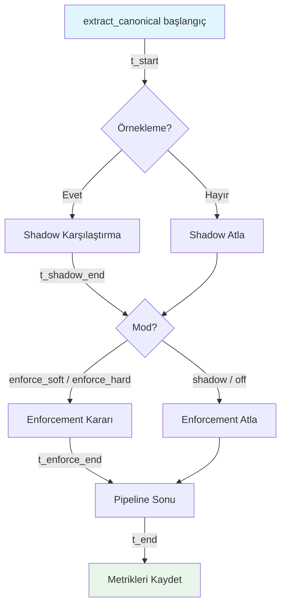
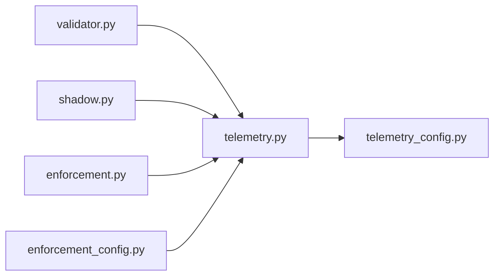

# Tasarım Dokümanı — Fatura Doğrulama Performans Telemetrisi (Faz G)

## Genel Bakış

Bu doküman, fatura doğrulama pipeline'ının performans telemetri altyapısının teknik tasarımını tanımlar.
Faz A–F tamamlanmış durumdadır (54 test, 0 fail). Shadow + Enforcement + Wiring aktiftir.

Faz G'nin amacı:
- Pipeline'ın her fazının (total, shadow, enforcement) gecikme dağılımını ölçmek
- Aktif doğrulama modunu anlık gauge metriği ile izlemek
- `ValidationBlockedError` için terminal durum semantiğini tanımlamak
- Yapılandırılabilir P95/P99 gecikme bütçesi sunmak
- Metrik kardinalitesini kontrol altında tutmak

Tasarım, mevcut `backend/app/invoice/validation/` modül yapısına yeni bir `telemetry.py` modülü ekler.
Prometheus client kütüphanesi kullanılır; test ortamında in-memory registry ile izole edilir.

## Mimari

### Pipeline Akışı ve Zamanlama Noktaları



### Zamanlama Stratejisi

| Faz | Başlangıç | Bitiş | Koşul |
|-----|-----------|-------|-------|
| `total` | Pipeline girişi | Pipeline çıkışı | Her fatura (örnekleme bağımsız) |
| `shadow` | Shadow hook girişi | Shadow hook çıkışı | Yalnızca örneklenen faturalar |
| `enforcement` | Enforcement girişi | Enforcement çıkışı | Yalnızca `enforce_soft` / `enforce_hard` modlarında |

### Modül Bağımlılık Grafiği



## Bileşenler ve Arayüzler

### 1. `telemetry.py` — Performans Telemetri Modülü

Yeni dosya: `backend/app/invoice/validation/telemetry.py`

Bu modül tüm performans metriklerini tanımlar ve kayıt fonksiyonlarını sunar.

```python
"""Performans telemetrisi (Faz G).

Tek histogram + mod gauge. Kapalı küme phase label.
"""
from __future__ import annotations

import logging
import time
from enum import Enum
from typing import Literal

logger = logging.getLogger(__name__)

# --- Kapalı küme faz etiketi ---
class Phase(str, Enum):
    TOTAL = "total"
    SHADOW = "shadow"
    ENFORCEMENT = "enforcement"

VALID_PHASES: frozenset[str] = frozenset(p.value for p in Phase)

# --- Kapalı küme mod etiketi ---
VALID_MODES: frozenset[str] = frozenset({"off", "shadow", "enforce_soft", "enforce_hard"})

# --- Histogram ---
# Prometheus: invoice_validation_duration_seconds{phase="total|shadow|enforcement"}
# Test ortamında in-memory dict ile simüle edilir.

_duration_observations: dict[str, list[float]] = {
    "total": [],
    "shadow": [],
    "enforcement": [],
}

def observe_duration(phase: str, duration_seconds: float) -> None:
    """Histogram'a gözlem ekle. Geçersiz phase → log + skip (fail-closed)."""
    if phase not in VALID_PHASES:
        logger.error("observe_duration: geçersiz phase=%r, gözlem atlandı", phase)
        return
    _duration_observations[phase].append(duration_seconds)

def get_duration_observations() -> dict[str, list[float]]:
    """Test inspection: tüm gözlemlerin kopyası."""
    return {k: list(v) for k, v in _duration_observations.items()}

def reset_duration_observations() -> None:
    """Test cleanup."""
    for v in _duration_observations.values():
        v.clear()

# --- Mod Gauge ---
# invoice_validation_mode{mode="off|shadow|enforce_soft|enforce_hard"}

_mode_gauge: dict[str, int] = {
    "off": 0,
    "shadow": 0,
    "enforce_soft": 0,
    "enforce_hard": 0,
}

def set_mode_gauge(active_mode: str) -> None:
    """Aktif modu 1, diğerlerini 0 yap. Geçersiz mod → log + skip."""
    if active_mode not in VALID_MODES:
        logger.error("set_mode_gauge: geçersiz mode=%r, güncelleme atlandı", active_mode)
        return
    for m in _mode_gauge:
        _mode_gauge[m] = 1 if m == active_mode else 0

def get_mode_gauge() -> dict[str, int]:
    """Test inspection."""
    return dict(_mode_gauge)

def reset_mode_gauge() -> None:
    """Test cleanup."""
    for m in _mode_gauge:
        _mode_gauge[m] = 0

# --- Zamanlayıcı context manager ---
class Timer:
    """Basit zamanlayıcı — with bloğu ile kullanılır."""
    def __init__(self) -> None:
        self.start: float = 0.0
        self.elapsed: float = 0.0

    def __enter__(self) -> "Timer":
        self.start = time.monotonic()
        return self

    def __exit__(self, *args: object) -> None:
        self.elapsed = time.monotonic() - self.start
```

### 2. `telemetry_config.py` — Gecikme Bütçesi Yapılandırması

Yeni dosya: `backend/app/invoice/validation/telemetry_config.py`

```python
"""Gecikme bütçesi yapılandırması (Faz G).

Ortam değişkenleri:
  INVOICE_VALIDATION_LATENCY_BUDGET_P95_MS — opsiyonel, pozitif float
  INVOICE_VALIDATION_LATENCY_BUDGET_P99_MS — opsiyonel, pozitif float
"""
from __future__ import annotations

import logging
import os
from dataclasses import dataclass

logger = logging.getLogger(__name__)

@dataclass(frozen=True)
class LatencyBudgetConfig:
    """Immutable gecikme bütçesi config. None = tanımsız."""
    p95_ms: float | None = None
    p99_ms: float | None = None

def _parse_positive_float(raw: str, name: str) -> float | None:
    """Pozitif float parse et. Geçersiz → None + log."""
    if not raw.strip():
        return None
    try:
        val = float(raw)
        if val <= 0:
            logger.warning("%s: pozitif olmalı, değer=%s — bütçe devre dışı", name, raw)
            return None
        return val
    except (ValueError, TypeError):
        logger.warning("%s: geçersiz değer=%r — bütçe devre dışı", name, raw)
        return None

def load_latency_budget_config() -> LatencyBudgetConfig:
    """Ortam değişkenlerinden gecikme bütçesi oku."""
    p95 = _parse_positive_float(
        os.environ.get("INVOICE_VALIDATION_LATENCY_BUDGET_P95_MS", ""),
        "INVOICE_VALIDATION_LATENCY_BUDGET_P95_MS",
    )
    p99 = _parse_positive_float(
        os.environ.get("INVOICE_VALIDATION_LATENCY_BUDGET_P99_MS", ""),
        "INVOICE_VALIDATION_LATENCY_BUDGET_P99_MS",
    )
    return LatencyBudgetConfig(p95_ms=p95, p99_ms=p99)
```

### 3. Entegrasyon Noktaları

#### `validator.py` — `extract_canonical()` veya üst seviye çağrı noktası

Toplam süre ölçümü pipeline'ın en dış katmanında yapılır:

```python
from .telemetry import Timer, observe_duration, Phase

def extract_canonical(invoice_dict: dict, ...) -> ...:
    with Timer() as t_total:
        # ... mevcut pipeline mantığı ...
        pass
    observe_duration(Phase.TOTAL.value, t_total.elapsed)
```

#### `shadow.py` — `shadow_validate_hook()`

Shadow fazı süresi hook içinde ölçülür:

```python
from .telemetry import Timer, observe_duration, Phase

def shadow_validate_hook(...) -> ShadowCompareResult | None:
    # ... sampling kontrolü ...
    with Timer() as t_shadow:
        result = compare_validators(invoice_dict)
    observe_duration(Phase.SHADOW.value, t_shadow.elapsed)
    # ...
```

#### `enforcement.py` — `enforce_validation()`

Enforcement fazı süresi yalnızca `enforce_soft` / `enforce_hard` modlarında ölçülür:

```python
from .telemetry import Timer, observe_duration, Phase

def enforce_validation(...) -> EnforcementDecision:
    # ... mod kontrolü ...
    if cfg.mode in (ValidationMode.ENFORCE_SOFT, ValidationMode.ENFORCE_HARD):
        with Timer() as t_enforce:
            # ... enforcement mantığı ...
            pass
        observe_duration(Phase.ENFORCEMENT.value, t_enforce.elapsed)
```

### 4. `ValidationBlockedError` Terminal Durum Davranışı

Mevcut `enforcement.py`'deki `ValidationBlockedError` sınıfı zaten tanımlıdır.
Faz G, bu exception'ın terminal durum semantiğini netleştirir:

```python
class ValidationBlockedError(Exception):
    """enforce_hard modunda bloklanan fatura.
    
    Terminal durum: worker retry etmemeli.
    - retry sayacı artırılmaz
    - fatura terminal hata olarak işaretlenir
    - log kaydı oluşturulur
    """
    terminal: bool = True  # worker retry guard için sentinel

    def __init__(self, decision: EnforcementDecision) -> None:
        self.decision = decision
        super().__init__(f"Validation blocked: {list(decision.blocker_codes)}")
```

Worker tarafında:
```python
try:
    result = process_invoice(invoice)
except ValidationBlockedError as exc:
    logger.error("terminal_validation_blocked", extra={
        "invoice_id": invoice_id,
        "blocker_codes": list(exc.decision.blocker_codes),
    })
    mark_terminal_failure(invoice_id)
    # retry yapılmaz — return, DLQ'ya gönderilmez
    return
```

## Veri Modelleri

### Prometheus Metrik Tanımları

| Metrik Adı | Tip | Label'lar | Kardinalite | Açıklama |
|------------|-----|-----------|-------------|----------|
| `invoice_validation_duration_seconds` | Histogram | `phase` ∈ {`total`, `shadow`, `enforcement`} | 3 | Faz bazlı gecikme dağılımı |
| `invoice_validation_mode` | Gauge | `mode` ∈ {`off`, `shadow`, `enforce_soft`, `enforce_hard`} | 4 | Aktif doğrulama modu (1=aktif, 0=pasif) |

### Kardinalite Matrisi

- Histogram zaman serisi sayısı: 3 (phase) × bucket_count
  - `invoice_validation_duration_seconds` varsayılan Prometheus client bucket setini kullanır (`.005, .01, .025, .05, .075, .1, .25, .5, .75, 1.0, 2.5, 5.0, 7.5, 10.0`)
- Gauge zaman serisi sayısı: 4 (mode)
- `mode` label'ı histogram'da YOKTUR → çapraz kardinalite patlaması önlenir

### Yapılandırma Ortam Değişkenleri

| Değişken | Tip | Varsayılan | Açıklama |
|----------|-----|-----------|----------|
| `INVOICE_VALIDATION_LATENCY_BUDGET_P95_MS` | float (pozitif) | tanımsız | P95 gecikme bütçesi (ms) |
| `INVOICE_VALIDATION_LATENCY_BUDGET_P99_MS` | float (pozitif) | tanımsız | P99 gecikme bütçesi (ms) |

Tanımsız = yalnızca ölçüm, uyarı yok. Geçersiz değer (negatif, non-numeric) = bütçe devre dışı + log.

### Dosya Yapısı (Faz G Eklemeleri)

```
backend/app/invoice/validation/
    telemetry.py          # YENİ — histogram, gauge, Timer, observe_duration, set_mode_gauge
    telemetry_config.py   # YENİ — LatencyBudgetConfig, load_latency_budget_config
    enforcement.py        # GÜNCELLEME — ValidationBlockedError.terminal, enforcement zamanlama
    shadow.py             # GÜNCELLEME — shadow zamanlama
    validator.py          # GÜNCELLEME — toplam süre zamanlama
    types.py              # GÜNCELLEME — yeni metrik sabit isimleri

backend/tests/
    test_invoice_telemetry_g.py   # YENİ — Faz G birim + PBT testleri
```


## Doğruluk Özellikleri (Correctness Properties)

*Bir doğruluk özelliği (property), sistemin tüm geçerli çalışmalarında doğru olması gereken bir davranış veya karakteristiktir — esasen, sistemin ne yapması gerektiğine dair biçimsel bir ifadedir. Özellikler, insan tarafından okunabilir spesifikasyonlar ile makine tarafından doğrulanabilir doğruluk garantileri arasındaki köprüdür.*

### Property 1: Phase Kapalı Küme Kontrolü

*Herhangi bir* string değeri için, `observe_duration` çağrıldığında: eğer değer `{"total", "shadow", "enforcement"}` kümesinde ise gözlem kaydedilmeli, aksi halde gözlem sayısı değişmemeli ve hata loglanmalıdır.

**Validates: Requirements 1.2, 1.3, 9.3**

### Property 2: Total Gözlem Her Fatura İçin Kaydedilir

*Herhangi bir* fatura verisi ve örnekleme konfigürasyonu için, pipeline çalıştırıldığında `phase="total"` gözlemi her zaman kaydedilmeli ve değeri pozitif (> 0) saniye cinsinden olmalıdır.

**Validates: Requirements 2.1, 2.2, 2.3**

### Property 3: Shadow Gözlem Yalnızca Örneklenen Faturalarda

*Herhangi bir* fatura ve sampling konfigürasyonu için, `phase="shadow"` gözlemi kaydedilmişse fatura örneklenmiş olmalı; fatura örneklenmemişse shadow gözlemi kaydedilmemiş olmalıdır (iff ilişkisi).

**Validates: Requirements 3.1, 3.2**

### Property 4: Enforcement Gözlem Yalnızca Enforcement Modlarında

*Herhangi bir* fatura ve mod konfigürasyonu için, `phase="enforcement"` gözlemi kaydedilmişse mod `enforce_soft` veya `enforce_hard` olmalı; mod `shadow` veya `off` ise enforcement gözlemi kaydedilmemiş olmalıdır (iff ilişkisi).

**Validates: Requirements 4.1, 4.2**

### Property 5: Mod Gauge Tek Aktif İnvariantı

*Herhangi bir* geçerli mod değeri için, `set_mode_gauge` çağrıldıktan sonra gauge state'inde tam olarak bir mod `1` değerine sahip olmalı ve bu mod çağrılan mod olmalı; diğer tüm modlar `0` olmalıdır. Geçersiz mod değerleri için gauge state değişmemelidir.

**Validates: Requirements 5.2, 5.3, 5.5**

### Property 6: ValidationBlockedError Enforce Hard + Blocker

*Herhangi bir* fatura verisi ve blocker kod kümesi için, `enforce_hard` modunda blocker kod tespit edildiğinde `ValidationBlockedError` fırlatılmalı ve exception'ın `decision.action` değeri `"block"` olmalıdır.

**Validates: Requirements 6.1**

### Property 7: Gecikme Bütçesi Config Parse Round-Trip

*Herhangi bir* string değeri için, `_parse_positive_float` çağrıldığında: eğer string geçerli bir pozitif float'a parse edilebiliyorsa sonuç o float olmalı; aksi halde (negatif, sıfır, non-numeric, boş) sonuç `None` olmalıdır.

**Validates: Requirements 7.1, 7.2, 7.5**

### Property 8: Mod Geçişinde Histogram Korunması

*Herhangi bir* gözlem dizisi ve mod geçiş sırası için, mod değiştirildiğinde mevcut histogram gözlemleri silinmemeli; geçiş öncesi kaydedilen tüm gözlemler geçiş sonrasında da mevcut olmalıdır.

**Validates: Requirements 8.4**

## Hata Yönetimi

### Fail-Closed Stratejisi

| Hata Durumu | Davranış | Log Seviyesi |
|-------------|----------|-------------|
| Geçersiz `phase` değeri | Gözlem atlanır, metrik kaydedilmez | ERROR |
| Geçersiz `mode` değeri | Gauge güncellenmez | ERROR |
| Geçersiz mod parse (config'den okunan mode string'i tanımsız) | Varsayılan `shadow` moduna fallback + log | WARNING |
| Geçersiz bütçe değeri (negatif/non-numeric) | Bütçe devre dışı, yalnızca ölçüm | WARNING |
| Bütçe tanımsız | Yalnızca ölçüm, uyarı yok | — |
| `ValidationBlockedError` | Terminal durum, retry yok, log + işaretle | ERROR |
| Zamanlama hatası (Timer exception) | Pipeline devam eder, metrik atlanır | ERROR |

### Kritik Tasarım Kararları

1. **Fail-closed, ValueError yok**: Geçersiz phase/mode değerlerinde exception fırlatılmaz — log + skip. Pipeline'ın telemetri hatası yüzünden durmaması sağlanır.

2. **Terminal durum semantiği**: `ValidationBlockedError` yakalayan worker retry yapmamalıdır. `terminal = True` sentinel özelliği ile worker guard pattern'i desteklenir.

3. **Bütçe opsiyonelliği**: Ortam değişkeni tanımsızsa hiçbir uyarı üretilmez. Bu, staging/dev ortamlarında gereksiz gürültüyü önler.

4. **Timer exception izolasyonu**: Timer context manager `try/finally` ile çalışır; exception'lar telemetry'de asla propagate edilmez. Pipeline'ın zamanlama hatası yüzünden durmaması garanti edilir.

## Test Stratejisi

### İkili Test Yaklaşımı

Faz G testleri iki katmandan oluşur:

1. **Birim Testleri (Unit Tests)**: Belirli örnekler, edge case'ler ve hata koşulları
2. **Özellik Tabanlı Testler (Property-Based Tests)**: Tüm girdiler üzerinde evrensel özellikler

Her iki katman birbirini tamamlar — birim testleri somut hataları yakalar, özellik testleri genel doğruluğu doğrular.

### Property-Based Testing Konfigürasyonu

- **Kütüphane**: `hypothesis` (mevcut projede zaten kullanılıyor — `test_invoice_validator_pbt.py`)
- **Minimum iterasyon**: Her property test için `@settings(max_examples=100)`
- **Etiketleme**: Her test fonksiyonu docstring'inde property referansı:
  ```
  Feature: invoice-validation-perf-telemetry, Property {N}: {başlık}
  ```
- Her doğruluk özelliği TEK bir property-based test ile implemente edilmelidir

### Birim Test Kapsamı

| Test | Açıklama | Gereksinim |
|------|----------|------------|
| `test_histogram_single_metric` | Tek histogram metriği doğrulama | G1 |
| `test_mode_gauge_initial_state` | Gauge başlangıç durumu (tümü 0) | G5 |
| `test_validation_blocked_error_terminal` | `terminal` özelliği True | G6 |
| `test_latency_budget_unset_no_warning` | Bütçe tanımsız → uyarı yok | G7 |
| `test_latency_budget_exceeded_logs` | Bütçe aşımı → log kaydı | G7 |
| `test_histogram_not_reset_on_mode_change` | Mod geçişinde veri korunması | G8 |
| `test_no_mode_label_on_histogram` | Histogram'da mode label yok | G9 |

### Property Test Kapsamı

| Test | Property | Strateji |
|------|----------|----------|
| `test_prop_phase_closed_set` | Property 1 | `st.text()` ile rastgele phase, geçerli/geçersiz ayrımı |
| `test_prop_total_always_recorded` | Property 2 | Rastgele fatura dict + sampling config |
| `test_prop_shadow_iff_sampled` | Property 3 | Rastgele invoice_id + sample_rate |
| `test_prop_enforcement_iff_mode` | Property 4 | Rastgele mod + fatura |
| `test_prop_mode_gauge_invariant` | Property 5 | `st.sampled_from(VALID_MODES)` + geçersiz string'ler |
| `test_prop_blocked_error_on_hard_blocker` | Property 6 | Rastgele blocker kodları + fatura |
| `test_prop_budget_parse_roundtrip` | Property 7 | `st.text()` + `st.floats()` |
| `test_prop_histogram_preserved_on_mode_change` | Property 8 | Rastgele gözlem dizisi + mod geçişleri |

### Test Dosya Yapısı

```
backend/tests/test_invoice_telemetry_g.py   # Tüm Faz G testleri (birim + PBT)
```

### Mevcut Test Regresyon Garantisi

Faz G eklemeleri mevcut 54 testi etkilememelidir. Telemetri modülü yan etkisiz (side-effect free) tasarlanmıştır — mevcut `validate()`, `shadow_validate_hook()` ve `enforce_validation()` fonksiyonlarının davranışı değişmez; yalnızca zamanlama ve metrik kaydı eklenir.
