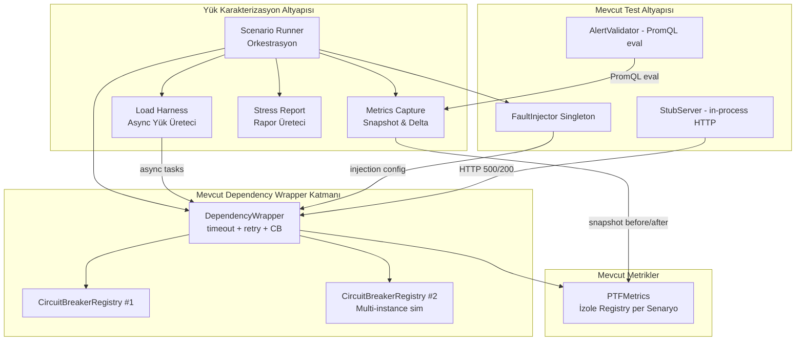
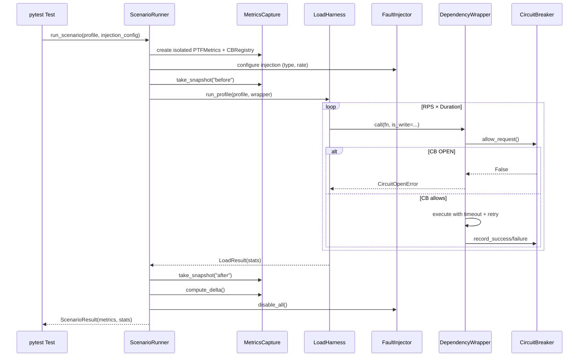
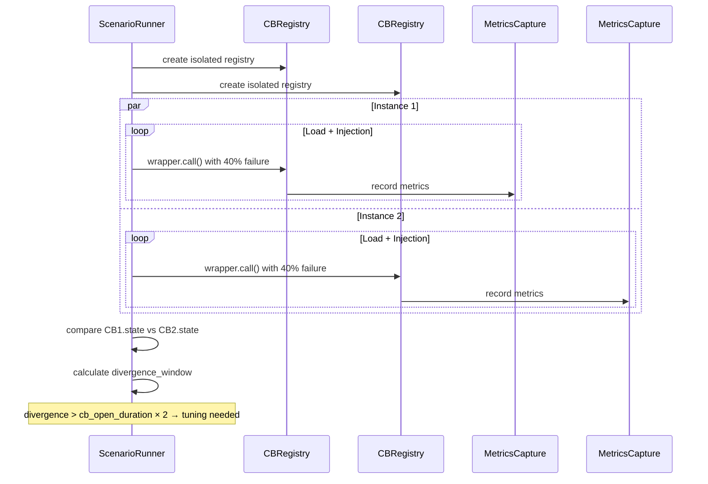

# Tasarım Dokümanı — Load Characterization & Failure Injection

## Genel Bakış

Load Characterization, PTF Admin sisteminin dayanıklılık mekanizmalarını deterministik yük profilleri ve hata enjeksiyonu altında doğrulayan Faz 6 özelliğidir. "Tasarlanmış dayanıklılık"tan "kanıtlanmış dayanıklılık"a geçişi sağlar.

Üç ana bileşenden oluşur:

1. **Load Harness** — Asyncio tabanlı eşzamanlı yük üreteci; 4 deterministik profil (Baseline, Peak, Stress, Burst)
2. **Metrics Capture** — Senaryo öncesi/sonrası metrik snapshot'ı alarak delta hesaplayan yardımcı
3. **Scenario Runner** — Yük profili + hata enjeksiyonu + metrik yakalama orkestrasyon bileşeni

Mevcut altyapı değiştirilmez. Tüm yeni kod `backend/app/testing/` ve `backend/tests/` dizinlerinde yaşar. Mevcut FaultInjector, StubServer, AlertValidator, DependencyWrapper ve CircuitBreakerRegistry bileşenleri olduğu gibi kullanılır.

### Kilitlenmiş Tasarım Kararları

- **LC-1**: Yük üreteci in-process async (asyncio) — harici araç gerektirmez, CI-güvenli, deterministik
- **LC-2**: Hata enjeksiyonu mevcut FaultInjector + wrapper-level hook'lar kullanır — production kodu değişmez
- **LC-3**: Çoklu-instance simülasyonu ayrı CircuitBreakerRegistry instance'ları ile yapılır (gerçek process değil)
- **LC-4**: Her senaryo için izole PTFMetrics registry — senaryolar arası metrik kirlenmesi yok
- **LC-5**: Alert doğrulaması mevcut AlertValidator kullanır — dependency-health alert'leri için genişletilir
- **LC-6**: Tüm yük profilleri pytest testleri olarak çalışır — CI entegrasyonu

### Determinism Scope — Normatif Kurallar (GNK-2)

Bu kurallar tüm bileşenler ve testler için geçerlidir. Bilgilendirme notu değil, zorunlu spesifikasyon kapsamıdır.

**Deterministik çıktılar** (aynı seed + aynı girdi → aynı sonuç):
- Metrik agregasyonu: `retry_total`, `total_calls`, `successful`, `failed`, `circuit_open_rejected`
- Karar çıktıları: alert fire/silent, CB state transitions, outcome counts, mapping completeness
- Rapor çıktıları: `TuningRecommendation` listesi, `write_path_safe`, `flaky_test_correlation` eşik kararı

**Non-deterministic tolerated** (çalıştırmalar arasında farklılık gösterebilir, kesin assertion yapılmaz):
- Per-request zamanlama jitter
- Exact request ordering (tek tek request timeline'ı)
- asyncio scheduling sırası
- OS timing farkları
- `compensated_divergence` ham değeri (yalnızca hesaplanabilirlik ve eşik mantığı doğrulanır)

### Tasarım Parametreleri

| Parametre | Değer | Kaynak |
|-----------|-------|--------|
| RPS toleransı | ±%30 | R1 AC3 |
| scale_factor alt sınır | 0.01 | R1 AC4 |
| Retry amplifikasyon toleransı | `abs(diff) > max(1e-6, 1e-4 × expected)` → FAIL | R2 AC4, GNK-2 |
| Profil min istek: Baseline/Peak | ≥ 200 | GNK-3 |
| Profil min istek: Stress/Burst | ≥ 500 | GNK-3 |
| Profil min istek: Write-path | ≥ 50 | R7 AC3 |
| CB OPEN heuristic threshold | 0.25 (`LcRuntimeConfig.cb_open_threshold`) | R4 AC2, LC simülasyon parametresi; staging'de kalibre edilecek |
| max_clock_skew (default) | 50ms (0.05s) | R5 AC4 |
| CB divergence eşiği | `cb_open_duration_seconds × 2` | R5 AC5 |
| alert eval_interval | `int(os.getenv("EVAL_INTERVAL_SECONDS", "60"))` | ENV fallback; `backend/app/testing/lc_config.py` |
| alert_fire_latency üst sınır | `2 × eval_interval_seconds` | R6 AC5, runtime param via `lc_config` |
| Flaky timing eşiği | 100ms | R9 AC3 |
| CI toplam test süresi limiti | < 4 dakika | R10 AC7 |

---

## Mimari



### Senaryo Akışı



---

## Bileşenler ve Arayüzler

### 1. Load Harness (`backend/app/testing/load_harness.py`)

Asyncio tabanlı eşzamanlı yük üreteci. Yapılandırılabilir profiller ile DependencyWrapper üzerinden istek simülasyonu yapar.

```python
import asyncio
import time
from dataclasses import dataclass, field
from enum import Enum
from typing import Awaitable, Callable


class ProfileType(str, Enum):
    BASELINE = "baseline"    # 50 RPS, 10 dk
    PEAK = "peak"            # 200 RPS, 10 dk
    STRESS = "stress"        # 500 RPS, 5 dk
    BURST = "burst"          # 1000 RPS, 30s × 3 döngü


@dataclass
class LoadProfile:
    """Deterministik yük profili tanımı."""
    profile_type: ProfileType
    rps: int                    # Hedef saniyedeki istek sayısı
    duration_seconds: float     # Toplam süre
    burst_cycles: int = 1       # Burst profili için döngü sayısı
    scale_factor: float = 1.0   # CI ölçekleme faktörü (0.0-1.0)


# Varsayılan profiller
DEFAULT_PROFILES: dict[ProfileType, LoadProfile] = {
    ProfileType.BASELINE: LoadProfile(ProfileType.BASELINE, rps=50, duration_seconds=600),
    ProfileType.PEAK: LoadProfile(ProfileType.PEAK, rps=200, duration_seconds=600),
    ProfileType.STRESS: LoadProfile(ProfileType.STRESS, rps=500, duration_seconds=300),
    ProfileType.BURST: LoadProfile(ProfileType.BURST, rps=1000, duration_seconds=30, burst_cycles=3),
}


@dataclass
class LoadResult:
    """Yük profili çalıştırma sonucu."""
    profile_type: ProfileType
    total_requests: int = 0
    successful: int = 0
    failed: int = 0
    circuit_open_rejected: int = 0
    actual_rps: float = 0.0
    avg_latency_ms: float = 0.0
    p95_latency_ms: float = 0.0
    duration_seconds: float = 0.0
    latencies: list[float] = field(default_factory=list)


class LoadHarness:
    """
    Async yük üreteci.
    
    DependencyWrapper.call() üzerinden eşzamanlı istek simülasyonu yapar.
    Her istek bir asyncio task olarak çalışır.
    """

    def __init__(self, scale_factor: float = 1.0) -> None:
        self._scale_factor = scale_factor

    async def run_profile(
        self,
        profile: LoadProfile,
        call_fn: Callable[[], Awaitable[None]],
    ) -> LoadResult:
        """
        Yük profilini çalıştır.
        
        call_fn: Her istek için çağrılacak async fonksiyon
                 (wrapper.call() çağrısını saran lambda/closure)
        """
        scaled_rps = max(1, int(profile.rps * self._scale_factor))
        result = LoadResult(profile_type=profile.profile_type)
        
        if profile.profile_type == ProfileType.BURST:
            for cycle in range(profile.burst_cycles):
                cycle_result = await self._run_window(
                    scaled_rps, profile.duration_seconds, call_fn
                )
                self._merge_results(result, cycle_result)
        else:
            scaled_duration = profile.duration_seconds * self._scale_factor
            result = await self._run_window(scaled_rps, scaled_duration, call_fn)
            result.profile_type = profile.profile_type
        
        return result

    async def _run_window(
        self, rps: int, duration: float, call_fn: Callable[[], Awaitable[None]]
    ) -> LoadResult:
        """Tek bir zaman penceresi için yük üret."""
        result = LoadResult(profile_type=ProfileType.BASELINE)
        start = time.monotonic()
        interval = 1.0 / rps if rps > 0 else 1.0
        
        while (time.monotonic() - start) < duration:
            batch_start = time.monotonic()
            tasks = []
            for _ in range(rps):
                tasks.append(asyncio.create_task(self._timed_call(call_fn, result)))
            await asyncio.gather(*tasks, return_exceptions=True)
            
            elapsed = time.monotonic() - batch_start
            if elapsed < 1.0:
                await asyncio.sleep(1.0 - elapsed)
        
        result.duration_seconds = time.monotonic() - start
        if result.duration_seconds > 0:
            result.actual_rps = result.total_requests / result.duration_seconds
        if result.latencies:
            result.latencies.sort()
            result.avg_latency_ms = sum(result.latencies) / len(result.latencies) * 1000
            p95_idx = int(len(result.latencies) * 0.95)
            result.p95_latency_ms = result.latencies[min(p95_idx, len(result.latencies) - 1)] * 1000
        
        return result

    async def _timed_call(
        self, call_fn: Callable[[], Awaitable[None]], result: LoadResult
    ) -> None:
        """Tek bir isteği zamanlayarak çalıştır."""
        start = time.monotonic()
        try:
            await call_fn()
            duration = time.monotonic() - start
            result.total_requests += 1
            result.successful += 1
            result.latencies.append(duration)
        except Exception as exc:
            duration = time.monotonic() - start
            result.total_requests += 1
            result.failed += 1
            result.latencies.append(duration)
            # CircuitOpenError ayrı say
            if "Circuit breaker open" in str(exc):
                result.circuit_open_rejected += 1

    @staticmethod
    def _merge_results(target: LoadResult, source: LoadResult) -> None:
        """Burst döngü sonuçlarını birleştir."""
        target.total_requests += source.total_requests
        target.successful += source.successful
        target.failed += source.failed
        target.circuit_open_rejected += source.circuit_open_rejected
        target.latencies.extend(source.latencies)
        target.duration_seconds += source.duration_seconds
```

**Tasarım kararları:**
- `scale_factor`: CI ortamında RPS ve süreyi orantılı küçültür (örn. 0.1 → 50 RPS yerine 5 RPS)
- Batch-per-second: Her saniye `rps` kadar task oluşturur, saniye dolmadan bekleme yapar
- `LoadResult.latencies`: p95 hesaplaması için ham gecikme değerlerini tutar
- Thread-safe değil (asyncio single-thread event loop) — `result` mutation güvenli

### 2. Metrics Capture (`backend/app/testing/metrics_capture.py`)

Senaryo öncesi/sonrası metrik snapshot'ı alarak delta hesaplar.

```python
from dataclasses import dataclass, field
from prometheus_client import CollectorRegistry

from ..ptf_metrics import PTFMetrics


@dataclass
class MetricSnapshot:
    """Tek bir zaman noktasındaki metrik değerleri."""
    timestamp: float = 0.0
    dependency_call_total: dict[str, dict[str, float]] = field(default_factory=dict)
    # {"db_primary": {"success": 10, "failure": 2, "timeout": 1, "circuit_open": 0}}
    dependency_retry_total: dict[str, float] = field(default_factory=dict)
    # {"db_primary": 3}
    circuit_breaker_states: dict[str, int] = field(default_factory=dict)
    # {"db_primary": 0, "external_api": 2}
    guard_failopen_total: float = 0.0
    dependency_map_miss_total: float = 0.0


@dataclass
class MetricDelta:
    """İki snapshot arasındaki fark."""
    total_calls: int = 0
    successful_calls: int = 0
    failed_calls: int = 0
    timeout_calls: int = 0
    circuit_open_calls: int = 0
    total_retries: int = 0
    retry_amplification_factor: float = 0.0
    guard_failopen_count: int = 0
    cb_states: dict[str, int] = field(default_factory=dict)
    p95_latency_ms: float = 0.0


class MetricsCapture:
    """
    Senaryo metrik yakalama yardımcısı.
    
    Her senaryo için izole PTFMetrics registry kullanır (LC-4).
    """

    def __init__(self) -> None:
        self._registry = CollectorRegistry()
        self._metrics = PTFMetrics(registry=self._registry)
        self._before: MetricSnapshot | None = None
        self._after: MetricSnapshot | None = None

    @property
    def metrics(self) -> PTFMetrics:
        return self._metrics

    @property
    def registry(self) -> CollectorRegistry:
        return self._registry

    def take_snapshot(self, label: str = "") -> MetricSnapshot:
        """Mevcut metrik değerlerinden snapshot al."""
        snapshot = MetricSnapshot(timestamp=__import__("time").monotonic())
        # prometheus_client'tan değerleri oku
        # ... snapshot doldurma implementasyonu
        if label == "before":
            self._before = snapshot
        elif label == "after":
            self._after = snapshot
        return snapshot

    def compute_delta(self) -> MetricDelta:
        """Before/after snapshot'ları arasındaki farkı hesapla."""
        delta = MetricDelta()
        # ... delta hesaplama implementasyonu
        if delta.total_calls > 0:
            delta.retry_amplification_factor = delta.total_retries / delta.total_calls
        return delta
```

**Tasarım kararları:**
- İzole `CollectorRegistry`: Her `MetricsCapture` instance'ı kendi registry'sini oluşturur (LC-4)
- `retry_amplification_factor`: `total_retries / total_calls` — 0.0 ideal, >1.0 sorunlu
- Snapshot prometheus_client collector'larından doğrudan okur

### 3. Scenario Runner (`backend/app/testing/scenario_runner.py`)

Yük profili + hata enjeksiyonu + metrik yakalama orkestrasyon bileşeni.

```python
import asyncio
from dataclasses import dataclass, field

from .fault_injection import FaultInjector, InjectionPoint
from .load_harness import LoadHarness, LoadProfile, LoadResult
from .metrics_capture import MetricsCapture, MetricDelta
from ..guards.circuit_breaker import CircuitBreakerRegistry, Dependency
from ..guards.dependency_wrapper import DependencyWrapper, create_wrapper
from ..guard_config import GuardConfig


@dataclass
class InjectionConfig:
    """Hata enjeksiyon yapılandırması."""
    failure_type: str          # "timeout", "5xx", "connection_error", "latency_2x"
    injection_rate: float      # 0.0 - 1.0 (oran)
    target_dependency: str     # Dependency enum value


@dataclass
class ScenarioResult:
    """Senaryo çalıştırma sonucu."""
    scenario_name: str
    load_result: LoadResult
    metric_delta: MetricDelta
    cb_states: dict[str, int] = field(default_factory=dict)
    injection_config: InjectionConfig | None = None


class ScenarioRunner:
    """
    Yük + enjeksiyon + metrik orkestrasyon bileşeni.
    
    Her senaryo için izole bileşenler oluşturur:
    - İzole PTFMetrics registry (LC-4)
    - İzole CircuitBreakerRegistry (LC-3 multi-instance için)
    - Mevcut FaultInjector singleton (LC-2)
    """

    def __init__(self, scale_factor: float = 1.0) -> None:
        self._scale_factor = scale_factor

    async def run_scenario(
        self,
        scenario_name: str,
        profile: LoadProfile,
        injection: InjectionConfig | None = None,
        config: GuardConfig | None = None,
        target_dependency: Dependency = Dependency.DB_PRIMARY,
        is_write: bool = False,
    ) -> ScenarioResult:
        """Tek bir senaryoyu çalıştır."""
        config = config or GuardConfig()
        capture = MetricsCapture()
        cb_registry = CircuitBreakerRegistry(config, capture.metrics)
        wrapper = create_wrapper(target_dependency, cb_registry, config, capture.metrics)
        harness = LoadHarness(self._scale_factor)
        injector = FaultInjector.get_instance()

        try:
            # Enjeksiyon yapılandır
            if injection:
                self._configure_injection(injector, injection)

            # Metrik snapshot (before)
            capture.take_snapshot("before")

            # Yük çalıştır
            async def call_fn():
                await wrapper.call(
                    self._create_target_fn(injection),
                    is_write=is_write,
                )

            load_result = await harness.run_profile(profile, call_fn)

            # Metrik snapshot (after)
            capture.take_snapshot("after")
            delta = capture.compute_delta()

            # CB durumları
            cb_states = {
                dep.value: cb_registry.get(dep.value).state.value
                for dep in Dependency
            }

            return ScenarioResult(
                scenario_name=scenario_name,
                load_result=load_result,
                metric_delta=delta,
                cb_states=cb_states,
                injection_config=injection,
            )
        finally:
            injector.disable_all()
            FaultInjector.reset_instance()

    async def run_multi_instance_scenario(
        self,
        scenario_name: str,
        profile: LoadProfile,
        injection: InjectionConfig,
        instance_count: int = 2,
        config: GuardConfig | None = None,
    ) -> list[ScenarioResult]:
        """Çoklu CB instance senaryosu (LC-3)."""
        config = config or GuardConfig()
        results = []
        
        # Her instance için ayrı registry + wrapper
        captures = [MetricsCapture() for _ in range(instance_count)]
        registries = [
            CircuitBreakerRegistry(config, cap.metrics) for cap in captures
        ]
        
        # Paralel çalıştır
        tasks = []
        for i in range(instance_count):
            tasks.append(
                self._run_instance(
                    f"{scenario_name}_instance_{i}",
                    profile, injection, config,
                    captures[i], registries[i],
                )
            )
        results = await asyncio.gather(*tasks)
        return list(results)

    def _configure_injection(
        self, injector: FaultInjector, injection: InjectionConfig
    ) -> None:
        """Enjeksiyon türüne göre FaultInjector'ı yapılandır."""
        # ... injection type → InjectionPoint mapping

    def _create_target_fn(
        self, injection: InjectionConfig | None
    ):
        """Enjeksiyon yapılandırmasına göre hedef fonksiyon oluştur."""
        # ... async fn that may raise based on injection rate
```

**Tasarım kararları:**
- `finally` bloğunda `disable_all()` + `reset_instance()`: test izolasyonu garantisi
- `run_multi_instance_scenario`: `asyncio.gather` ile paralel instance çalıştırma (LC-3)
- Her instance kendi `MetricsCapture` + `CircuitBreakerRegistry` kullanır — bağımsız CB FSM'leri

### 4. Stress Report (`backend/app/testing/stress_report.py`)

Senaryo sonuçlarından yapılandırılmış rapor üreten bileşen.

```python
from dataclasses import dataclass, field


@dataclass
class TuningRecommendation:
    """Tek bir ayar önerisi."""
    parameter: str
    current_value: str
    recommended_value: str
    reason: str


@dataclass
class StressReport:
    """Tüm senaryoların birleşik raporu."""
    scenario_results: list  # ScenarioResult listesi
    retry_amplification: dict[str, float] = field(default_factory=dict)
    cb_tuning: list[TuningRecommendation] = field(default_factory=list)
    retry_tuning: list[TuningRecommendation] = field(default_factory=list)
    alert_tuning: list[TuningRecommendation] = field(default_factory=list)
    write_path_safe: bool = False
    flaky_test_correlation: str = ""
    flaky_segment: dict = field(default_factory=dict)
    # flaky_segment dolu ise: {"timing_deviation_ms": float, "suspected_source": str, "repro_steps": str}
    
    def generate_metrics_table(self) -> list[dict]:
        """Her senaryo için metrik tablosu üret."""
        # ...

    def generate_recommendations(self) -> list[TuningRecommendation]:
        """Tüm ayar önerilerini birleştir."""
        # ...
```

### 5. Hata Enjeksiyon Matrisi

Wrapper seviyesinde enjeksiyon — mevcut FaultInjector + yeni wrapper-level hook'lar.

| Hata Türü | Enjeksiyon Mekanizması | Beklenen Davranış |
|-----------|----------------------|-------------------|
| Timeout %10 | `asyncio.sleep(timeout+1)` oran bazlı | Retry artışı, CB kapalı kalır |
| Timeout %40 | `asyncio.sleep(timeout+1)` oran bazlı | CB OPEN'a geçer |
| 5xx %30 | `raise ConnectionError` oran bazlı | CB OPEN eşiğine ulaşır |
| ConnectionError %100 | `raise ConnectionError` her çağrıda | Hızlı CB OPEN |
| Latency 2× %100 | `asyncio.sleep(normal_latency)` | Gecikme artışı, CB kapalı (timeout altında) |

Enjeksiyon, `_create_target_fn()` içinde oran bazlı random ile uygulanır:

```python
import random

async def _create_injected_fn(
    injection: InjectionConfig,
    base_fn,
    timeout: float,
):
    """Enjeksiyon oranına göre hata üreten wrapper fonksiyon."""
    async def fn():
        if random.random() < injection.injection_rate:
            if injection.failure_type == "timeout":
                await asyncio.sleep(timeout + 1)  # timeout aşımı
            elif injection.failure_type == "5xx":
                raise ConnectionError("Injected 5xx")
            elif injection.failure_type == "connection_error":
                raise ConnectionError("Injected connection error")
            elif injection.failure_type == "latency_2x":
                await asyncio.sleep(timeout * 0.8)  # timeout altında ama yavaş
                return
        # Normal çağrı
        await base_fn()
    return fn
```

### 6. Çoklu-Instance CB Sapma Analizi



**Sapma hesaplama:**
- Her instance'ın CB durum geçiş zamanları kaydedilir (monotonic timestamp)
- Ham divergence: `divergence_window = |instance1_open_time - instance2_open_time|`
- Clock skew compensation: `compensated_divergence = max(0, divergence_window - max_clock_skew)`
  - `max_clock_skew` default 50ms (0.05s), yapılandırılabilir
  - Eşik karşılaştırması compensated değer üzerinden yapılır
- Eşik: `cb_open_duration_seconds × 2` (varsayılan 60s)
- Çift yönlü FAIL semantiği:
  - `compensated_divergence > eşik` → `TuningRecommendation` üretilmeli (yoksa FAIL)
  - `compensated_divergence ≤ eşik` → öneri üretilmemeli (varsa FAIL)

---

## Veri Modelleri

### LoadProfile

```python
@dataclass
class LoadProfile:
    profile_type: ProfileType   # BASELINE | PEAK | STRESS | BURST
    rps: int                    # Hedef RPS
    duration_seconds: float     # Süre
    burst_cycles: int = 1       # Burst döngü sayısı
    scale_factor: float = 1.0   # CI ölçekleme (0.0-1.0)
```

### Varsayılan Profiller

| Profil | RPS | Süre | Hedef |
|--------|-----|------|-------|
| Baseline | 50 | 10 dk | Kararlı metrik baseline |
| Peak | 200 | 10 dk | Gecikme artışı gözlemi |
| Stress | 500 | 5 dk | Retry amplifikasyonu |
| Burst | 1000 | 30s × 3 | CB salınım davranışı |

### InjectionConfig

```python
@dataclass
class InjectionConfig:
    failure_type: str       # "timeout" | "5xx" | "connection_error" | "latency_2x"
    injection_rate: float   # 0.0 - 1.0
    target_dependency: str  # Dependency enum value
```

### Failure Matrix

| Hata Türü | Enjeksiyon Oranı | Beklenen CB Durumu | Beklenen Retry |
|-----------|-----------------|-------------------|----------------|
| Timeout | %10 | CLOSED | Artış var |
| Timeout | %40 | OPEN | CB açılınca durur |
| 5xx | %30 | OPEN | CB açılınca durur |
| ConnectionError | %100 | OPEN (hızlı) | CB açılınca durur |
| Latency 2× | %100 | CLOSED | Yok (timeout altında) |

### ScenarioResult

```python
@dataclass
class ScenarioResult:
    scenario_name: str
    load_result: LoadResult
    metric_delta: MetricDelta
    cb_states: dict[str, int]
    injection_config: InjectionConfig | None
```

### StressReport

```python
@dataclass
class StressReport:
    scenario_results: list[ScenarioResult]
    retry_amplification: dict[str, float]
    cb_tuning: list[TuningRecommendation]
    retry_tuning: list[TuningRecommendation]
    alert_tuning: list[TuningRecommendation]
    write_path_safe: bool
    flaky_test_correlation: str
```

---

## Doğruluk Özellikleri (Correctness Properties)

*Bir özellik (property), sistemin tüm geçerli çalışmalarında doğru kalması gereken bir davranış veya karakteristiktir — esasen, sistemin ne yapması gerektiğine dair biçimsel bir ifadedir. Özellikler, insan tarafından okunabilir spesifikasyonlar ile makine tarafından doğrulanabilir doğruluk garantileri arasında köprü görevi görür.*

### Property 1: LoadResult İnvariantı — Toplam = Başarılı + Başarısız

*For any* LoadResult nesnesi, `total_requests` değeri `successful + failed` toplamına eşit olmalıdır. Ayrıca `circuit_open_rejected` değeri `failed` değerinden büyük olmamalıdır.

**Validates: Requirements 1.5**

### Property 2: RPS Toleransı

*For any* LoadProfile ve yeterli süre (≥1 saniye), LoadHarness'ın ürettiği `actual_rps` değeri hedef `rps × scale_factor` değerinin ±%30 toleransı içinde olmalıdır.

**Validates: Requirements 1.3**

### Property 3: Ölçekleme Faktörü Metamorfik Özelliği

*For any* LoadProfile ve iki farklı scale_factor değeri (s1, s2 where s1 < s2), s2 ile çalıştırılan senaryonun `total_requests` değeri s1 ile çalıştırılanınkinden büyük veya eşit olmalıdır.

**Validates: Requirements 1.4**

### Property 4: Retry Amplifikasyon Formülü

*For any* MetricDelta nesnesi, `retry_amplification_factor` değeri `total_retries / total_calls` formülüne eşit olmalıdır (total_calls > 0 ise). total_calls = 0 ise retry_amplification_factor = 0.0 olmalıdır.

**Validates: Requirements 2.4**

### Property 5: MetricsCapture İzolasyonu

*For any* iki ayrı MetricsCapture instance'ı, birindeki metrik artışı (inc_dependency_call, inc_dependency_retry vb.) diğerinin snapshot değerlerini etkilememelidir.

**Validates: Requirements 2.5, 3.2**

### Property 6: Senaryo Temizlik İnvariantı

*For any* ScenarioRunner.run_scenario() çağrısı (başarılı veya hatalı), çağrı sonrasında FaultInjector'daki tüm InjectionPoint'ler disabled durumda olmalıdır.

**Validates: Requirements 3.4**

### Property 7: %100 Hata Oranında CB OPEN Garantisi

*For any* dependency ve %100 CB-failure enjeksiyon oranı, `cb_min_samples` kadar istek gönderildikten sonra ilgili CircuitBreaker OPEN durumuna geçmelidir.

**Validates: Requirements 4.4**

### Property 8: CB Registry Bağımsızlığı

*For any* iki ayrı CircuitBreakerRegistry instance'ı ve aynı dependency adı, birindeki CB'ye record_failure() çağrılması diğerindeki CB'nin durumunu değiştirmemelidir.

**Validates: Requirements 5.2**

### Property 9: Sapma Eşiği ve Ayar Önerisi

*For any* CB_Divergence_Window değeri, max_clock_skew ve cb_open_duration_seconds yapılandırması, `compensated_divergence = max(0, divergence_window - max_clock_skew)` hesaplanır. `compensated_divergence > cb_open_duration_seconds × 2` ise StressReport bir TuningRecommendation üretmelidir; aksi halde üretmemelidir (çift yönlü FAIL).

**Validates: Requirements 5.4, 5.5**

### Property 10: Alert Doğrulama Tutarlılığı

*For any* senaryo sonucu ve beklenen/beklenmeyen alert listesi, AlertValidator beklenen alert'lerin `would_fire=True` ve beklenmeyen alert'lerin `would_fire=False` döndürmesi gerekir. Metrik değerleri eşik değerlerle tutarlı olmalıdır.

**Validates: Requirements 6.1, 6.2**

### Property 13: Alert Fire Latency Üst Sınırı

*For any* beklenen alert tetiklemesi, `alert_fire_latency_seconds` değeri `2 × eval_interval_seconds` üst sınırını aşmamalıdır. `eval_interval_seconds` runtime paramından okunur: `int(os.getenv("EVAL_INTERVAL_SECONDS", "60"))`. ENV yoksa fallback 60s. Eşik aşımı FAIL.

**Validates: Requirements 6.5**

### Property 11: Write-Path Retry Sıfır Garantisi

*For any* DependencyWrapper çağrısı `is_write=True` ve `wrapper_retry_on_write=False` yapılandırması ile, retry sayısı sıfır olmalıdır. `dependency_retry_total` metriği artmamalıdır.

**Validates: Requirements 7.1, 7.2, 7.3**

### Property 12: Rapor Tamlığı

*For any* ScenarioResult listesi, StressReport.generate_metrics_table() her senaryo için bir satır üretmelidir ve satır sayısı giriş listesi uzunluğuna eşit olmalıdır.

**Validates: Requirements 8.1**

---

## FAIL Diagnostic Payload Şeması (GNK-1)

Her FAIL koşulu tetiklendiğinde, test çıktısı aşağıdaki yapıda tek satır diagnostic payload içermelidir:

```python
@dataclass
class FailDiagnostic:
    """FAIL koşulu tetiklendiğinde üretilen diagnostic payload."""
    scenario_id: str        # Senaryo tanımlayıcı (ör. "FM-2_timeout_40pct")
    dependency: str         # Hedef dependency (ör. "db_primary")
    outcome: str            # Gözlenen sonuç türü (ör. "cb_state_mismatch")
    observed: str           # Gözlenen değer (ör. "CLOSED")
    expected: str           # Beklenen değer (ör. "OPEN")
    seed: int               # Deterministik seed değeri
```

Assertion mesajı formatı:
```
FAIL: scenario_id={scenario_id} dependency={dependency} outcome={outcome} observed={observed} expected={expected} seed={seed}
```

Bu payload, CI'da FAIL triage süresini minimize eder. Tüm test fonksiyonları bu formatı kullanmalıdır.

---

## Rapor Şeması — Flaky Korelasyon Segmenti (R9)

`StressReport.flaky_test_correlation` dolu olduğunda, rapor segmenti en az şu 3 alanı içermelidir:

```python
@dataclass
class FlakyCorrelationSegment:
    """Flaky test korelasyon rapor segmenti."""
    timing_deviation_ms: float      # Gözlenen zamanlama sapması (ms)
    suspected_source: str           # Şüpheli kaynak: "scheduler" | "io" | "cb" | "retry"
    repro_steps: str                # Reprodüksiyon adımları: "seed={seed} scenario={name} dependency={dep}"
```

Eşik mantığı:
- `timing_deviation_ms > 100` → segment dolu (3 alan zorunlu)
- `timing_deviation_ms ≤ 100` → segment boş string (noise üretme)

---

## Hata Yönetimi

### Load Harness Hataları
- **RPS hedefine ulaşılamama**: `actual_rps` raporlanır, test tolerans kontrolü yapar; hata fırlatılmaz
- **Task exception**: `asyncio.gather(return_exceptions=True)` ile yakalanır, `failed` sayacına eklenir
- **Timeout**: Bireysel task timeout'ları DependencyWrapper tarafından yönetilir; LoadHarness seviyesinde ek timeout yok

### Metrics Capture Hataları
- **Prometheus registry okuma hatası**: Snapshot'ta ilgili metrik 0.0 olarak kaydedilir
- **Division by zero (retry amplification)**: `total_calls = 0` ise `retry_amplification_factor = 0.0`
- **İzolasyon ihlali**: Her MetricsCapture kendi CollectorRegistry'sini oluşturur — paylaşım mümkün değil

### Scenario Runner Hataları
- **Enjeksiyon yapılandırma hatası**: Geçersiz failure_type → ValueError fırlatılır
- **Senaryo çalıştırma hatası**: `finally` bloğunda `disable_all()` + `reset_instance()` garantisi
- **Multi-instance paralel hata**: `asyncio.gather` ile tüm instance'lar bağımsız çalışır; birinin hatası diğerini etkilemez

### Stress Report Hataları
- **Boş senaryo listesi**: Boş rapor üretilir, hata fırlatılmaz
- **Eksik metrik verisi**: Varsayılan değerler (0.0, False) kullanılır
- **Tuning önerisi üretememe**: Eşik aşılmamışsa boş öneri listesi döner

---

## Test Stratejisi

### İkili Test Yaklaşımı

**Property-Based Testler** (Hypothesis — Python):
- Her correctness property için ayrı bir property-based test
- Minimum 100 iterasyon per test
- Her test, tasarım dokümanındaki property numarasını referans eder
- Tag formatı: `Feature: load-characterization, Property N: {property_text}`
- Kütüphane: `hypothesis` (Python backend)
- PBT Performans Kuralı: `st.from_regex(...)` kullanılmaz; küçük boyut limitleri ile kompozisyonel stratejiler tercih edilir

**Unit / Entegrasyon Testler** (pytest):
- Failure matrix senaryoları (4.1-4.5) entegrasyon testleri olarak
- Multi-instance CB sapma testi
- Alert doğrulama testleri
- Write-path güvenlik testi (stress altında)
- Flaky test korelasyon gözlemi
- Rapor üretimi doğrulaması

### Test Dosya Yapısı

```
backend/app/testing/
  lc_config.py             # Tüm LC parametreleri: ENV fallback, GNK-3 sabitleri, toleranslar
  load_harness.py          # Async yük üreteci + LoadProfile + LoadResult
  metrics_capture.py       # MetricsCapture + MetricSnapshot + MetricDelta
  scenario_runner.py       # ScenarioRunner + InjectionConfig + ScenarioResult
  stress_report.py         # StressReport + TuningRecommendation

backend/tests/
  test_lc_config.py            # ENV parsing + fallback doğrulaması (PR-1)
  test_lc_load_harness.py      # Property 1, 2, 3 + unit tests
  test_lc_metrics_capture.py   # Property 4, 5 + unit tests
  test_lc_scenario_runner.py   # Property 6 + unit tests
  test_lc_failure_matrix.py    # Property 7 + failure matrix entegrasyon testleri
  test_lc_multi_instance.py    # Property 8, 9 + multi-instance CB sapma testleri
  test_lc_alert_validation.py  # Property 10, 13 + alert doğrulama testleri
  test_lc_write_safety.py      # Property 11 + write-path güvenlik testleri
  test_lc_report.py            # Property 12 + rapor üretimi testleri
  test_lc_flaky_correlation.py # Flaky test korelasyon gözlemi
  test_lc_integration.py       # Uçtan uca entegrasyon testi
```

### Property-Based Test Konfigürasyonu

```python
from hypothesis import given, settings, strategies as st

# Property 1: LoadResult İnvariantı
@settings(max_examples=100)
@given(
    successful=st.integers(min_value=0, max_value=10000),
    failed=st.integers(min_value=0, max_value=10000),
    circuit_open=st.integers(min_value=0, max_value=100),
)
def test_load_result_invariant(successful, failed, circuit_open):
    """Feature: load-characterization, Property 1: LoadResult İnvariantı"""
    circuit_open = min(circuit_open, failed)  # circuit_open <= failed
    result = LoadResult(
        profile_type=ProfileType.BASELINE,
        total_requests=successful + failed,
        successful=successful,
        failed=failed,
        circuit_open_rejected=circuit_open,
    )
    assert result.total_requests == result.successful + result.failed
    assert result.circuit_open_rejected <= result.failed


# Property 4: Retry Amplifikasyon Formülü
@settings(max_examples=100)
@given(
    total_calls=st.integers(min_value=0, max_value=10000),
    total_retries=st.integers(min_value=0, max_value=5000),
)
def test_retry_amplification_formula(total_calls, total_retries):
    """Feature: load-characterization, Property 4: Retry Amplifikasyon Formülü"""
    delta = MetricDelta(total_calls=total_calls, total_retries=total_retries)
    if total_calls > 0:
        expected = total_retries / total_calls
        assert abs(delta.retry_amplification_factor - expected) <= max(1e-6, 1e-4 * expected)
    else:
        assert delta.retry_amplification_factor == 0.0


# Property 5: MetricsCapture İzolasyonu
@settings(max_examples=100)
@given(
    dep=st.sampled_from(["db_primary", "external_api", "cache"]),
    count=st.integers(min_value=1, max_value=100),
)
def test_metrics_capture_isolation(dep, count):
    """Feature: load-characterization, Property 5: MetricsCapture İzolasyonu"""
    cap1 = MetricsCapture()
    cap2 = MetricsCapture()
    for _ in range(count):
        cap1.metrics.inc_dependency_call(dep, "success")
    # cap2 etkilenmemeli
    snap2 = cap2.take_snapshot()
    # snap2'deki dep success count = 0 olmalı
```

### Senaryo Test Süresi Hedefleri

| Test Dosyası | Hedef Süre | Yaklaşım |
|-------------|-----------|----------|
| test_lc_config.py | < 2s | ENV parsing, fallback doğrulaması |
| test_lc_load_harness.py | < 30s | Küçük scale_factor (0.01), kısa süre |
| test_lc_metrics_capture.py | < 10s | İzole metrik testleri |
| test_lc_scenario_runner.py | < 30s | Küçük profil, kısa süre |
| test_lc_failure_matrix.py | < 60s | Her matris satırı için kısa senaryo |
| test_lc_multi_instance.py | < 30s | 2 instance, kısa profil |
| test_lc_alert_validation.py | < 10s | Deterministik PromQL eval |
| test_lc_write_safety.py | < 30s | Stress profili, küçük scale |
| test_lc_report.py | < 10s | Rapor üretimi unit testleri |
| test_lc_flaky_correlation.py | < 20s | Zamanlama sapması gözlemi |
| test_lc_integration.py | < 30s | Uçtan uca entegrasyon |
| **Toplam** | **< 4 dakika** | CI-safe |
