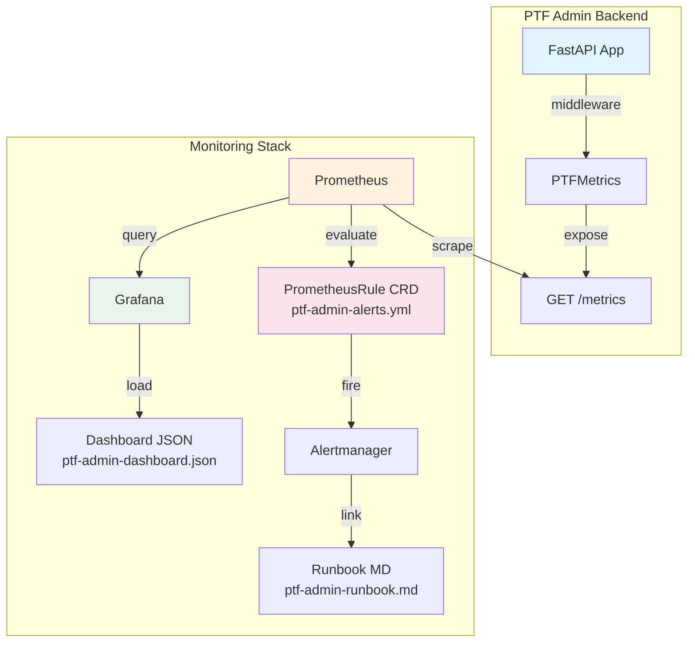

# Design Document: Observability Pack

## Overview

Bu tasarım, mevcut PTF Admin Prometheus metriklerini operasyonel olarak kullanılabilir hale getiren üç statik dosyanın yapısını tanımlar:

1. **Grafana Dashboard JSON** — 4 bölüm, ~12 panel
2. **PrometheusRule YAML** — 8 alert kuralı (S1–S5 grupları)
3. **Runbook Markdown** — Alert başına troubleshooting rehberi

Tüm dosyalar statik artifact'tir; runtime kodu değişikliği gerektirmez. Hedef ortam: Prometheus Operator (kube-prometheus-stack) + Grafana.

## Architecture



### Dosya Yapısı

```
monitoring/
├── grafana/
│   └── ptf-admin-dashboard.json    # Grafana provisioning-ready dashboard
├── prometheus/
│   └── ptf-admin-alerts.yml        # PrometheusRule CRD (Prometheus Operator)
└── runbooks/
    └── ptf-admin-runbook.md        # Per-alert troubleshooting guide
```

### Deployment Akışı

1. **Dashboard**: `kubectl create configmap ptf-admin-dashboard --from-file=monitoring/grafana/ptf-admin-dashboard.json` veya Grafana UI'dan import
2. **Alert Rules**: `kubectl apply -f monitoring/prometheus/ptf-admin-alerts.yml`
3. **Runbook**: Alert annotation'larındaki `runbook_url` ile erişilir (Git repo URL veya wiki)

## Components and Interfaces

### Component 1: Grafana Dashboard (`ptf-admin-dashboard.json`)

Grafana dashboard JSON modeli, provisioning API ile uyumlu standart yapıyı takip eder.

#### Üst Düzey Yapı

```json
{
  "__inputs": [
    {
      "name": "DS_PROMETHEUS",
      "label": "Prometheus",
      "type": "datasource",
      "pluginId": "prometheus"
    }
  ],
  "title": "PTF Admin Overview",
  "uid": "ptf-admin-overview",
  "tags": ["ptf-admin", "prometheus"],
  "timezone": "browser",
  "time": { "from": "now-1h", "to": "now" },
  "refresh": "30s",
  "templating": {
    "list": [
      {
        "name": "datasource",
        "type": "datasource",
        "query": "prometheus"
      }
    ]
  },
  "panels": [ ... ]
}
```

#### Panel Düzeni (Row-based Layout)

| Row | Bölüm | Panel Sayısı | Panel Tipleri |
|-----|--------|-------------|---------------|
| 1 | API Traffic & Health | 4 | timeseries, timeseries, timeseries, stat |
| 2 | Import/Upsert Business Health | 3 | timeseries, timeseries, timeseries |
| 3 | Lookup / History | 3 | timeseries, timeseries, timeseries |
| 4 | Frontend Telemetry | 2 | bargauge, timeseries |

#### Panel PromQL Sorguları

**Row 1: API Traffic & Health**

| Panel | Tip | PromQL |
|-------|-----|--------|
| Request Rate | timeseries | `sum(rate(ptf_admin_api_request_total{endpoint!="/metrics"}[5m])) by (endpoint, method, status_class)` |
| Error Rate | timeseries | `sum(rate(ptf_admin_api_request_total{status_class=~"4xx\|5xx\|0xx"}[5m])) by (status_class)` |
| P95 Latency | timeseries | `histogram_quantile(0.95, sum(rate(ptf_admin_api_request_duration_seconds_bucket{endpoint!="/metrics"}[5m])) by (le, endpoint))` |
| /metrics Self-Exclude Check | stat | `sum(rate(ptf_admin_api_request_total{endpoint="/metrics"}[5m]))` — beklenen değer: 0 veya "No data" |

**Row 2: Import/Upsert Business Health**

| Panel | Tip | PromQL |
|-------|-----|--------|
| Upsert Rate | timeseries | `sum(rate(ptf_admin_upsert_total[5m])) by (status)` |
| Import Rows | timeseries | `sum(rate(ptf_admin_import_rows_total[5m])) by (outcome)` |
| Import Apply P95 | timeseries | `histogram_quantile(0.95, sum(rate(ptf_admin_import_apply_duration_seconds_bucket[5m])) by (le))` |

**Row 3: Lookup / History**

| Panel | Tip | PromQL |
|-------|-----|--------|
| Lookup Hit/Miss | timeseries | `sum(rate(ptf_admin_lookup_total[5m])) by (hit, status)` |
| History Query Rate | timeseries | `sum(rate(ptf_admin_history_query_total[5m]))` |
| History Query P95 | timeseries | `histogram_quantile(0.95, sum(rate(ptf_admin_history_query_duration_seconds_bucket[5m])) by (le))` |

**Row 4: Frontend Telemetry**

| Panel | Tip | PromQL |
|-------|-----|--------|
| Top Events (1h) | bargauge | `topk(20, sum(increase(ptf_admin_frontend_events_total[1h])) by (event_name))` |
| Telemetry Endpoint Health | timeseries | `sum(rate(ptf_admin_api_request_total{endpoint="/admin/telemetry/events"}[5m])) by (status_class)` |

#### Renk Kodlaması

| Status Class | Renk | Hex |
|-------------|-------|-----|
| 2xx | Yeşil | `#73BF69` |
| 3xx | Mavi | `#5794F2` |
| 4xx | Sarı | `#FADE2A` |
| 5xx | Kırmızı | `#F2495C` |
| 0xx | Mor | `#B877D9` |

### Component 2: PrometheusRule CRD (`ptf-admin-alerts.yml`)

#### CRD Üst Yapı

```yaml
apiVersion: monitoring.coreos.com/v1
kind: PrometheusRule
metadata:
  name: ptf-admin-alerts
  labels:
    app: ptf-admin
    prometheus: kube-prometheus
spec:
  groups:
    - name: ptf-admin-alerts
      rules: [ ... ]
```

#### Alert Kuralları Detayı

| ID | Alert Adı | Severity | PromQL | For | Grup |
|----|-----------|----------|--------|-----|------|
| S1a | PTFAdminMetricsAbsent | critical | `absent(ptf_admin_api_request_total)` | 5m | Scrape/Liveness |
| S1b | PTFAdminTargetDown | critical | `up{job="ptf-admin"} == 0` | 2m | Scrape/Liveness |
| S2a | PTFAdmin5xxSpike | warning | `sum(rate(ptf_admin_api_request_total{status_class="5xx"}[5m])) / sum(rate(ptf_admin_api_request_total[5m])) > 0.05` | 5m | Error Spikes |
| S2b | PTFAdminExceptionPath | critical | `sum(rate(ptf_admin_api_request_total{status_class="0xx"}[5m])) > 0` | 5m | Error Spikes |
| S3a | PTFAdminHighLatency | warning | `histogram_quantile(0.95, sum(rate(ptf_admin_api_request_duration_seconds_bucket[5m])) by (le, endpoint)) > 2` | 5m | Latency |
| S3b | PTFAdminTelemetryLatency | warning | `histogram_quantile(0.95, sum(rate(ptf_admin_api_request_duration_seconds_bucket{endpoint="/admin/telemetry/events"}[5m])) by (le)) > 0.5` | 5m | Latency |
| S3c | PTFAdminImportLatency | warning | `histogram_quantile(0.95, sum(rate(ptf_admin_import_apply_duration_seconds_bucket[5m])) by (le)) > 10` | 5m | Latency |
| S4 | PTFAdminTelemetryAbuse | warning | `sum(rate(ptf_admin_api_request_total{endpoint="/admin/telemetry/events",status_class="4xx"}[5m])) * 60 > 10` | 5m | Abuse |
| S5 | PTFAdminImportRejectRatio | warning | `sum(rate(ptf_admin_import_rows_total{outcome="rejected"}[15m])) / sum(rate(ptf_admin_import_rows_total[15m])) > 0.2` | 15m | Import Quality |

#### Alert Annotation Şablonu

Her alert aşağıdaki annotation'ları içerir:

```yaml
annotations:
  summary: "Kısa açıklama"
  description: "Detaylı açıklama — {{ $labels.endpoint }} / {{ $value }}"
  runbook_url: "https://github.com/<repo>/blob/main/monitoring/runbooks/ptf-admin-runbook.md#alert-adı"
```

### Component 3: Runbook (`ptf-admin-runbook.md`)

#### Bölüm Yapısı (Her Alert İçin)

```markdown
## PTFAdminAlertName

**Severity:** critical/warning
**PromQL:** `<alert expression>`

### Olası Nedenler
1. ...
2. ...
3. ...

### İlk 3 Kontrol
1. ...
2. ...
3. ...

### Müdahale Adımları
1. ...
2. ...
```

#### Alert-Runbook Eşleştirmesi

| Alert | Olası Nedenler (Özet) | İlk Kontroller |
|-------|----------------------|----------------|
| PTFAdminMetricsAbsent | Pod crash, OOM kill, deployment hatası | Pod logs, `kubectl get pods`, recent deploys |
| PTFAdminTargetDown | Network policy, service endpoint değişikliği, Prometheus config | `kubectl get endpoints`, ServiceMonitor, Prometheus targets UI |
| PTFAdmin5xxSpike | Unhandled exception, DB connection pool, upstream timeout | Application logs (5xx filter), DB connection count, recent deploys |
| PTFAdminExceptionPath | Uncaught exception in middleware, dependency crash | Application logs (traceback), middleware chain, dependency health |
| PTFAdminHighLatency | DB slow queries, connection pool exhaustion, resource contention | Slow query log, connection pool metrics, pod resource usage |
| PTFAdminTelemetryLatency | Event ingestion bottleneck, rate limiter misconfiguration | Telemetry endpoint logs, rate limiter state, pod CPU |
| PTFAdminImportLatency | Large batch size, DB lock contention, disk I/O | Import batch sizes, DB lock waits, disk metrics |
| PTFAdminTelemetryAbuse | Bot/scraper traffic, misconfigured frontend, rate limit trigger | Access logs (IP analysis), rate limiter 429 count, frontend deploy |
| PTFAdminImportRejectRatio | Veri format değişikliği, upstream data quality, validation rule change | Rejected row samples, import source analysis, recent validation changes |


## Data Models

Bu özellik runtime veri modeli içermez. Tüm çıktılar statik dosyalardır. Aşağıda dosya formatlarının şema tanımları verilmiştir.

### Grafana Dashboard JSON Şeması

```
Dashboard {
  __inputs: Input[]           # Datasource tanımları
  title: string               # "PTF Admin Overview"
  uid: string                 # "ptf-admin-overview"
  tags: string[]              # ["ptf-admin", "prometheus"]
  timezone: string            # "browser"
  time: { from: string, to: string }  # { "now-1h", "now" }
  refresh: string             # "30s"
  templating: { list: Variable[] }
  panels: Panel[]
}

Panel {
  id: number                  # Unique panel ID
  title: string               # Panel başlığı
  type: string                # "timeseries" | "stat" | "bargauge"
  gridPos: { h, w, x, y }    # 24-column grid pozisyonu
  targets: Target[]           # PromQL sorguları
  fieldConfig: object         # Renk, birim, threshold ayarları
}

Target {
  expr: string                # PromQL expression
  legendFormat: string        # Legend şablonu
  refId: string               # "A", "B", ...
  datasource: { uid: "$datasource", type: "prometheus" }
}

Row {
  id: number
  title: string
  type: "row"
  collapsed: boolean          # true — collapsible rows
  panels: Panel[]
}
```

### PrometheusRule YAML Şeması

```
PrometheusRule {
  apiVersion: "monitoring.coreos.com/v1"
  kind: "PrometheusRule"
  metadata: {
    name: string              # "ptf-admin-alerts"
    labels: { app, prometheus }
  }
  spec: {
    groups: RuleGroup[]
  }
}

RuleGroup {
  name: string                # "ptf-admin-alerts"
  rules: Rule[]
}

Rule {
  alert: string               # Alert adı
  expr: string                # PromQL expression
  for: string                 # Duration (e.g. "5m")
  labels: {
    severity: string          # "critical" | "warning"
    team: string
    service: string           # "ptf-admin"
  }
  annotations: {
    summary: string
    description: string
    runbook_url: string
  }
}
```

### Runbook Markdown Yapısı

```
Runbook {
  title: string               # "PTF Admin Runbook"
  sections: AlertSection[]
}

AlertSection {
  alert_name: string          # Alert adı (H2 heading)
  severity: string
  promql: string              # Alert expression
  probable_causes: string[]   # En az 3 madde
  diagnostic_checks: string[] # İlk 3 kontrol
  mitigation_steps: string[]  # Müdahale adımları
}
```

## Correctness Properties

*Bir özellik (property), sistemin tüm geçerli çalışmalarında doğru olması gereken bir davranış veya karakteristiktir — esasen, sistemin ne yapması gerektiğine dair biçimsel bir ifadedir. Özellikler, insan tarafından okunabilir spesifikasyonlar ile makine tarafından doğrulanabilir doğruluk garantileri arasındaki köprü görevi görür.*

Bu özellik statik dosyalar ürettiği için, correctness properties dosya yapısının doğruluğunu ve dosyalar arası tutarlılığı doğrular.

### Property 1: Dashboard Row Panel Sayısı

*For any* dashboard row, the number of panels contained within that row SHALL be at least the minimum specified for that section (API Traffic & Health ≥ 4, Import/Upsert ≥ 3, Lookup/History ≥ 3, Frontend Telemetry ≥ 2).

**Validates: Requirements 1.1, 2.1, 3.1, 4.1**

### Property 2: Self-Exclude Doğrulaması

*For any* PromQL expression in the dashboard panels (excluding the dedicated self-exclude verification panel), the expression SHALL either contain an `endpoint!="/metrics"` filter or not reference the `ptf_admin_api_request_total` / `ptf_admin_api_request_duration_seconds` metrics.

**Validates: Requirements 1.5**

### Property 3: Dashboard JSON Geçerliliği

*For any* valid Grafana dashboard JSON file produced by this feature, parsing the JSON SHALL succeed and the resulting object SHALL contain the required top-level keys: `title`, `uid`, `panels`, `templating`, `time`, `refresh`.

**Validates: Requirements 5.1**

### Property 4: Collapsible Row Yapısı

*For any* panel of type "row" in the dashboard JSON, the `collapsed` field SHALL be `true`, ensuring all sections are collapsible.

**Validates: Requirements 5.3**

### Property 5: Alert Rule Tamamlığı

*For any* alert rule in the PrometheusRule YAML, the rule SHALL contain: (a) `severity`, `team`, and `service` labels, and (b) `summary`, `description`, and `runbook_url` annotations.

**Validates: Requirements 6.3, 7.3, 8.4, 9.2, 10.2, 11.3, 11.4**

### Property 6: PrometheusRule CRD Geçerliliği

*For any* PrometheusRule YAML file produced by this feature, parsing the YAML SHALL succeed and the resulting object SHALL have `apiVersion: monitoring.coreos.com/v1` and `kind: PrometheusRule`.

**Validates: Requirements 11.1**

### Property 7: Runbook-Alert Kapsam Eşleştirmesi

*For any* alert rule defined in the PrometheusRule YAML, a corresponding section SHALL exist in the runbook markdown file, and the `runbook_url` annotation SHALL contain an anchor that matches the section heading.

**Validates: Requirements 12.1, 12.5**

### Property 8: Runbook Bölüm Tamamlığı

*For any* alert section in the runbook, the section SHALL contain at least 3 probable causes, at least 3 diagnostic checks, and at least 1 mitigation step.

**Validates: Requirements 12.2, 12.3, 12.4**

## Error Handling

Bu özellik runtime kodu içermediğinden, geleneksel error handling geçerli değildir. Bunun yerine, dosya üretim sürecinde dikkat edilmesi gereken hata senaryoları:

### Dashboard JSON Hataları

| Hata Senaryosu | Önlem |
|----------------|-------|
| Geçersiz JSON syntax | JSON lint/parse doğrulaması (test ile) |
| Yanlış panel ID çakışması | Her panel'e unique ID atanması |
| Datasource referans hatası | `$datasource` variable kullanımı (hardcoded datasource UID yok) |
| PromQL syntax hatası | PromQL expression'ların bilinen kalıplara uygunluğu |

### PrometheusRule YAML Hataları

| Hata Senaryosu | Önlem |
|----------------|-------|
| Geçersiz YAML syntax | YAML parse doğrulaması (test ile) |
| Eksik CRD alanları | apiVersion, kind, metadata, spec zorunlu alan kontrolü |
| Geçersiz `for` duration formatı | Regex doğrulaması (`^\d+[smh]$`) |
| Eksik annotation/label | Property 5 ile doğrulanır |

### Runbook Tutarsızlıkları

| Hata Senaryosu | Önlem |
|----------------|-------|
| Alert ile eşleşmeyen bölüm | Property 7 ile doğrulanır |
| Eksik troubleshooting adımları | Property 8 ile doğrulanır |
| Kırık anchor link | runbook_url → heading eşleştirme testi |

## Testing Strategy

### Test Yaklaşımı

Bu özellik statik dosyalar ürettiğinden, testler dosya yapısının doğruluğunu ve dosyalar arası tutarlılığı doğrular. Python ile `pytest` kullanılarak yapısal doğrulama testleri yazılacaktır.

### Property-Based Testing

Property-based testing kütüphanesi: **Hypothesis** (Python)

Her property testi minimum 100 iterasyon ile çalıştırılacaktır. Ancak bu özellikte üretilen dosyalar deterministik olduğundan, property testleri dosya içeriğinin yapısal özelliklerini doğrular (rastgele girdi üretimi yerine, dosya içindeki tüm elemanlar üzerinde iterasyon).

| Property | Test Stratejisi |
|----------|----------------|
| P1: Row Panel Sayısı | Dashboard JSON parse → her row için panel sayısı kontrolü |
| P2: Self-Exclude | Tüm PromQL expression'ları tarayarak /metrics filtresi kontrolü |
| P3: Dashboard JSON Geçerliliği | JSON parse + required key kontrolü |
| P4: Collapsible Rows | Tüm row panel'lerde collapsed=true kontrolü |
| P5: Alert Rule Tamamlığı | YAML parse → her rule için label/annotation kontrolü |
| P6: CRD Geçerliliği | YAML parse + apiVersion/kind kontrolü |
| P7: Runbook-Alert Eşleştirme | YAML'daki alert adları ↔ Runbook heading'leri karşılaştırması |
| P8: Runbook Bölüm Tamamlığı | Her runbook bölümünde madde sayısı kontrolü |

### Unit Testing

Unit testler spesifik örnekleri ve edge case'leri doğrular:

- Dashboard'da belirli PromQL sorgularının varlığı (Req 1.2–1.4, 2.2–2.4, 3.2–3.4, 4.2–4.3)
- Belirli alert'lerin doğru expression ve threshold değerleri (Req 6.1–6.2, 7.1–7.2, 8.1–8.3, 9.1, 10.1)
- Dashboard time range ve refresh ayarları (Req 5.4)
- Datasource variable yapılandırması (Req 5.2)
- Alert group adı kontrolü (Req 11.2)

### Test Dosya Yapısı

```
monitoring/
├── tests/
│   ├── test_dashboard_structure.py    # Property tests (P1–P4) + unit tests
│   ├── test_alert_rules.py            # Property tests (P5–P6) + unit tests
│   └── test_runbook_coverage.py       # Property tests (P7–P8) + unit tests
```

Her test, tasarım dokümanındaki property numarasına referans verecektir:
- Tag format: **Feature: observability-pack, Property {number}: {property_text}**
