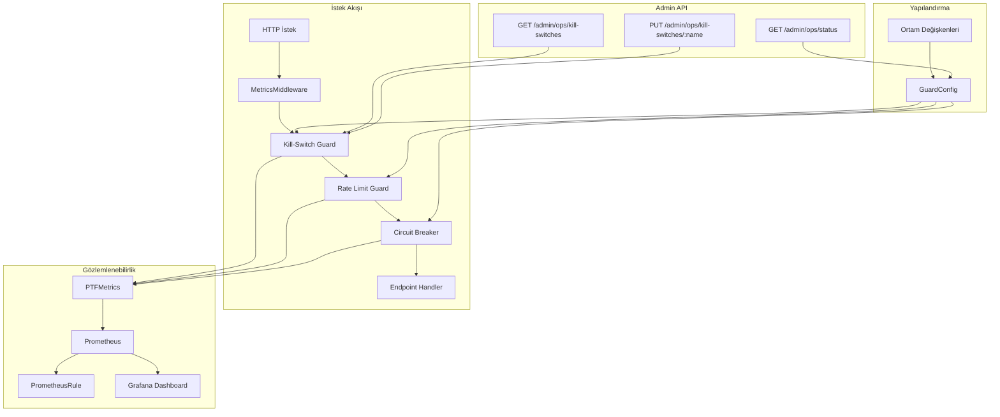

# Tasarım Dokümanı — Ops-Guard

## Genel Bakış

Ops-Guard, PTF Admin sistemine operasyonel koruma katmanı ekler. Mevcut `PTFMetrics`, `MetricsMiddleware`, PrometheusRule ve Grafana dashboard altyapısı üzerine inşa edilir. Beş ana bileşenden oluşur:

1. **Guard Config** — SLO eşikleri, kill-switch, rate limit ve circuit breaker ayarlarını merkezi olarak yöneten yapılandırma
2. **Kill-Switch Manager** — Global, per-tenant ve degrade mode kontrolleri; admin API endpoint'leri
3. **Endpoint Rate Limiter** — Mevcut `check_rate_limit()` üzerine endpoint-bazlı farklı limitler
4. **Circuit Breaker** — Downstream bağımlılık hata oranına göre open/half-open/closed durum makinesi
5. **Monitoring Artifacts** — Yeni alert kuralları (PrometheusRule), runbook genişletmesi, dashboard genişletmesi

Mevcut prod kodu minimal düzeyde değiştirilir: yalnızca `PTFMetrics`'e yeni metrikler eklenir ve middleware'e kill-switch/rate-limit guard'ları entegre edilir.

---

## Hard Decisions (Kilitlenmiş Tasarım Kararları)

Bu bölümdeki kararlar uygulama öncesinde kesinleştirilmiştir. Değişiklik için kullanıcı onayı gerekir.

### HD-1: Kill-Switch Failure Semantics (Endpoint Sınıfına Göre)

Kill-switch kontrolü sırasında oluşan iç hata (exception, timeout vb.) durumunda davranış endpoint sınıfına göre ayrışır:

| Endpoint Sınıfı | Örnekler | Hata Davranışı | Gerekçe |
|---|---|---|---|
| **High-risk** (veri değiştiren bulk/import) | `/admin/market-prices/import/apply`, `/admin/market-prices/import/preview`, bulk write | **Fail-closed** — guard aktifmiş gibi davran, istek reddedilir (HTTP 503) | Kontrolsüz bulk write prod veriyi bozabilir |
| **Diğer tüm endpoint'ler** | GET, tekil upsert, lookup, status | **Fail-open** — istek geçirilir | Operasyonel kontrol; read/tekil write durdurulmamalı |

Her iki durumda da:
- `ptf_admin_killswitch_error_total{endpoint_class, error_type}` counter artırılır
- `ERROR` seviyesinde log yazılır
- Fail-open durumda ek olarak `ptf_admin_killswitch_fallback_open_total` counter artırılır → bu metrik üzerinden alert bağlanır

**Önceki tasarım**: Uniform fail-open. **Güncelleme**: High-risk endpoint'ler fail-closed'a taşındı.

### HD-2: Guard Katman Sıralaması ve Gerekçesi

İstek akışı sırası sabittir:

```
KillSwitch → RateLimiter → CircuitBreaker → Handler
```

**Gerekçe**:
1. **KillSwitch ilk**: Devre dışı bırakılmış endpoint'e rate limit penceresi açılmamalı
2. **RateLimiter ikinci**: Rate-limited (reddedilen) trafik circuit breaker'a ulaşmamalı — aksi halde breaker state'i bozulur (429'lar downstream hata gibi sayılır)
3. **CircuitBreaker son** (handler'dan hemen önce): Yalnızca gerçek downstream çağrılarının başarı/başarısızlık oranını ölçer

Bu sıralama değiştirilemez; değişiklik için tasarım revizyonu gerekir.

### HD-3: İdempotency ve Determinizm Garantisi

Guard katmanı deterministik karar verir:

**Karar determinizmi**: Aynı `(endpoint, principal, config_snapshot, guard_state_snapshot)` girdisi → aynı `(allow | deny, deny_reason)` çıktısı.

**Sabit deny reason enum'u**:
```python
class GuardDenyReason(str, Enum):
    KILL_SWITCHED = "KILL_SWITCHED"
    RATE_LIMITED = "RATE_LIMITED"
    CIRCUIT_OPEN = "CIRCUIT_OPEN"
    INTERNAL_ERROR = "INTERNAL_ERROR"  # fail-closed durumda
```

**Gözlemlenebilirlik determinizmi**:
- `endpoint` label: mevcut 3-seviyeli fallback kullanılır (route template → sanitized bucket → unmatched:sanitized) — `MetricsMiddleware._sanitize_path()` ile aynı mantık
- `decision` label: sabit enum `allowed | rejected`
- `switch_name` label: sabit set (`global_import`, `degrade_mode`, `tenant:{id}`)
- `dependency` label: sabit enum set (bkz. HD-5 cardinality budget)
- Bucket label normalizasyonu: route template tercih edilir, yoksa ilk 2 segment + `/*`

### HD-4: Config Versiyonlama

GuardConfig'e aşağıdaki alanlar eklenir:

```python
class GuardConfig(BaseSettings):
    # ... mevcut alanlar ...

    # Versiyonlama
    schema_version: str = "1.0"              # Şema uyumluluk versiyonu
    config_version: str = "default"          # Monoton artan veya hash (deploy pipeline tarafından set edilir)
    last_updated_at: str = ""                # ISO 8601 timestamp (boş = startup default)
```

**Geçersiz config davranışı**:
- `ValidationError` → varsayılan değerlerle devam et + `WARNING` log + `ptf_admin_guard_config_fallback_total` counter artır
- **ASLA reject etme** — reject, prod'u config deploy hatasında kilitler
- `schema_version` uyumsuzluğu → aynı fallback davranışı + ek `ptf_admin_guard_config_schema_mismatch_total` counter

**Config snapshot metriği**: `ptf_admin_guard_config_loaded{schema_version, config_version}` gauge (1 = aktif config)

### HD-5: Cardinality Budget

Tüm yeni metrikler için kardinalite bütçesi:

| Metrik | Label'lar | Max Kardinalite | Kontrol Mekanizması |
|---|---|---|---|
| `ptf_admin_killswitch_state` | `switch_name` | ~10 | Sabit enum: `global_import`, `degrade_mode`, `tenant:{id}` (tenant sayısı sınırlı) |
| `ptf_admin_killswitch_error_total` | `endpoint_class`, `error_type` | ~6 | `endpoint_class`: {`high_risk`, `standard`}, `error_type`: {`exception`, `timeout`, `unknown`} |
| `ptf_admin_rate_limit_total` | `endpoint`, `decision` | ~20 | `endpoint`: mevcut 3-seviyeli fallback (route template), `decision`: {`allowed`, `rejected`} |
| `ptf_admin_circuit_breaker_state` | `dependency` | ~5 | Sabit enum: {`db_primary`, `db_replica`, `cache`, `external_api`, `import_worker`} |
| `ptf_admin_slo_violation_total` | `slo_name` | ~5 | Sabit enum: {`availability`, `p95_latency`, `p99_latency`, `import_p95`, `import_reject_rate`} |
| `ptf_admin_sentinel_impossible_state_total` | (yok) | 1 | Label'sız counter |
| `ptf_admin_guard_config_fallback_total` | (yok) | 1 | Label'sız counter |
| `ptf_admin_guard_config_loaded` | `schema_version`, `config_version` | ~3 | Tek aktif config |

**Yasaklar**:
- `user_id`, `tenant_id`, `customer_id` gibi yüksek kardinalite label'lar metrik label'ı olarak KULLANILMAZ
- `endpoint` label'ı her zaman template/sanitized formda olmalı (ham URL path YASAK)
- Circuit breaker `dependency` key'i yukarıdaki sabit enum dışında değer ALAMAZ

### HD-6: Minimum Alert Seti (Zorunlu vs İsteğe Bağlı)

Alert'ler iki katmana ayrılır:

**Zorunlu (MVP — mutlaka uygulanacak)**:

| Alert | Tip | Açıklama |
|---|---|---|
| SLO burn-rate (fast window) | P0 | 1 saatlik pencerede error budget tüketim hızı > 14.4x |
| SLO burn-rate (slow window) | P1 | 6 saatlik pencerede error budget tüketim hızı > 6x |
| Kill-switch unexpected toggle | P0 | Beklenmeyen kill-switch durum değişikliği (otomasyon dışı) |
| Rate limit sustained spike | P1 | Rate limit rejection oranı > %10 (5 dk sürekli) |
| Circuit open sustained | P0 | Circuit breaker > 5 dk open durumda (dependency outage) |
| Error budget forecast | P1 | Mevcut tüketim hızıyla error budget 24 saat içinde tükenecek |

**İsteğe bağlı (nice-to-have — MVP sonrası)**:
- Payload size drift (P2)
- Client error skew (P2)
- Validation reject spike (P1 → mevcut `PTFAdminImportRejectRatio` zaten kapsıyor)
- Queue backlog runaway (P0 → bulk import yoksa gereksiz)

Mevcut `ptf-admin-alerts` grubundaki alert'ler (PTFAdmin5xxSpike, PTFAdminHighLatency vb.) korunur ve değiştirilmez.

### HD-7: Task Sıralaması Gerekçesi (Feedback-First)

Task sıralaması "feedback-first" prensibine göre düzenlenmiştir:

1. **Config + Metrikler** (Task 1-2): Gözlemlenebilirlik altyapısı önce — guard'lar metrik yazabilmeli
2. **Guard bileşenleri** (Task 4-6): Kill-switch → Rate Limiter → Circuit Breaker — bağımsız bileşenler, paralel geliştirilebilir ama test sırası önemli
3. **Middleware entegrasyonu** (Task 8): Tüm guard'lar hazır olduktan sonra birleştirme
4. **Monitoring artifacts** (Task 9-11): Alert, runbook, dashboard — guard metrikleri mevcut olduktan sonra anlamlı
5. **Checkpoint'ler** (Task 3, 7, 12): Artımlı doğrulama kapıları

Bu sıralama, her adımda önceki adımın çıktısını doğrulama imkanı verir. "Önce metrik yaz, sonra guard yaz, sonra alert bağla" — her katman bir öncekinin feedback'ini kullanır.

---

## Mimari



## Bileşenler ve Arayüzler

### 1. GuardConfig (`backend/app/guard_config.py`)

Merkezi yapılandırma sınıfı. `pydantic_settings.BaseSettings` kullanarak ortam değişkenlerinden veya `.env` dosyasından yüklenir.

```python
class GuardConfig(BaseSettings):
    # Versiyonlama (HD-4)
    schema_version: str = "1.0"
    config_version: str = "default"
    last_updated_at: str = ""

    # SLO Eşikleri
    slo_availability_target: float = 0.995          # %99.5
    slo_p95_latency_ms: int = 300
    slo_p99_latency_ms: int = 800
    slo_import_p95_seconds: float = 30.0
    slo_import_reject_rate_max: float = 0.20        # %20

    # Kill-Switch Varsayılanları (başlangıçta hepsi pasif)
    killswitch_global_import_disabled: bool = False
    killswitch_degrade_mode: bool = False
    killswitch_disabled_tenants: str = ""            # virgülle ayrılmış tenant ID'leri

    # Rate Limit (endpoint bazlı)
    rate_limit_import_per_minute: int = 10
    rate_limit_heavy_read_per_minute: int = 120
    rate_limit_default_per_minute: int = 60
    rate_limit_fail_closed: bool = True

    # Circuit Breaker
    cb_error_threshold_pct: float = 50.0             # %50
    cb_open_duration_seconds: float = 30.0
    cb_half_open_max_requests: int = 3
    cb_window_seconds: float = 60.0
```

**Geçersiz config davranışı (HD-4)**: `ValidationError` → varsayılan değerlerle devam + `WARNING` log + `ptf_admin_guard_config_fallback_total` counter. ASLA reject etme.

**Guard Deny Reason Enum (HD-3)**:
```python
class GuardDenyReason(str, Enum):
    KILL_SWITCHED = "KILL_SWITCHED"
    RATE_LIMITED = "RATE_LIMITED"
    CIRCUIT_OPEN = "CIRCUIT_OPEN"
    INTERNAL_ERROR = "INTERNAL_ERROR"
```

**Güvenli varsayılan davranış**: Config yüklenemezse Pydantic varsayılan değerleri kullanılır; uyarı logu yazılır.

### 2. KillSwitchManager (`backend/app/kill_switch.py`)

In-memory durum yönetimi + admin API endpoint'leri.

```python
class KillSwitchManager:
    def __init__(self, config: GuardConfig, metrics: PTFMetrics):
        ...

    def is_import_disabled(self, tenant_id: str | None = None) -> bool:
        """Global veya tenant bazlı import kill-switch kontrolü."""

    def is_degrade_mode(self) -> bool:
        """Write path kapalı mı?"""

    def set_switch(self, switch_name: str, enabled: bool, actor: str) -> dict:
        """Kill-switch durumunu değiştir, metrik güncelle, audit log yaz."""

    def get_all_switches(self) -> dict:
        """Tüm kill-switch durumlarını döndür."""

    def get_disabled_tenants(self) -> set[str]:
        """Devre dışı tenant listesini döndür."""
```

**Switch isimleri**: `global_import`, `degrade_mode`, `tenant:{tenant_id}`

**Metrikler**: Her durum değişikliğinde `ptf_admin_killswitch_state{switch_name}` gauge güncellenir. İç hata durumunda `ptf_admin_killswitch_error_total{endpoint_class, error_type}` artırılır (bkz. HD-1).

**Failure semantics (HD-1)**: High-risk endpoint'lerde (import/apply, bulk write) kill-switch iç hatası → fail-closed (503). Diğer endpoint'lerde → fail-open (istek geçer) + metrik + log.

**Audit log**: `logger.info()` ile yapılandırılmış format: `[KILLSWITCH] actor={actor} switch={name} old={old} new={new} timestamp={ts}`

### 3. Endpoint Rate Limiter (`backend/app/guards/rate_limit_guard.py`)

Mevcut `backend/app/services/rate_limit.py` altyapısını kullanır; endpoint kategorisine göre farklı limitler uygular.

```python
# Endpoint kategorileri
ENDPOINT_CATEGORIES = {
    "/admin/market-prices/import/preview": "import",
    "/admin/market-prices/import/apply": "import",
    "/admin/market-prices": "heavy_read",
    # ... diğer endpoint'ler default kategoriye düşer
}

def get_rate_limit_for_endpoint(endpoint: str, config: GuardConfig) -> int:
    """Endpoint kategorisine göre rate limit eşiğini döndür."""

def check_endpoint_rate_limit(
    endpoint: str, client_key: str, config: GuardConfig, metrics: PTFMetrics
) -> None:
    """Endpoint bazlı rate limit kontrolü. Fail-closed politikası."""
```

**Fail-closed**: Rate limiter iç hatası durumunda istek reddedilir (güvenlik öncelikli). Deny reason: `GuardDenyReason.INTERNAL_ERROR` (HD-3).

**Metrikler**: `ptf_admin_rate_limit_total{endpoint, decision}` her kararda artırılır. `endpoint` label'ı mevcut 3-seviyeli fallback ile normalize edilir (HD-5).

### 4. CircuitBreaker (`backend/app/guards/circuit_breaker.py`)

Basit durum makinesi: closed → open → half-open → closed.

```python
class CircuitBreakerState(Enum):
    CLOSED = 0
    HALF_OPEN = 1
    OPEN = 2

class CircuitBreaker:
    def __init__(self, name: str, config: GuardConfig, metrics: PTFMetrics):
        self._state: CircuitBreakerState = CircuitBreakerState.CLOSED
        self._failure_count: int = 0
        self._success_count: int = 0
        self._last_failure_time: float = 0
        self._request_count_in_window: int = 0
        ...

    def allow_request(self) -> bool:
        """İstek geçebilir mi? State'e göre karar verir."""

    def record_success(self) -> None:
        """Başarılı yanıt kaydı. Half-open'da yeterli başarı → closed'a geç."""

    def record_failure(self) -> None:
        """Başarısız yanıt kaydı. Eşik aşılırsa → open'a geç."""

    @property
    def state(self) -> CircuitBreakerState:
        """Mevcut durum (open süre dolmuşsa otomatik half-open'a geçer)."""
```

**Metrikler**: `ptf_admin_circuit_breaker_state{dependency}` gauge her durum geçişinde güncellenir. `dependency` label'ı sabit enum'dan gelir (HD-5): `db_primary`, `db_replica`, `cache`, `external_api`, `import_worker`.

### 5. Guard Middleware Entegrasyonu

Mevcut `MetricsMiddleware` değiştirilmez. Yeni bir `OpsGuardMiddleware` eklenir (MetricsMiddleware'den sonra, handler'dan önce):

```python
class OpsGuardMiddleware(BaseHTTPMiddleware):
    """Kill-switch, rate limit ve circuit breaker kontrollerini uygular.
    
    Sıralama sabittir (HD-2): KS → RL → CB → Handler
    Gerekçe: CB, rate-limited trafikten korunmalı; KS devre dışı endpoint'e RL penceresi açılmamalı.
    """

    async def dispatch(self, request, call_next):
        # 1. Kill-switch kontrolü (HD-1: high-risk → fail-closed, diğer → fail-open)
        # 2. Rate limit kontrolü
        # 3. Circuit breaker kontrolü
        # 4. İsteği handler'a ilet
        # 5. Circuit breaker'a sonucu bildir
```

### 6. Yeni PTFMetrics Metrikleri

Mevcut `PTFMetrics` sınıfına eklenen yeni metrikler:

```python
# SLO (HD-5: slo_name sabit enum, max ~5)
ptf_admin_slo_violation_total{slo_name}          # Counter
ptf_admin_sentinel_impossible_state_total          # Counter (label'sız)

# Kill-Switch (HD-5: switch_name sabit set, max ~10)
ptf_admin_killswitch_state{switch_name}           # Gauge (0=pasif, 1=aktif)
ptf_admin_killswitch_error_total{endpoint_class, error_type}  # Counter (HD-1)
ptf_admin_killswitch_fallback_open_total           # Counter (HD-1, fail-open fallback sayacı)

# Rate Limit (HD-5: endpoint template, decision enum, max ~20)
ptf_admin_rate_limit_total{endpoint, decision}    # Counter (decision: allowed|rejected)

# Circuit Breaker (HD-5: dependency sabit enum, max ~5)
ptf_admin_circuit_breaker_state{dependency}       # Gauge (0=closed, 1=half-open, 2=open)

# Config (HD-4)
ptf_admin_guard_config_fallback_total              # Counter (config validation hatası)
ptf_admin_guard_config_schema_mismatch_total       # Counter (schema uyumsuzluğu)
ptf_admin_guard_config_loaded{schema_version, config_version}  # Gauge (1=aktif)
```

### 7. Admin API Endpoint'leri

| Endpoint | Method | Açıklama | Auth |
|---|---|---|---|
| `/admin/ops/kill-switches` | GET | Tüm kill-switch durumları | `require_admin_key()` |
| `/admin/ops/kill-switches/{switch_name}` | PUT | Kill-switch durumu değiştir | `require_admin_key()` |
| `/admin/ops/status` | GET | Guard durumu özeti (SLO, CB, RL) | `require_admin_key()` |

### 8. Monitoring Artifacts

**PrometheusRule genişletmesi** (`monitoring/prometheus/ptf-admin-alerts.yml`):
- Yeni grup: `ptf-admin-ops-guard` — P0/P1/P2 alert kuralları
- Mevcut `ptf-admin-alerts` grubu değiştirilmez

**Runbook genişletmesi** (`monitoring/runbooks/ptf-admin-runbook.md`):
- Her yeni P0/P1 alert için: Belirti, Hızlı Tanı, Müdahale, Kurtarma, Postmortem bölümleri
- Mevcut runbook bölümleri değiştirilmez

**Dashboard genişletmesi** (`monitoring/grafana/ptf-admin-dashboard.json`):
- Yeni satır: "Ops Guard Status" — kill-switch durumları, circuit breaker, rate limit
- Mevcut 4 satır (id: 100-400) değiştirilmez

## Veri Modelleri

### GuardConfig (Pydantic Settings)

```python
class GuardConfig(BaseSettings):
    model_config = SettingsConfigDict(env_prefix="OPS_GUARD_", env_file=".env", extra="ignore")

    # Versiyonlama (HD-4)
    schema_version: str = "1.0"
    config_version: str = "default"
    last_updated_at: str = ""

    # SLO
    slo_availability_target: float = 0.995
    slo_p95_latency_ms: int = 300
    slo_p99_latency_ms: int = 800
    slo_import_p95_seconds: float = 30.0
    slo_import_reject_rate_max: float = 0.20

    # Kill-Switch
    killswitch_global_import_disabled: bool = False
    killswitch_degrade_mode: bool = False
    killswitch_disabled_tenants: str = ""

    # Rate Limit
    rate_limit_import_per_minute: int = 10
    rate_limit_heavy_read_per_minute: int = 120
    rate_limit_default_per_minute: int = 60
    rate_limit_fail_closed: bool = True

    # Circuit Breaker
    cb_error_threshold_pct: float = 50.0
    cb_open_duration_seconds: float = 30.0
    cb_half_open_max_requests: int = 3
    cb_window_seconds: float = 60.0
```

### KillSwitchState

```python
@dataclass
class KillSwitchEntry:
    name: str
    enabled: bool
    updated_at: str          # ISO 8601
    updated_by: str          # actor identifier
```

### CircuitBreakerSnapshot

```python
@dataclass
class CircuitBreakerSnapshot:
    name: str
    state: str               # "closed" | "half_open" | "open"
    failure_count: int
    success_count: int
    last_failure_time: float  # monotonic timestamp
```

### API Request/Response Modelleri

```python
class KillSwitchUpdateRequest(BaseModel):
    enabled: bool
    reason: str | None = None

class KillSwitchResponse(BaseModel):
    switch_name: str
    enabled: bool
    updated_at: str
    updated_by: str

class OpsStatusResponse(BaseModel):
    kill_switches: dict[str, KillSwitchEntry]
    circuit_breakers: dict[str, CircuitBreakerSnapshot]
    guard_config_loaded: bool
```


## Doğruluk Özellikleri (Correctness Properties)

*Bir özellik (property), sistemin tüm geçerli çalışmalarında doğru kalması gereken bir davranış veya karakteristiktir — esasen, sistemin ne yapması gerektiğine dair biçimsel bir ifadedir. Özellikler, insan tarafından okunabilir spesifikasyonlar ile makine tarafından doğrulanabilir doğruluk garantileri arasında köprü görevi görür.*

### Property 1: GuardConfig Yapılandırma Round-Trip

*For any* geçerli SLO eşik değerleri seti, bu değerlerle oluşturulan bir GuardConfig nesnesinden aynı değerlerin okunması, orijinal değerlerle eşleşmelidir.

**Validates: Requirements 1.1**

### Property 2: SLI Availability Hesaplama Doğruluğu

*For any* 2xx, 4xx ve 5xx istek sayısı kombinasyonu, SLI_Calculator'ın hesapladığı başarı oranı `(count_2xx + count_4xx) / (count_2xx + count_4xx + count_5xx)` formülüne eşit olmalı ve yalnızca 5xx yanıtlar başarısız sayılmalıdır.

**Validates: Requirements 1.2**

### Property 3: SLI Import Metrikleri Kaydı

*For any* import sonucu (süre, kabul edilen satır sayısı, reddedilen satır sayısı), SLI_Calculator tamamlanma süresini, reject oranını (`rejected / total`) ve kuyruk derinliğini doğru hesaplayıp kaydetmelidir.

**Validates: Requirements 1.3**

### Property 4: SLO ve Sentinel Metrik Artışları

*For any* SLO ihlal olayı veya imkansız durum olayı, ilgili Prometheus sayacı (`ptf_admin_slo_violation_total` veya `ptf_admin_sentinel_impossible_state_total`) tam olarak 1 artmalıdır.

**Validates: Requirements 1.4, 1.5**

### Property 5: Kill-Switch Kapsam Engelleme

*For any* tenant ve kill-switch yapılandırması, import isteği ancak ve ancak global import kill-switch aktifse VEYA ilgili tenant'ın kill-switch'i aktifse engellenmelidir. Diğer tenant'ların istekleri etkilenmemelidir.

**Validates: Requirements 3.1, 3.2**

### Property 6: Degrade Mode Write Engelleme

*For any* endpoint, degrade mode aktifken write endpoint'leri (POST, PUT, DELETE) engellenip read endpoint'lerine (GET) izin verilmelidir.

**Validates: Requirements 3.3**

### Property 7: Kill-Switch Gözlemlenebilirlik

*For any* kill-switch durum değişikliği, hem `ptf_admin_killswitch_state` gauge metriği güncel durumu yansıtmalı (1=aktif, 0=pasif), hem de audit log kaydı oluşturulmalıdır.

**Validates: Requirements 3.5, 3.6**

### Property 8: Kill-Switch API Round-Trip

*For any* switch adı ve boolean değer, PUT ile yapılan durum değişikliğinden sonra GET ile sorgulanan durum, PUT'ta gönderilen değerle eşleşmelidir.

**Validates: Requirements 3.8**

### Property 9: Endpoint Rate Limit Kategorizasyonu

*For any* endpoint yolu, uygulanan rate limit eşiği endpoint'in kategorisine (import, heavy_read, default) göre doğru GuardConfig değerine eşit olmalıdır.

**Validates: Requirements 4.1**

### Property 10: Rate Limit Uygulama

*For any* endpoint ve rate limit eşiği N, N+1'inci istek HTTP 429 ile reddedilmeli ve yanıtta `Retry-After` header'ı bulunmalıdır.

**Validates: Requirements 4.2**

### Property 11: Circuit Breaker Durum Makinesi

*For any* başarı/başarısızlık olay dizisi, circuit breaker şu durum geçiş kurallarına uymalıdır: (a) closed durumda hata oranı eşiği aşarsa → open, (b) open durumda yapılandırılmış süre dolduktan sonra → half-open, (c) half-open durumda yeterli başarılı istek → closed, (d) half-open durumda başarısız istek → open.

**Validates: Requirements 4.4, 4.5, 4.6**

### Property 12: Guard Bileşen Metrikleri

*For any* rate limit kararı veya circuit breaker durum geçişi, ilgili Prometheus metriği (`ptf_admin_rate_limit_total` veya `ptf_admin_circuit_breaker_state`) doğru değerle güncellenmelidir.

**Validates: Requirements 4.7, 4.8**

### Property 13: Metrik Namespace Uyumu

*For any* Ops-Guard tarafından kaydedilen yeni Prometheus metriği, metrik adı `ptf_admin_` prefix'i ile başlamalıdır.

**Validates: Requirements 7.1**

### Property 14: Admin Auth Zorunluluğu

*For any* yeni ops-guard admin endpoint'i, admin key olmadan yapılan istek HTTP 401 veya 403 ile reddedilmelidir.

**Validates: Requirements 7.3**

### Property 15: Config Ortam Değişkeni Round-Trip

*For any* GuardConfig alanı ve geçerli değer, ilgili ortam değişkeni (`OPS_GUARD_` prefix'li) ayarlandığında GuardConfig bu değeri yüklemelidir.

**Validates: Requirements 7.5**

## Hata Yönetimi

### Guard Config Yükleme Hatası
- **Davranış**: Pydantic `ValidationError` yakalanır, varsayılan değerlerle devam edilir (HD-4: ASLA reject etme)
- **Log**: `WARNING` seviyesinde config yükleme hatası loglanır
- **Metrik**: `ptf_admin_guard_config_fallback_total` counter artırılır; schema uyumsuzluğunda ek olarak `ptf_admin_guard_config_schema_mismatch_total`

### Kill-Switch İç Hatası
- **Davranış**: Endpoint sınıfına göre ayrışır (bkz. HD-1):
  - High-risk endpoint'ler (import/apply, bulk write): **fail-closed** — istek reddedilir (HTTP 503)
  - Diğer endpoint'ler: **fail-open** — istek geçirilir
- **Log**: `ERROR` seviyesinde hata loglanır
- **Metrik**: `ptf_admin_killswitch_error_total{endpoint_class, error_type}` artırılır

### Rate Limiter İç Hatası
- **Davranış**: Fail-closed — istek reddedilir (güvenlik öncelikli)
- **Log**: `ERROR` seviyesinde hata loglanır
- **Yanıt**: HTTP 503 "Service temporarily unavailable"

### Circuit Breaker İç Hatası
- **Davranış**: Fail-open — istek geçirilir (circuit breaker hatası sistemi durdurmamalı)
- **Log**: `ERROR` seviyesinde hata loglanır

### Admin API Hataları
- **401**: Admin key eksik
- **403**: Admin key geçersiz
- **404**: Bilinmeyen switch adı
- **422**: Geçersiz request body

## Test Stratejisi

### İkili Test Yaklaşımı

**Property-Based Testler** (Hypothesis — Python):
- Her correctness property için ayrı bir property-based test
- Minimum 100 iterasyon per test
- Her test, tasarım dokümanındaki property numarasını referans eder
- Tag formatı: `Feature: ops-guard, Property N: {property_text}`
- Kütüphane: `hypothesis` (Python backend)

**Unit Testler** (pytest):
- Spesifik örnekler ve edge case'ler
- Admin API endpoint entegrasyon testleri
- Kill-switch + degrade mode spesifik senaryoları
- Circuit breaker zamanlama edge case'leri

**Monitoring Artifact Testleri** (pytest):
- PrometheusRule YAML yapısal doğrulama (mevcut `test_alert_rules.py` pattern'i genişletilir)
- Dashboard JSON yapısal doğrulama (mevcut `test_dashboard_structure.py` pattern'i genişletilir)
- Runbook kapsam doğrulama (mevcut `test_runbook_coverage.py` pattern'i genişletilir)

### Test Dosya Yapısı

```
backend/tests/
  test_guard_config.py          # Property 1, 15 + unit tests
  test_sli_calculator.py        # Property 2, 3, 4 + unit tests
  test_kill_switch.py           # Property 5, 6, 7, 8 + unit tests
  test_rate_limit_guard.py      # Property 9, 10 + unit tests
  test_circuit_breaker.py       # Property 11, 12 + unit tests
  test_ops_guard_middleware.py   # Property 13, 14 + integration tests
monitoring/tests/
  test_ops_guard_alerts.py      # Alert rule structure tests
  test_ops_guard_dashboard.py   # Dashboard structure tests
  test_ops_guard_runbook.py     # Runbook coverage tests
```

### Property-Based Test Konfigürasyonu

```python
from hypothesis import given, settings, strategies as st

@settings(max_examples=100)
@given(
    count_2xx=st.integers(min_value=0, max_value=10000),
    count_4xx=st.integers(min_value=0, max_value=10000),
    count_5xx=st.integers(min_value=0, max_value=10000),
)
def test_sli_availability_calculation(count_2xx, count_4xx, count_5xx):
    """Feature: ops-guard, Property 2: SLI Availability Hesaplama Doğruluğu"""
    # ... test implementation
```
