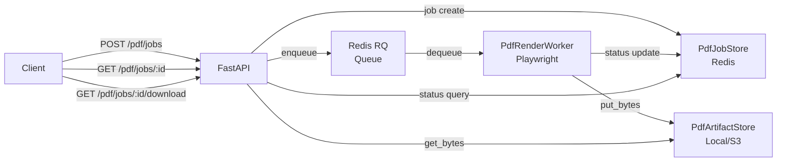
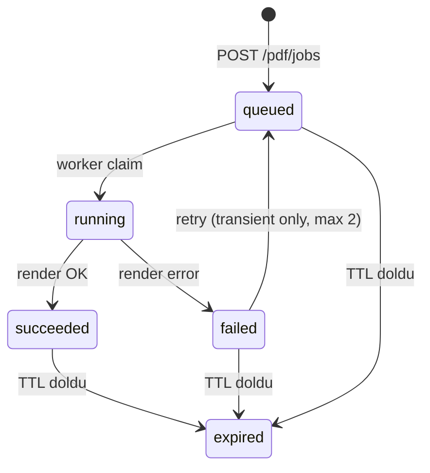

# Tasarım Dokümanı — PDF Render Worker

## Genel Bakış

PDF Render Worker, HTML template'lerden PDF üretimini API request path'inden izole eden asenkron iş kuyruğu sistemidir. Mevcut `pdf_playwright.py` (Playwright/Chromium) ve `rq_adapter.py` (Redis RQ) altyapısı üzerine inşa edilir. Sistem üç ana bileşenden oluşur: `PdfJobStore` (Redis üzerinde job yönetimi), `PdfRenderWorker` (Playwright render), `PdfArtifactStore` (artifact depolama). MVP'de Redis RQ tercih edilir; Celery veya multiprocessing.Process alternatif olarak değerlendirilebilir.

## Mimari



### Kuyruk Teknolojisi Seçimi (MVP)

| Kriter | RQ + Redis | Celery | multiprocessing.Process |
|--------|-----------|--------|------------------------|
| Ops karmaşıklığı | Düşük (Redis zaten var) | Orta (broker + backend) | Düşük (tek node) |
| Ölçeklenebilirlik | Yatay (worker ekle) | Yatay | Dikey (tek process) |
| Retry desteği | Basit (manuel) | Yerleşik | Manuel |
| Monitoring | rq-dashboard | Flower | Yok |
| Mevcut altyapı | ✅ `rq_adapter.py` mevcut | Yeni | Yeni |

**Karar:** RQ + Redis (MVP). Mevcut `rq_adapter.py` ve `rq_worker.py` altyapısı genişletilir. Celery'ye geçiş gerekirse `enqueue_pdf_job()` fonksiyonu değiştirilir; interface aynı kalır.

### Durum Makinesi



Geçerli durum geçişleri:
- `queued → running` (worker claim)
- `running → succeeded` (render başarılı)
- `running → failed` (render hatası)
- `failed → queued` (retry, yalnızca transient hatalar, max 2)
- `queued → expired`, `succeeded → expired`, `failed → expired` (TTL)

## Bileşenler ve Arayüzler

### 1. PdfJobStore

Redis üzerinde job durumu yöneten bileşen. Mevcut `job_queue.py` pattern'ini takip eder ancak PDF job'larına özeldir.

```python
# backend/app/services/pdf_job_store.py

class PdfJobStatus(str, Enum):
    QUEUED = "queued"
    RUNNING = "running"
    SUCCEEDED = "succeeded"
    FAILED = "failed"
    EXPIRED = "expired"

class PdfErrorCode(str, Enum):
    BROWSER_LAUNCH_FAILED = "BROWSER_LAUNCH_FAILED"
    NAVIGATION_TIMEOUT = "NAVIGATION_TIMEOUT"
    TEMPLATE_ERROR = "TEMPLATE_ERROR"
    UNSUPPORTED_PLATFORM = "UNSUPPORTED_PLATFORM"
    UNKNOWN = "UNKNOWN"

TRANSIENT_ERRORS = {PdfErrorCode.BROWSER_LAUNCH_FAILED, PdfErrorCode.NAVIGATION_TIMEOUT}
MAX_RETRIES = 2

@dataclass
class PdfJob:
    job_id: str
    job_key: str            # payload hash (idempotency)
    status: PdfJobStatus
    template_name: str
    payload: dict
    artifact_key: str | None
    error_code: PdfErrorCode | None
    retry_count: int
    created_at: float
    started_at: float | None
    finished_at: float | None

class PdfJobStore:
    def __init__(self, redis_conn: Redis): ...
    def create_job(self, template_name: str, payload: dict) -> PdfJob: ...
    def get_job(self, job_id: str) -> PdfJob | None: ...
    def find_by_key(self, job_key: str) -> PdfJob | None: ...
    def update_status(self, job_id: str, status: PdfJobStatus, **kwargs) -> PdfJob: ...
    def compute_job_key(self, template_name: str, payload: dict) -> str: ...
    def cleanup_expired(self, ttl_seconds: int) -> int: ...
```

**Job Key hesaplama:** `sha256(canonical_json(template_name + sorted_payload))` — deterministik hash.

### 2. PdfRenderWorker

Playwright/Chromium kullanarak HTML → PDF dönüşümü yapan worker. Mevcut `pdf_playwright.py` üzerine inşa edilir.

```python
# backend/app/services/pdf_render_worker.py

class PdfRenderWorker:
    def __init__(self, job_store: PdfJobStore, artifact_store: PdfArtifactStore, config: PdfRenderConfig): ...
    def process_job(self, job_id: str) -> None: ...
    def render_html_to_pdf(self, html: str, timeout: int) -> bytes: ...
    def validate_template(self, template_name: str) -> bool: ...
    def validate_url(self, url: str) -> bool: ...
    def sanitize_payload(self, payload: dict) -> dict: ...
```

**Timeout stratejisi:**
- RQ job timeout: `hard_timeout` (varsayılan 60s)
- Playwright navigation timeout: `hard_timeout - 5s` (graceful cancel)
- Browser launch timeout: 10s (sabit)

**Retry mantığı:**
```python
def should_retry(error_code: PdfErrorCode, retry_count: int) -> bool:
    return error_code in TRANSIENT_ERRORS and retry_count < MAX_RETRIES
```

### 3. PdfArtifactStore

Mevcut `StorageBackend` arayüzünü kullanan artifact depolama katmanı.

```python
# backend/app/services/pdf_artifact_store.py

class PdfArtifactStore:
    def __init__(self, storage: StorageBackend): ...
    def store_pdf(self, job_id: str, pdf_bytes: bytes) -> str: ...  # returns artifact_key
    def get_pdf(self, artifact_key: str) -> bytes: ...
    def delete_pdf(self, artifact_key: str) -> bool: ...
    def exists(self, artifact_key: str) -> bool: ...
    def generate_key(self, job_id: str) -> str: ...  # "pdfs/{job_id}/{timestamp}.pdf"
```

### 4. Güvenlik Bileşenleri

```python
# backend/app/services/pdf_security.py

class PdfSecurityConfig:
    template_allowlist: set[str]
    url_allowlist: list[str]  # regex patterns

def validate_template(name: str, allowlist: set[str]) -> bool: ...
def validate_url(url: str, allowlist: list[str]) -> bool: ...
def sanitize_html_variables(variables: dict) -> dict: ...  # HTML escape
```

### 5. API Endpoint'leri

```python
# backend/app/pdf_api.py (FastAPI router)

router = APIRouter(prefix="/pdf", tags=["pdf"])

@router.post("/jobs")
async def create_pdf_job(request: PdfJobRequest) -> PdfJobResponse: ...

@router.get("/jobs/{job_id}")
async def get_pdf_job_status(job_id: str) -> PdfJobStatusResponse: ...

@router.get("/jobs/{job_id}/download")
async def download_pdf(job_id: str) -> Response: ...
```

### 6. Fail-Safe Politikası

```python
# backend/app/services/pdf_failsafe.py

class FailSafePolicy(str, Enum):
    STRICT = "strict"    # 503 döndür
    DEGRADE = "degrade"  # HTML fallback

def check_worker_health(redis_conn: Redis) -> bool: ...
def handle_unavailable(policy: FailSafePolicy, html: str | None) -> Response: ...
```

## Veri Modelleri

### Redis Key Yapısı

```
pdf:job:{job_id}          → Hash (PdfJob alanları)
pdf:key:{job_key}         → String (job_id) — idempotency lookup
pdf:jobs:queued           → Sorted Set (score=created_at) — kuyruk sırası
```

### PdfJobRequest (API Input)

```python
class PdfJobRequest(BaseModel):
    template_name: str          # Template_Allowlist'te olmalı
    variables: dict[str, Any]   # Template değişkenleri
    options: PdfRenderOptions | None = None

class PdfRenderOptions(BaseModel):
    timeout: int = 60           # Hard timeout (saniye)
    fail_safe: FailSafePolicy = FailSafePolicy.STRICT
```

### PdfJobResponse (API Output)

```python
class PdfJobResponse(BaseModel):
    job_id: str
    status: PdfJobStatus
    created_at: str

class PdfJobStatusResponse(BaseModel):
    job_id: str
    status: PdfJobStatus
    created_at: str
    started_at: str | None
    finished_at: str | None
    error_code: PdfErrorCode | None
    download_url: str | None    # Sadece succeeded durumunda
    retry_count: int
```

### PdfRenderConfig

```python
class PdfRenderConfig(BaseModel):
    hard_timeout: int = 60
    graceful_cancel_offset: int = 5
    max_retries: int = 2
    artifact_ttl_seconds: int = 86400  # 24 saat
    cleanup_interval_seconds: int = 3600  # 1 saat
    fail_safe_policy: FailSafePolicy = FailSafePolicy.STRICT
    template_allowlist: set[str] = set()
    url_allowlist: list[str] = []
```

## Doğruluk Özellikleri (Correctness Properties)

*Bir doğruluk özelliği (property), sistemin tüm geçerli çalışmalarında doğru olması gereken bir karakteristik veya davranıştır — esasen, sistemin ne yapması gerektiğine dair biçimsel bir ifadedir. Özellikler, insan tarafından okunabilir spesifikasyonlar ile makine tarafından doğrulanabilir doğruluk garantileri arasında köprü görevi görür.*

### Property 1: Durum Makinesi Geçerli Geçişler
*Her hangi bir* PdfJob için, durum geçişleri yalnızca tanımlı geçerli geçiş kümesinde olmalıdır: `queued→running`, `running→succeeded`, `running→failed`, `failed→queued` (retry), `{queued,succeeded,failed}→expired`. Geçersiz bir geçiş (örn. `succeeded→running`) reddedilmelidir.
**Validates: Requirements 2.1, 2.2, 2.3, 2.4, 2.5, 2.6**

### Property 2: Job Key Deterministik Hash
*Her hangi bir* template adı ve payload kombinasyonu için, `compute_job_key()` fonksiyonu her çağrıda aynı hash değerini üretmelidir. Farklı payload'lar farklı hash'ler üretmelidir.
**Validates: Requirements 3.3**

### Property 3: Retry Politikası Doğruluğu
*Her hangi bir* başarısız job için, `should_retry()` fonksiyonu yalnızca hata kodu transient (`BROWSER_LAUNCH_FAILED`, `NAVIGATION_TIMEOUT`) ve `retry_count < MAX_RETRIES` ise `True` döndürmelidir. Kalıcı hatalar (`TEMPLATE_ERROR`, `UNSUPPORTED_PLATFORM`) için her zaman `False` döndürmelidir.
**Validates: Requirements 5.1, 5.2, 5.3, 5.4**

### Property 4: İdempotency Garantisi
*Her hangi bir* payload için, aynı Job_Key ile job oluşturma isteği yapıldığında: mevcut job `queued`/`running`/`succeeded` (artifact mevcut) durumundaysa aynı job_id döndürülmelidir; mevcut job `failed`/`expired` durumundaysa yeni bir job_id oluşturulmalıdır.
**Validates: Requirements 6.1, 6.2, 6.3**

### Property 5: Allowlist Doğrulaması
*Her hangi bir* template adı veya URL için, allowlist'te olmayan değerler reddedilmeli, allowlist'te olan değerler kabul edilmelidir. Boş allowlist durumunda tüm değerler reddedilmelidir.
**Validates: Requirements 8.1, 8.2**

### Property 6: HTML Sanitizasyon
*Her hangi bir* kullanıcı girdisi için, `sanitize_html_variables()` fonksiyonu HTML özel karakterlerini (`<`, `>`, `&`, `"`, `'`) escape etmelidir. Sanitize edilmiş çıktı, orijinal girdi ile aynı metin içeriğini korumalı ancak HTML tag'leri içermemelidir.
**Validates: Requirements 8.3**

### Property 7: Metrik Kayıt Tutarlılığı
*Her hangi bir* job durum geçişi dizisi için, `ptf_admin_pdf_jobs_total` sayacının toplam değeri, oluşturulan toplam job sayısı ile tutarlı olmalıdır. Her başarısız job için `ptf_admin_pdf_failures_total` sayacı da artırılmış olmalıdır.
**Validates: Requirements 9.1, 9.3**

### Property 8: Job Oluşturma ve Sorgulama Round-Trip
*Her hangi bir* geçerli `PdfJobRequest` için, `POST /pdf/jobs` ile oluşturulan job'un `GET /pdf/jobs/{job_id}` ile sorgulandığında aynı `job_id`, `status`, ve `created_at` değerlerini döndürmesi gerekir.
**Validates: Requirements 11.1, 11.2**

### Property 9: Artifact Key Benzersizliği
*Her hangi bir* iki farklı job_id için, `generate_key()` fonksiyonu farklı artifact key'ler üretmelidir.
**Validates: Requirements 7.5**

### Property 10: TTL Cleanup Doğruluğu
*Her hangi bir* TTL süresi dolmuş artifact için, `cleanup_expired()` çağrısı sonrasında artifact dosyası silinmiş ve ilgili job `expired` durumuna geçmiş olmalıdır. TTL süresi dolmamış artifact'lar etkilenmemelidir.
**Validates: Requirements 7.3**

## Hata Yönetimi

### Error Taxonomy

| Hata Kodu | Açıklama | Retry? | HTTP Status |
|-----------|----------|--------|-------------|
| `BROWSER_LAUNCH_FAILED` | Chromium başlatılamadı | Evet (max 2) | - |
| `NAVIGATION_TIMEOUT` | Sayfa yükleme zaman aşımı | Evet (max 2) | - |
| `TEMPLATE_ERROR` | Template bulunamadı veya geçersiz | Hayır | 400 |
| `UNSUPPORTED_PLATFORM` | Platform desteklenmiyor | Hayır | 400 |
| `UNKNOWN` | Sınıflandırılamayan hata | Hayır | 500 |
| `PDF_RENDER_UNAVAILABLE` | Worker/Redis erişilemez | - | 503 |

### Hata Akışı

```python
try:
    pdf_bytes = worker.render_html_to_pdf(html, timeout)
    store.update_status(job_id, SUCCEEDED, artifact_key=key)
except PlaywrightTimeoutError:
    handle_failure(job, NAVIGATION_TIMEOUT)
except BrowserLaunchError:
    handle_failure(job, BROWSER_LAUNCH_FAILED)
except TemplateNotFoundError:
    handle_failure(job, TEMPLATE_ERROR)
except Exception:
    handle_failure(job, UNKNOWN)

def handle_failure(job, error_code):
    if should_retry(error_code, job.retry_count):
        store.update_status(job.job_id, QUEUED, retry_count=job.retry_count + 1)
        enqueue_pdf_job(job.job_id)  # tekrar kuyruğa ekle
    else:
        store.update_status(job.job_id, FAILED, error_code=error_code)
```

## Test Stratejisi

### Property-Based Testing

- **Kütüphane:** `hypothesis` (Python)
- **Minimum iterasyon:** 100 (her property test için)
- **Her test, tasarım dokümanındaki property numarasını referans almalıdır**
- **Tag formatı:** `Feature: pdf-render-worker, Property {N}: {başlık}`

### Unit Testler

- Job durum geçişleri (geçerli ve geçersiz)
- Job key hesaplama (deterministik hash)
- Retry politikası (transient vs kalıcı hatalar)
- İdempotency (aynı key ile tekrar istek)
- Allowlist doğrulama (template ve URL)
- HTML sanitizasyon
- Artifact key üretimi
- TTL cleanup
- Fail-safe politikası (strict vs degrade)
- API endpoint'leri (happy path, hata durumları)

### Entegrasyon Testleri

- Happy path: job oluştur → worker işle → download
- Timeout: uzun süren render → timeout → failed
- Worker down: Redis yok → 503
- Retry path: transient hata → retry → başarı
- İdempotency: aynı payload → aynı job_id

### Test Dosya Yapısı

```
backend/tests/
├── test_pdf_job_store.py          # PdfJobStore unit + property testleri
├── test_pdf_render_worker.py      # Worker unit testleri
├── test_pdf_artifact_store.py     # Artifact store testleri
├── test_pdf_security.py           # Güvenlik testleri (allowlist, sanitize)
├── test_pdf_api.py                # API endpoint testleri
├── test_pdf_failsafe.py           # Fail-safe politikası testleri
└── test_pdf_integration.py        # Entegrasyon testleri
```
