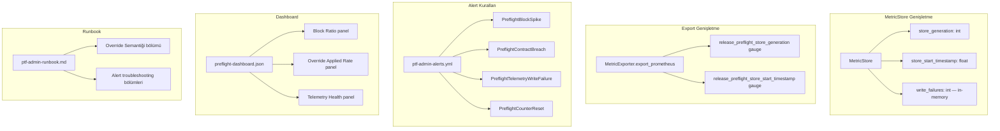

# Tasarım: Preflight Guard-Rails

## Genel Bakış

Bu tasarım, PR-17 ile kurulan preflight telemetry altyapısına 5 koruma mekanizması ekler. Mevcut `preflight_metrics.py` modülüne minimal ekleme, `ptf-admin-alerts.yml`'e yeni alert grubu, runbook genişletmesi ve dashboard güncelleme yapılır. Yeni modül oluşturulmaz.

Tasarım felsefesi: mevcut koda minimal dokunuş, mevcut sözleşmeleri bozmadan guard-rail ekleme.

## Mimari

### Mevcut Yapı (PR-17)

```
MetricStore (in-memory + JSON persistence)
    → MetricExporter.export_prometheus() → .prom dosyası
    → MetricExporter.export_json() → .json dosyası
    → Dashboard JSON (3 panel)
    → Alert kuralları (ptf-admin-alerts.yml)
    → Runbook (ptf-admin-runbook.md)
```

### Guard-Rail Eklemeleri

```
MetricStore
    + store_generation (gauge) — her save döngüsünde +1
    + store_start_timestamp (gauge) — ilk oluşturulma zamanı
    + write_failures in-memory birikim doğrulaması

BlockReasonCode
    + cardinality guard testi (≤ 50 üye)

MetricExporter.export_prometheus()
    + store_generation gauge satırı
    + store_start_timestamp gauge satırı

ptf-admin-alerts.yml
    + preflight-guardrails alert grubu (4 kural)

preflight-dashboard.json
    + 3 yeni panel (Block Ratio, Override Applied Rate, Telemetry Health)

ptf-admin-runbook.md
    + Override semantiği bölümü
    + 4 yeni alert troubleshooting bölümü
```

### Bileşen Diyagramı



## Bileşenler ve Arayüzler

### 1. MetricStore Genişletmesi

Mevcut `MetricStore` sınıfına iki yeni alan eklenir:

```python
class MetricStore:
    def __init__(self) -> None:
        # ... mevcut alanlar ...
        self._store_generation: int = 0
        self._store_start_timestamp: float = time.time()
```

#### store_generation Semantiği

- `load_from_dir` başarılı → mevcut generation değeri yüklenir
- `save_to_dir` başarılı → generation +1 artırılır, sonra yazılır
- `load_from_dir` başarısız (dosya yok/bozuk) → generation = 0
- Prometheus'ta `release_preflight_store_generation` gauge olarak yazılır

#### store_start_timestamp Semantiği

- Yeni store → `time.time()` (şimdiki zaman)
- `load_from_dir` başarılı → mevcut timestamp korunur
- `load_from_dir` başarısız → `time.time()` (yeni başlangıç)
- Prometheus'ta `release_preflight_store_start_timestamp` gauge olarak yazılır

#### to_dict / from_dict Genişletmesi

```python
def to_dict(self) -> dict[str, Any]:
    with self._lock:
        return {
            # ... mevcut alanlar ...
            "store_generation": self._store_generation,
            "store_start_timestamp": self._store_start_timestamp,
        }

@classmethod
def from_dict(cls, data: dict[str, Any]) -> "MetricStore":
    store = cls()
    # ... mevcut yükleme ...
    store._store_generation = data.get("store_generation", 0)
    store._store_start_timestamp = data.get("store_start_timestamp", store._store_start_timestamp)
    return store
```

#### save_to_dir Genişletmesi

```python
def save_to_dir(self, path: str | Path) -> bool:
    with self._lock:
        self._store_generation += 1
    # ... mevcut atomic write ...
```

### 2. MetricExporter Genişletmesi

`export_prometheus()` fonksiyonuna iki yeni gauge eklenir:

```python
@staticmethod
def export_prometheus(store: MetricStore) -> str:
    lines: list[str] = []
    # ... mevcut counter'lar ...

    # Store generation gauge
    lines.append("# HELP release_preflight_store_generation Store load-save cycle count")
    lines.append("# TYPE release_preflight_store_generation gauge")
    lines.append(f"release_preflight_store_generation {store.store_generation()}")
    lines.append("")

    # Store start timestamp gauge
    lines.append("# HELP release_preflight_store_start_timestamp Store creation time (unix epoch)")
    lines.append("# TYPE release_preflight_store_start_timestamp gauge")
    lines.append(f"release_preflight_store_start_timestamp {store.store_start_timestamp()}")
    lines.append("")

    return "\n".join(lines)
```

### 3. Cardinality Guard

Test seviyesinde uygulanan sert sınır:

```python
# test_preflight_guardrails.py
MAX_BLOCK_REASON_CARDINALITY = 50

def test_block_reason_code_cardinality():
    assert len(BlockReasonCode) <= MAX_BLOCK_REASON_CARDINALITY, (
        f"BlockReasonCode enum {len(BlockReasonCode)} üyeye ulaştı. "
        f"Sınır: {MAX_BLOCK_REASON_CARDINALITY}. "
        f"Prometheus cardinality patlaması riski."
    )
```

Mevcut `MetricExporter.from_preflight_output()` zaten enum dışı reason'ları filtreliyor — bu davranış korunur.

### 4. Alert Kuralları

`monitoring/prometheus/ptf-admin-alerts.yml` dosyasına yeni alert grubu eklenir:

```yaml
- name: ptf-admin-preflight-guardrails
  rules:
    - alert: PreflightBlockSpike
      expr: increase(release_preflight_verdict_total{verdict="BLOCK"}[15m]) > 3
      for: 0m
      labels:
        severity: warning
        team: platform
        service: release-preflight
      annotations:
        summary: "Preflight BLOCK spike — son 15 dakikada 3'ten fazla BLOCK"
        description: "release_preflight_verdict_total{verdict=\"BLOCK\"} son 15 dakikada {{ $value }} artış gösterdi."
        runbook_url: "...#PreflightBlockSpike"

    - alert: PreflightContractBreach
      expr: increase(release_preflight_override_total{kind="breach"}[5m]) > 0
      for: 0m
      labels:
        severity: critical
        team: platform
        service: release-preflight
      annotations:
        summary: "CONTRACT BREACH — ABSOLUTE_BLOCK_REASONS override girişimi"
        description: "release_preflight_override_total{kind=\"breach\"} son 5 dakikada artış gösterdi. Sözleşme ihlali."
        runbook_url: "...#PreflightContractBreach"

    - alert: PreflightTelemetryWriteFailure
      expr: increase(release_preflight_telemetry_write_failures_total[15m]) > 0
      for: 0m
      labels:
        severity: warning
        team: platform
        service: release-preflight
      annotations:
        summary: "Telemetry write failure — metrik dosyası yazılamadı"
        description: "release_preflight_telemetry_write_failures_total son 15 dakikada artış gösterdi."
        runbook_url: "...#PreflightTelemetryWriteFailure"

    - alert: PreflightCounterReset
      expr: resets(release_preflight_verdict_total[1h]) > 0
      for: 0m
      labels:
        severity: warning
        team: platform
        service: release-preflight
      annotations:
        summary: "Counter reset tespit edildi — monotonluk bozulmuş olabilir"
        description: "release_preflight_verdict_total son 1 saatte {{ $value }} reset gösterdi."
        runbook_url: "...#PreflightCounterReset"
```

### 5. Dashboard Genişletmesi

Mevcut 3 panele 3 yeni panel eklenir (toplam 6):

| Panel | Tip | Sorgu |
|-------|-----|-------|
| Block Ratio | gauge | `increase(release_preflight_verdict_total{verdict="BLOCK"}[15m]) / increase(release_preflight_verdict_total[15m])` |
| Override Applied Rate | timeseries | `increase(release_preflight_override_total{kind="applied"}[1h])` |
| Telemetry Health | stat | `release_preflight_telemetry_write_failures_total` + `release_preflight_store_generation` |

### 6. Runbook Genişletmesi

#### Override Semantiği Bölümü

```markdown
## Preflight Override Semantiği

| Kind | Anlam | Senaryo |
|------|-------|---------|
| `attempt` | Override reddedildi | BLOCK verdict + override flag'leri sağlandı, ama BLOCK override edilemez |
| `applied` | Override kabul edildi | HOLD verdict + override flag'leri sağlandı → exit 0 |
| `breach` | Sözleşme ihlali | BLOCK verdict + ABSOLUTE_BLOCK_REASONS + override girişimi → CONTRACT_BREACH |

**Önemli:** `attempt` "override denendi ama reddedildi" demektir, "override başarılı" değil.
```

#### Alert Troubleshooting Bölümleri

Her 4 alert için: olası nedenler, ilk 3 kontrol, müdahale adımları.

## Veri Modelleri

### MetricStore Genişletilmiş State

```python
@dataclass
class MetricStoreState:
    metrics: list[PreflightMetric]
    verdict_counts: dict[str, int]      # {"OK": N, "HOLD": N, "BLOCK": N}
    reason_counts: dict[str, int]       # {BlockReasonCode.value: N, ...}
    override_counts: dict[str, int]     # {"attempt": N, "applied": N, "breach": N}
    write_failures: int                 # in-memory + persisted
    store_generation: int               # her save döngüsünde +1
    store_start_timestamp: float        # ilk oluşturulma zamanı (Unix epoch)
```

### JSON Persistence Formatı (Genişletilmiş)

```json
{
  "metrics": [...],
  "verdict_counts": {"OK": 5, "HOLD": 2, "BLOCK": 1},
  "reason_counts": {"TIER_FAIL": 2, ...},
  "override_counts": {"attempt": 1, "applied": 1, "breach": 0},
  "write_failures": 0,
  "store_generation": 42,
  "store_start_timestamp": 1700000000.0
}
```

### Sabit Metrik İsimleri (Genişletilmiş Sözleşme)

| Metrik | Tip | Label | Açıklama |
|--------|-----|-------|----------|
| `release_preflight_verdict_total` | counter | `verdict` | Mevcut — değişmez |
| `release_preflight_reason_total` | counter | `reason` | Mevcut — değişmez |
| `release_preflight_override_total` | counter | `kind` | Mevcut — değişmez |
| `release_preflight_telemetry_write_failures_total` | counter | — | Mevcut — değişmez |
| `release_preflight_store_generation` | gauge | — | **YENİ** — save döngü sayacı |
| `release_preflight_store_start_timestamp` | gauge | — | **YENİ** — store başlangıç zamanı |


## Doğruluk Özellikleri (Correctness Properties)

*Bir özellik (property), sistemin tüm geçerli çalışmalarında doğru olması gereken bir davranış veya karakteristiktir — esasen, sistemin ne yapması gerektiğine dair biçimsel bir ifadedir. Özellikler, insan tarafından okunabilir spesifikasyonlar ile makine tarafından doğrulanabilir doğruluk garantileri arasındaki köprüdür.*

### Property 1: Store generation monoton artış

*Her* `save_to_dir` çağrısı için, çağrı sonrası `store_generation` değeri çağrı öncesi değerden tam olarak 1 fazla olmalıdır. N ardışık başarılı save döngüsü sonrası generation değeri N olmalıdır.

**Validates: Requirements 1.1**

### Property 2: MetricStore save/load round-trip (generation + timestamp)

*Her* geçerli MetricStore state'i için, `save_to_dir` → `load_from_dir` döngüsü sonrası `store_generation` ve `store_start_timestamp` değerleri korunmalıdır (save sırasında generation +1 artmış haliyle).

**Validates: Requirements 1.2, 1.5**

### Property 3: Reason label filtreleme — bounded cardinality

*Her* rastgele reason string listesi için, `MetricExporter.from_preflight_output()` sonrası `PreflightMetric.reasons` listesi yalnızca `BlockReasonCode` enum üyelerini içermelidir. Enum dışı değerler filtrelenmiş olmalıdır.

**Validates: Requirements 2.3**

### Property 4: Write failures in-memory birikim ve persist round-trip

*Her* N ≥ 1 ardışık `record_write_failure()` çağrısı için, `write_failures()` değeri N olmalıdır. Ardından başarılı `save_to_dir` → `load_from_dir` döngüsü sonrası yüklenen store'un `write_failures()` değeri de N olmalıdır.

**Validates: Requirements 4.1, 4.2, 4.3**

### Property 5: Write failures thread-safety

*Her* K thread'den her biri M kez `record_write_failure()` çağırdığında, tüm thread'ler tamamlandıktan sonra `write_failures()` değeri tam olarak K × M olmalıdır.

**Validates: Requirements 4.4**

## Hata Yönetimi

| Durum | Davranış |
|-------|----------|
| `load_from_dir` dosya bulunamadı | Yeni store başlatılır, generation=0, start_timestamp=now |
| `load_from_dir` bozuk JSON | Yeni store başlatılır, stderr uyarı, generation=0 |
| `save_to_dir` başarısız | write_failures in-memory artar, generation artmaz, exit code değişmez |
| `save_to_dir` başarısız → sonraki save başarılı | Birikmiş write_failures persist edilir, generation +1 artar |
| BlockReasonCode enum > 50 üye | Cardinality guard testi fail olur, CI engeller |
| Prometheus çıktısında bilinmeyen reason | Filtrelenir, metriğe yazılmaz |
| Alert kuralı YAML parse hatası | Yapısal test fail olur, CI engeller |
| Dashboard JSON geçersiz | Yapısal test fail olur, CI engeller |

## Test Stratejisi

### Test Dosyaları

- `backend/tests/test_preflight_guardrails.py` — guard-rail unit + property testleri
- `backend/tests/test_preflight_dashboard.py` — dashboard yapısal testleri (mevcut, genişletilecek)
- Mevcut `backend/tests/test_preflight_metrics.py` değiştirilmez

### Property-Based Testing

**Kütüphane:** hypothesis (Python)
**Minimum iterasyon:** 100

Her property testi şu formatta tag'lenir:
```python
# Feature: preflight-guardrails, Property N: <property_text>
```

### Test Planı

**Property Testleri:**

1. **Property 1 — Store generation monoton artış**
   - Rastgele N (1-50) save döngüsü oluştur
   - Her save sonrası generation'ın tam 1 arttığını doğrula
   - Son generation değerinin N olduğunu doğrula

2. **Property 2 — Save/load round-trip**
   - Rastgele MetricStore state'i oluştur (rastgele metrikler ekle)
   - save_to_dir → load_from_dir
   - generation ve start_timestamp değerlerinin korunduğunu doğrula

3. **Property 3 — Reason filtreleme**
   - Rastgele string listesi oluştur (geçerli + geçersiz reason'lar karışık)
   - from_preflight_output() çağır
   - Sonuçta sadece BlockReasonCode üyelerinin kaldığını doğrula

4. **Property 4 — Write failures round-trip**
   - Rastgele N (1-20) kez record_write_failure() çağır
   - write_failures() == N doğrula
   - save_to_dir → load_from_dir → write_failures() == N doğrula

5. **Property 5 — Write failures thread-safety**
   - K thread × M çağrı
   - Toplam write_failures() == K × M doğrula

**Unit Testleri (Örnekler ve Edge Case'ler):**

6. Yeni store'un generation=0, start_timestamp > 0 olduğunu doğrula
7. load_from_dir dosya yoksa generation=0 kalır
8. load_from_dir bozuk JSON → generation=0, yeni timestamp
9. BlockReasonCode cardinality ≤ 50 guard testi
10. Prometheus çıktısında store_generation ve store_start_timestamp gauge'larının mevcut olduğunu doğrula

**Yapısal Doğrulama Testleri:**

11. Alert kuralları YAML — 4 yeni alert mevcut, doğru severity ve expr
12. Dashboard JSON — 6 panel (3 mevcut + 3 yeni), doğru tip ve sorgu
13. Runbook — Override semantiği bölümü mevcut, 4 yeni alert troubleshooting bölümü mevcut
