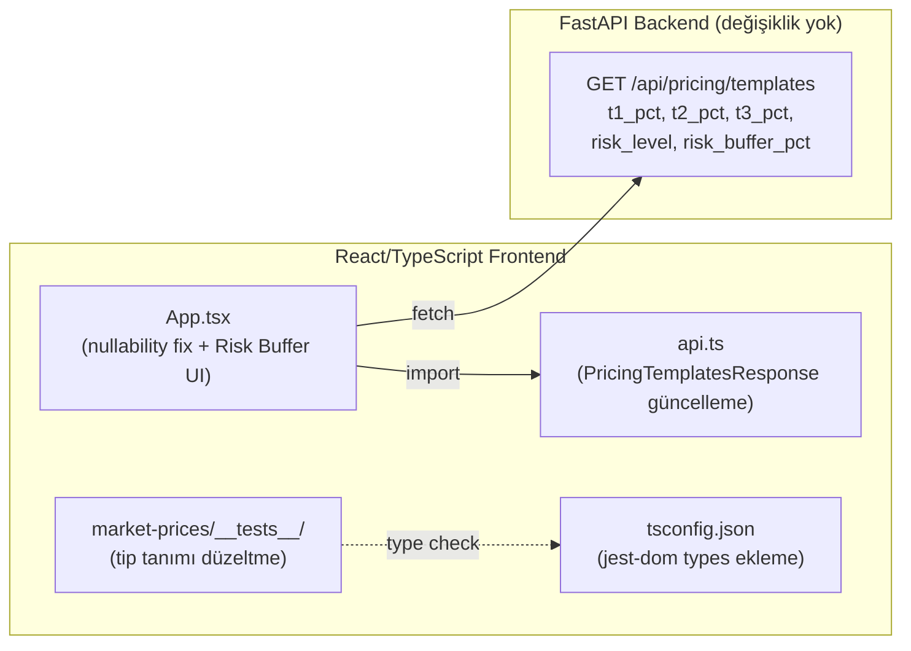
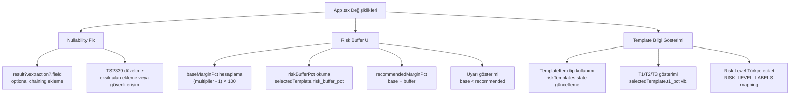

# Tasarım Dokümanı — Pricing Frontend Completion

## Genel Bakış (Overview)

Bu doküman, `pricing-consistency-fixes` bugfix spec'inin kapatılması için gereken frontend görevlerinin teknik tasarımını içerir. Backend tarafı tamamlanmıştır; bu spec yalnızca frontend değişikliklerini kapsar.

**Kapsam:**
1. TypeScript nullability hatalarının giderilmesi (`App.tsx` — TS18047, TS2339)
2. Test dosyalarındaki tip hatalarının giderilmesi (`market-prices/__tests__/` — TS2339)
3. Risk Buffer UI — `base_margin_pct`, `risk_buffer_pct`, `recommended_margin_pct` ayrı gösterimi
4. Template API frontend entegrasyonu — `t1_pct`, `t2_pct`, `t3_pct`, `risk_level`, `risk_buffer_pct`
5. `tsc --noEmit` sıfır hata çıkış kriteri
6. Mevcut davranışın korunması

**Kapsam Dışı:**
- Backend değişiklikleri (tamamlanmış)
- Yeni API endpoint'leri
- `calculator.py` veya pricing engine değişiklikleri

**Temel Tasarım Kararları:**
1. Nullability düzeltmeleri yalnızca optional chaining (`?.`) ve null kontrolleri ile yapılır — çalışma zamanı davranışı değişmez
2. Test tip tanımları `@testing-library/jest-dom` mevcut devDependency üzerinden tsconfig'e eklenir
3. Risk Buffer UI mevcut Risk Paneli içine eklenir — yeni bileşen oluşturulmaz
4. Template API tip tanımı `api.ts`'deki mevcut `PricingTemplatesResponse` arayüzü genişletilerek yapılır
5. Frontend property testleri opsiyoneldir (kullanıcı kararı)

---

## Mimari (Architecture)

Bu spec mevcut frontend mimarisini değiştirmez. Tüm değişiklikler mevcut dosyalar üzerinde yapılır.



### Değişiklik Haritası

| Dosya | Değişiklik Türü | Açıklama |
|-------|----------------|----------|
| `frontend/src/App.tsx` | Düzeltme + Yeni UI | Nullability fix + Risk Buffer UI + Template bilgi gösterimi |
| `frontend/src/api.ts` | Tip Güncelleme | `PricingTemplatesResponse` arayüzüne yeni alanlar |
| `frontend/tsconfig.json` | Yapılandırma | `@testing-library/jest-dom` tip tanımı ekleme |
| `frontend/src/market-prices/__tests__/*.tsx` | Düzeltme | Test dosyalarında jest-dom matcher tip hataları |

---

## Bileşenler ve Arayüzler (Components and Interfaces)

### 1. TypeScript Nullability Düzeltmeleri (`App.tsx`)

**Sorun:** `result` değişkeni `FullProcessResponse | null` tipindedir. Bazı erişim noktalarında TypeScript `strict: true` modunda TS18047 ("is possibly null") hatası verir.

**Çözüm Stratejisi:**

```typescript
// ❌ Hatalı — TS18047
const kwh = result.extraction.consumption_kwh.value;

// ✅ Doğru — optional chaining + fallback
const kwh = result?.extraction?.consumption_kwh?.value ?? 0;
```

**Kurallar:**
- `result` erişimlerinde `?.` kullanılır
- Sayısal fallback: `?? 0`
- String fallback: `?? ''`
- Boolean fallback: `?? false`
- Mevcut `|| 0` pattern'leri korunur (zaten çalışma zamanında güvenli)
- Yeni `?.` eklenen yerlerde mevcut fallback değerleri değiştirilmez

**TS2339 Düzeltmesi:**

`FullProcessResponse` veya `CalculateResponse` arayüzünde eksik olan alanlar varsa, `api.ts`'deki ilgili arayüze eklenir. Alternatif olarak, erişim `(result as any).field` yerine güvenli optional chaining ile yapılır.

### 2. Test Dosyası Tip Düzeltmeleri

**Sorun:** `market-prices/__tests__/` dizinindeki test dosyaları `toBeInTheDocument()`, `toHaveAttribute()`, `toHaveValue()`, `toHaveTextContent()`, `toBeDisabled()` gibi jest-dom matcher'larını kullanır. Bu matcher'ların tip tanımları TypeScript'e bildirilmemiştir.

**Çözüm:**

`@testing-library/jest-dom` paketi zaten `devDependencies`'de mevcut (v6.0.0). Tip tanımlarının TypeScript'e bildirilmesi gerekir.

**Seçenek A — tsconfig.json'a types ekleme (Tercih Edilen):**

```jsonc
// frontend/tsconfig.json
{
  "compilerOptions": {
    // ... mevcut ayarlar
    "types": ["@testing-library/jest-dom"]
  }
}
```

**Seçenek B — Global tip tanım dosyası:**

```typescript
// frontend/src/setupTests.ts veya frontend/src/test-setup.d.ts
/// <reference types="@testing-library/jest-dom" />
```

Seçenek B tercih edilir çünkü tsconfig.json'a `types` eklemek diğer otomatik tip çözümlemelerini etkileyebilir. Bir `.d.ts` dosyası veya test setup dosyası daha güvenlidir.

**Vitest Yapılandırması:**

Vitest config'de (`vite.config.ts` veya `vitest.config.ts`) `setupFiles` ile jest-dom import'u yapılıyorsa, sadece tip tanımı eksiktir. Tip tanımı eklendikten sonra tüm test dosyaları derleme hatası vermeden çalışmalıdır.

### 3. Risk Buffer UI (`App.tsx` — Risk Paneli)

**Mevcut Durum:** Risk Paneli şu bilgileri gösterir:
- T1/T2/T3 tüketim dağılımı (zaman dilimi breakdown)
- Dağıtım bedeli
- Risk flags (LOSS_RISK, UNPROFITABLE_OFFER)
- Dual margin (Enerji Marjı, Toplam Etki, Net Marj)
- Brüt Marj (TL)
- Güvenli Katsayı / Önerilen Katsayı
- Risk Seviyesi

**Yeni Eklenen UI Bölümü — Risk Buffer Bilgi Kartı:**

```
┌─────────────────────────────────────────────────────────┐
│ 📊 Marj & Risk Tamponu                                  │
├─────────────────────────────────────────────────────────┤
│ Baz Marj:       %15.0    ← (katsayı - 1) × 100        │
│ Risk Tamponu:   %3.0     ← Template API'den            │
│ Önerilen Marj:  %18.0    ← base + buffer               │
├─────────────────────────────────────────────────────────┤
│ ⚠️ Seçilen katsayı önerilen marjın altında —            │
│    risk tamponu karşılanmıyor                           │
│    (gösterilir: base_margin < recommended_margin ise)   │
└─────────────────────────────────────────────────────────┘
```

**Hesaplama Mantığı:**

```typescript
// Risk Buffer hesaplama — mevcut state'lerden türetilir
const baseMarginPct = (multiplier - 1) * 100;

// selectedTemplate: seçili şablon profili (riskTemplates dizisinden)
const riskBufferPct = selectedTemplate?.risk_buffer_pct ?? 0;
const recommendedMarginPct = baseMarginPct + riskBufferPct;

// Uyarı koşulu
const isMarginBelowRecommended = baseMarginPct < recommendedMarginPct;
// Not: risk_buffer_pct > 0 olduğunda her zaman true olacak
// risk_buffer_pct = 0 olduğunda false (uyarı gösterilmez)
```

**UI Yerleşimi:**

Risk Buffer bilgi kartı, mevcut Risk Paneli sonuçları içinde "Güvenli Katsayı" ve "Risk Seviyesi" satırlarının hemen üstüne eklenir. Böylece kullanıcı önce marj durumunu, sonra katsayı önerisini görür.

**Özel Durumlar:**
- `risk_buffer_pct = 0`: "Risk Tamponu: %0 (düşük riskli profil)" gösterilir
- `riskResult` null: Risk Buffer kartı gösterilmez (analiz henüz çalışmamış)
- Template seçilmemiş: Risk Buffer kartı gösterilmez

### 4. Template API Frontend Entegrasyonu (`api.ts`)

**Mevcut Tip Tanımı:**

```typescript
export interface PricingTemplatesResponse {
  status: string;
  count: number;
  items: Array<{ name: string; display_name: string; description: string }>;
}
```

**Güncellenmiş Tip Tanımı:**

```typescript
export interface TemplateItem {
  name: string;
  display_name: string;
  description: string;
  t1_pct: number;      // Gündüz 06:00-16:59 tüketim dağılım %
  t2_pct: number;      // Puant  17:00-21:59 tüketim dağılım %
  t3_pct: number;      // Gece   22:00-05:59 tüketim dağılım %
  risk_level: string;   // "low" | "medium" | "high" | "very_high"
  risk_buffer_pct: number;  // Önerilen katsayıya eklenecek risk tamponu %
}

export interface PricingTemplatesResponse {
  status: string;
  count: number;
  items: TemplateItem[];
}
```

**Risk Level Türkçe Etiket Mapping:**

```typescript
const RISK_LEVEL_LABELS: Record<string, string> = {
  'low': 'Düşük',
  'medium': 'Orta',
  'high': 'Yüksek',
  'very_high': 'Çok Yüksek',
};
```

**Template Bilgi Gösterimi (Risk Paneli içinde):**

Şablon seçildiğinde, şablon modu aktifken (`inputMode === 'template'`), seçili şablonun T1/T2/T3 dağılımı ve risk seviyesi gösterilir:

```
┌─────────────────────────────────────────────────────────┐
│ 📋 Şablon Profili: 3 Vardiya Sanayi                     │
│ T1: %40 | T2: %25 | T3: %35                            │
│ Risk Seviyesi: Orta                                      │
└─────────────────────────────────────────────────────────┘
```

**State Değişiklikleri (`App.tsx`):**

```typescript
// Mevcut state — tip güncellenir
const [riskTemplates, setRiskTemplates] = useState<TemplateItem[]>([]);

// Seçili şablonu bul (mevcut riskTemplateName state'i kullanılır)
const selectedTemplate = useMemo(
  () => riskTemplates.find(t => t.name === riskTemplateName) ?? null,
  [riskTemplates, riskTemplateName]
);
```

### 5. App.tsx Bileşen Değişiklik Özeti



---

## Veri Modelleri (Data Models)

Bu spec yeni veri modeli oluşturmaz. Yalnızca mevcut TypeScript arayüzleri güncellenir.

### Güncellenecek Arayüzler

**`api.ts` — PricingTemplatesResponse:**

| Alan | Tip | Açıklama | Kaynak |
|------|-----|----------|--------|
| `t1_pct` | `number` | Gündüz tüketim dağılım % | Backend Template API |
| `t2_pct` | `number` | Puant tüketim dağılım % | Backend Template API |
| `t3_pct` | `number` | Gece tüketim dağılım % | Backend Template API |
| `risk_level` | `string` | Risk sınıflandırması | Backend Template API |
| `risk_buffer_pct` | `number` | Risk tamponu % | Backend Template API |

**`App.tsx` — Türetilen Değerler (state değil, hesaplanan):**

| Değer | Formül | Tip |
|-------|--------|-----|
| `baseMarginPct` | `(multiplier - 1) * 100` | `number` |
| `riskBufferPct` | `selectedTemplate?.risk_buffer_pct ?? 0` | `number` |
| `recommendedMarginPct` | `baseMarginPct + riskBufferPct` | `number` |

### Backend API Yanıt Formatı (Referans — Değişiklik Yok)

`GET /api/pricing/templates` yanıtı:

```json
{
  "status": "ok",
  "count": 5,
  "items": [
    {
      "name": "3_vardiya_sanayi",
      "display_name": "3 Vardiya Sanayi",
      "description": "7/24 üretim yapan sanayi tesisi",
      "t1_pct": 40,
      "t2_pct": 25,
      "t3_pct": 35,
      "risk_level": "medium",
      "risk_buffer_pct": 2
    }
  ]
}
```

---

## Hata Yönetimi (Error Handling)

### Nullability Hataları

| Durum | Mevcut Davranış | Düzeltme Sonrası |
|-------|----------------|-----------------|
| `result === null` | Çalışma zamanında `undefined` erişimi (potansiyel crash) | Optional chaining ile güvenli `undefined` → fallback değer |
| `result.extraction === null` | TS18047 derleme hatası | `result?.extraction?.field ?? fallback` |
| Eksik alan erişimi | TS2339 derleme hatası | Arayüze alan ekleme veya optional chaining |

### Template API Hataları

| Durum | Davranış |
|-------|----------|
| Template API başarısız | `riskTemplates` boş dizi kalır, şablon seçimi gösterilmez |
| Seçili şablon bulunamaz | `selectedTemplate` null, Risk Buffer kartı gösterilmez |
| `risk_buffer_pct` undefined | `?? 0` fallback — tampon %0 olarak gösterilir |
| `risk_level` bilinmeyen değer | `RISK_LEVEL_LABELS[level] ?? level` — ham değer gösterilir |

### Test Tip Hataları

| Durum | Davranış |
|-------|----------|
| jest-dom tip tanımı eksik | TS2339 hataları — tip tanımı eklenerek çözülür |
| Tip tanımı eklendikten sonra | Tüm matcher'lar (`toBeInTheDocument` vb.) tip güvenli |

---

## Test Stratejisi (Testing Strategy)

### PBT Uygulanabilirlik Değerlendirmesi

Bu feature için property-based testing (PBT) **uygun değildir**. Sebepler:

1. **TypeScript nullability düzeltmeleri** — Derleme zamanı tip güvenliği, çalışma zamanı davranışı değişmez. `tsc --noEmit` smoke test yeterli.
2. **Test dosyası tip düzeltmeleri** — Yapılandırma değişikliği, PBT ile test edilecek mantık yok.
3. **Risk Buffer UI** — Basit aritmetik (`(x-1)*100`, `a+b`) ve UI rendering. Formüller trivial, PBT'nin 100+ iterasyonu ek hata bulmaz.
4. **Template API entegrasyonu** — API'den gelen değerlerin UI'da gösterilmesi. Davranış girdi ile anlamlı şekilde değişmez.
5. **Build/typecheck kriteri** — Tek seferlik smoke test.
6. **Mevcut davranış korunması** — Mevcut test suite ile doğrulanır.

Kullanıcı da frontend property testlerinin opsiyonel olduğunu belirtmiştir.

### Test Planı

#### Smoke Testler (Derleme/Yapılandırma)

1. **tsc --noEmit**: `frontend/` dizininde çalıştırılır, çıkış kodu 0 olmalı
2. **tsconfig.json korunması**: `strict: true`, `noUnusedLocals: true`, `noUnusedParameters: true` ayarları mevcut
3. **Mevcut test suite**: `npm run test` (vitest --run) tüm testler geçmeli

#### Örnek Bazlı Birim Testler (Opsiyonel)

Risk Buffer hesaplama mantığı basit olduğu için ayrı birim test opsiyoneldir. Ancak yazılacaksa:

```typescript
// Örnek test senaryoları
describe('Risk Buffer hesaplama', () => {
  it('base_margin_pct = (multiplier - 1) * 100', () => {
    expect((1.15 - 1) * 100).toBeCloseTo(15.0);
    expect((1.01 - 1) * 100).toBeCloseTo(1.0);
  });

  it('recommended = base + buffer', () => {
    expect(15.0 + 3.0).toBe(18.0);
    expect(1.0 + 0).toBe(1.0);
  });

  it('risk_level Türkçe etiket mapping', () => {
    const labels = { low: 'Düşük', medium: 'Orta', high: 'Yüksek', very_high: 'Çok Yüksek' };
    expect(labels['medium']).toBe('Orta');
    expect(labels['very_high']).toBe('Çok Yüksek');
  });
});
```

#### Entegrasyon / Manuel Doğrulama

1. **Fatura analizi akışı**: PDF yükle → analiz → hesaplama → sonuç gösterimi (değişmemeli)
2. **Risk Paneli**: Şablon seç → Risk Buffer kartı görünür → base/buffer/recommended doğru
3. **Template bilgi**: Şablon seç → T1/T2/T3 ve risk seviyesi gösterilir
4. **PDF indirme**: Mevcut PDF indirme çalışır (değişmemeli)
5. **Bayi rapor**: Mevcut bayi rapor oluşturma çalışır (değişmemeli)

#### Kabul Testi Kontrol Listesi

| # | Kriter | Doğrulama Yöntemi |
|---|--------|-------------------|
| 1 | `tsc --noEmit` sıfır hata | Komut çalıştırma |
| 2 | `strict: true` korunmuş | tsconfig.json inceleme |
| 3 | Mevcut testler geçiyor | `npm run test` |
| 4 | Risk Buffer kartı görünür | Manuel UI kontrolü |
| 5 | base_margin_pct doğru | Katsayı 1.15 → %15 |
| 6 | risk_buffer_pct gösterilir | Şablon seçimi sonrası |
| 7 | recommended_margin_pct doğru | base + buffer |
| 8 | Uyarı gösterilir (base < recommended) | risk_buffer > 0 durumunda |
| 9 | T1/T2/T3 gösterilir | Şablon seçimi sonrası |
| 10 | Risk seviyesi Türkçe | low→Düşük, medium→Orta vb. |
| 11 | Mevcut akışlar bozulmamış | Fatura analizi + PDF |
