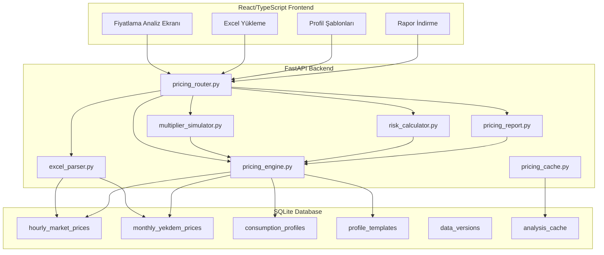
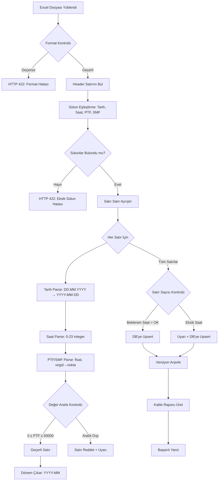
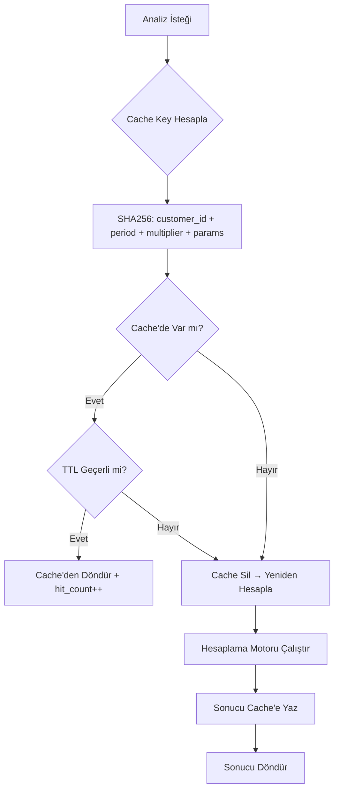
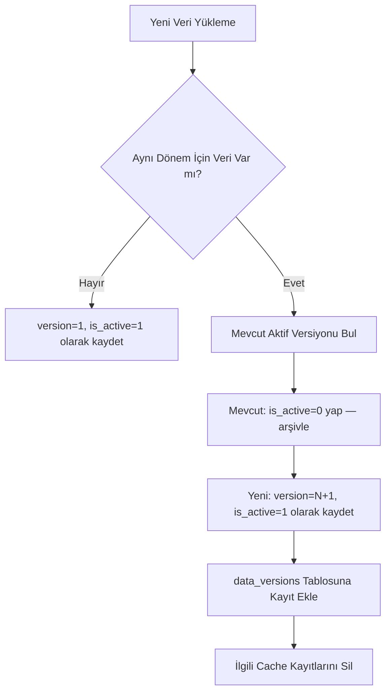
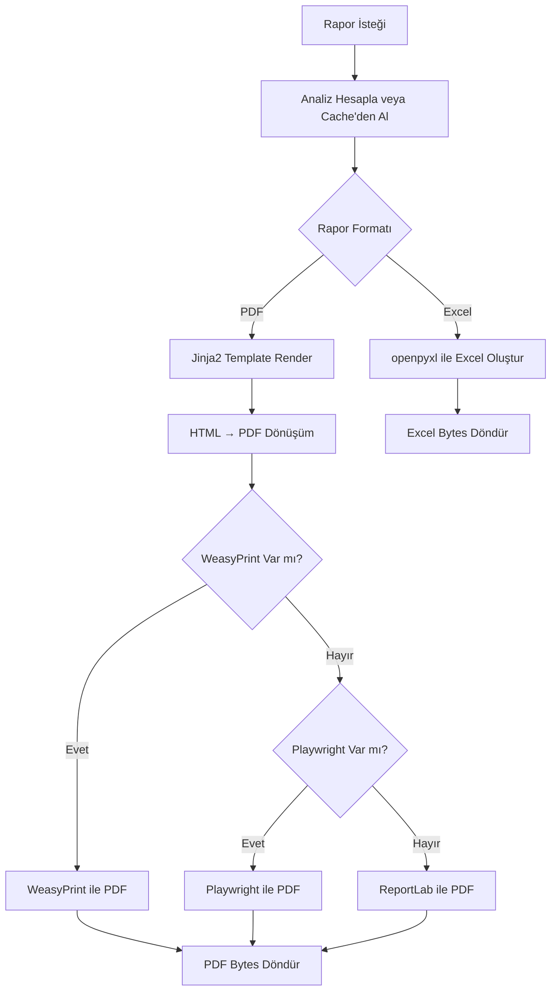

# Tasarım Dokümanı — Pricing Risk Engine

## Genel Bakış (Overview)

Bu modül, mevcut fatura bazlı teklif sistemini tamamlayan **saatlik PTF/SMF bazlı proaktif fiyatlama ve risk analiz motoru**dur. EPİAŞ uzlaştırma Excel dosyasından saatlik piyasa verilerini yükleyerek, müşterinin gerçek tüketim profili üzerinden ağırlıklı maliyet hesabı, katsayı simülasyonu, güvenli katsayı önerisi, risk skoru ve detaylı analiz raporu üretir.

### Mevcut Sistem ile İlişki

```
Mevcut Sistem (Fatura Bazlı):
  Fatura PDF → OCR/Extraction → Aylık Ortalama PTF × Katsayı → Teklif PDF

Yeni Modül (Profil Bazlı):
  EPİAŞ Excel → Saatlik PTF/SMF → Müşteri Profili × Saatlik PTF → Ağırlıklı Maliyet
  → Katsayı Simülasyonu → Güvenli Katsayı → Risk Skoru → Analiz Raporu
```

### Temel Tasarım Kararları

1. **Ayrı tablo yapısı**: Saatlik veriler mevcut `market_reference_prices` tablosuna eklenmez; yeni `hourly_market_prices` tablosu kullanılır. Sebep: Mevcut tablo aylık ortalama PTF/YEKDEM için optimize edilmiş, saatlik 744 satır/ay yapısı farklı indeksleme ve sorgu paterni gerektirir.

2. **YEKDEM ayrı tablo**: YEKDEM aylık sabit bir bedeldir, saatlik PTF/SMF ile aynı tabloya gömülmez. `monthly_yekdem_prices` tablosu kullanılır.

3. **Mevcut PDF altyapısı**: Rapor üretimi mevcut `pdf_generator.py` altyapısını (Jinja2 + WeasyPrint/Playwright/ReportLab fallback zinciri) kullanır.

4. **SQLite uyumlu**: Tüm şema SQLite ile çalışır, PostgreSQL'e geçiş için hazır.

5. **Modüler servis yapısı**: Her hesaplama adımı bağımsız, test edilebilir fonksiyonlardır.

---

## Mimari (Architecture)

### Üst Düzey Mimari



### Modül Yapısı

```
backend/app/pricing/
├── __init__.py
├── router.py              # FastAPI router — tüm /api/pricing/* endpoint'leri
├── excel_parser.py        # EPİAŞ Excel + Tüketim Excel ayrıştırıcı
├── excel_formatter.py     # Veri → Excel dışa aktarma (round-trip)
├── pricing_engine.py      # Ağırlıklı PTF/SMF, saatlik maliyet, marj hesaplama
├── multiplier_simulator.py # Katsayı simülasyonu + güvenli katsayı
├── risk_calculator.py     # Profil risk skoru
├── time_zones.py          # T1/T2/T3 zaman dilimi motoru
├── imbalance.py           # Dengesizlik maliyeti hesaplama (SMF/flat)
├── pricing_report.py      # PDF/Excel rapor üretimi
├── pricing_cache.py       # Analiz cache yönetimi
├── data_quality.py        # Veri kalite raporu
├── profile_templates.py   # Sektörel profil şablonları
├── models.py              # Pydantic modeller
├── schemas.py             # DB şemaları (SQLAlchemy)
└── version_manager.py     # Veri versiyonlama
```

---

## Bileşenler ve Arayüzler (Components and Interfaces)

### 1. Excel Parser (`excel_parser.py`)

EPİAŞ uzlaştırma Excel dosyasını ayrıştırır. openpyxl kütüphanesi kullanılır.

#### EPİAŞ Excel Ayrıştırma Akışı



#### Beklenen EPİAŞ Excel Formatı

Parser şu sütun isimlerini arar (case-insensitive, Türkçe karakter toleranslı):

| Sütun | Alternatif İsimler | Tip |
|-------|-------------------|-----|
| Tarih | tarih, date, Tarih | DD.MM.YYYY string |
| Saat | saat, hour, Hour, Saat | 0-23 integer |
| PTF (TL/MWh) | ptf, PTF, Ptf, piyasa_takas_fiyati | float |
| SMF (TL/MWh) | smf, SMF, Smf, sistem_marjinal_fiyati | float |

```python
# excel_parser.py — temel arayüz
class ExcelParseResult:
    """Excel ayrıştırma sonucu"""
    success: bool
    period: str                    # YYYY-MM
    total_rows: int                # Ayrıştırılan satır sayısı
    expected_hours: int            # Beklenen saat sayısı (720/744 vb.)
    missing_hours: list[int]       # Eksik saat indeksleri
    rejected_rows: list[dict]      # Reddedilen satırlar + sebep
    warnings: list[str]            # Uyarı mesajları
    quality_score: int             # 0-100 kalite skoru
    records: list[HourlyMarketPrice]  # Ayrıştırılan kayıtlar

def parse_epias_excel(file_bytes: bytes, filename: str) -> ExcelParseResult:
    """EPİAŞ uzlaştırma Excel dosyasını ayrıştır."""
    ...

def parse_consumption_excel(file_bytes: bytes, filename: str) -> ConsumptionParseResult:
    """Müşteri tüketim Excel dosyasını ayrıştır."""
    ...
```

#### Ay Bazlı Beklenen Saat Sayısı Hesaplama

```python
import calendar

def expected_hours_for_period(period: str) -> int:
    """YYYY-MM formatında dönem için beklenen saat sayısı."""
    year, month = int(period[:4]), int(period[5:7])
    days = calendar.monthrange(year, month)[1]
    return days * 24
    # 28 gün → 672, 29 gün → 696, 30 gün → 720, 31 gün → 744
```

### 2. Excel Formatter (`excel_formatter.py`)

DB'deki verileri EPİAŞ Excel formatına geri yazar. Round-trip özelliği için kritik.

```python
def export_market_data_to_excel(period: str, db: Session) -> bytes:
    """Saatlik piyasa verilerini Excel formatında dışa aktar."""
    ...

def export_consumption_to_excel(profile_id: int, db: Session) -> bytes:
    """Tüketim profilini Excel formatında dışa aktar."""
    ...
```

### 3. Hesaplama Motoru (`pricing_engine.py`)

Tüm maliyet ve marj hesaplamalarının merkezi servisi.

```python
@dataclass
class WeightedPriceResult:
    """Ağırlıklı fiyat hesaplama sonucu"""
    weighted_ptf_tl_per_mwh: float
    weighted_smf_tl_per_mwh: float
    arithmetic_avg_ptf: float
    arithmetic_avg_smf: float
    total_consumption_kwh: float
    total_cost_tl: float
    hours_count: int

@dataclass
class HourlyCostResult:
    """Saatlik maliyet hesaplama sonucu"""
    hour_costs: list[HourlyCostEntry]  # Her saat için detay
    total_base_cost_tl: float
    total_sales_revenue_tl: float
    total_gross_margin_tl: float
    total_net_margin_tl: float
    supplier_real_cost_tl_per_mwh: float

@dataclass
class HourlyCostEntry:
    """Tek saat maliyet detayı"""
    date: str           # YYYY-MM-DD
    hour: int           # 0-23
    consumption_kwh: float
    ptf_tl_per_mwh: float
    smf_tl_per_mwh: float
    yekdem_tl_per_mwh: float
    base_cost_tl: float       # (PTF + YEKDEM) × kWh / 1000
    sales_price_tl: float     # Enerji_Maliyeti × Katsayı × kWh / 1000
    margin_tl: float           # sales - base_cost
    is_loss_hour: bool         # margin < 0
    time_zone: str             # T1, T2, T3

def calculate_weighted_prices(
    hourly_prices: list[HourlyMarketPriceRecord],
    consumption_profile: list[HourlyConsumptionRecord],
) -> WeightedPriceResult:
    """Ağırlıklı PTF ve SMF hesapla."""
    ...

def calculate_hourly_costs(
    hourly_prices: list[HourlyMarketPriceRecord],
    consumption_profile: list[HourlyConsumptionRecord],
    yekdem_tl_per_mwh: float,
    multiplier: float,
    imbalance_params: ImbalanceParams,
    dealer_commission_pct: float = 0.0,
) -> HourlyCostResult:
    """Saatlik maliyet, satış fiyatı ve marj hesapla."""
    ...
```

### 4. Katsayı Simülatörü (`multiplier_simulator.py`)

```python
@dataclass
class SimulationRow:
    """Tek katsayı simülasyon sonucu"""
    multiplier: float
    total_sales_tl: float
    total_cost_tl: float
    gross_margin_tl: float
    dealer_commission_tl: float
    net_margin_tl: float
    loss_hours: int
    total_loss_tl: float

@dataclass
class SafeMultiplierResult:
    """Güvenli katsayı hesaplama sonucu"""
    safe_multiplier: float          # 5. persentil güvenli katsayı
    recommended_multiplier: float   # Bir üst 0.01 adımı
    confidence_level: float         # 0.95
    periods_analyzed: int
    monthly_margins: list[float]    # Her ay net marj
    warning: str | None             # ×1.10 üzeri uyarısı

def run_simulation(
    hourly_prices: list[HourlyMarketPriceRecord],
    consumption_profile: list[HourlyConsumptionRecord],
    yekdem_tl_per_mwh: float,
    imbalance_params: ImbalanceParams,
    dealer_commission_pct: float = 0.0,
    multiplier_start: float = 1.02,
    multiplier_end: float = 1.10,
    multiplier_step: float = 0.01,
) -> list[SimulationRow]:
    """Katsayı simülasyonu çalıştır."""
    ...

def calculate_safe_multiplier(
    periods_data: list[PeriodData],
    yekdem_tl_per_mwh: float,
    imbalance_params: ImbalanceParams,
    dealer_commission_pct: float = 0.0,
    confidence_level: float = 0.95,
) -> SafeMultiplierResult:
    """Güvenli katsayı hesapla (5. persentil algoritması)."""
    ...
```

### 5. Risk Hesaplayıcı (`risk_calculator.py`)

```python
@dataclass
class RiskScoreResult:
    """Profil risk skoru sonucu"""
    score: str                    # "Düşük", "Orta", "Yüksek"
    weighted_ptf: float
    arithmetic_avg_ptf: float
    deviation_pct: float          # (weighted - avg) / avg × 100
    t2_consumption_pct: float     # Puant dilimi tüketim payı
    peak_concentration: float     # Yüksek PTF saatlerine yoğunlaşma

def calculate_risk_score(
    weighted_result: WeightedPriceResult,
    time_zone_result: TimeZoneResult,
) -> RiskScoreResult:
    """Profil risk skoru hesapla."""
    ...
```

### 6. Dengesizlik Maliyeti (`imbalance.py`)

```python
@dataclass
class ImbalanceParams:
    """Dengesizlik maliyeti parametreleri"""
    forecast_error_rate: float = 0.05          # %5 varsayılan
    imbalance_cost_tl_per_mwh: float = 50.0    # Sabit mod birim maliyet
    smf_based_imbalance_enabled: bool = False   # SMF bazlı mod

def calculate_imbalance_cost(
    weighted_ptf: float,
    weighted_smf: float,
    params: ImbalanceParams,
) -> float:
    """Dengesizlik maliyeti hesapla (TL/MWh)."""
    if params.smf_based_imbalance_enabled:
        return abs(weighted_smf - weighted_ptf) * params.forecast_error_rate
    else:
        return params.imbalance_cost_tl_per_mwh * params.forecast_error_rate
```

---

## Veri Modelleri (Data Models)

### 1. Veritabanı Şemaları (SQL CREATE TABLE)

#### `hourly_market_prices` — Saatlik PTF/SMF Verileri

```sql
CREATE TABLE hourly_market_prices (
    id          INTEGER PRIMARY KEY AUTOINCREMENT,
    period      TEXT    NOT NULL,                    -- YYYY-MM (indeks + filtre)
    date        TEXT    NOT NULL,                    -- YYYY-MM-DD
    hour        INTEGER NOT NULL CHECK (hour >= 0 AND hour <= 23),
    ptf_tl_per_mwh  REAL NOT NULL CHECK (ptf_tl_per_mwh >= 0 AND ptf_tl_per_mwh <= 50000),
    smf_tl_per_mwh  REAL NOT NULL CHECK (smf_tl_per_mwh >= 0 AND smf_tl_per_mwh <= 50000),
    currency    TEXT    NOT NULL DEFAULT 'TRY',
    source      TEXT    NOT NULL DEFAULT 'epias_excel',  -- epias_excel, epias_api, manual
    version     INTEGER NOT NULL DEFAULT 1,              -- Veri versiyonu
    is_active   INTEGER NOT NULL DEFAULT 1,              -- 1=aktif, 0=arşiv
    created_at  TEXT    NOT NULL DEFAULT (datetime('now')),
    updated_at  TEXT    NOT NULL DEFAULT (datetime('now')),

    CONSTRAINT uq_hourly_period_date_hour_version
        UNIQUE (period, date, hour, version)
);

CREATE INDEX idx_hourly_market_period ON hourly_market_prices(period);
CREATE INDEX idx_hourly_market_period_active ON hourly_market_prices(period, is_active);
CREATE INDEX idx_hourly_market_date_hour ON hourly_market_prices(date, hour);
```

#### `monthly_yekdem_prices` — Aylık YEKDEM Bedelleri

```sql
CREATE TABLE monthly_yekdem_prices (
    id              INTEGER PRIMARY KEY AUTOINCREMENT,
    period          TEXT    NOT NULL,                    -- YYYY-MM
    yekdem_tl_per_mwh REAL NOT NULL CHECK (yekdem_tl_per_mwh >= 0 AND yekdem_tl_per_mwh <= 10000),
    source          TEXT    NOT NULL DEFAULT 'manual',   -- manual, epias_api
    created_at      TEXT    NOT NULL DEFAULT (datetime('now')),
    updated_at      TEXT    NOT NULL DEFAULT (datetime('now')),

    CONSTRAINT uq_yekdem_period UNIQUE (period)
);

CREATE INDEX idx_yekdem_period ON monthly_yekdem_prices(period);
```

#### `consumption_profiles` — Müşteri Tüketim Profilleri

```sql
CREATE TABLE consumption_profiles (
    id              INTEGER PRIMARY KEY AUTOINCREMENT,
    customer_id     TEXT    NOT NULL,                    -- Müşteri kimliği
    customer_name   TEXT,                                -- Müşteri adı
    period          TEXT    NOT NULL,                    -- YYYY-MM
    profile_type    TEXT    NOT NULL DEFAULT 'actual',   -- actual, template
    template_name   TEXT,                                -- Şablon kullanıldıysa adı
    total_kwh       REAL    NOT NULL CHECK (total_kwh >= 0),
    source          TEXT    NOT NULL DEFAULT 'excel',    -- excel, template, manual
    version         INTEGER NOT NULL DEFAULT 1,
    is_active       INTEGER NOT NULL DEFAULT 1,
    created_at      TEXT    NOT NULL DEFAULT (datetime('now')),
    updated_at      TEXT    NOT NULL DEFAULT (datetime('now')),

    CONSTRAINT uq_consumption_customer_period_version
        UNIQUE (customer_id, period, version)
);

CREATE INDEX idx_consumption_customer ON consumption_profiles(customer_id);
CREATE INDEX idx_consumption_period ON consumption_profiles(period);
CREATE INDEX idx_consumption_active ON consumption_profiles(customer_id, period, is_active);
```

#### `consumption_hourly_data` — Saatlik Tüketim Verileri

```sql
CREATE TABLE consumption_hourly_data (
    id              INTEGER PRIMARY KEY AUTOINCREMENT,
    profile_id      INTEGER NOT NULL REFERENCES consumption_profiles(id) ON DELETE CASCADE,
    date            TEXT    NOT NULL,                    -- YYYY-MM-DD
    hour            INTEGER NOT NULL CHECK (hour >= 0 AND hour <= 23),
    consumption_kwh REAL    NOT NULL,                    -- Negatif olabilir (uyarı üretilir)

    CONSTRAINT uq_consumption_hourly
        UNIQUE (profile_id, date, hour)
);

CREATE INDEX idx_consumption_hourly_profile ON consumption_hourly_data(profile_id);
```

#### `profile_templates` — Sektörel Profil Şablonları

```sql
CREATE TABLE profile_templates (
    id              INTEGER PRIMARY KEY AUTOINCREMENT,
    name            TEXT    NOT NULL UNIQUE,             -- "3_vardiya_sanayi", "ofis", vb.
    display_name    TEXT    NOT NULL,                    -- "3 Vardiya Sanayi"
    description     TEXT,
    hourly_weights  TEXT    NOT NULL,                    -- JSON: [0.04, 0.04, ..., 0.04] (24 eleman)
    is_builtin      INTEGER NOT NULL DEFAULT 1,         -- 1=sistem, 0=kullanıcı tanımlı
    created_at      TEXT    NOT NULL DEFAULT (datetime('now')),
    updated_at      TEXT    NOT NULL DEFAULT (datetime('now'))
);
```

#### `data_versions` — Veri Versiyonlama Arşivi

```sql
CREATE TABLE data_versions (
    id              INTEGER PRIMARY KEY AUTOINCREMENT,
    data_type       TEXT    NOT NULL,                    -- 'market_data', 'consumption'
    period          TEXT    NOT NULL,                    -- YYYY-MM
    customer_id     TEXT,                                -- NULL for market data
    version         INTEGER NOT NULL,
    uploaded_by     TEXT,
    upload_filename TEXT,
    row_count       INTEGER NOT NULL,
    quality_score   INTEGER,                             -- 0-100
    is_active       INTEGER NOT NULL DEFAULT 0,          -- 1=aktif versiyon
    created_at      TEXT    NOT NULL DEFAULT (datetime('now')),

    CONSTRAINT uq_data_version
        UNIQUE (data_type, period, customer_id, version)
);

CREATE INDEX idx_data_versions_lookup ON data_versions(data_type, period, customer_id);
```

#### `analysis_cache` — Analiz Sonuç Önbelleği

```sql
CREATE TABLE analysis_cache (
    id              INTEGER PRIMARY KEY AUTOINCREMENT,
    cache_key       TEXT    NOT NULL UNIQUE,             -- SHA256(customer_id + period + params)
    customer_id     TEXT    NOT NULL,
    period          TEXT    NOT NULL,
    params_hash     TEXT    NOT NULL,                    -- Parametre hash'i
    result_json     TEXT    NOT NULL,                    -- JSON analiz sonucu
    created_at      TEXT    NOT NULL DEFAULT (datetime('now')),
    expires_at      TEXT    NOT NULL,                    -- TTL süresi
    hit_count       INTEGER NOT NULL DEFAULT 0
);

CREATE INDEX idx_cache_key ON analysis_cache(cache_key);
CREATE INDEX idx_cache_expires ON analysis_cache(expires_at);
CREATE INDEX idx_cache_customer_period ON analysis_cache(customer_id, period);
```

### 2. SQLAlchemy ORM Modelleri

```python
# backend/app/pricing/schemas.py

from sqlalchemy import Column, Integer, String, Float, Text, ForeignKey
from sqlalchemy.orm import relationship
from ..database import Base

class HourlyMarketPrice(Base):
    __tablename__ = "hourly_market_prices"

    id = Column(Integer, primary_key=True, index=True)
    period = Column(String(7), nullable=False, index=True)
    date = Column(String(10), nullable=False)
    hour = Column(Integer, nullable=False)
    ptf_tl_per_mwh = Column(Float, nullable=False)
    smf_tl_per_mwh = Column(Float, nullable=False)
    currency = Column(String(3), nullable=False, default="TRY")
    source = Column(String(30), nullable=False, default="epias_excel")
    version = Column(Integer, nullable=False, default=1)
    is_active = Column(Integer, nullable=False, default=1)
    created_at = Column(String(30), nullable=False)
    updated_at = Column(String(30), nullable=False)

    __table_args__ = (
        sa.UniqueConstraint('period', 'date', 'hour', 'version',
                            name='uq_hourly_period_date_hour_version'),
    )


class MonthlyYekdemPrice(Base):
    __tablename__ = "monthly_yekdem_prices"

    id = Column(Integer, primary_key=True, index=True)
    period = Column(String(7), nullable=False, unique=True, index=True)
    yekdem_tl_per_mwh = Column(Float, nullable=False)
    source = Column(String(30), nullable=False, default="manual")
    created_at = Column(String(30), nullable=False)
    updated_at = Column(String(30), nullable=False)


class ConsumptionProfile(Base):
    __tablename__ = "consumption_profiles"

    id = Column(Integer, primary_key=True, index=True)
    customer_id = Column(String(100), nullable=False, index=True)
    customer_name = Column(String(255))
    period = Column(String(7), nullable=False, index=True)
    profile_type = Column(String(20), nullable=False, default="actual")
    template_name = Column(String(100))
    total_kwh = Column(Float, nullable=False)
    source = Column(String(30), nullable=False, default="excel")
    version = Column(Integer, nullable=False, default=1)
    is_active = Column(Integer, nullable=False, default=1)
    created_at = Column(String(30), nullable=False)
    updated_at = Column(String(30), nullable=False)

    hourly_data = relationship("ConsumptionHourlyData", back_populates="profile",
                               cascade="all, delete-orphan")


class ConsumptionHourlyData(Base):
    __tablename__ = "consumption_hourly_data"

    id = Column(Integer, primary_key=True, index=True)
    profile_id = Column(Integer, ForeignKey("consumption_profiles.id",
                                             ondelete="CASCADE"), nullable=False)
    date = Column(String(10), nullable=False)
    hour = Column(Integer, nullable=False)
    consumption_kwh = Column(Float, nullable=False)

    profile = relationship("ConsumptionProfile", back_populates="hourly_data")

    __table_args__ = (
        sa.UniqueConstraint('profile_id', 'date', 'hour',
                            name='uq_consumption_hourly'),
    )


class ProfileTemplate(Base):
    __tablename__ = "profile_templates"

    id = Column(Integer, primary_key=True, index=True)
    name = Column(String(100), nullable=False, unique=True)
    display_name = Column(String(200), nullable=False)
    description = Column(Text)
    hourly_weights = Column(Text, nullable=False)  # JSON array
    is_builtin = Column(Integer, nullable=False, default=1)
    created_at = Column(String(30), nullable=False)
    updated_at = Column(String(30), nullable=False)


class DataVersion(Base):
    __tablename__ = "data_versions"

    id = Column(Integer, primary_key=True, index=True)
    data_type = Column(String(30), nullable=False)
    period = Column(String(7), nullable=False)
    customer_id = Column(String(100))
    version = Column(Integer, nullable=False)
    uploaded_by = Column(String(100))
    upload_filename = Column(String(255))
    row_count = Column(Integer, nullable=False)
    quality_score = Column(Integer)
    is_active = Column(Integer, nullable=False, default=0)
    created_at = Column(String(30), nullable=False)


class AnalysisCache(Base):
    __tablename__ = "analysis_cache"

    id = Column(Integer, primary_key=True, index=True)
    cache_key = Column(String(64), nullable=False, unique=True)
    customer_id = Column(String(100), nullable=False)
    period = Column(String(7), nullable=False)
    params_hash = Column(String(64), nullable=False)
    result_json = Column(Text, nullable=False)
    created_at = Column(String(30), nullable=False)
    expires_at = Column(String(30), nullable=False)
    hit_count = Column(Integer, nullable=False, default=0)
```

### 3. Pydantic Request/Response Modelleri

```python
# backend/app/pricing/models.py

from pydantic import BaseModel, Field
from typing import Optional
from enum import Enum

class RiskLevel(str, Enum):
    LOW = "Düşük"
    MEDIUM = "Orta"
    HIGH = "Yüksek"

class TimeZone(str, Enum):
    T1 = "T1"  # Gündüz 06:00-16:59
    T2 = "T2"  # Puant  17:00-21:59
    T3 = "T3"  # Gece   22:00-05:59
```

---

## API Request/Response Formatları

### POST `/api/pricing/upload-market-data`

EPİAŞ uzlaştırma Excel yükleme. Admin/operations rolü gerektirir.

**Request:** `multipart/form-data`
```
file: <epias_uzlastirma.xlsx>
```

**Response (200):**
```json
{
  "status": "ok",
  "period": "2025-01",
  "total_rows": 744,
  "expected_hours": 744,
  "missing_hours": [],
  "rejected_rows": [],
  "warnings": [],
  "quality_score": 98,
  "version": 2,
  "previous_version_archived": true
}
```

**Response (422 — Format Hatası):**
```json
{
  "status": "error",
  "error": "invalid_excel_format",
  "message": "EPİAŞ Excel formatı tanınamadı. Beklenen sütunlar: Tarih, Saat, PTF (TL/MWh), SMF (TL/MWh)",
  "missing_columns": ["SMF (TL/MWh)"],
  "found_columns": ["Tarih", "Saat", "PTF (TL/MWh)"]
}
```

### POST `/api/pricing/upload-consumption`

Müşteri tüketim Excel yükleme.

**Request:** `multipart/form-data`
```
file: <tuketim_profili.xlsx>
customer_id: "CUST-001"
customer_name: "ABC Sanayi A.Ş."  (opsiyonel)
```

**Response (200):**
```json
{
  "status": "ok",
  "customer_id": "CUST-001",
  "period": "2025-01",
  "total_rows": 744,
  "total_kwh": 125000.5,
  "negative_hours": [],
  "quality_score": 100,
  "profile_id": 42,
  "version": 1
}
```

### POST `/api/pricing/analyze`

Tam fiyatlama analizi. Ana hesaplama endpoint'i.

**Request:**
```json
{
  "customer_id": "CUST-001",
  "period": "2025-01",
  "multiplier": 1.05,
  "dealer_commission_pct": 2.0,
  "imbalance_params": {
    "forecast_error_rate": 0.05,
    "imbalance_cost_tl_per_mwh": 50.0,
    "smf_based_imbalance_enabled": false
  },
  "use_template": null,
  "template_name": null,
  "template_monthly_kwh": null
}
```

Alternatif — şablon ile:
```json
{
  "period": "2025-01",
  "multiplier": 1.05,
  "dealer_commission_pct": 0,
  "imbalance_params": {
    "forecast_error_rate": 0.05,
    "smf_based_imbalance_enabled": true
  },
  "use_template": true,
  "template_name": "3_vardiya_sanayi",
  "template_monthly_kwh": 150000
}
```

**Response (200):**
```json
{
  "status": "ok",
  "period": "2025-01",
  "customer_id": "CUST-001",
  "weighted_prices": {
    "weighted_ptf_tl_per_mwh": 2856.42,
    "weighted_smf_tl_per_mwh": 2912.18,
    "arithmetic_avg_ptf": 2780.50,
    "arithmetic_avg_smf": 2845.30,
    "total_consumption_kwh": 125000.5,
    "total_cost_tl": 401250.75
  },
  "supplier_cost": {
    "weighted_ptf_tl_per_mwh": 2856.42,
    "yekdem_tl_per_mwh": 370.00,
    "imbalance_tl_per_mwh": 2.79,
    "total_cost_tl_per_mwh": 3229.21
  },
  "pricing": {
    "multiplier": 1.05,
    "sales_price_tl_per_mwh": 3390.67,
    "gross_margin_tl_per_mwh": 161.46,
    "dealer_commission_tl_per_mwh": 3.23,
    "net_margin_tl_per_mwh": 158.23,
    "total_sales_tl": 423833.75,
    "total_cost_tl": 403651.25,
    "total_gross_margin_tl": 20182.50,
    "total_dealer_commission_tl": 403.65,
    "total_net_margin_tl": 19778.85
  },
  "time_zone_breakdown": {
    "T1": {
      "label": "Gündüz (06:00-16:59)",
      "consumption_kwh": 62500.0,
      "consumption_pct": 50.0,
      "weighted_ptf_tl_per_mwh": 2920.15,
      "weighted_smf_tl_per_mwh": 2980.40,
      "total_cost_tl": 205625.00
    },
    "T2": {
      "label": "Puant (17:00-21:59)",
      "consumption_kwh": 31250.0,
      "consumption_pct": 25.0,
      "weighted_ptf_tl_per_mwh": 3150.80,
      "weighted_smf_tl_per_mwh": 3210.50,
      "total_cost_tl": 110000.00
    },
    "T3": {
      "label": "Gece (22:00-05:59)",
      "consumption_kwh": 31250.5,
      "consumption_pct": 25.0,
      "weighted_ptf_tl_per_mwh": 2498.30,
      "weighted_smf_tl_per_mwh": 2545.60,
      "total_cost_tl": 85625.75
    }
  },
  "loss_map": {
    "total_loss_hours": 12,
    "total_loss_tl": 1250.30,
    "by_time_zone": {"T1": 3, "T2": 8, "T3": 1},
    "worst_hours": [
      {"date": "2025-01-15", "hour": 18, "ptf": 4250.0, "sales_price": 3890.5, "loss_tl": 45.2}
    ]
  },
  "risk_score": {
    "score": "Orta",
    "deviation_pct": 2.73,
    "t2_consumption_pct": 25.0,
    "peak_concentration": 0.35
  },
  "safe_multiplier": {
    "safe_multiplier": 1.042,
    "recommended_multiplier": 1.05,
    "confidence_level": 0.95,
    "periods_analyzed": 1,
    "warning": null
  },
  "warnings": [
    {
      "type": "safe_multiplier_warning",
      "message": null
    }
  ],
  "data_quality": {
    "market_data_score": 98,
    "consumption_data_score": 100
  },
  "cache_hit": false
}
```

### POST `/api/pricing/simulate`

Katsayı simülasyonu.

**Request:**
```json
{
  "customer_id": "CUST-001",
  "period": "2025-01",
  "dealer_commission_pct": 2.0,
  "imbalance_params": {
    "forecast_error_rate": 0.05,
    "smf_based_imbalance_enabled": false,
    "imbalance_cost_tl_per_mwh": 50.0
  },
  "multiplier_start": 1.02,
  "multiplier_end": 1.10,
  "multiplier_step": 0.01
}
```

**Response (200):**
```json
{
  "status": "ok",
  "period": "2025-01",
  "simulation": [
    {
      "multiplier": 1.02,
      "total_sales_tl": 412500.00,
      "total_cost_tl": 403651.25,
      "gross_margin_tl": 8848.75,
      "dealer_commission_tl": 176.98,
      "net_margin_tl": 8671.77,
      "loss_hours": 45,
      "total_loss_tl": 5200.30
    },
    {
      "multiplier": 1.03,
      "total_sales_tl": 415800.00,
      "total_cost_tl": 403651.25,
      "gross_margin_tl": 12148.75,
      "dealer_commission_tl": 242.98,
      "net_margin_tl": 11905.77,
      "loss_hours": 32,
      "total_loss_tl": 3100.50
    }
  ],
  "safe_multiplier": {
    "safe_multiplier": 1.042,
    "recommended_multiplier": 1.05
  }
}
```

### POST `/api/pricing/compare`

Çoklu ay karşılaştırma.

**Request:**
```json
{
  "customer_id": "CUST-001",
  "periods": ["2024-11", "2024-12", "2025-01"],
  "multiplier": 1.05,
  "dealer_commission_pct": 2.0,
  "imbalance_params": {
    "forecast_error_rate": 0.05,
    "smf_based_imbalance_enabled": false,
    "imbalance_cost_tl_per_mwh": 50.0
  }
}
```

**Response (200):**
```json
{
  "status": "ok",
  "periods_analyzed": 3,
  "missing_periods": [],
  "comparison": [
    {
      "period": "2024-11",
      "weighted_ptf_tl_per_mwh": 2720.50,
      "weighted_smf_tl_per_mwh": 2780.30,
      "total_cost_tl": 380000.00,
      "net_margin_tl": 18500.00,
      "risk_score": "Düşük",
      "change_pct": null
    },
    {
      "period": "2024-12",
      "weighted_ptf_tl_per_mwh": 2850.30,
      "weighted_smf_tl_per_mwh": 2910.50,
      "total_cost_tl": 395000.00,
      "net_margin_tl": 17200.00,
      "risk_score": "Orta",
      "change_pct": {
        "weighted_ptf": 4.77,
        "total_cost": 3.95,
        "net_margin": -7.03
      }
    },
    {
      "period": "2025-01",
      "weighted_ptf_tl_per_mwh": 2856.42,
      "weighted_smf_tl_per_mwh": 2912.18,
      "total_cost_tl": 401250.75,
      "net_margin_tl": 19778.85,
      "risk_score": "Orta",
      "change_pct": {
        "weighted_ptf": 0.21,
        "total_cost": 1.58,
        "net_margin": 14.99
      }
    }
  ],
  "safe_multiplier": {
    "safe_multiplier": 1.048,
    "recommended_multiplier": 1.05,
    "periods_analyzed": 3
  }
}
```

### GET `/api/pricing/templates`

Profil şablonları listesi.

**Response (200):**
```json
{
  "status": "ok",
  "templates": [
    {
      "name": "3_vardiya_sanayi",
      "display_name": "3 Vardiya Sanayi",
      "description": "7/24 çalışan sanayi tesisi, gece-gündüz eşit tüketim",
      "hourly_weights": [0.042, 0.042, 0.042, 0.042, 0.042, 0.042, 0.042, 0.042, 0.042, 0.042, 0.042, 0.042, 0.042, 0.042, 0.042, 0.042, 0.042, 0.042, 0.042, 0.042, 0.042, 0.042, 0.042, 0.042],
      "is_builtin": true
    },
    {
      "name": "ofis",
      "display_name": "Ofis",
      "description": "08:00-18:00 yoğun, gece minimal tüketim",
      "hourly_weights": [0.01, 0.01, 0.01, 0.01, 0.01, 0.01, 0.02, 0.04, 0.08, 0.09, 0.09, 0.09, 0.08, 0.08, 0.08, 0.06, 0.04, 0.03, 0.02, 0.01, 0.01, 0.01, 0.01, 0.01],
      "is_builtin": true
    }
  ]
}
```

### GET `/api/pricing/periods`

Yüklü dönemlerin listesi.

**Response (200):**
```json
{
  "status": "ok",
  "periods": [
    {
      "period": "2025-01",
      "has_market_data": true,
      "has_yekdem": true,
      "market_data_hours": 744,
      "market_data_quality": 98,
      "market_data_version": 2,
      "yekdem_tl_per_mwh": 370.0,
      "consumption_profiles": ["CUST-001", "CUST-002"]
    },
    {
      "period": "2024-12",
      "has_market_data": true,
      "has_yekdem": true,
      "market_data_hours": 744,
      "market_data_quality": 100,
      "market_data_version": 1,
      "yekdem_tl_per_mwh": 364.0,
      "consumption_profiles": ["CUST-001"]
    }
  ]
}
```

### POST `/api/pricing/report/pdf` ve `/api/pricing/report/excel`

Analiz raporu dışa aktarma.

**Request:**
```json
{
  "customer_id": "CUST-001",
  "period": "2025-01",
  "multiplier": 1.05,
  "dealer_commission_pct": 2.0,
  "imbalance_params": {
    "forecast_error_rate": 0.05,
    "smf_based_imbalance_enabled": false,
    "imbalance_cost_tl_per_mwh": 50.0
  },
  "customer_name": "ABC Sanayi A.Ş.",
  "contact_person": "Ahmet Yılmaz"
}
```

**Response:** Binary PDF veya Excel dosyası (`Content-Type: application/pdf` veya `application/vnd.openxmlformats-officedocument.spreadsheetml.sheet`)

---

## Güvenli Katsayı Algoritması (Detaylı)

### 5. Persentil Algoritması

```
GİRDİ:
  periods_data: [{period, hourly_prices[], consumption_profile[]}]
  yekdem_tl_per_mwh: float
  imbalance_params: ImbalanceParams
  dealer_commission_pct: float
  confidence_level: float = 0.95  (→ 5. persentil)

ÇIKTI:
  safe_multiplier: float (3 ondalık)
  recommended_multiplier: float (2 ondalık, bir üst 0.01 adımı)

ALGORİTMA:

1. Katsayı aday listesi oluştur:
   candidates = [1.001, 1.002, ..., 1.100]  (0.001 adımla)

2. Her katsayı adayı için:
   a. Her dönem için aylık net marj hesapla:
      - weighted_ptf = Σ(consumption_h × ptf_h) / Σ(consumption_h)
      - total_cost = Σ(consumption_h × (ptf_h + yekdem) / 1000)
      - total_sales = Σ(consumption_h × (weighted_ptf + yekdem) × multiplier / 1000)
      - gross_margin = total_sales - total_cost
      - dealer_commission = gross_margin × dealer_commission_pct / 100
      - imbalance_cost = calculate_imbalance(...) × Σ(consumption_h) / 1000
      - net_margin = gross_margin - dealer_commission - imbalance_cost

   b. Aylık net marj listesi: monthly_margins = [net_margin_period1, ...]

3. Tek ay verisi varsa:
   - Saatlik marj dağılımını kullan (744 veri noktası)
   - 5. persentil = sorted(hourly_margins)[int(0.05 × len)]

4. Çoklu ay verisi varsa:
   - Aylık net marj dağılımını kullan
   - 5. persentil = sorted(monthly_margins)[int(0.05 × len)]

5. Güvenli katsayı = 5. persentilde net_margin ≥ 0 olan en düşük katsayı
   - Binary search ile bul (candidates listesinde)

6. Önerilen katsayı = ceil(safe_multiplier × 100) / 100
   - Örn: 1.042 → 1.05

7. Eğer safe_multiplier > 1.10:
   - warning = "Bu profil için ×1.10 altında güvenli katsayı bulunamadı"
```

### Pseudocode

```python
def calculate_safe_multiplier(periods_data, yekdem, imbalance_params,
                               dealer_pct=0.0, confidence=0.95):
    percentile_idx = 1.0 - confidence  # 0.05 for 95%

    def net_margin_at_multiplier(mult):
        """Verilen katsayı için tüm dönemlerin net marjlarını döndür."""
        margins = []
        for pd in periods_data:
            result = calculate_hourly_costs(
                pd.hourly_prices, pd.consumption,
                yekdem, mult, imbalance_params, dealer_pct
            )
            if len(periods_data) == 1:
                # Tek ay: saatlik marjları kullan
                margins.extend([h.margin_tl for h in result.hour_costs])
            else:
                # Çoklu ay: aylık net marjı kullan
                margins.append(result.total_net_margin_tl)
        return margins

    # Binary search: en düşük katsayıyı bul
    lo, hi = 1.001, 1.100
    safe = None

    for _ in range(100):  # max iterations
        mid = round((lo + hi) / 2, 3)
        margins = net_margin_at_multiplier(mid)
        margins.sort()
        p5_index = max(0, int(len(margins) * percentile_idx) - 1)
        p5_value = margins[p5_index]

        if p5_value >= 0:
            safe = mid
            hi = mid - 0.001
        else:
            lo = mid + 0.001

        if lo > hi:
            break

    if safe is None:
        return SafeMultiplierResult(
            safe_multiplier=1.100,
            recommended_multiplier=1.10,
            warning="Bu profil için ×1.10 altında güvenli katsayı bulunamadı",
            ...
        )

    import math
    recommended = math.ceil(safe * 100) / 100

    return SafeMultiplierResult(
        safe_multiplier=round(safe, 3),
        recommended_multiplier=round(recommended, 2),
        confidence_level=confidence,
        periods_analyzed=len(periods_data),
        warning=None,
    )
```

---

## Dengesizlik Maliyeti Modeli (Detaylı)

İki mod desteklenir:

### Mod 1: SMF Bazlı (smf_based_imbalance_enabled=true)

Gerçek piyasa verilerine dayalı, daha doğru hesaplama.

```
Dengesizlik_Maliyeti (TL/MWh) = |Ağırlıklı_SMF − Ağırlıklı_PTF| × forecast_error_rate

Örnek:
  Ağırlıklı_SMF = 2912.18 TL/MWh
  Ağırlıklı_PTF = 2856.42 TL/MWh
  forecast_error_rate = 0.05 (%5)
  Dengesizlik = |2912.18 - 2856.42| × 0.05 = 55.76 × 0.05 = 2.79 TL/MWh
```

### Mod 2: Sabit Oran (smf_based_imbalance_enabled=false)

Basit, SMF verisi gerekmez.

```
Dengesizlik_Maliyeti (TL/MWh) = imbalance_cost_tl_per_mwh × forecast_error_rate

Örnek:
  imbalance_cost_tl_per_mwh = 50.0 TL/MWh (varsayılan)
  forecast_error_rate = 0.05 (%5)
  Dengesizlik = 50.0 × 0.05 = 2.50 TL/MWh
```

### Tedarikçi Gerçek Maliyet Formülü

```
Tedarikçi_Gerçek_Maliyet = Ağırlıklı_PTF + YEKDEM + Dengesizlik_Maliyeti

Örnek (SMF bazlı):
  2856.42 + 370.00 + 2.79 = 3229.21 TL/MWh

Satış_Fiyatı = Tedarikçi_Gerçek_Maliyet × Katsayı
  3229.21 × 1.05 = 3390.67 TL/MWh
```

---

## Cache ve Versiyonlama Davranışı

### Cache Stratejisi



**Cache Key Yapısı:**
```python
import hashlib, json

def build_cache_key(customer_id: str, period: str, params: dict) -> str:
    raw = json.dumps({
        "customer_id": customer_id,
        "period": period,
        "params": params,
    }, sort_keys=True)
    return hashlib.sha256(raw.encode()).hexdigest()
```

**Cache Invalidation Kuralları:**
1. Müşterinin tüketim verisi güncellendiğinde → o müşterinin tüm cache kayıtları silinir
2. Dönemin piyasa verisi güncellendiğinde → o dönemin tüm cache kayıtları silinir
3. YEKDEM verisi güncellendiğinde → ilgili dönemin tüm cache kayıtları silinir
4. TTL süresi dolduğunda → otomatik geçersiz (varsayılan: 24 saat)

```python
def invalidate_cache_for_customer(db: Session, customer_id: str):
    db.query(AnalysisCache).filter(
        AnalysisCache.customer_id == customer_id
    ).delete()
    db.commit()

def invalidate_cache_for_period(db: Session, period: str):
    db.query(AnalysisCache).filter(
        AnalysisCache.period == period
    ).delete()
    db.commit()
```

**TTL Yapılandırması:**
```python
CACHE_TTL_HOURS = int(os.getenv("PRICING_CACHE_TTL_HOURS", "24"))
```

### Versiyonlama Davranışı



**Versiyon Arşiv Kuralları:**
- Aktif versiyon her zaman `is_active=1`
- Önceki versiyonlar `is_active=0` (arşiv)
- Arşiv versiyonları görüntülenebilir ama hesaplamada kullanılmaz
- `data_versions` tablosu yükleme geçmişini tutar

---

## PDF/Excel Rapor Üretim Akışı

### Rapor Üretim Pipeline



### PDF Rapor Şablonu Bölümleri

Mevcut `offer_template.html` yapısıyla tutarlı, yeni Jinja2 template:

```
pricing_analysis_template.html
├── Sayfa 1: Kapak + Özet
│   ├── Şirket logosu + antetli kağıt (mevcut header.png/footer.png)
│   ├── Müşteri bilgileri
│   ├── Dönem özeti
│   ├── Ağırlıklı PTF/SMF kutusu
│   ├── Risk skoru badge (Düşük/Orta/Yüksek)
│   └── Güvenli katsayı önerisi
│
├── Sayfa 2: T1/T2/T3 Dağılım + Maliyet Karşılaştırma
│   ├── T1/T2/T3 tüketim ve maliyet tablosu
│   ├── Maliyet karşılaştırma tablosu (mevcut vs teklif)
│   └── Tasarruf kutusu (yeşil)
│
├── Sayfa 3: Katsayı Simülasyonu
│   ├── Katsayı simülasyon tablosu (×1.02 – ×1.10)
│   ├── Güvenli katsayı vurgusu
│   └── Zararlı saat sayıları
│
└── Sayfa 4: Zarar Haritası Özeti + Notlar
    ├── Zarar haritası özet tablosu
    ├── T1/T2/T3 bazlı zararlı saat dağılımı
    └── Yasal uyarılar ve notlar
```

### Excel Rapor Yapısı

openpyxl ile oluşturulur:

```
pricing_analysis.xlsx
├── Sheet 1: "Özet"
│   ├── Müşteri bilgileri
│   ├── Ağırlıklı PTF/SMF
│   ├── Risk skoru
│   └── Güvenli katsayı
│
├── Sheet 2: "T1/T2/T3 Dağılım"
│   └── Zaman dilimi bazlı tüketim ve maliyet tablosu
│
├── Sheet 3: "Katsayı Simülasyonu"
│   └── Tüm katsayılar için simülasyon tablosu
│
├── Sheet 4: "Saatlik Detay"
│   └── 744 satır saatlik maliyet detayı
│
└── Sheet 5: "Zarar Haritası"
    └── Zararlı saatler listesi
```

---

## Doğruluk Özellikleri (Correctness Properties)

*Bir özellik (property), bir sistemin tüm geçerli yürütmelerinde doğru olması gereken bir davranış veya karakteristiktir — esasen, sistemin ne yapması gerektiğine dair biçimsel bir ifadedir. Özellikler, insan tarafından okunabilir spesifikasyonlar ile makine tarafından doğrulanabilir doğruluk garantileri arasındaki köprü görevi görür.*

### Property 1: EPİAŞ Excel Round-Trip

*For any* geçerli EPİAŞ saatlik piyasa verisi seti (rastgele dönem, rastgele PTF/SMF değerleri 0–50000 aralığında, doğru saat sayısı), veriyi Excel formatına yazıp (format), sonra tekrar ayrıştırma (parse) işlemi orijinal veri ile eşdeğer sonuç üretmelidir. Eşdeğerlik: her satır için tarih, saat, PTF ve SMF değerleri ±0.01 toleransla eşleşmelidir.

**Validates: Requirements 1.1, 1.7, 1.8**

### Property 2: Tüketim Excel Round-Trip

*For any* geçerli müşteri tüketim verisi seti (rastgele dönem, rastgele saatlik kWh değerleri ≥ 0), veriyi Excel formatına yazıp tekrar ayrıştırma işlemi orijinal veri ile eşdeğer sonuç üretmelidir. Eşdeğerlik: her satır için tarih, saat ve tüketim değerleri ±0.001 kWh toleransla eşleşmelidir.

**Validates: Requirements 4.1, 4.5, 4.6**

### Property 3: Beklenen Saat Sayısı Hesaplama

*For any* geçerli YYYY-MM dönem dizgisi (yıl 2020–2030, ay 1–12), beklenen saat sayısı `calendar.monthrange(year, month)[1] × 24` formülüne eşit olmalıdır.

**Validates: Requirements 1.3**

### Property 4: Geçersiz Excel Reddi

*For any* Excel dosyası ki gerekli sütunlardan (Tarih, Saat, PTF) en az biri eksik olsun, parser dosyayı reddetmeli ve `success=False` ile eksik sütun bilgisini içeren hata mesajı döndürmelidir.

**Validates: Requirements 1.4, 4.3**

### Property 5: Profil Şablonu Ağırlık Normalizasyonu ve Tüketim Üretimi

*For any* profil şablonu ve *for any* pozitif toplam aylık tüketim değeri (kWh), şablonun 24 saatlik ağırlıklarının toplamı 1.0'a eşit olmalı (±0.001 tolerans) ve üretilen saatlik tüketim serisinin toplamı verilen toplam aylık tüketime eşit olmalıdır (±0.01 kWh tolerans).

**Validates: Requirements 5.2, 5.3**

### Property 6: T1/T2/T3 Zaman Dilimi Sınıflandırması

*For any* saat değeri (0–23), sınıflandırma deterministik olmalıdır: saat 6–16 → T1, saat 17–21 → T2, saat 22–23 veya 0–5 → T3. Hiçbir saat sınıflandırılmadan kalmamalı ve hiçbir saat birden fazla dilime atanmamalıdır.

**Validates: Requirements 6.1**

### Property 7: T1/T2/T3 Bölümleme Değişmezi

*For any* tüketim profili ve saatlik PTF verisi, T1 + T2 + T3 toplam tüketimi genel toplam tüketime eşit olmalı ve T1 + T2 + T3 toplam maliyeti genel toplam maliyete eşit olmalıdır (±0.01 TL tolerans).

**Validates: Requirements 6.3, 6.4**

### Property 8: Ağırlıklı Ortalama Sınır Özelliği

*For any* tüketim profili (toplam tüketim > 0) ve saatlik PTF verisi, hesaplanan Ağırlıklı_PTF değeri ilgili dönemin minimum saatlik PTF değerinden küçük olmamalı ve maksimum saatlik PTF değerinden büyük olmamalıdır. Aynı sınır özelliği Ağırlıklı_SMF için de geçerlidir.

**Validates: Requirements 7.5**

### Property 9: Eşit Tüketimde Ağırlıklı Ortalama = Aritmetik Ortalama

*For any* saatlik PTF verisi, tüm saatlerde eşit tüketim olduğunda Ağırlıklı_PTF değeri aritmetik ortalama PTF değerine eşit olmalıdır (±0.01 TL/MWh tolerans). Bu metamorfik özellik, ağırlıklı ortalama hesaplamasının doğruluğunu doğrular.

**Validates: Requirements 7.6**

### Property 10: Zarar Saati Tutarlılığı

*For any* tüketim profili, saatlik PTF verisi ve katsayı, zarar haritasında `is_loss_hour=true` olarak işaretlenen her saat için `margin_tl < 0` olmalı ve `is_loss_hour=false` olan her saat için `margin_tl >= 0` olmalıdır.

**Validates: Requirements 9.1, 9.2**

### Property 11: Katsayı Simülasyonu Monotonluğu

*For any* tüketim profili ve saatlik PTF verisi, katsayı simülasyonunda katsayı arttıkça toplam satış geliri kesinlikle artmalıdır (monoton artan). Ayrıca katsayı arttıkça zararlı saat sayısı azalmalı veya eşit kalmalıdır (monoton azalan).

**Validates: Requirements 10.1, 10.2, 10.3**

### Property 12: Güvenli Katsayı Sınır Doğrulaması

*For any* tüketim profili, saatlik PTF verisi ve maliyet parametreleri, hesaplanan güvenli katsayı değerinde 5. persentil net marj ≥ 0 olmalıdır. Güvenli katsayıdan 0.001 düşük değerde ise 5. persentil net marj < 0 olmalıdır (sınır koşulu).

**Validates: Requirements 11.1, 11.2, 11.3**

### Property 13: Risk Skoru Eşik Tutarlılığı

*For any* ağırlıklı PTF ve aritmetik ortalama PTF çifti, sapma yüzdesi `(weighted - avg) / avg × 100` formülüyle hesaplandığında: sapma > %5 → Yüksek, %2 ≤ sapma ≤ %5 → Orta, sapma < %2 → Düşük sınıflandırması tutarlı olmalıdır.

**Validates: Requirements 12.2, 12.3, 12.4, 12.5**

### Property 14: Uyarı Sistemi Tutarlılığı

*For any* seçilen katsayı ve hesaplanan güvenli katsayı çifti, seçilen katsayı < güvenli katsayı ise uyarı mesajı üretilmeli, seçilen katsayı ≥ güvenli katsayı ise uyarı mesajı üretilmemelidir.

**Validates: Requirements 13.1, 13.3**

---

## Hata Yönetimi (Error Handling)

### Hata Kategorileri

| Kategori | HTTP Kodu | Örnek | Davranış |
|----------|-----------|-------|----------|
| Geçersiz dosya formatı | 422 | EPİAŞ Excel formatı tanınamadı | Detaylı hata mesajı + eksik sütunlar |
| Aralık dışı değer | 422 | PTF < 0 veya > 50000 | Reddedilen satırlar listesi |
| Eksik veri | 422 | Zorunlu parametre eksik | Eksik alan listesi |
| Veri bulunamadı | 404 | Dönem için piyasa verisi yok | Açıklayıcı mesaj |
| Sıfıra bölme | 422 | Toplam tüketim = 0 | "Toplam tüketim sıfır, ağırlıklı ortalama hesaplanamaz" |
| Yetki hatası | 403 | Admin olmayan kullanıcı market data yüklemeye çalışıyor | "Bu işlem için admin yetkisi gerekli" |
| Sunucu hatası | 500 | Beklenmeyen hata | Trace ID ile genel hata mesajı |

### Hata Yanıt Formatı

```json
{
  "status": "error",
  "error": "error_code",
  "message": "Kullanıcı dostu Türkçe hata mesajı",
  "details": {
    "missing_columns": ["SMF (TL/MWh)"],
    "rejected_rows": [{"row": 15, "reason": "PTF değeri aralık dışı: -50.0"}]
  },
  "trace_id": "abc-123-def"
}
```

### Kritik Hata Senaryoları

1. **Excel parse hatası**: Dosya formatı tanınamazsa HTTP 422 döner, kısmi veri DB'ye yazılmaz (atomik işlem).
2. **Eksik dönem verisi**: Analiz isteğinde dönem için piyasa verisi yoksa HTTP 404 döner, hesaplama yapılmaz.
3. **Cache tutarsızlığı**: Cache invalidation başarısız olursa, sonraki istek cache'i bypass eder (fail-open).
4. **Versiyonlama hatası**: Arşivleme başarısız olursa yeni veri yüklenmez (atomik işlem).

---

## Test Stratejisi (Testing Strategy)

### İkili Test Yaklaşımı

Bu özellik hem birim testleri hem de property-based testler gerektirir:

**Property-Based Testler (Hypothesis kütüphanesi):**
- Her property testi minimum **100 iterasyon** çalıştırılır
- Her test, tasarım dokümanındaki property numarasını referans alır
- Tag formatı: `Feature: pricing-risk-engine, Property {N}: {başlık}`
- Hypothesis kütüphanesi kullanılır (projede zaten mevcut)

**Birim Testler (pytest):**
- Spesifik örnekler ve edge case'ler
- Entegrasyon noktaları (DB, dosya I/O)
- API endpoint testleri

### Test Dosya Yapısı

```
backend/tests/
├── test_pricing_parser_pbt.py          # Property 1, 2, 3, 4 (round-trip, hours, rejection)
├── test_pricing_engine_pbt.py          # Property 7, 8, 9 (T1/T2/T3, weighted avg, bounds)
├── test_pricing_simulator_pbt.py       # Property 10, 11, 12 (loss map, monotonicity, safe mult)
├── test_pricing_risk_pbt.py            # Property 13, 14 (risk score, warnings)
├── test_pricing_templates_pbt.py       # Property 5, 6 (template normalization, time zones)
├── test_pricing_parser.py              # Birim testler: parser edge cases
├── test_pricing_engine.py              # Birim testler: hesaplama örnekleri
├── test_pricing_api.py                 # Entegrasyon: API endpoint testleri
├── test_pricing_cache.py               # Entegrasyon: cache invalidation
└── test_pricing_versioning.py          # Entegrasyon: veri versiyonlama
```

### Property Test Konfigürasyonu

```python
from hypothesis import given, settings, strategies as st

@settings(max_examples=100, deadline=None)
@given(
    ptf_values=st.lists(
        st.floats(min_value=0.01, max_value=50000.0),
        min_size=672, max_size=744
    ),
    consumption_values=st.lists(
        st.floats(min_value=0.0, max_value=10000.0),
        min_size=672, max_size=744
    ),
)
def test_weighted_ptf_bounds(ptf_values, consumption_values):
    """Feature: pricing-risk-engine, Property 8: Ağırlıklı Ortalama Sınır Özelliği"""
    # ... test implementation
```

### Birim Test Örnekleri

- Bilinen EPİAŞ Excel dosyası ile parser doğrulama
- Ocak 2025 gerçek PTF verileri ile ağırlıklı ortalama hesaplama
- 3 vardiya sanayi profili ile katsayı simülasyonu
- Cache hit/miss/invalidation senaryoları
- Versiyonlama: 2 kez yükleme sonrası arşiv kontrolü
- API endpoint'leri: 422/403/404 hata senaryoları

### Entegrasyon Testleri

- Excel yükleme → DB kayıt → analiz → rapor üretimi tam akış
- Cache invalidation: veri güncelleme sonrası cache temizlenme
- Çoklu ay karşılaştırma: 3 dönem verisi ile tam analiz
- Yetki kontrolü: admin vs normal kullanıcı endpoint erişimi
