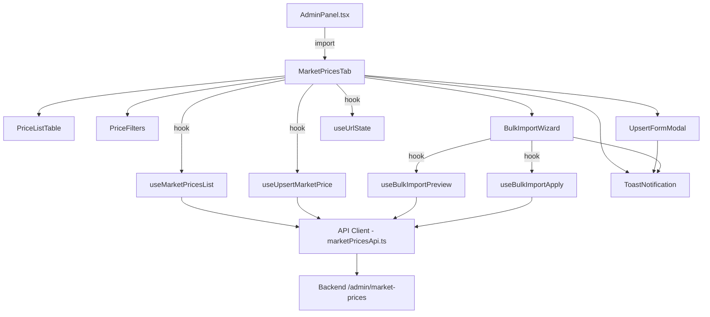
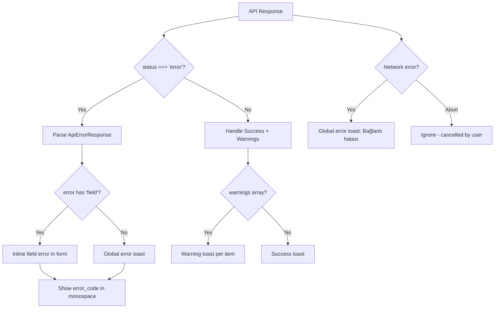

# Design Document: PTF Admin Frontend

## Overview

Bu tasarım, mevcut `AdminPanel.tsx` monolitindeki market-prices sekmesini modern, modüler bir React bileşen ağacına dönüştürür. Backend PTF Admin Management API'si (JSON tabanlı, sayfalanmış, status/audit destekli) ile tam uyumlu bir frontend oluşturulur.

Temel yaklaşım:
- Mevcut `AdminPanel.tsx` içindeki `MarketPricesTab` fonksiyonu kaldırılıp, yeni `MarketPricesTab` bileşeni import edilir
- Diğer sekmeler (distribution-tariffs, tariff-lookup, incidents) hiç değiştirilmez
- State yönetimi: plain axios + custom hooks (React Query/SWR kullanılmaz)
- URL query state ile filtre/pagination senkronizasyonu
- Tüm UI etiketleri Türkçe

## Architecture



### Dosya Yapısı

```
frontend/src/
├── AdminPanel.tsx                    # Mevcut — sadece import değişir
├── api.ts                            # Mevcut — eski market price fonksiyonları kalır (backward compat)
├── market-prices/
│   ├── MarketPricesTab.tsx           # Ana orkestratör bileşen
│   ├── PriceListTable.tsx            # Tablo + pagination
│   ├── PriceFilters.tsx              # Filtre kontrolleri
│   ├── UpsertFormModal.tsx           # Upsert modal formu
│   ├── BulkImportWizard.tsx          # Toplu import akışı
│   ├── StatusBadge.tsx               # Durum rozeti
│   ├── SkeletonLoader.tsx            # Shimmer loading
│   ├── ToastNotification.tsx         # Global toast
│   ├── marketPricesApi.ts            # Yeni JSON API client
│   ├── hooks/
│   │   ├── useMarketPricesList.ts    # Liste fetch + pagination state
│   │   ├── useUpsertMarketPrice.ts   # Upsert mutation
│   │   ├── useBulkImportPreview.ts   # Preview mutation
│   │   ├── useBulkImportApply.ts     # Apply mutation
│   │   └── useUrlState.ts           # URL ↔ state senkronizasyonu
│   ├── types.ts                      # TypeScript interfaces
│   ├── constants.ts                  # Sabitler, error code mapping
│   └── utils.ts                      # Formatter, parser yardımcıları
```

## Components and Interfaces

### MarketPricesTab (Orkestratör)

Ana bileşen. Tüm alt bileşenleri compose eder, hook'ları bağlar, toast state'ini yönetir.

```typescript
interface MarketPricesTabProps {
  // AdminPanel'den gelen prop yok — kendi state'ini yönetir
}

// Internal state:
// - urlState: filters + pagination (useUrlState hook'undan)
// - toasts: ToastMessage[] 
// - upsertModal: { open: boolean; editingRecord?: MarketPriceRecord }
// - bulkImportOpen: boolean
```

### PriceListTable

```typescript
interface PriceListTableProps {
  data: MarketPriceRecord[];
  loading: boolean;
  pagination: PaginationState;
  sortBy: string;
  sortOrder: 'asc' | 'desc';
  onSort: (column: string) => void;
  onPageChange: (page: number) => void;
  onPageSizeChange: (size: number) => void;
  onEdit: (record: MarketPriceRecord) => void;
  onClearFilters: () => void;
  isEmpty: boolean;
}
```

Tablo sütunları:
| Sütun | Alan | Format | Sıralanabilir |
|-------|------|--------|---------------|
| Dönem | period | "2025-01" | ✅ |
| PTF (TL/MWh) | ptf_tl_per_mwh | "2.508,80" (tr-TR locale) | ✅ |
| Durum | status | StatusBadge bileşeni | ✅ |
| Güncelleme | updated_at | "15.01.2025 13:30" (Europe/Istanbul) | ✅ |
| Kaynak | source | Text | ❌ |
| Güncelleyen | updated_by | Text | ❌ |
| Değişiklik Nedeni | change_reason | Text (truncated) | ❌ |
| İşlem | — | Edit butonu | ❌ |

### PriceFilters

```typescript
interface PriceFiltersProps {
  filters: FilterState;
  onFilterChange: (filters: Partial<FilterState>) => void;
}

interface FilterState {
  status: 'all' | 'provisional' | 'final';
  fromPeriod: string; // "YYYY-MM" or ""
  toPeriod: string;   // "YYYY-MM" or ""
}
```

### UpsertFormModal

```typescript
interface UpsertFormModalProps {
  open: boolean;
  onClose: () => void;
  editingRecord?: MarketPriceRecord;
  onSuccess: () => void;
  onToast: (toast: ToastMessage) => void;
}

// Form state:
interface UpsertFormState {
  period: string;
  value: string;        // String for input control, parsed to number on submit
  status: 'provisional' | 'final';
  changeReason: string;
  sourceNote: string;
  forceUpdate: boolean;
}
```

Form akışı:
1. Modal açılır (yeni kayıt veya mevcut kayıt düzenleme)
2. Kullanıcı alanları doldurur
3. force_update işaretlenirse → onay dialogu + change_reason zorunlu kontrolü
4. Submit → API çağrısı → başarı: modal kapanır + toast + liste yenilenir
5. Hata: field-level inline hata veya global toast
6. Esc tuşu → modal kapanır

### BulkImportWizard

```typescript
interface BulkImportWizardProps {
  open: boolean;
  onClose: () => void;
  onSuccess: () => void;
  onToast: (toast: ToastMessage) => void;
}

type BulkImportStep = 'upload' | 'preview' | 'result';
```

Adımlar:
1. **Upload**: Dosya seçimi (CSV/JSON) + force_update checkbox
2. **Preview**: Özet sayılar + satır detayları (hata/uyarı) + "Uygula" butonu
3. **Result**: Sonuç özeti + başarısız satırları indirme butonu

### StatusBadge

```typescript
interface StatusBadgeProps {
  status: 'provisional' | 'final';
}
// provisional → "Ön Değer" (bg-amber-100 text-amber-700)
// final → "Kesinleşmiş" (bg-green-100 text-green-700)
```

### ToastNotification

```typescript
interface ToastMessage {
  id: string;
  type: 'success' | 'info' | 'warning' | 'error';
  title: string;
  detail?: string;       // Backend error_code gibi debug bilgisi
  autoClose?: number;    // ms, default 5000
}
```

Renk eşlemesi:
- success: bg-green-50 border-green-200 text-green-700
- info: bg-blue-50 border-blue-200 text-blue-700
- warning: bg-amber-50 border-amber-200 text-amber-700
- error: bg-red-50 border-red-200 text-red-700

## Data Models

### TypeScript Interfaces (types.ts)

```typescript
// Backend API response — list endpoint
interface MarketPricesListResponse {
  status: string;
  total: number;
  page: number;
  page_size: number;
  items: MarketPriceRecord[];
}

interface MarketPriceRecord {
  period: string;              // "2025-01"
  ptf_tl_per_mwh: number;     // 2508.80
  status: 'provisional' | 'final';
  price_type: string;          // "PTF"
  captured_at: string;         // ISO 8601 UTC
  updated_at: string;          // ISO 8601 UTC
  updated_by: string;
  source: string;              // "epias_manual" | "epias_api" | "migration" | "seed"
  source_note: string;
  change_reason: string;
  is_locked: boolean;
  yekdem_tl_per_mwh: number;
}

// Upsert request body
interface UpsertMarketPriceRequest {
  period: string;
  value: number;
  price_type: 'PTF';
  status: 'provisional' | 'final';
  source_note?: string;
  change_reason?: string;
  force_update: boolean;
}

// Upsert response
interface UpsertMarketPriceResponse {
  status: 'ok';
  action: 'created' | 'updated';
  period: string;
  warnings?: string[];
}

// Backend error response
interface ApiErrorResponse {
  status: 'error';
  error_code: string;
  message: string;
  field?: string;
  row_index?: number | null;
  details?: Record<string, unknown>;
}

// Bulk import preview response
interface BulkImportPreviewResponse {
  status: 'ok';
  preview: {
    total_rows: number;
    valid_rows: number;
    invalid_rows: number;
    new_records: number;
    updates: number;
    unchanged: number;
    final_conflicts: number;
    errors: BulkImportError[];
  };
}

interface BulkImportError {
  row: number;
  field: string;
  error: string;
}

// Bulk import apply response
interface BulkImportApplyResponse {
  status: 'ok';
  result: {
    success: boolean;
    imported_count: number;
    skipped_count: number;
    error_count: number;
    details: BulkImportError[];
  };
}

// Internal UI state types
interface PaginationState {
  page: number;
  pageSize: number;
  total: number;
}

interface ListParams {
  page: number;
  page_size: number;
  sort_by: string;
  sort_order: 'asc' | 'desc';
  price_type: 'PTF';
  status?: 'provisional' | 'final';
  from_period?: string;
  to_period?: string;
}

interface FilterState {
  status: 'all' | 'provisional' | 'final';
  fromPeriod: string;
  toPeriod: string;
}
```

### URL State Serialization

URL query parametreleri ↔ UI state eşlemesi:

| URL Param | UI State | Default | Örnek |
|-----------|----------|---------|-------|
| `page` | pagination.page | 1 | `?page=2` |
| `page_size` | pagination.pageSize | 20 | `?page_size=50` |
| `sort_by` | sortBy | "period" | `?sort_by=ptf_tl_per_mwh` |
| `sort_order` | sortOrder | "desc" | `?sort_order=asc` |
| `status` | filters.status | (omitted = all) | `?status=final` |
| `from_period` | filters.fromPeriod | (omitted) | `?from_period=2024-01` |
| `to_period` | filters.toPeriod | (omitted) | `?to_period=2025-06` |

Serialization kuralları:
- Default değerler URL'den çıkarılır (temiz URL)
- `status=all` URL'ye yazılmaz
- Boş string değerler URL'ye yazılmaz
- `window.history.replaceState` kullanılır (pushState değil, her filtre değişikliğinde history entry oluşturmamak için)
- Sayfa ilk yüklendiğinde `window.location.search` parse edilir

### Error Code → UI Mapping (constants.ts)

```typescript
const ERROR_CODE_MAP: Record<string, { message: string; field?: string }> = {
  INVALID_PERIOD_FORMAT: { message: 'Geçersiz dönem formatı (YYYY-MM bekleniyor)', field: 'period' },
  FUTURE_PERIOD: { message: 'Gelecek dönem girilemez', field: 'period' },
  INVALID_PTF_VALUE: { message: 'Geçersiz PTF değeri', field: 'value' },
  INVALID_STATUS: { message: 'Geçersiz durum değeri', field: 'status' },
  INVALID_DECIMAL_FORMAT: { message: 'Geçersiz ondalık format (nokta kullanın)', field: 'value' },
  PERIOD_LOCKED: { message: 'Bu dönem kilitli, güncelleme yapılamaz', field: 'period' },
  FINAL_RECORD_PROTECTED: { message: 'Kesinleşmiş kayıt force_update olmadan güncellenemez', field: 'force_update' },
  STATUS_DOWNGRADE_FORBIDDEN: { message: 'Durum geri alınamaz (final → provisional)', field: 'status' },
  PERIOD_NOT_FOUND: { message: 'Dönem bulunamadı' },
  PARSE_ERROR: { message: 'Dosya ayrıştırma hatası' },
  BATCH_VALIDATION_FAILED: { message: 'Toplu doğrulama başarısız' },
  EMPTY_FILE: { message: 'Dosya boş' },
  CHANGE_REASON_REQUIRED: { message: 'Değişiklik nedeni zorunlu', field: 'change_reason' },
};
```

### Hooks Design

**useMarketPricesList**
```typescript
function useMarketPricesList(params: ListParams): {
  data: MarketPriceRecord[];
  pagination: PaginationState;
  loading: boolean;
  error: ApiErrorResponse | null;
  refetch: () => void;
}
```
- `useEffect` ile params değiştiğinde fetch
- AbortController ile önceki isteği iptal
- Loading state: skeleton gösterimi için

**useUpsertMarketPrice**
```typescript
function useUpsertMarketPrice(): {
  submit: (req: UpsertMarketPriceRequest) => Promise<UpsertMarketPriceResponse>;
  loading: boolean;
  error: ApiErrorResponse | null;
  fieldErrors: Record<string, string>;
}
```
- Submit sırasında loading=true → double-submit guard
- Backend hata → error_code'a göre fieldErrors parse

**useBulkImportPreview**
```typescript
function useBulkImportPreview(): {
  preview: (file: File, priceType: string, forceUpdate: boolean) => Promise<BulkImportPreviewResponse>;
  loading: boolean;
  error: ApiErrorResponse | null;
}
```

**useBulkImportApply**
```typescript
function useBulkImportApply(): {
  apply: (file: File, priceType: string, forceUpdate: boolean, strictMode: boolean) => Promise<BulkImportApplyResponse>;
  loading: boolean;
  error: ApiErrorResponse | null;
}
```

**useUrlState**
```typescript
function useUrlState(): {
  filters: FilterState;
  pagination: { page: number; pageSize: number };
  sortBy: string;
  sortOrder: 'asc' | 'desc';
  setFilters: (f: Partial<FilterState>) => void;
  setPage: (page: number) => void;
  setPageSize: (size: number) => void;
  setSort: (column: string) => void;
  clearFilters: () => void;
}
```
- `window.location.search` parse → initial state
- State değişikliğinde `window.history.replaceState` ile URL güncelle
- `popstate` event listener ile back/forward desteği

### Utility Functions (utils.ts)

```typescript
// Sayıyı Türkçe locale'de formatla: 2508.80 → "2.508,80"
function formatPrice(value: number): string;

// ISO 8601 UTC → Europe/Istanbul timezone, "15.01.2025 13:30" formatı
function formatDateTime(isoString: string): string;

// URL query string → ListParams parse
function parseUrlParams(search: string): Partial<ListParams>;

// ListParams → URL query string serialize (default değerler hariç)
function serializeUrlParams(params: Partial<ListParams>): string;

// Backend error response → field errors map
function parseFieldErrors(error: ApiErrorResponse): Record<string, string>;

// Failed rows → CSV string (download için)
function exportFailedRowsCsv(errors: BulkImportError[]): string;

// Failed rows → JSON string (download için)
function exportFailedRowsJson(errors: BulkImportError[]): string;
```


## Correctness Properties

*A property is a characteristic or behavior that should hold true across all valid executions of a system — essentially, a formal statement about what the system should do. Properties serve as the bridge between human-readable specifications and machine-verifiable correctness guarantees.*

### Property 1: URL State Round-Trip

*For any* valid filter state (status, fromPeriod, toPeriod) and pagination state (page, pageSize, sortBy, sortOrder), serializing to a URL query string and then parsing back should produce an equivalent state object.

**Validates: Requirements 2.1, 2.2, 2.3, 2.4**

### Property 2: Price Formatting

*For any* non-negative number, `formatPrice(value)` should produce a string in Turkish locale format (dot as thousands separator, comma as decimal separator) with exactly 2 decimal places, and parsing that string back (replacing dots, swapping comma for dot) should yield the original value within floating-point tolerance.

**Validates: Requirements 1.2**

### Property 3: DateTime Formatting

*For any* valid ISO 8601 UTC timestamp string, `formatDateTime(isoString)` should produce a string in "DD.MM.YYYY HH:mm" format representing the Europe/Istanbul timezone, and the output should always contain exactly 16 characters (DD.MM.YYYY HH:mm).

**Validates: Requirements 1.2**

### Property 4: Sort Toggle Correctness

*For any* current sort state (sortBy, sortOrder) and any clicked column name: if the clicked column equals the current sortBy, the sortOrder should toggle (asc↔desc); if the clicked column differs, sortBy should change to the clicked column and sortOrder should reset to "desc".

**Validates: Requirements 1.5**

### Property 5: Pagination Total Pages Calculation

*For any* total record count ≥ 0 and page size > 0, the calculated total pages should equal `Math.ceil(total / pageSize)`, and the current page should be clamped between 1 and totalPages.

**Validates: Requirements 1.6**

### Property 6: Filter Change Resets Page

*For any* current pagination state with page > 1, when any filter value changes, the resulting page should be reset to 1.

**Validates: Requirements 3.4**

### Property 7: Force Update Requires Change Reason

*For any* upsert form state where force_update is true, the form should be invalid (submission blocked) if change_reason is empty or whitespace-only.

**Validates: Requirements 5.3**

### Property 8: Error Code to Field Routing

*For any* backend error response with a known error_code from the ERROR_CODE_MAP, if the mapping has a "field" property, `parseFieldErrors` should return that field with the mapped message; if the mapping has no "field" property, the error should be routed to global toast display.

**Validates: Requirements 5.7, 8.2, 8.3, 8.4**

### Property 9: Decimal Serialization

*For any* numeric value entered in the upsert form (including values with Turkish locale display), the serialized API request body should contain the value with dot (.) as decimal separator, never comma.

**Validates: Requirements 5.10**

### Property 10: Preview Summary Completeness

*For any* valid BulkImportPreviewResponse, the rendered preview should contain all summary fields (total_rows, valid_rows, invalid_rows, new_records, updates, unchanged, final_conflicts) and for each error entry, the rendered output should contain row number, field name, and error message.

**Validates: Requirements 6.2, 6.3**

### Property 11: Failed Rows Export Round-Trip

*For any* non-empty list of BulkImportError objects, exporting to CSV and parsing back should preserve all row numbers, field names, and error messages. Similarly for JSON export.

**Validates: Requirements 7.4**

### Property 12: Apply Result Summary Completeness

*For any* valid BulkImportApplyResponse, the rendered result should contain imported_count, skipped_count, and error_count values.

**Validates: Requirements 7.3**

## Design Decisions & Edge Cases

### 1. Backend `total` Garantisi

Backend GET /admin/market-prices response'u `total` alanını HER ZAMAN döndürür (integer, ≥ 0). Bu, pagination hesaplaması için kesin contract'tır. `has_next` veya `items.length < page_size` gibi alternatif stratejilere gerek yoktur.

```typescript
// Backend contract (kesinleşmiş):
interface MarketPricesListResponse {
  status: string;
  total: number;      // ← HER ZAMAN mevcut, ≥ 0
  page: number;
  page_size: number;
  items: MarketPriceRecord[];
}
```

### 2. Filtre Değişiminde Page Reset

Filtre değiştiğinde page HER ZAMAN 1'e reset edilir. Clamp tek başına yeterli değildir — kullanıcı page=7'de iken filtre değiştirirse boş sonuç görmemeli.

Akış: filtre değişir → page=1 set edilir → URL güncellenir → API çağrılır.

Bu davranış Property 6'da (Filter Change Resets Page) test edilir.

### 3. AbortController İptali = Sessiz İptal

Abort edilen request bir hata DEĞİLDİR. UI davranışı:
- Global error toast ATILMAZ
- Loading state doğru kapanır (abort sonrası loading=false)
- `error` state'i set edilmez

```typescript
// Hook'larda abort handling:
catch (err) {
  if (err instanceof DOMException && err.name === 'AbortError') {
    return; // Sessiz iptal — UI'a yansımaz
  }
  // Gerçek hata → error state set et
}
```

Bu kural `useMarketPricesList` hook'unda ve `marketPricesApi.ts` error handling'de uygulanır.

### 4. Double-Submit Guard Kapsamı

Tüm mutation endpoint'lerinde double-submit guard aktiftir:
- **Upsert**: submit button disabled + loading state
- **Bulk Apply**: "Uygula" button disabled + loading state
- **Enter ile submit**: form onSubmit handler'ı loading state'i kontrol eder, loading=true ise submit'i engeller

Guard mekanizması: `loading` state'i true iken button `disabled` attribute'u set edilir VE form submit handler'ı early return yapar.

### 5. Preview → Apply Drift Toleransı

Preview ile apply arasında backend verisi değişebilir (başka admin aynı anda kayıt güncellemiş olabilir). Bu beklenen bir durumdur.

Kural: **Apply sonucu authoritative'dir.** Preview ile apply sonucu farklıysa, UI apply sonucunu gösterir. Preview sadece "tahmini önizleme" olarak sunulur, garanti değildir.

UI'da preview ekranında şu not gösterilir: _"Önizleme tahminidir. Uygulama sonucu farklılık gösterebilir."_

### 6. replaceState Seçimi (Intentional)

URL state güncellemesi `window.history.replaceState` kullanır, `pushState` DEĞİL. Bu bilinçli bir karardır:

- **Neden replaceState**: Her filtre değişikliğinde history entry oluşturmak, tarayıcı history'sini şişirir. Admin kullanıcısı 10 filtre değişikliği yaparsa 10 history entry oluşur — "geri" butonu kullanılamaz hale gelir.
- **Sonuç**: Tarayıcı "geri" butonu bir önceki filtre state'ine değil, bir önceki sayfaya (örn. ana sayfa) gider.
- **Bu bir bug değildir**: Admin panel için filtre history'si şart değildir. Paylaşılabilir link (URL'deki query params) yeterlidir.

`popstate` event listener yine de dinlenir — kullanıcı URL'yi manuel değiştirip Enter'a basarsa veya bookmark'tan gelirse state doğru parse edilir.

## Error Handling

### Error Flow



### Error Handling Strategy

1. **API Client Layer** (`marketPricesApi.ts`):
   - Axios interceptor catches non-2xx responses
   - Parse response body as `ApiErrorResponse`
   - Network errors → generic "Bağlantı hatası" message
   - AbortError → silently ignored (intentional cancellation)

2. **Hook Layer** (custom hooks):
   - Catch errors from API client
   - Set `error` state for component consumption
   - For upsert hook: parse `fieldErrors` from error_code mapping

3. **Component Layer**:
   - UpsertFormModal: display field-level errors inline, global errors as toast
   - BulkImportWizard: display errors in preview table, apply errors as toast
   - PriceListTable: display error state with retry button

### Backend Error Codes Handled

| Error Code | HTTP | UI Behavior |
|-----------|------|-------------|
| INVALID_PERIOD_FORMAT | 400 | Inline error on period field |
| FUTURE_PERIOD | 400 | Inline error on period field |
| INVALID_PTF_VALUE | 400 | Inline error on value field |
| INVALID_STATUS | 400 | Inline error on status field |
| INVALID_DECIMAL_FORMAT | 400 | Inline error on value field |
| PERIOD_LOCKED | 409 | Inline error on period field |
| FINAL_RECORD_PROTECTED | 409 | Inline error on force_update field |
| STATUS_DOWNGRADE_FORBIDDEN | 409 | Inline error on status field |
| CHANGE_REASON_REQUIRED | 400 | Inline error on change_reason field |
| PERIOD_NOT_FOUND | 404 | Global toast |
| PARSE_ERROR | 400 | Global toast (bulk import) |
| BATCH_VALIDATION_FAILED | 400 | Global toast (bulk import) |
| EMPTY_FILE | 400 | Global toast (bulk import) |

## Testing Strategy

### Dual Testing Approach

Bu proje hem unit test hem property-based test kullanır. İkisi birbirini tamamlar:

- **Unit tests**: Belirli örnekler, edge case'ler, bileşen render testleri
- **Property tests**: Evrensel özellikler, rastgele girdi ile kapsamlı doğrulama

### Property-Based Testing

**Kütüphane**: [fast-check](https://github.com/dubzzz/fast-check) (TypeScript/JavaScript için en olgun PBT kütüphanesi)

**Konfigürasyon**: Her property test minimum 100 iterasyon çalıştırılır.

**Test Dosyaları**:
- `frontend/src/market-prices/__tests__/urlState.property.test.ts` — Property 1
- `frontend/src/market-prices/__tests__/formatters.property.test.ts` — Property 2, 3
- `frontend/src/market-prices/__tests__/listState.property.test.ts` — Property 4, 5, 6
- `frontend/src/market-prices/__tests__/validation.property.test.ts` — Property 7, 9
- `frontend/src/market-prices/__tests__/errorMapping.property.test.ts` — Property 8
- `frontend/src/market-prices/__tests__/bulkImport.property.test.ts` — Property 10, 11, 12

**Tagging**: Her test, tasarım dokümanındaki property'yi referans alır:
```typescript
// Feature: ptf-admin-frontend, Property 1: URL State Round-Trip
```

### Unit Testing

**Kütüphane**: Vitest + React Testing Library

**Kapsam**:
- Bileşen render testleri (skeleton, empty state, status badge)
- Form validation edge case'leri
- API client mock testleri (request format, headers)
- Toast notification render testleri
- Keyboard interaction testleri (Esc to close)

### Test Bağımlılıkları (Eklenecek)

```json
{
  "devDependencies": {
    "vitest": "^1.0.0",
    "fast-check": "^3.0.0",
    "@testing-library/react": "^14.0.0",
    "@testing-library/jest-dom": "^6.0.0",
    "@testing-library/user-event": "^14.0.0",
    "jsdom": "^23.0.0"
  }
}
```
