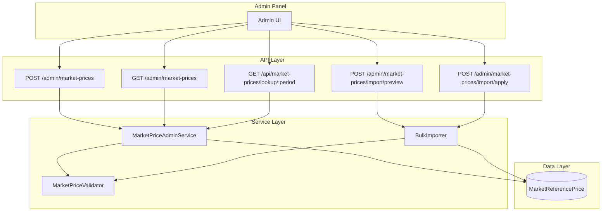

# Design Document: PTF Admin Management

## Overview

Bu tasarım, EPİAŞ PTF verilerinin Admin Panel üzerinden yönetilmesi için gerekli veritabanı şema değişikliklerini, API endpoint'lerini, servis katmanını ve iş kurallarını tanımlar.

Mevcut `MarketReferencePrice` tablosu genişletilerek `status`, `captured_at`, `price_type` ve audit alanları eklenecektir. Yeni endpoint'ler bulk import, preview ve deterministik hesaplama lookup'ı destekleyecektir.

### Tasarım Prensipleri

1. **Backward Compatibility**: Mevcut endpoint'ler ve veri yapısı korunacak
2. **Minimal Disruption**: Mevcut `market_prices.py` fonksiyonları genişletilecek, yeniden yazılmayacak
3. **Explicit Over Implicit**: Status transition ve fallback kuralları açık ve deterministik
4. **Audit Trail**: Tüm değişiklikler izlenebilir olacak

## Architecture



**NOT:** Endpoint'ler `/admin/market-prices` altında tutarlı. `price_type` parametresi ile gelecekte SMF, YEKDEM desteklenebilir. Şimdilik sadece PTF destekleniyor.

## Components and Interfaces

### 1. Database Schema Extension

Mevcut `MarketReferencePrice` tablosuna eklenecek alanlar:

#### Veri Modeli Standartları

| Alan | Tip | Birim | Açıklama |
|------|-----|-------|----------|
| `ptf_tl_per_mwh` | DECIMAL(12,2) | TL/MWh | PTF değeri (mevcut alan adı korunuyor) |
| `yekdem_tl_per_mwh` | DECIMAL(12,2) | TL/MWh | YEKDEM değeri |
| `period` | VARCHAR(7) | - | YYYY-MM formatı |

**NOT:** Alan adı `ptf_tl_per_mwh` olarak kalıyor (mevcut yapıyla uyumluluk). API'de `value` kullanılabilir ama DB'de explicit isim tercih edildi.

```python
# backend/app/database.py - MarketReferencePrice güncellemesi

class MarketReferencePrice(Base):
    __tablename__ = "market_reference_prices"

    id = Column(Integer, primary_key=True, index=True)
    
    # Mevcut alanlar
    period = Column(String(7), nullable=False, index=True)  # YYYY-MM
    ptf_tl_per_mwh = Column(Numeric(12, 2), nullable=False)  # DECIMAL(12,2), TL/MWh
    yekdem_tl_per_mwh = Column(Numeric(12, 2), nullable=False, default=0)  # TL/MWh
    source_note = Column(String(500), nullable=True)
    is_locked = Column(Integer, default=0)
    updated_by = Column(String(100), nullable=True)
    created_at = Column(DateTime, default=datetime.utcnow)
    updated_at = Column(DateTime, default=datetime.utcnow, onupdate=datetime.utcnow)
    
    # YENİ ALANLAR
    price_type = Column(String(20), nullable=False, default="PTF", index=True)
    status = Column(String(20), nullable=False, default="provisional")  # provisional | final
    captured_at = Column(DateTime, nullable=False, default=datetime.utcnow)
    change_reason = Column(String(500), nullable=True)
    source = Column(String(30), nullable=False, default="epias_manual")  # epias_manual | epias_api | migration | seed
    
    # Unique constraint güncelleme
    __table_args__ = (
        UniqueConstraint('price_type', 'period', name='uq_price_type_period'),
    )
```

### 2. MarketPriceValidator Component

```python
# backend/app/market_price_validator.py

@dataclass
class ValidationResult:
    is_valid: bool
    errors: List[str]
    warnings: List[str]

class MarketPriceValidator:
    """
    Piyasa fiyatı validasyonu.
    Şimdilik PTF odaklı, price_type ile genişletilebilir.
    """
    PERIOD_REGEX = r"^\d{4}-(0[1-9]|1[0-2])$"
    MIN_VALUE = 0.01
    MAX_VALUE = 100000.0
    WARNING_MIN = 1000.0
    WARNING_MAX = 5000.0
    VALID_STATUSES = {"provisional", "final"}
    VALID_PRICE_TYPES = {"PTF"}  # Gelecekte: {"PTF", "SMF", "YEKDEM"}
    
    def validate_period(self, period: str) -> ValidationResult
    def validate_value(self, value: float) -> ValidationResult
    def validate_status(self, status: str) -> ValidationResult
    def validate_price_type(self, price_type: str) -> ValidationResult
    def validate_entry(self, period: str, value: float, status: str, price_type: str = "PTF") -> ValidationResult
    def is_future_period(self, period: str) -> bool
```

### 3. MarketPriceAdminService Component

```python
# backend/app/market_price_admin_service.py

@dataclass
class MarketPriceEntry:
    period: str
    value: float  # TL/MWh
    status: str
    price_type: str = "PTF"
    captured_at: Optional[datetime] = None
    source_note: Optional[str] = None
    change_reason: Optional[str] = None

@dataclass
class MarketPriceLookupResult:
    period: str
    value: float
    status: str
    price_type: str
    is_provisional_used: bool
    source: str

class MarketPriceAdminService:
    def upsert(self, db: Session, entry: MarketPriceEntry, updated_by: str, 
               force_update: bool = False) -> Tuple[bool, str, List[str]]
    
    def get_for_calculation(self, db: Session, period: str, 
                            price_type: str = "PTF") -> MarketPriceLookupResult
    
    def list_prices(self, db: Session, 
                    price_type: str = "PTF",
                    page: int = 1, 
                    page_size: int = 20,
                    sort_by: str = "period",
                    sort_order: str = "desc",
                    status_filter: Optional[str] = None,
                    from_period: Optional[str] = None,
                    to_period: Optional[str] = None) -> Tuple[List[MarketPriceEntry], int]
```

### 4. BulkImporter Component

```python
# backend/app/bulk_importer.py

@dataclass
class ImportRow:
    row_number: int
    period: str
    value: float
    status: str
    validation_result: Optional[ValidationResult] = None

@dataclass
class ImportPreview:
    total_rows: int
    valid_rows: int
    invalid_rows: int
    new_records: int
    updates: int
    unchanged: int
    final_conflicts: int  # final kayıtlar force_update olmadan
    rows: List[ImportRow]
    errors: List[Dict]  # {row: int, field: str, error: str}

@dataclass
class ImportResult:
    success: bool
    imported_count: int
    skipped_count: int
    error_count: int
    details: List[Dict]  # Per-row results

class BulkImporter:
    def parse_csv(self, content: str) -> List[ImportRow]
    def parse_json(self, content: str) -> List[ImportRow]
    def preview(self, db: Session, rows: List[ImportRow], 
                price_type: str = "PTF",
                force_update: bool = False) -> ImportPreview
    def apply(self, db: Session, rows: List[ImportRow], 
              price_type: str = "PTF",
              updated_by: str,
              force_update: bool = False,
              strict_mode: bool = False) -> ImportResult
```

### 5. Authorization Rules

Admin endpoint'leri için yetkilendirme kuralları:

| Endpoint | Minimum Rol | Ek Kural |
|----------|-------------|----------|
| GET /admin/market-prices | admin | - |
| POST /admin/market-prices | admin | - |
| POST /admin/market-prices (force_update=true) | admin | Audit log zorunlu |
| POST /admin/market-prices/import/* | admin | - |
| GET /api/market-prices/lookup/* | authenticated | Internal use |

**NOT:** Şu an tek "admin" rolü var. Gelecekte "privileged_admin" ayrımı yapılabilir.

### 6. API Endpoints

```python
# Mevcut /admin/market-prices endpoint'leri genişletilecek
# price_type parametresi ile gelecekte SMF, YEKDEM desteklenebilir
# Şimdilik sadece PTF destekleniyor

# Tekil giriş (mevcut endpoint genişletilecek)
POST /admin/market-prices
Request:
{
    "period": "2025-01",
    "value": 2508.80,
    "price_type": "PTF",  # default: PTF
    "status": "final",
    "source_note": "EPİAŞ manuel giriş",
    "change_reason": "Ay sonu kesinleşme",
    "force_update": false
}
Response:
{
    "status": "ok",
    "action": "created" | "updated",
    "period": "2025-01",
    "warnings": []
}

# Listeleme (pagination + filtering)
GET /admin/market-prices?page=1&page_size=20&sort_by=period&sort_order=desc&price_type=PTF&status=final&from_period=2024-01&to_period=2025-12
Response:
{
    "status": "ok",
    "total": 26,
    "page": 1,
    "page_size": 20,
    "items": [...]
}

# Import preview
POST /admin/market-prices/import/preview
Content-Type: multipart/form-data
Request:
- file: CSV or JSON file
- price_type: string (default: PTF)
- force_update: boolean
Response:
{
    "status": "ok",
    "preview": {
        "total_rows": 26,
        "valid_rows": 25,
        "invalid_rows": 1,
        "new_records": 10,
        "updates": 15,
        "unchanged": 0,
        "final_conflicts": 3,
        "errors": [
            {"row": 5, "field": "period", "error": "Invalid format"}
        ]
    }
}

# Import apply
POST /admin/market-prices/import/apply
Content-Type: multipart/form-data
Request:
- file: CSV or JSON file
- price_type: string (default: PTF)
- force_update: boolean
- strict_mode: boolean
Response:
{
    "status": "ok",
    "result": {
        "success": true,
        "imported_count": 25,
        "skipped_count": 1,
        "error_count": 0,
        "details": [...]
    }
}

# Hesaplama için lookup (internal use)
GET /api/market-prices/lookup/{period}?price_type=PTF
Response:
{
    "period": "2025-01",
    "value": 2508.80,
    "price_type": "PTF",
    "status": "final",
    "is_provisional_used": false
}
```

### 7. Decimal Parsing Standard

**Import kabul formatı:** Sadece nokta (.) decimal separator olarak kabul edilir.

```
✅ Kabul: 2508.80, 1942.90, 2973.04
❌ Reject: 2.508,80, 2508,80, 2.508.80
```

TR formatı (virgül decimal) gelirse: reject + "Lütfen nokta (.) kullanın" hata mesajı.

**Rationale:** Binlik/ondalık karışıklığını önlemek için tek standart. UI zaten doğru format üretir.

### 8. get_for_calculation Davranışı

```python
def get_for_calculation(db: Session, period: str, price_type: str = "PTF") -> MarketPriceLookupResult:
    """
    Hesaplama için piyasa fiyatı getir.
    
    Kurallar (deterministik):
    1. İstenen period için final kayıt varsa → final döndür, is_provisional_used=false
    2. İstenen period için sadece provisional varsa → provisional döndür, is_provisional_used=true
    3. İstenen period hiç yoksa → PeriodNotFoundError (nearest period'a fallback YOK)
    4. Future period istenirse → FuturePeriodError
    5. Döndürülen period HER ZAMAN istenen period'a eşit olmalı
    
    Future Period Kontrolü (Europe/Istanbul timezone):
    - today_tr = now() in Europe/Istanbul
    - current_period = YYYY-MM(today_tr)
    - period > current_period ⇒ FuturePeriodError
    
    NOT: is_locked alanı hesaplama lookup'ını etkilemez, sadece admin update'i engeller.
    """
```

## Data Models

### Period Definition

**Period Format:** `YYYY-MM` (aylık granülarite)

- **period_key:** String, format `YYYY-MM` (örn: "2025-01")
- **Zaman dilimi:** Europe/Istanbul (TR saati)
- **Ay kapsamı:** Ayın 1. günü 00:00:00 TR - son günü 23:59:59 TR
- **Unique constraint:** `(price_type, period)` - her price_type için her ay tek kayıt

**NOT:** Günlük granülarite (YYYY-MM-DD) şu an desteklenmiyor. Gelecekte gerekirse `period_granularity` alanı eklenebilir.

### Database Uniqueness Strategy

```sql
-- Tek tablo, tek kayıt per (price_type, period)
-- Status alanı ile provisional/final ayrımı
-- Aynı period için hem provisional hem final OLMAZ

CREATE UNIQUE INDEX uq_price_type_period 
ON market_reference_prices (price_type, period);
```

**Deterministic Selection Query:**
```sql
-- get_for_calculation: exact period match, final > provisional
SELECT * FROM market_reference_prices 
WHERE price_type = :price_type AND period = :period
ORDER BY 
  CASE status WHEN 'final' THEN 1 WHEN 'provisional' THEN 2 END
LIMIT 1;
```

### Import Idempotency

- **Aynı dosya tekrar yüklenirse:** Upsert davranışı (mevcut kayıtlar güncellenir)
- **import_hash:** Dosya içeriğinin SHA256 hash'i (opsiyonel, audit için)
- **Dry-run:** Preview endpoint ile önce kontrol, sonra apply

### Status Transition Matrix

| Current Status | New Status | force_update | Result |
|---------------|------------|--------------|--------|
| - (new) | provisional | - | ✅ Allow |
| - (new) | final | - | ✅ Allow |
| provisional | provisional | false | ✅ Allow |
| provisional | final | false | ✅ Allow (upgrade) |
| final | provisional | any | ❌ Reject (downgrade) |
| final | final (same value) | false | ✅ Allow (no-op) |
| final | final (diff value) | false | ❌ Reject |
| final | final (diff value) | true | ✅ Allow |

### CSV Format

```csv
period,value,status
2024-01,1942.90,final
2024-02,1957.68,final
2026-02,2536.21,provisional
```

### JSON Format

```json
[
    {"period": "2024-01", "value": 1942.90, "status": "final"},
    {"period": "2024-02", "value": 1957.68, "status": "final"},
    {"period": "2026-02", "value": 2536.21, "status": "provisional"}
]
```

### Seed Data

```python
SEED_DATA = [
    # 2024
    ("2024-01", 1942.90, "final"),
    ("2024-02", 1957.68, "final"),
    ("2024-03", 2190.11, "final"),
    ("2024-04", 1764.04, "final"),
    ("2024-05", 2047.32, "final"),
    ("2024-06", 2095.23, "final"),
    ("2024-07", 2588.83, "final"),
    ("2024-08", 2574.15, "final"),
    ("2024-09", 2395.78, "final"),
    ("2024-10", 2335.71, "final"),
    ("2024-11", 2463.14, "final"),
    ("2024-12", 2446.22, "final"),
    # 2025
    ("2025-01", 2508.80, "final"),
    ("2025-02", 2478.28, "final"),
    ("2025-03", 2183.83, "final"),
    ("2025-04", 2452.67, "final"),
    ("2025-05", 2458.15, "final"),
    ("2025-06", 2202.23, "final"),
    ("2025-07", 2965.16, "final"),
    ("2025-08", 2939.24, "final"),
    ("2025-09", 2729.02, "final"),
    ("2025-10", 2739.50, "final"),
    ("2025-11", 2784.10, "final"),
    ("2025-12", 2973.04, "final"),
    # 2026
    ("2026-01", 2894.92, "final"),
    ("2026-02", 2536.21, "provisional"),  # Ay devam ediyor
]
```


## Correctness Properties

*A property is a characteristic or behavior that should hold true across all valid executions of a system—essentially, a formal statement about what the system should do. Properties serve as the bridge between human-readable specifications and machine-verifiable correctness guarantees.*

### Property 1: Period Format Validation

*For any* string input as period, the PTF_Validator SHALL accept it if and only if it matches the regex `^\d{4}-(0[1-9]|1[0-2])$` and is not a future period.

**Validates: Requirements 3.1, 3.7**

### Property 2: PTF Value Bounds Validation

*For any* numeric input as ptf_value:
- Values ≤ 0 SHALL be rejected with error
- Values > 100000 SHALL be rejected with error
- Values in (0, 1000) or (5000, 100000] SHALL be accepted with warning
- Values in [1000, 5000] SHALL be accepted without warning

**Validates: Requirements 3.2, 3.3, 3.4**

### Property 3: Status Enum Validation

*For any* string input as status, the PTF_Validator SHALL accept it if and only if it equals "provisional" or "final" (case-sensitive).

**Validates: Requirements 3.6**

### Property 4: Unique Constraint Enforcement

*For any* two records with the same (price_type, period) combination, the database SHALL reject the second insert and the service SHALL perform an upsert instead.

**Validates: Requirements 1.4, 2.2**

### Property 5: Default Values

*For any* new record created:
- If status is not provided, it SHALL default to "provisional"
- If price_type is not provided, it SHALL default to "PTF"
- captured_at SHALL always be set to current UTC time

**Validates: Requirements 1.3, 1.5, 2.6**

### Property 6: Locked Period Protection

*For any* period that is locked (is_locked=1), any update attempt SHALL be rejected regardless of force_update flag.

**Validates: Requirements 2.3**

### Property 7: Status Transition Rules

*For any* existing record with status S1 being updated to status S2:
- provisional → provisional: ALLOW without force_update
- provisional → final: ALLOW without force_update (upgrade)
- final → provisional: REJECT always (downgrade forbidden)
- final → final (same value): ALLOW without force_update (no-op)
- final → final (different value): REQUIRE force_update

**Validates: Requirements 2.4, 2.5, 10.1, 10.2, 10.3**

### Property 8: Calculation Lookup Priority

*For any* period P requested for calculation:
- If final record exists for P: return final record, is_provisional_used=false
- If only provisional record exists for P: return provisional record, is_provisional_used=true
- If no record exists for P: return error (not fallback to different period)
- If P is future period: return error
- Returned period SHALL always equal requested period P

**Validates: Requirements 7.1, 7.2, 7.3, 7.5, 7.6, 7.7**

### Property 9: Pagination Correctness

*For any* list request with page P and page_size S on a dataset of N records:
- Returned items count SHALL be min(S, N - (P-1)*S) for valid pages
- Total count SHALL equal N regardless of pagination
- Items SHALL be sorted according to sort_by and sort_order parameters

**Validates: Requirements 4.1, 4.2**

### Property 10: Filter Correctness

*For any* list request with filters:
- If status_filter is set, all returned items SHALL have matching status
- If from_period is set, all returned items SHALL have period >= from_period
- If to_period is set, all returned items SHALL have period <= to_period

**Validates: Requirements 4.5**

### Property 11: Decimal Parsing

*For any* numeric string in CSV/JSON import:
- Strings with dot (.) as decimal separator SHALL be parsed correctly
- Strings with comma (,) as decimal separator SHALL be rejected with error
- Parsed values SHALL preserve 2 decimal places precision

**Validates: Requirements 9.3, 9.4, 9.1**

### Property 12: Bulk Import Mode Behavior

*For any* bulk import with mixed valid/invalid rows:
- In default mode (strict_mode=false): valid rows SHALL be imported, invalid rows SHALL be skipped
- In strict mode (strict_mode=true): if any row is invalid, entire batch SHALL be rejected
- Import result SHALL accurately report imported_count, skipped_count, error_count

**Validates: Requirements 5.4, 5.5, 5.7**

### Property 13: Import Preview Accuracy

*For any* import preview request:
- new_records count SHALL equal rows where period does not exist in DB
- updates count SHALL equal rows where period exists and value differs
- unchanged count SHALL equal rows where period exists and value is same
- locked_conflicts SHALL equal rows targeting locked periods
- final_conflicts SHALL equal rows targeting final records without force_update

**Validates: Requirements 6.1, 6.2, 6.3**

### Property 14: Audit Trail Completeness

*For any* modification operation:
- updated_by SHALL be set and non-empty
- updated_at SHALL be set to current UTC time
- If change_reason is provided, it SHALL be stored

**Validates: Requirements 1.7, 1.8, 2.7, 4.4**

## Error Handling

### Validation Errors

| Error Code | HTTP Status | Description |
|------------|-------------|-------------|
| INVALID_PERIOD_FORMAT | 400 | Period format does not match YYYY-MM |
| FUTURE_PERIOD | 400 | Period is in the future |
| INVALID_PTF_VALUE | 400 | PTF value is ≤ 0 or > 100000 |
| INVALID_STATUS | 400 | Status is not "provisional" or "final" |
| INVALID_DECIMAL_FORMAT | 400 | Decimal uses comma instead of dot |

### Business Rule Errors

| Error Code | HTTP Status | Description |
|------------|-------------|-------------|
| PERIOD_LOCKED | 409 | Attempting to update a locked period |
| FINAL_RECORD_PROTECTED | 409 | Attempting to update final record without force_update |
| STATUS_DOWNGRADE_FORBIDDEN | 409 | Attempting to change final to provisional |
| PERIOD_NOT_FOUND | 404 | Requested period does not exist (for calculation) |

### Import Errors

| Error Code | HTTP Status | Description |
|------------|-------------|-------------|
| PARSE_ERROR | 400 | CSV/JSON parsing failed |
| BATCH_VALIDATION_FAILED | 400 | Strict mode: one or more rows invalid |
| EMPTY_FILE | 400 | Uploaded file is empty |

### Error Response Format

```json
{
    "status": "error",
    "error_code": "PERIOD_LOCKED",
    "message": "Dönem 2024-01 kilitli, güncellenemez",
    "field": "period",
    "row_index": null,
    "details": {
        "period": "2024-01",
        "is_locked": true
    }
}
```

### Import Error Response Format

```json
{
    "status": "error",
    "error_code": "BATCH_VALIDATION_FAILED",
    "message": "Import validation failed",
    "errors": [
        {
            "row_index": 5,
            "field": "value",
            "error_code": "INVALID_DECIMAL_FORMAT",
            "message": "Geçersiz format. 1234.56 formatında girin (nokta ile)"
        },
        {
            "row_index": 8,
            "field": "period",
            "error_code": "INVALID_PERIOD_FORMAT",
            "message": "Geçersiz dönem formatı. YYYY-MM kullanın (örn: 2025-01)"
        }
    ]
}
```

## Testing Strategy

### Unit Tests

Unit tests should focus on:
- Validator edge cases (boundary values, invalid formats)
- Service method isolation
- Error message correctness

### Property-Based Tests

Property-based tests should use a library like `hypothesis` (Python) with minimum 100 iterations per property.

Each property test should be tagged with:
```python
# Feature: ptf-admin-management, Property N: [Property Title]
```

**Property Test Configuration:**
- Library: `hypothesis`
- Min iterations: 100
- Shrinking: enabled

### Test Categories

1. **Validation Properties (1-3)**: Generate random strings/numbers, verify validation rules
2. **Database Properties (4-6)**: Generate random entries, verify constraints and defaults
3. **Business Rule Properties (7-8)**: Generate state transitions, verify rules
4. **Query Properties (9-10)**: Generate datasets, verify pagination/filtering
5. **Import Properties (11-13)**: Generate CSV/JSON content, verify parsing and import behavior
6. **Audit Properties (14)**: Generate modifications, verify audit trail

### Integration Tests

- End-to-end API tests for each endpoint
- Database migration verification
- Seed data loading verification
