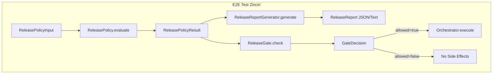

# Tasarım Dokümanı — End-to-End Release Pipeline Simulation (PR-12)

## Genel Bakış

PR-11'de ayrı ayrı test edilen üç bileşeni (ReleasePolicy, ReleaseReportGenerator, ReleaseGate) tek bir zincir olarak birleştirip uçtan uca doğrular. Orchestrator entegrasyonunu simüle eder ve deterministik "golden" audit artifact'ları üretir.

## Mimari



## Bileşenler

### 1. E2E Test Senaryoları (test_release_e2e.py)

Tek dosyada tüm zincir senaryoları:

```python
class TestE2EReleasePipeline:
    """
    Uçtan uca zincir: input → policy → report → gate → orchestrator
    Her test tam zinciri çalıştırır ve her katmanın çıktısını doğrular.
    """

    def _run_pipeline(
        self,
        inp: ReleasePolicyInput,
        override: ReleaseOverride | None = None,
        release_scope: str = "v2.4",
        now_ms: int = 1000,
    ) -> tuple[ReleasePolicyResult, ReleaseReport, GateDecision, list[EffectResult]]:
        """Tam zinciri çalıştır, her katmanın çıktısını döndür."""
        # 1. Policy
        result = policy.evaluate(inp)
        # 2. Report
        report = gen.generate(result, inp, generated_at="2026-02-15T15:00:00Z")
        # 3. Gate
        decision = gate.check(result, override, release_scope, now_ms)
        # 4. Orchestrator (sadece allowed ise)
        effects = []
        if decision.allowed:
            effects = orchestrator.execute(policy_decision, event_id)
        return result, report, decision, effects
```

### 2. Golden Audit Artifact'ları

Deterministik snapshot'lar — sabit girdi ile üretilir, test içinde doğrulanır:

| Senaryo | Verdict | Gate | Orchestrator |
|---|---|---|---|
| all_clean | RELEASE_OK | allowed | execute |
| tier_fail_flaky | RELEASE_HOLD | denied | no effects |
| ops_gate_fail | RELEASE_BLOCK | denied + breach | no effects |

Her golden artifact şunları içerir:
- `report_json`: `ReleaseReportGenerator.to_dict(report)`
- `report_text`: `ReleaseReportGenerator.format_text(report)`
- `gate_decision`: `GateDecision.audit_detail`
- `orchestrator_effects`: effect listesi (OK'da dolu, diğerlerinde boş)

### 3. Zincir Bütünlüğü Kontrolleri

Her e2e testte doğrulanan cross-layer invariant'lar:

```python
# Policy → Report uyumu
assert report.verdict == result.verdict.value
assert report.reasons == [r.value for r in result.reasons]
assert len(report.required_actions) == len(result.required_actions)

# Policy → Gate uyumu
assert decision.verdict == result.verdict

# Gate → Orchestrator uyumu
if not decision.allowed:
    assert len(effects) == 0
    assert orchestrator.applied_count == initial_count  # değişmemiş
```

## Veri Modelleri

Yeni veri modeli yok. Mevcut PR-11 modelleri kullanılır:
- `ReleasePolicyInput`, `ReleasePolicyResult` (release_policy.py)
- `ReleaseReport` (release_report.py)
- `GateDecision`, `ReleaseOverride` (release_gate.py)
- `Orchestrator`, `EffectResult` (rollout_orchestrator.py)
- `PolicyDecision` (policy_engine.py)

## Doğruluk Özellikleri (Correctness Properties)

### Property 12: E2E Zincir Determinizmi

*For any* ReleasePolicyInput, tüm zinciri (policy → report → gate) iki kez çalıştırmak her zaman aynı sonuçları üretmelidir: aynı verdict, aynı rapor JSON, aynı gate decision.

**Validates: Requirements 5.1**

### Property 13: Gate-Orchestrator Yan Etki İzolasyonu

*For any* ReleasePolicyInput where gate decision allowed=false ise, orchestrator side-effect listesi boş olmalıdır.

**Validates: Requirements 5.2, 4.1, 4.2**

### Property 14: Mutlak Blok Zincir Garantisi

*For any* ReleasePolicyInput where GUARD_VIOLATION veya OPS_GATE_FAIL varsa ve herhangi bir override sağlanmışsa, gate decision her zaman allowed=false olmalı ve override_applied=false olmalıdır.

**Validates: Requirements 5.3, 1.3, 1.4**

## Test Stratejisi

### Unit Test Dağılımı

| Kategori | Test Sayısı | Açıklama |
|---|---|---|
| E2E senaryo testleri | ≥8 | OK/HOLD/BLOCK/override akışları |
| Golden artifact testleri | ≥3 | Deterministik snapshot doğrulama |
| Zincir bütünlüğü | ≥3 | Cross-layer invariant kontrolleri |
| **Toplam unit** | **≥14** | |

### PBT Dağılımı

| Property | Test Sayısı | Açıklama |
|---|---|---|
| P12: E2E determinizm | 1 | Tam zincir deterministik |
| P13: Yan etki izolasyonu | 1 | denied → no effects |
| P14: Mutlak blok zincir | 1 | Absolute block + override → rejected |
| **Toplam PBT** | **3** | 200 iterasyon/test |

### DoD

- ≥14 unit test + 3 PBT
- 0 flaky
- Golden artifact'lar deterministik (byte-level)
- Tüm cross-layer invariant'lar testle kilitli

## Hata Yönetimi

Yeni hata durumu yok. PR-11'deki hata tablosu geçerli. E2E testler mevcut hata davranışlarını zincir bağlamında doğrular.
