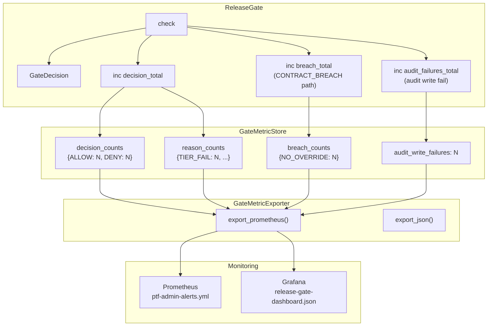

# Tasarım Dokümanı — Release Gate Telemetry

## Genel Bakış

Bu tasarım, mevcut ReleaseGate enforcement hook'una (`release_gate.py`) gözlemlenebilirlik katmanı ekler. Üç monoton sayaç (decision, breach, audit failure), Prometheus alert kuralları ve Grafana dashboard panelleri tanımlar.

Tasarım, `preflight_metrics.py`'deki MetricStore/Counter desenini birebir takip eder:
- Saf Python, harici bağımlılık yok
- Thread-safe counter'lar, sabit label kümeleri
- JSON persistence, atomik yazım
- Prometheus text exposition formatı

ReleaseGate.check() metoduna minimal değişiklik yapılır: yalnızca sayaç artırma çağrıları eklenir. Gate karar mantığı değişmez.

## Mimari



## Bileşenler ve Arayüzler

### 1. GateMetricStore (`backend/app/testing/gate_metrics.py`)

MetricStore desenini takip eden, ReleaseGate'e özel metrik deposu.

```python
# Sabit label kümeleri (bounded cardinality)
_DECISION_LABELS: list[str] = ["ALLOW", "DENY"]
_REASON_LABELS: list[str] = [m.value for m in BlockReasonCode]
_BREACH_KINDS: list[str] = ["NO_OVERRIDE"]

class GateMetricStore:
    """
    Thread-safe in-memory metrik deposu — ReleaseGate telemetrisi.
    
    Counter'lar monoton artar.
    Label cardinality bounded: decision ∈ {ALLOW, DENY},
    reason ∈ BlockReasonCode, kind ∈ {NO_OVERRIDE}.
    """

    def __init__(self) -> None:
        self._lock = threading.Lock()
        # Decision counters — decision × reason matris
        self._decision_counts: dict[str, int] = {d: 0 for d in _DECISION_LABELS}
        self._reason_counts: dict[str, int] = {r: 0 for r in _REASON_LABELS}
        # Breach counter
        self._breach_counts: dict[str, int] = {k: 0 for k in _BREACH_KINDS}
        # Audit write failure counter
        self._audit_write_failures: int = 0
        # Internal metric write failure counter (fail-open observability)
        self._metric_write_failures: int = 0
        # Store metadata
        self._store_generation: int = 0
        self._store_start_timestamp: float = time.time()

    def record_decision(self, allowed: bool, reasons: list[str]) -> None:
        """
        Karar sayacını artır. Her check() çağrısında bir kez çağrılır.
        
        allowed=True → decision="ALLOW", reasons boş olabilir
        allowed=False → decision="DENY", her reason ayrı sayılır
        """
        with self._lock:
            decision = "ALLOW" if allowed else "DENY"
            self._decision_counts[decision] += 1
            for reason in reasons:
                if reason in self._reason_counts:
                    self._reason_counts[reason] += 1

    def record_breach(self) -> None:
        """Sözleşme ihlali sayacını artır. CONTRACT_BREACH_NO_OVERRIDE path'inde çağrılır."""
        with self._lock:
            self._breach_counts["NO_OVERRIDE"] += 1

    def record_audit_write_failure(self) -> None:
        """Audit yazım hatası sayacını artır."""
        with self._lock:
            self._audit_write_failures += 1

    def record_metric_write_failure(self) -> None:
        """Dahili metrik yazım hatası sayacını artır (fail-open gözlemlenebilirlik)."""
        with self._lock:
            self._metric_write_failures += 1

    # --- Okuma ---
    def decision_counts(self) -> dict[str, int]: ...
    def reason_counts(self) -> dict[str, int]: ...
    def breach_counts(self) -> dict[str, int]: ...
    def audit_write_failures(self) -> int: ...
    def metric_write_failures(self) -> int: ...

    # --- JSON persistence ---
    def to_dict(self) -> dict[str, Any]: ...

    @classmethod
    def from_dict(cls, data: dict[str, Any]) -> "GateMetricStore": ...

    def save_to_dir(self, path: str | Path) -> bool:
        """Atomik yazım. Başarısızlıkta metric_write_failures artırılır."""

    def load_from_dir(self, path: str | Path) -> bool:
        """Fail-open: bozuk dosya → yeni store."""
```

### 2. GateMetricExporter (`backend/app/testing/gate_metrics.py`)

```python
class GateMetricExporter:
    """Prometheus text exposition ve JSON export."""

    @staticmethod
    def export_prometheus(store: GateMetricStore) -> str:
        """
        Deterministik Prometheus text exposition çıktısı.
        
        Metrikler:
        - release_gate_decision_total{decision="ALLOW|DENY"} counter
        - release_gate_reason_total{reason="<BlockReasonCode>"} counter
        - release_gate_contract_breach_total{kind="NO_OVERRIDE"} counter
        - release_gate_audit_write_failures_total counter
        - release_gate_metric_write_failures_total counter
        """

    @staticmethod
    def export_json(store: GateMetricStore) -> str:
        """JSON formatında export. Deterministik (sort_keys=True)."""
```

### 3. ReleaseGate Entegrasyonu (`backend/app/testing/release_gate.py`)

Mevcut check() metoduna minimal ekleme:

```python
class ReleaseGate:
    def __init__(
        self,
        audit_log: AuditLog | None = None,
        metric_store: GateMetricStore | None = None,  # YENİ
    ):
        self._audit = audit_log or AuditLog()
        self._metrics = metric_store  # None ise metrik toplanmaz

    def check(self, ...) -> GateDecision:
        # ... mevcut karar mantığı DEĞİŞMEZ ...
        
        # Karar üretildikten sonra, return'den önce:
        self._emit_metrics(decision)
        return decision

    def _emit_metrics(self, decision: GateDecision) -> None:
        """Fail-open metrik emisyonu. Hata gate kararını etkilemez."""
        if self._metrics is None:
            return
        try:
            reason_values = [r.value for r in decision.reasons]
            self._metrics.record_decision(decision.allowed, reason_values)
        except Exception:
            pass  # fail-open

    def _emit_breach(self) -> None:
        """CONTRACT_BREACH_NO_OVERRIDE path'inde çağrılır."""
        if self._metrics is None:
            return
        try:
            self._metrics.record_breach()
        except Exception:
            pass

    def _emit_audit_failure(self) -> None:
        """Audit yazım hatası durumunda çağrılır."""
        if self._metrics is None:
            return
        try:
            self._metrics.record_audit_write_failure()
        except Exception:
            pass
```

Entegrasyon noktaları (check() içinde):
1. Her karar sonrası → `_emit_metrics(decision)`
2. CONTRACT_BREACH_NO_OVERRIDE dalı → `_emit_breach()`
3. `_record_audit()` başarısız olursa → `_emit_audit_failure()`

### 4. Prometheus Alert Kuralları (`monitoring/prometheus/ptf-admin-alerts.yml`)

Yeni alert grubu: `ptf-admin-release-gate`

```yaml
- name: ptf-admin-release-gate
  rules:
    # RG1: Sözleşme ihlali — kritik
    - alert: ReleaseGateContractBreach
      expr: increase(release_gate_contract_breach_total[5m]) > 0
      for: 0m
      labels:
        severity: critical
        team: platform
        service: release-gate
      annotations:
        summary: "CONTRACT BREACH — ABSOLUTE_BLOCK_REASONS override girişimi"
        description: "release_gate_contract_breach_total son 5 dakikada artış gösterdi."
        runbook_url: "...#ReleaseGateContractBreach"

    # RG2: Audit yazım hatası — warning
    - alert: ReleaseGateAuditWriteFailure
      expr: increase(release_gate_audit_write_failures_total[15m]) > 0
      for: 0m
      labels:
        severity: warning
        team: platform
        service: release-gate
      annotations:
        summary: "Audit write failure — R3 fail-closed invariantı tetiklendi"
        description: "release_gate_audit_write_failures_total son 15 dakikada artış gösterdi."
        runbook_url: "...#ReleaseGateAuditWriteFailure"

    # RG3: DENY spike — warning
    - alert: ReleaseGateDenySpike
      expr: increase(release_gate_decision_total{decision="DENY"}[15m]) > 10
      for: 5m
      labels:
        severity: warning
        team: platform
        service: release-gate
      annotations:
        summary: "Release gate DENY spike — son 15 dakikada eşik aşıldı"
        description: "release_gate_decision_total{decision=\"DENY\"} son 15 dakikada artış gösterdi."
        runbook_url: "...#ReleaseGateDenySpike"
```

### 5. Grafana Dashboard (`monitoring/grafana/release-gate-dashboard.json`)

Mevcut preflight-dashboard.json yapısını takip eden 4 panel:

| Panel ID | Başlık | Tip | PromQL |
|---|---|---|---|
| 1 | Allow vs Deny Rate | timeseries | `release_gate_decision_total{decision="ALLOW"}`, `release_gate_decision_total{decision="DENY"}` |
| 2 | Top Deny Reasons | barchart | `topk(10, release_gate_reason_total)` |
| 3 | Audit Write Failures | stat | `release_gate_audit_write_failures_total` |
| 4 | Contract Breaches | stat | `release_gate_contract_breach_total` |

## Veri Modelleri

### GateMetricStore İç Yapısı

```
GateMetricStore
├── _decision_counts: dict[str, int]     # {"ALLOW": 0, "DENY": 0}
├── _reason_counts: dict[str, int]       # {r.value: 0 for r in BlockReasonCode}
├── _breach_counts: dict[str, int]       # {"NO_OVERRIDE": 0}
├── _audit_write_failures: int           # 0
├── _metric_write_failures: int          # 0
├── _store_generation: int               # 0
└── _store_start_timestamp: float        # time.time()
```

### JSON Persistence Formatı

```json
{
  "decision_counts": {"ALLOW": 42, "DENY": 7},
  "reason_counts": {"TIER_FAIL": 3, "FLAKY_TESTS": 2, ...},
  "breach_counts": {"NO_OVERRIDE": 1},
  "audit_write_failures": 0,
  "metric_write_failures": 0,
  "store_generation": 5,
  "store_start_timestamp": 1700000000.0
}
```

### Prometheus Text Exposition Formatı

```
# HELP release_gate_decision_total Gate decision counter
# TYPE release_gate_decision_total counter
release_gate_decision_total{decision="ALLOW"} 42
release_gate_decision_total{decision="DENY"} 7

# HELP release_gate_reason_total Gate deny reason counter
# TYPE release_gate_reason_total counter
release_gate_reason_total{reason="TIER_FAIL"} 3
release_gate_reason_total{reason="FLAKY_TESTS"} 2
...

# HELP release_gate_contract_breach_total Contract breach counter
# TYPE release_gate_contract_breach_total counter
release_gate_contract_breach_total{kind="NO_OVERRIDE"} 1

# HELP release_gate_audit_write_failures_total Audit write failure counter
# TYPE release_gate_audit_write_failures_total counter
release_gate_audit_write_failures_total 0
```


## Doğruluk Özellikleri (Correctness Properties)

*Bir özellik (property), bir sistemin tüm geçerli yürütmelerinde doğru olması gereken bir davranış veya karakteristiktir — esasen, sistemin ne yapması gerektiğine dair biçimsel bir ifadedir. Özellikler, insan tarafından okunabilir spesifikasyonlar ile makine tarafından doğrulanabilir doğruluk garantileri arasında köprü görevi görür.*

### Property 1: Karar sayacı doğru artırılır

*For any* ReleasePolicyResult ve ReleaseGate.check() çağrısı, GateMetricStore'daki decision_counts toplamı (ALLOW + DENY) tam olarak çağrı sayısı kadar artmalıdır. allowed=True ise ALLOW, allowed=False ise DENY sayacı artmalıdır. DENY durumunda her reason için ilgili reason_counts sayacı da artmalıdır.

**Validates: Requirements 1.1, 1.4, 1.5, 6.2**

### Property 2: Sözleşme ihlali sayacı yalnızca CONTRACT_BREACH path'inde artar

*For any* ReleaseGate.check() çağrısı, breach_counts["NO_OVERRIDE"] yalnızca ve yalnızca ABSOLUTE_BLOCK_REASONS içeren bir RELEASE_BLOCK kararına override denendiğinde artmalıdır. Diğer tüm durumlarda breach sayacı değişmemelidir.

**Validates: Requirements 2.1, 2.3, 6.3**

### Property 3: Audit yazım hatası sayacı doğru artırılır

*For any* ReleaseGate.check() çağrısı, audit yazımı başarısız olduğunda audit_write_failures tam olarak 1 artmalıdır; audit yazımı başarılı olduğunda audit_write_failures değişmemelidir.

**Validates: Requirements 3.1, 3.2, 6.4**

### Property 4: Etiket kardinalitesi sınırlıdır (bounded label invariant)

*For any* GateMetricStore üzerinde yapılan herhangi bir işlem dizisi sonrasında, decision_counts anahtarları tam olarak {"ALLOW", "DENY"} kümesi, reason_counts anahtarları tam olarak BlockReasonCode enum üyeleri kümesi ve breach_counts anahtarları tam olarak {"NO_OVERRIDE"} kümesi olmalıdır. Hiçbir yeni anahtar eklenmemeli, hiçbir mevcut anahtar silinmemelidir.

**Validates: Requirements 1.2, 1.3, 2.2, 9.1, 9.2, 9.3**

### Property 5: Metrik emisyonu fail-open — gate kararı değişmez

*For any* ReleasePolicyResult, metrik store'u hata fırlatan bir implementasyonla değiştirildiğinde bile, ReleaseGate.check() aynı GateDecision'ı döndürmelidir (allowed, verdict, reasons, override_applied, audit_detail alanları birebir aynı). Metrik hatası gate kararını etkilememelidir.

**Validates: Requirements 4.1, 4.2, 6.5**

### Property 6: JSON persistence round-trip

*For any* geçerli GateMetricStore durumu, `from_dict(store.to_dict())` orijinal store ile eşdeğer sayaç değerleri üretmelidir (decision_counts, reason_counts, breach_counts, audit_write_failures).

**Validates: Requirements 5.3**

### Property 7: Prometheus export determinizmi

*For any* GateMetricStore durumu, `export_prometheus(store)` iki kez çağrıldığında byte-level aynı çıktıyı üretmelidir. Ayrıca çıktı, tüm tanımlı metrik isimlerini (release_gate_decision_total, release_gate_reason_total, release_gate_contract_breach_total, release_gate_audit_write_failures_total) içermelidir.

**Validates: Requirements 5.4**

## Hata Yönetimi

| Hata Durumu | Davranış | Gerekçe |
|---|---|---|
| Metrik sayacı artırma hatası | Fail-open: hata yutulur, gate kararı değişmez | Telemetri arızası release sürecini engellemez |
| JSON persistence yazım hatası | Fail-open: metric_write_failures artırılır, store_generation geri alınır | Disk hatası metrik kaybına yol açar ama gate çalışmaya devam eder |
| JSON persistence okuma hatası | Fail-open: yeni boş store başlatılır | Bozuk dosya counter reset'e neden olur, alert ile tespit edilir |
| Geçersiz reason değeri (enum dışı) | Sessizce atlanır, reason_counts'a eklenmez | Bounded cardinality korunur |
| Audit yazım hatası | audit_write_failures artırılır + gate kararı fail-closed (allowed=False, R3 invariantı) | Denetlenebilirlik garantisi: "kanıt yoksa izin yok" |

### Fail-Open vs Fail-Closed Ayrımı

- **Metrik yazımı**: Fail-open. Metrik kaybı kabul edilebilir; gate kararı etkilenmez.
- **Audit yazımı**: Fail-closed (R3 invariantı). Audit kaydı olmadan allowed=True dönemez. Bu mevcut davranıştır ve değişmez.

## Test Stratejisi

### Property-Based Testing (Hypothesis)

- Kütüphane: `hypothesis` (Python)
- Her property testi en az 100 iterasyon çalıştırılır
- Her test, tasarım dokümanındaki property numarasını referans alır
- Tag formatı: `# Feature: release-gate-telemetry, Property N: <property_text>`
- Her correctness property tek bir hypothesis testi ile implemente edilir

### Strateji Dağılımı

| Bileşen | Property Testleri | Unit Testleri |
|---|---|---|
| GateMetricStore | P1, P4, P6, P7 (4 PBT) | Counter artırma, sıfır başlangıç, thread-safe okuma |
| ReleaseGate entegrasyonu | P2, P3, P5 (3 PBT) | Breach path, audit failure path, None metric_store |
| Alert kuralları | — | YAML yapı doğrulama, expr/severity kontrolleri |
| Dashboard | — | JSON yapı doğrulama, panel varlık kontrolleri |

### Unit Test Odağı

- GateMetricStore sıfır başlangıç değerleri
- record_decision ile ALLOW/DENY doğru artırma
- record_breach ile NO_OVERRIDE doğru artırma
- Geçersiz reason değerlerinin sessizce atlanması
- save_to_dir / load_from_dir başarılı ve başarısız senaryolar
- Alert YAML'ında gerekli alanların varlığı (expr, severity, annotations)
- Dashboard JSON'ında gerekli panellerin varlığı (timeseries, barchart, stat)

### Property Test Odağı

- Evrensel özellikler: bounded cardinality, round-trip, determinizm
- Rastgele GateDecision kombinasyonları üzerinde sayaç doğruluğu
- Fail-open davranışı: hata fırlatan store ile gate kararı karşılaştırma
