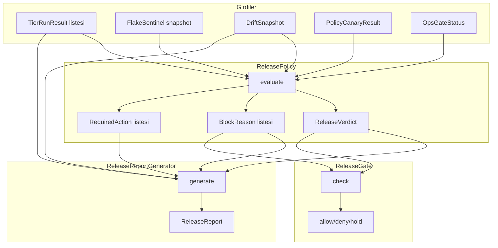

# Tasarım Dokümanı — Release Governance + Change Management (Ops Policy Layer)

## Genel Bakış

Bu tasarım, PR-10'da kurulan test disiplini çıktılarını release kararlarına bağlayan üç bileşeni tanımlar:

1. **ReleasePolicy** — Tüm sinyalleri (tier sonuçları, flake sentinel, drift monitor, policy canary, ops gate) birleştirip deterministik bir RELEASE_OK / RELEASE_HOLD / RELEASE_BLOCK kararı üreten saf fonksiyon.
2. **ReleaseReportGenerator** — Karar gerekçesi ve sistem durumunu deterministik bir denetim raporu olarak üreten bileşen.
3. **ReleaseGate** — Orchestrator seviyesinde ReleasePolicy kararını uygulayan enforcement hook.

Tüm bileşenler saf-matematik, IO'suz ve deterministiktir. Mevcut `policy_engine.py`, `perf_budget.py`, `rollout_orchestrator.py` modüllerini tüketir.

## Mimari



## Bileşenler ve Arayüzler

### 1. Veri Modelleri (release_policy.py)

```python
class ReleaseVerdict(str, Enum):
    RELEASE_OK = "release_ok"
    RELEASE_HOLD = "release_hold"
    RELEASE_BLOCK = "release_block"

class BlockReasonCode(str, Enum):
    TIER_FAIL = "TIER_FAIL"
    FLAKY_TESTS = "FLAKY_TESTS"
    DRIFT_ALERT = "DRIFT_ALERT"
    CANARY_BREAKING = "CANARY_BREAKING"
    GUARD_VIOLATION = "GUARD_VIOLATION"
    OPS_GATE_FAIL = "OPS_GATE_FAIL"
    NO_TIER_DATA = "NO_TIER_DATA"
    NO_FLAKE_DATA = "NO_FLAKE_DATA"
    NO_DRIFT_DATA = "NO_DRIFT_DATA"
    NO_CANARY_DATA = "NO_CANARY_DATA"

# Mutlak blok nedenleri — override ile geçilemez
ABSOLUTE_BLOCK_REASONS: frozenset[BlockReasonCode] = frozenset({
    BlockReasonCode.GUARD_VIOLATION,
    BlockReasonCode.OPS_GATE_FAIL,
})

@dataclass(frozen=True)
class RequiredAction:
    code: BlockReasonCode
    description: str

@dataclass(frozen=True)
class ReleasePolicyInput:
    tier_results: list[TierRunResult]       # perf_budget.TierRunResult
    flake_snapshot: list[str] | None        # FlakeSentinel.detect_flaky() sonucu veya None
    drift_snapshot: DriftSnapshot | None    # rollout_orchestrator.DriftSnapshot veya None
    canary_result: PolicyCanaryResult | None  # rollout_orchestrator.PolicyCanaryResult veya None
    ops_gate: OpsGateStatus                 # policy_engine.OpsGateStatus

@dataclass(frozen=True)
class ReleasePolicyResult:
    verdict: ReleaseVerdict
    reasons: list[BlockReasonCode]
    required_actions: list[RequiredAction]
    details: dict[str, Any]
```

### 2. ReleasePolicy (release_policy.py)

Saf fonksiyon. IO yok, yan etki yok.

```python
class ReleasePolicy:
    def evaluate(self, inp: ReleasePolicyInput) -> ReleasePolicyResult:
        """
        Karar mantığı sırası:
        1. Girdi doğrulama (eksik veri → BLOCK veya HOLD)
        2. Mutlak blok kontrolleri (GUARD_VIOLATION, OPS_GATE_FAIL → BLOCK)
        3. Tier sonuçları kontrolü (fail → HOLD)
        4. Flake kontrolü (flaky testler → HOLD/BLOCK)
        5. Drift kontrolü (alert → HOLD)
        6. Canary kontrolü (BREAKING → HOLD)
        7. Tüm sinyaller temiz → OK
        
        Monotonik kural: BLOCK > HOLD > OK. 
        Bir sinyal BLOCK gerektiriyorsa nihai karar asla düşmez.
        Tüm neden kodları birleştirilir.
        """
```

Karar algoritması:

```
worst_verdict = RELEASE_OK
all_reasons = []
all_actions = []

# 1. Girdi doğrulama
if tier_results boş → BLOCK + NO_TIER_DATA
if flake_snapshot None → BLOCK + NO_FLAKE_DATA
if drift_snapshot None → HOLD + NO_DRIFT_DATA
if canary_result None → HOLD + NO_CANARY_DATA

# 2. Mutlak bloklar (sözleşme ihlalleri)
if ops_gate.passed == false → BLOCK + OPS_GATE_FAIL
if canary_result.guard_violations > 0 → BLOCK + GUARD_VIOLATION

# 3. Tier sonuçları
for tier in tier_results:
    if not tier.passed → HOLD + TIER_FAIL

# 4. Flake kontrolü
if len(flake_snapshot) > 0 → HOLD + FLAKY_TESTS

# 5. Drift kontrolü
if drift_snapshot.alert → HOLD + DRIFT_ALERT

# 6. Canary kontrolü
if canary_result.recommendation == "abort" and breaking > 0 → HOLD + CANARY_BREAKING

# Monotonik birleştirme
verdict = max(worst_verdict)  # BLOCK > HOLD > OK
return ReleasePolicyResult(verdict, all_reasons, all_actions, details)
```

### 3. ReleaseReportGenerator (release_report.py)

```python
@dataclass(frozen=True)
class ReleaseReport:
    verdict: ReleaseVerdict
    reasons: list[BlockReasonCode]
    required_actions: list[RequiredAction]
    tier_summaries: list[TierSummary]
    flaky_tests: list[str]
    drift_summary: DriftSummary | None
    override_summary: OverrideSummary | None
    guard_summary: GuardSummary | None
    generated_at: str  # ISO 8601 timestamp (dışarıdan verilen, deterministik)

@dataclass(frozen=True)
class TierSummary:
    tier: str
    total_seconds: float
    budget_seconds: float
    usage_percent: float
    passed: bool
    slowest_tests: list[str]  # en fazla 10

@dataclass(frozen=True)
class DriftSummary:
    abort_rate: float
    override_rate: float
    alert: bool
    alert_reason: str

@dataclass(frozen=True)
class OverrideSummary:
    total_overrides: int
    active_overrides: int
    expired_overrides: int

@dataclass(frozen=True)
class GuardSummary:
    active_guards: list[str]
    violated_guards: list[str]

class ReleaseReportGenerator:
    def generate(
        self,
        policy_result: ReleasePolicyResult,
        policy_input: ReleasePolicyInput,
        override_summary: OverrideSummary | None = None,
        guard_summary: GuardSummary | None = None,
        generated_at: str = "",
    ) -> ReleaseReport:
        """Deterministik rapor üretir. Aynı girdi → aynı çıktı."""

    def format_text(self, report: ReleaseReport) -> str:
        """İnsan okunabilir düz metin formatı."""

    def to_dict(self, report: ReleaseReport) -> dict:
        """JSON serileştirilebilir dict."""

    @staticmethod
    def from_dict(data: dict) -> ReleaseReport:
        """Dict'ten ReleaseReport oluşturur (round-trip desteği)."""
```

### 4. ReleaseGate (release_gate.py)

```python
@dataclass(frozen=True)
class GateDecision:
    allowed: bool
    verdict: ReleaseVerdict
    reasons: list[BlockReasonCode]
    override_applied: bool
    audit_detail: str

@dataclass(frozen=True)
class ReleaseOverride:
    ttl_seconds: int
    created_at_ms: int
    scope: str          # release identifier
    reason: str
    created_by: str

    @property
    def expires_at_ms(self) -> int:
        return self.created_at_ms + (self.ttl_seconds * 1000)

    def is_expired(self, now_ms: int) -> bool:
        return now_ms >= self.expires_at_ms

class ReleaseGate:
    def __init__(self, audit_log: AuditLog | None = None):
        self._audit = audit_log

    def check(
        self,
        policy_result: ReleasePolicyResult,
        override: ReleaseOverride | None = None,
        now_ms: int = 0,
    ) -> GateDecision:
        """
        1. RELEASE_OK → izin ver
        2. RELEASE_BLOCK → engelle (override kontrol etme, 
           ABSOLUTE_BLOCK_REASONS varsa override reddet)
        3. RELEASE_HOLD → override varsa doğrula (TTL, scope), 
           geçerliyse izin ver
        """

    def _is_absolute_block(self, reasons: list[BlockReasonCode]) -> bool:
        """GUARD_VIOLATION veya OPS_GATE_FAIL varsa True."""
        return bool(set(reasons) & ABSOLUTE_BLOCK_REASONS)
```

## Veri Modelleri

### Girdi-Çıktı Akışı

```
ReleasePolicyInput
├── tier_results: list[TierRunResult]     # perf_budget.py'den
├── flake_snapshot: list[str] | None      # FlakeSentinel.detect_flaky()
├── drift_snapshot: DriftSnapshot | None  # DriftMonitor.snapshot()
├── canary_result: PolicyCanaryResult | None  # PolicyCanary.compare()
└── ops_gate: OpsGateStatus              # policy_engine.py'den

ReleasePolicyResult
├── verdict: ReleaseVerdict              # OK / HOLD / BLOCK
├── reasons: list[BlockReasonCode]       # deterministik neden kodları
├── required_actions: list[RequiredAction]
└── details: dict[str, Any]             # ek bilgi

ReleaseReport
├── verdict + reasons + required_actions
├── tier_summaries: list[TierSummary]
├── flaky_tests: list[str]
├── drift_summary: DriftSummary | None
├── override_summary: OverrideSummary | None
├── guard_summary: GuardSummary | None
└── generated_at: str

GateDecision
├── allowed: bool
├── verdict: ReleaseVerdict
├── reasons: list[BlockReasonCode]
├── override_applied: bool
└── audit_detail: str
```

### Mevcut Modüllerle Entegrasyon

| Mevcut Modül | Kullanılan Yapı | PR-11'de Kullanım |
|---|---|---|
| `perf_budget.py` | `TierRunResult`, `TestTier` | Tier sonuçları girdi |
| `perf_budget.py` | `FlakeSentinel` | Flake snapshot girdi |
| `rollout_orchestrator.py` | `DriftSnapshot`, `DriftMonitor` | Drift snapshot girdi |
| `rollout_orchestrator.py` | `PolicyCanaryResult`, `DriftKind` | Canary sınıflandırma girdi |
| `policy_engine.py` | `OpsGateStatus`, `AuditLog` | Ops gate + audit |
| `policy_engine.py` | `PolicyAction` | Karar karşılaştırma |


## Doğruluk Özellikleri (Correctness Properties)

*Bir özellik (property), bir sistemin tüm geçerli yürütmelerinde doğru olması gereken bir davranış veya karakteristiktir — esasen, sistemin ne yapması gerektiğine dair biçimsel bir ifadedir. Özellikler, insan tarafından okunabilir spesifikasyonlar ile makine tarafından doğrulanabilir doğruluk garantileri arasında köprü görevi görür.*

### Property 1: Tüm temiz sinyaller → RELEASE_OK

*For any* ReleasePolicyInput where tüm tier sonuçları pass, flake listesi boş, drift alert yok, canary SAFE ve ops gate geçti ise, ReleasePolicy RELEASE_OK kararı üretmelidir.

**Validates: Requirements 1.1**

### Property 2: Determinizm — aynı girdi → aynı çıktı

*For any* ReleasePolicyInput, aynı girdiyi iki kez evaluate etmek her zaman aynı ReleasePolicyResult üretmelidir (verdict, reasons, required_actions).

**Validates: Requirements 1.8**

### Property 3: HOLD/BLOCK → en az bir RequiredAction

*For any* ReleasePolicyInput that üretilen verdict RELEASE_HOLD veya RELEASE_BLOCK ise, required_actions listesi en az bir eleman içermelidir.

**Validates: Requirements 1.9**

### Property 4: Monotonik blok kuralı

*For any* ReleasePolicyInput ve herhangi bir sinyal bozulması (tier fail ekleme, flaky test ekleme, drift alert açma, canary breaking yapma), bozulmuş girdinin verdict'i orijinal verdict'ten asla daha düşük (daha az kısıtlayıcı) olmamalıdır. Sıralama: BLOCK > HOLD > OK.

**Validates: Requirements 1.10, 5.1, 5.2**

### Property 5: Mutlak blok — sözleşme ihlalleri override edilemez

*For any* ReleasePolicyInput where PolicyCanaryResult GUARD_VIOLATION içeriyor veya OpsGateStatus passed=false ise, verdict her zaman RELEASE_BLOCK olmalıdır. Ayrıca, bu BLOCK kararı ReleaseGate'te ManualOverride ile geçersiz kılınamamalıdır; override girişimi "CONTRACT_BREACH_NO_OVERRIDE" neden koduyla reddedilmelidir.

**Validates: Requirements 1.6, 1.7, 6.1, 6.2, 6.3**

### Property 6: Rapor bütünlüğü

*For any* geçerli ReleasePolicyResult ve ReleasePolicyInput, üretilen ReleaseReport şunları içermelidir: (a) her tier için en fazla 10 yavaş test, (b) her tier için doğru bütçe kullanım yüzdesi, (c) drift özeti (abort oranı, override oranı, alert durumu), (d) override özeti, (e) guard özeti, (f) verdict, tüm reason kodları ve required_actions.

**Validates: Requirements 3.1, 3.2, 3.3, 3.4, 3.5, 3.6**

### Property 7: Rapor determinizmi

*For any* aynı girdi seti (policy_result, policy_input, override_summary, guard_summary, generated_at), ReleaseReportGenerator iki kez çağrıldığında eşdeğer ReleaseReport üretmelidir.

**Validates: Requirements 3.7**

### Property 8: ReleaseReport round-trip (serileştirme)

*For any* geçerli ReleaseReport nesnesi, `from_dict(to_dict(report))` orijinal nesneye eşdeğer bir nesne üretmelidir.

**Validates: Requirements 3.10**

### Property 9: Gate verdict uyumu

*For any* ReleasePolicyResult, ReleaseGate şu şekilde davranmalıdır: RELEASE_OK → allowed=True, RELEASE_BLOCK → allowed=False, RELEASE_HOLD (override yok) → allowed=False.

**Validates: Requirements 4.1, 4.2, 4.3**

### Property 10: Override doğrulama

*For any* RELEASE_HOLD kararı ve ReleaseOverride, ReleaseGate şu şekilde davranmalıdır: TTL geçerli ve scope eşleşiyor → allowed=True; TTL dolmuş → allowed=False + OVERRIDE_EXPIRED; scope eşleşmiyor → allowed=False.

**Validates: Requirements 4.4, 4.5, 4.6**

### Property 11: Audit kaydı

*For any* ReleaseGate.check çağrısı, audit log'a en az bir kayıt eklenmelidir.

**Validates: Requirements 4.7**

## Hata Yönetimi

| Hata Durumu | Davranış | Neden Kodu |
|---|---|---|
| Tier sonuçları boş | RELEASE_BLOCK | NO_TIER_DATA |
| FlakeSentinel snapshot None | RELEASE_BLOCK | NO_FLAKE_DATA |
| DriftSnapshot None | RELEASE_HOLD | NO_DRIFT_DATA |
| PolicyCanaryResult None | RELEASE_HOLD | NO_CANARY_DATA |
| Override TTL dolmuş | Override reddedilir | OVERRIDE_EXPIRED |
| Override scope eşleşmiyor | Override reddedilir | SCOPE_MISMATCH |
| Mutlak blok + override girişimi | Override reddedilir | CONTRACT_BREACH_NO_OVERRIDE |

Tüm hata durumları deterministik neden kodları üretir. Hiçbir hata sessizce yutulmaz; her biri BlockReason veya audit kaydı olarak raporlanır.

## Test Stratejisi

### Property-Based Testing (Hypothesis)

- Kütüphane: `hypothesis` (Python)
- Her property testi en az 100 iterasyon çalıştırılır
- Her test, tasarım dokümanındaki property numarasını referans alır
- Tag formatı: `# Feature: release-governance, Property N: <property_text>`
- Her correctness property tek bir hypothesis testi ile implemente edilir

### Strateji Dağılımı

| Bileşen | Property Testleri | Unit Testleri |
|---|---|---|
| ReleasePolicy | P1-P5 (5 PBT) | ≥15 unit test (edge case'ler, girdi doğrulama, bireysel sinyal kontrolleri) |
| ReleaseReportGenerator | P6-P8 (3 PBT) | ≥10 unit test (format kontrolleri, alan doğrulama) |
| ReleaseGate | P9-P11 (3 PBT) | ≥3 unit test (entegrasyon, orchestrator bağlantısı) |

### Unit Test Odağı

- Gereksinim 2'deki tüm edge case'ler (boş tier, None snapshot'lar)
- Bireysel sinyal kontrolleri (tek tier fail, tek flaky test)
- Metin formatı yapısal kontrolleri
- Override sınır koşulları (TTL tam sınırda, scope tam eşleşme)

### Property Test Odağı

- Evrensel özellikler (determinizm, monotoniklik, round-trip)
- Rastgele girdi kombinasyonları üzerinde doğruluk
- Hypothesis stratejileri ile zengin girdi üretimi

### DoD Uyumu

- ReleasePolicy: ≥25 unit test + 5 PBT
- ReleaseReportGenerator: ≥10 unit test + 3 PBT
- ReleaseGate (entegrasyon): ≥3 unit test + 3 PBT
- 0 flaky test, tier bütçeleri korunur
