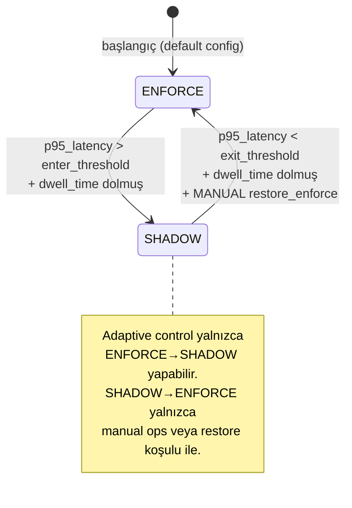
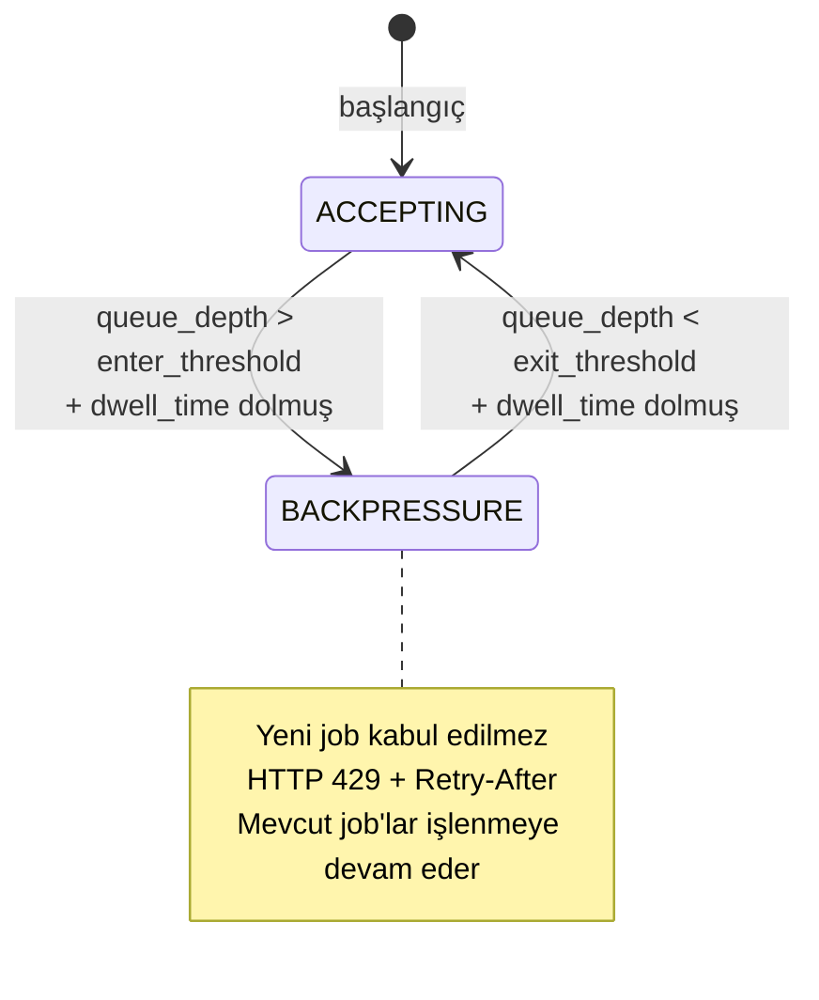

# Tasarım Dokümanı — SLO-Aware Adaptive Control

## Genel Bakış

SLO-Aware Adaptive Control, mevcut runtime guard ve PDF worker subsystem'lerini birleştiren bir feedback-loop kontrol düzlemi oluşturur. Sistem, gerçek zamanlı SLO metriklerinden (p95 latency, queue depth, error budget) yararlanarak iki ana koruyucu aksiyon alır:

1. **Guard Mode Downgrade**: p95 API latency SLO threshold'unu aştığında ENFORCE→SHADOW geçişi
2. **PDF Backpressure**: Queue depth threshold'u aştığında yeni job kabulünü durdurma (HTTP 429 + Retry-After)

Kontrol döngüsü deterministik bir öncelik sırası izler: KillSwitch > Manual Override > Adaptive Control > Default Config. Tüm kararlar monotonic-safe'dir (yalnızca downgrade, asla otomatik upgrade). Oscillation, hysteresis band (ayrı enter/exit threshold) ve minimum dwell time ile önlenir.

### Mevcut Bileşenlerle Entegrasyon

```
┌─────────────────────────────────────────────────────────────────┐
│                    Adaptive Control Plane                        │
│                                                                 │
│  ┌──────────────┐   ┌──────────────┐   ┌───────────────────┐   │
│  │Metrics_       │──▶│SLO_Evaluator │──▶│Adaptive_          │   │
│  │Collector      │   │(mevcut)      │   │Controller         │   │
│  └──────┬───────┘   └──────────────┘   └────────┬──────────┘   │
│         │                                        │              │
│         │  telemetry                    Control_Signal           │
│         │                                        │              │
│  ┌──────▼───────┐                      ┌────────▼──────────┐   │
│  │Guard_Decision │◀─────────────────────│Decision_Engine    │   │
│  │(mevcut)       │   switch_to_shadow   │(priority ladder)  │   │
│  └──────────────┘                      └────────┬──────────┘   │
│                                                  │              │
│  ┌──────────────┐                      ┌────────▼──────────┐   │
│  │PDF_Job_Store  │◀─────────────────────│Backpressure_      │   │
│  │(mevcut)       │   stop_accepting     │Controller         │   │
│  └──────────────┘                      └───────────────────┘   │
│                                                                 │
│  ┌──────────────┐                                               │
│  │KillSwitch     │──▶ Priority Level 1 (hard override)          │
│  │Manager(mevcut)│                                              │
│  └──────────────┘                                               │
└─────────────────────────────────────────────────────────────────┘
```

### v1 Kısıtları (Bağlayıcı)

- Monotonic-safe: yalnızca downgrade, asla otomatik enforcement artırma
- Guard: yalnızca ENFORCE→SHADOW (OFF modu kapsam dışı)
- PDF Backpressure: HTTP 429 + Retry-After, HOLD semantiği (hard block)
- Canonical SLO sinyalleri: `p95 API latency over 5m sliding window`, `p95 PDF render duration over 5m sliding window`
- Error budget: `allowed_errors = (1 - SLO_target) × window_duration × request_rate`, rolling 30-day window
- Telemetry-insufficient: min N sample, bucket coverage ≥ 80%, source_stale kontrolü
- Tie-breaker: `subsystem_id → metric_name → tenant_id` (lexicographic)
- Hysteresis: ayrı enter/exit threshold + minimum dwell time

---

## Mimari (Architecture)

### Sinyal Pipeline

Telemetri verisi aşağıdaki pipeline'dan geçerek kontrol kararına dönüşür:

```
Telemetry Ingestion → Windowing → Quantile/Histogram Calc → Budget Eval → Decision
```

```mermaid
flowchart LR
    A[MetricsMiddleware<br/>Guard_Decision<br/>PDF_Job_Store] -->|raw samples| B[Metrics_Collector]
    B -->|MetricSample[]| C[SLO_Evaluator]
    C -->|SloEvalResult[]| D[Error_Budget_Calculator]
    D -->|BudgetStatus| E[Decision_Engine]
    E -->|Control_Signal| F{Priority Ladder}
    F -->|1. KillSwitch| G[No-op]
    F -->|2. Manual Override| G
    F -->|3. Adaptive| H[Guard_Decision / PDF_Job_Store]
    F -->|4. Default| I[Config defaults]
```

### State Machine

Adaptive Controller iki bağımsız state machine yönetir:

#### Guard Subsystem State Machine



#### PDF Subsystem State Machine



### Kontrol Döngüsü (Control Loop)

Her `control_loop_interval_seconds` periyodunda:

```python
def control_loop_tick(now_ms: int) -> list[ControlSignal]:
    # 1. Telemetri yeterliliği kontrolü
    if is_telemetry_insufficient():
        emit_alert("telemetry_insufficient")
        return []  # no-op

    # 2. Metrik toplama
    samples = metrics_collector.collect_all()

    # 3. SLO değerlendirme
    eval_results = slo_evaluator.evaluate_all(samples, now_ms)

    # 4. Error budget hesaplama
    budget_status = error_budget_calculator.evaluate(eval_results)

    # 5. Karar üretme (priority ladder)
    signals = decision_engine.decide(budget_status, now_ms)

    # 6. Hysteresis + dwell time filtresi
    filtered = hysteresis_filter.apply(signals, now_ms)

    # 7. Uygulama + audit
    for signal in filtered:
        apply_signal(signal)
        emit_control_decision_event(signal)

    return filtered
```

### Decision Engine: 4-Level Priority Ladder

```
Level 1: KillSwitch (hard)     → Aktifse: adaptive control askıya alınır
Level 2: Manual Override (ops) → Aktifse: ilgili subsystem için no-op
Level 3: Adaptive Control      → SLO-based otomatik kararlar
Level 4: Default Config        → Yapılandırma varsayılanları
```

Aynı seviyede birden fazla sinyal varsa deterministik tie-breaker:
1. `subsystem_id` lexicographic (guard < pdf)
2. `metric_name` lexicographic
3. `tenant_id` lexicographic

---

## Bileşenler ve Arayüzler (Components and Interfaces)

### 1. Metrics_Collector

Mevcut `MetricsMiddleware`, `Guard_Decision` ve `PDF_Job_Store` kaynaklarından metrik sample'ları toplar ve `SLO_Evaluator` ile uyumlu `MetricSample` formatında sunar.

```python
@dataclass(frozen=True)
class SourceHealth:
    source_id: str
    last_sample_ms: int
    is_stale: bool  # control_loop_interval süresince veri gelmemişse True

class MetricsCollector:
    """Birden fazla kaynaktan metrik toplayan bileşen."""

    def __init__(self, control_loop_interval_ms: int):
        self._sources: dict[str, list[MetricSample]] = {}
        self._last_seen: dict[str, int] = {}
        self._interval_ms = control_loop_interval_ms

    def ingest(self, source_id: str, sample: MetricSample) -> None:
        """Yeni sample ekle, son görülme zamanını güncelle."""
        ...

    def get_samples(self, source_id: str, window_start_ms: int, window_end_ms: int) -> list[MetricSample]:
        """Belirli pencere içindeki sample'ları döndür."""
        ...

    def get_all_samples(self, window_start_ms: int, window_end_ms: int) -> list[MetricSample]:
        """Tüm kaynaklardan pencere içi sample'ları birleştir."""
        ...

    def check_health(self, now_ms: int) -> list[SourceHealth]:
        """Her kaynak için stale durumunu kontrol et."""
        ...
```

### 2. Error_Budget_Calculator

Error budget'ı `allowed_errors = (1 - SLO_target) × window_duration × request_rate` formülüyle hesaplar. Rolling 30-day window kullanır.

```python
@dataclass(frozen=True)
class ErrorBudgetConfig:
    metric: str           # "5xx_rate" | "block_rate" | "snapshot_failure_rate" | "failed_jobs_rate"
    window_seconds: int   # rolling window (default: 30 * 86400)
    slo_target: float     # e.g. 0.999
    burn_rate_threshold: float  # e.g. 2.0 (2x normal burn)

@dataclass(frozen=True)
class BudgetStatus:
    subsystem_id: str     # "guard" | "pdf"
    metric: str
    budget_total: float
    budget_consumed: float
    budget_remaining_pct: float
    burn_rate: float
    is_exhausted: bool
    is_burn_rate_exceeded: bool

class ErrorBudgetCalculator:
    def __init__(self, configs: list[ErrorBudgetConfig]):
        self._configs = configs

    def evaluate(self, samples: list[MetricSample], now_ms: int) -> list[BudgetStatus]:
        """Her subsystem için error budget durumunu hesapla."""
        ...
```

### 3. Telemetry_Sufficiency_Checker

Telemetri verisinin karar almak için yeterli olup olmadığını kontrol eder.

```python
@dataclass(frozen=True)
class SufficiencyConfig:
    min_samples: int              # varsayılan: window / control_loop_interval * 0.8
    min_bucket_coverage_pct: float  # varsayılan: 0.80
    check_source_stale: bool      # varsayılan: True

@dataclass(frozen=True)
class SufficiencyResult:
    is_sufficient: bool
    sample_count: int
    required_samples: int
    bucket_coverage_pct: float
    stale_sources: list[str]
    reason: str  # "" if sufficient, else explanation

class TelemetrySufficiencyChecker:
    def __init__(self, config: SufficiencyConfig):
        self._config = config

    def check(self, samples: list[MetricSample], source_health: list[SourceHealth]) -> SufficiencyResult:
        """Telemetri yeterliliğini değerlendir."""
        ...
```

### 4. Decision_Engine

Priority ladder ve tie-breaker ile deterministik kontrol kararları üretir.

```python
class SignalType(str, Enum):
    SWITCH_TO_SHADOW = "switch_to_shadow"
    RESTORE_ENFORCE = "restore_enforce"
    STOP_ACCEPTING_JOBS = "stop_accepting_jobs"
    RESUME_ACCEPTING_JOBS = "resume_accepting_jobs"

class PriorityLevel(int, Enum):
    KILLSWITCH = 1
    MANUAL_OVERRIDE = 2
    ADAPTIVE_CONTROL = 3
    DEFAULT_CONFIG = 4

@dataclass(frozen=True)
class ControlSignal:
    signal_type: SignalType
    subsystem_id: str       # "guard" | "pdf"
    metric_name: str        # tetikleyen metrik
    tenant_id: str          # etkilenen tenant ("*" = all in allowlist)
    trigger_value: float
    threshold: float
    priority: PriorityLevel
    correlation_id: str
    timestamp_ms: int

class DecisionEngine:
    def __init__(self, killswitch: KillSwitchManager, config: AdaptiveControlConfig):
        self._killswitch = killswitch
        self._config = config

    def decide(
        self,
        budget_statuses: list[BudgetStatus],
        eval_results: list[SloEvalResult],
        now_ms: int,
    ) -> list[ControlSignal]:
        """Priority ladder + tie-breaker ile kararlar üret."""
        ...

    def _apply_tie_breaker(self, signals: list[ControlSignal]) -> list[ControlSignal]:
        """subsystem_id → metric_name → tenant_id lexicographic sıralama."""
        return sorted(signals, key=lambda s: (s.subsystem_id, s.metric_name, s.tenant_id))
```

### 5. Hysteresis_Filter

Oscillation önleme: ayrı enter/exit threshold, dwell time ve cooldown period.

```python
@dataclass
class HysteresisState:
    last_transition_ms: int = 0
    last_signal_ms: int = 0
    current_mode: str = ""
    transition_history: list[tuple[int, str, str]] = field(default_factory=list)  # (ts, from, to)

class HysteresisFilter:
    def __init__(self, config: AdaptiveControlConfig):
        self._config = config
        self._states: dict[str, HysteresisState] = {}  # key: subsystem_id

    def apply(self, signals: list[ControlSignal], now_ms: int) -> list[ControlSignal]:
        """Dwell time ve cooldown kontrolü uygula; geçersiz sinyalleri filtrele."""
        ...

    def detect_oscillation(self, subsystem_id: str) -> bool:
        """Son N karar içinde M'den fazla geçiş varsa True."""
        ...
```

### 6. Adaptive_Controller (Orkestratör)

Tüm bileşenleri birleştiren ana kontrol döngüsü.

```python
class AdaptiveControllerState(str, Enum):
    RUNNING = "running"
    FAILSAFE = "failsafe"
    SUSPENDED = "suspended"  # tüm kaynaklar stale

class AdaptiveController:
    def __init__(
        self,
        config: AdaptiveControlConfig,
        metrics_collector: MetricsCollector,
        slo_evaluator: SloEvaluator,
        budget_calculator: ErrorBudgetCalculator,
        decision_engine: DecisionEngine,
        hysteresis_filter: HysteresisFilter,
        sufficiency_checker: TelemetrySufficiencyChecker,
        guard_decision: GuardDecision,
        pdf_job_store: PdfJobStore,
    ):
        ...

    def tick(self, now_ms: int) -> list[ControlSignal]:
        """Tek bir control loop iterasyonu çalıştır."""
        ...

    def apply_signal(self, signal: ControlSignal) -> None:
        """Control signal'i ilgili subsystem'e uygula."""
        ...

    @property
    def state(self) -> AdaptiveControllerState:
        ...
```

### 7. Allowlist_Manager

Adaptive control'ün etki alanını sınırlayan allowlist yönetimi.

```python
@dataclass(frozen=True)
class AllowlistEntry:
    tenant_id: str          # "*" = all tenants
    endpoint_class: str     # endpoint sınıfı veya "*"
    subsystem_id: str       # "guard" | "pdf" | "*"

class AllowlistManager:
    def __init__(self, entries: list[AllowlistEntry]):
        self._entries = frozenset(entries)

    def is_in_scope(self, tenant_id: str, endpoint_class: str, subsystem_id: str) -> bool:
        """Hedefin allowlist kapsamında olup olmadığını kontrol et."""
        ...

    def update(self, new_entries: list[AllowlistEntry], actor: str, now_ms: int) -> None:
        """Allowlist'i güncelle ve audit log üret."""
        ...

    @property
    def is_empty(self) -> bool:
        return len(self._entries) == 0
```

### 8. Control_Decision_Event (Audit)

Her mod geçişinde üretilen yapılandırılmış event.

```python
@dataclass(frozen=True)
class ControlDecisionEvent:
    event_id: str           # UUID
    correlation_id: str     # control loop correlation
    reason: str             # tetikleyen SLO/metrik
    previous_mode: str      # önceki mod
    new_mode: str           # yeni mod
    subsystem_id: str       # "guard" | "pdf"
    transition_timestamp_ms: int
    trigger_metric: str
    trigger_value: float
    threshold: float
    burn_rate: float | None
    actor: str              # "adaptive_control" | "manual_override" | "killswitch"
```

---

## Veri Modelleri (Data Models)

### AdaptiveControlConfig

Tüm yapılandırma parametrelerini merkezi olarak tutan model. `GuardConfig` ile tutarlı şekilde environment variable'lardan yüklenir.

```python
@dataclass
class AdaptiveControlConfig:
    # ── Control Loop ──
    control_loop_interval_seconds: int = 30

    # ── Guard Subsystem Thresholds ──
    p95_latency_enter_threshold: float = 2.0    # seconds
    p95_latency_exit_threshold: float = 1.0     # seconds (< enter)

    # ── PDF Subsystem Thresholds ──
    queue_depth_enter_threshold: int = 50
    queue_depth_exit_threshold: int = 20        # < enter

    # ── Error Budget ──
    error_budget_window_seconds: int = 30 * 86400  # 30 days rolling
    guard_slo_target: float = 0.999
    pdf_slo_target: float = 0.999
    burn_rate_threshold: float = 2.0

    # ── Hysteresis & Timing ──
    dwell_time_seconds: int = 600               # 10 minutes
    cooldown_period_seconds: int = 300           # 5 minutes
    oscillation_window_size: int = 10            # son N karar
    oscillation_max_transitions: int = 3         # M geçiş → oscillation

    # ── Telemetry Sufficiency ──
    min_sample_ratio: float = 0.8               # window / interval * ratio
    min_bucket_coverage_pct: float = 0.80

    # ── Allowlist ──
    targets: list[AllowlistEntry] = field(default_factory=list)

    # ── Canonical SLO Signals (v1 bağlayıcı) ──
    guard_slo_query: str = "histogram_quantile(0.95, rate(http_request_duration_seconds_bucket[5m]))"
    pdf_slo_query: str = "histogram_quantile(0.95, rate(pdf_render_duration_seconds_bucket[5m]))"

    def validate(self) -> list[str]:
        """Yapılandırma doğrulaması. Hata listesi döndürür (boş = geçerli)."""
        errors = []
        if self.p95_latency_exit_threshold >= self.p95_latency_enter_threshold:
            errors.append("exit_threshold must be < enter_threshold for latency")
        if self.queue_depth_exit_threshold >= self.queue_depth_enter_threshold:
            errors.append("exit_threshold must be < enter_threshold for queue_depth")
        if not (0 < self.guard_slo_target <= 1.0):
            errors.append("guard_slo_target must be in (0, 1]")
        if not (0 < self.pdf_slo_target <= 1.0):
            errors.append("pdf_slo_target must be in (0, 1]")
        if self.dwell_time_seconds <= 0:
            errors.append("dwell_time_seconds must be > 0")
        if self.cooldown_period_seconds <= 0:
            errors.append("cooldown_period_seconds must be > 0")
        if self.control_loop_interval_seconds <= 0:
            errors.append("control_loop_interval_seconds must be > 0")
        if self.burn_rate_threshold <= 0:
            errors.append("burn_rate_threshold must be > 0")
        return errors
```

### Metrik Tanımları

| Metrik Adı | Tip | Label'lar | Açıklama |
|---|---|---|---|
| `adaptive_control_loop_duration_seconds` | Histogram | — | Control loop iterasyon süresi |
| `adaptive_control_signal_total` | Counter | `signal_type` | Üretilen sinyal sayısı |
| `adaptive_control_state` | Gauge | `subsystem`, `state` | Mevcut subsystem durumu |
| `adaptive_guard_mode_transition_total` | Counter | `from_mode`, `to_mode`, `reason` | Guard mod geçiş sayısı |
| `adaptive_pdf_backpressure_active` | Gauge | — | Backpressure aktif mi (0/1) |
| `adaptive_pdf_jobs_rejected_total` | Counter | — | Backpressure nedeniyle reddedilen job sayısı |
| `adaptive_cooldown_active` | Gauge | `subsystem` | Cooldown aktif mi (0/1) |
| `adaptive_oscillation_detected_total` | Counter | `subsystem` | Oscillation tespit sayısı |
| `adaptive_control_decision_total` | Counter | `reason`, `from_mode`, `to_mode` | Karar event sayısı |
| `adaptive_control_failsafe` | Counter | `reason` | Fail-safe geçiş sayısı |
| `adaptive_error_budget_remaining_pct` | Gauge | `subsystem`, `metric` | Kalan error budget yüzdesi |
| `adaptive_telemetry_insufficient_total` | Counter | `subsystem`, `reason` | Telemetri yetersizliği sayısı |

### Control_Decision_Event JSON Schema

```json
{
  "event_id": "uuid-v4",
  "correlation_id": "loop-iteration-uuid",
  "reason": "p95_latency_exceeded",
  "previous_mode": "enforce",
  "new_mode": "shadow",
  "subsystem_id": "guard",
  "transition_timestamp_ms": 1700000000000,
  "trigger_metric": "p95_api_latency_5m",
  "trigger_value": 2.5,
  "threshold": 2.0,
  "burn_rate": 3.1,
  "actor": "adaptive_control"
}
```

---

## Doğruluk Özellikleri (Correctness Properties)

*Bir doğruluk özelliği (property), bir sistemin tüm geçerli çalışmalarında doğru olması gereken bir davranış veya karakteristiktir — esasen, sistemin ne yapması gerektiğine dair biçimsel bir ifadedir. Özellikler, insan tarafından okunabilir spesifikasyonlar ile makine tarafından doğrulanabilir doğruluk garantileri arasındaki köprü görevi görür.*

### Property 1: Monotonic-Safe Transitions

*For any* sequence of adaptive control decisions and any initial guard state, the controller shall never produce a signal that increases enforcement level. Specifically: no SHADOW→ENFORCE auto-transition, no OFF transition, and the only allowed adaptive transition is ENFORCE→SHADOW.

**Validates: Requirements CC.2, 4.3, 7.2**

### Property 2: Priority Ladder Determinism

*For any* set of concurrent signals from different priority levels (KillSwitch, Manual Override, Adaptive Control, Default Config), the decision engine shall always select the highest-priority signal. Furthermore, *for any* set of signals at the same priority level, the tie-breaker shall produce a deterministic ordering: `subsystem_id` (lexicographic) → `metric_name` (lexicographic) → `tenant_id` (lexicographic).

**Validates: Requirements CC.3, CC.4, 10.1, 10.2**

### Property 3: Bounded Action Set

*For any* output of the decision engine, the `signal_type` field must be a member of the enumerated set `{switch_to_shadow, restore_enforce, stop_accepting_jobs, resume_accepting_jobs}`. No signal outside this set shall ever be produced.

**Validates: Requirements CC.1**

### Property 4: Allowlist Scoping Invariant

*For any* tenant/endpoint combination not present in the configured allowlist, the adaptive controller shall never produce a control signal affecting that target. Additionally, *for any* empty allowlist, the controller shall produce zero control signals regardless of metric values.

**Validates: Requirements CC.5, 7.5, 9.5, 9.6**

### Property 5: Audit Completeness Invariant

*For any* mode transition, a `Control_Decision_Event` must be emitted containing all required fields (event_id, correlation_id, reason, previous_mode, new_mode, subsystem_id, transition_timestamp_ms, trigger_metric, trigger_value, threshold). No mode transition shall occur without a corresponding event being produced first. When the transition is triggered by error budget exhaustion, the event must additionally include burn_rate.

**Validates: Requirements CC.6, 3.5, 11.6, 11.7, 11.8**

### Property 6: Dwell Time Enforcement

*For any* subsystem and any sequence of metric values, no two mode transitions for the same subsystem shall occur within `dwell_time_seconds` of each other. This constraint cannot be bypassed.

**Validates: Requirements CC.7, 5.2, 5.6**

### Property 7: Cooldown Period Enforcement

*For any* control signal of a given type, no subsequent signal of the same type for the same subsystem shall be produced within `cooldown_period_seconds`. During cooldown, threshold violations shall be logged but not acted upon.

**Validates: Requirements 5.3, 5.4**

### Property 8: Metric Collection Round-Trip

*For any* set of `MetricSample` objects ingested into the `Metrics_Collector` from any source, querying the collector for the same time window shall return all ingested samples in `MetricSample` format with correct timestamps. The last-seen timestamp for each source shall equal the timestamp of the most recently ingested sample from that source.

**Validates: Requirements 1.1, 1.2, 1.3**

### Property 9: Source Stale Detection

*For any* metric source that has not produced a sample within `control_loop_interval` milliseconds of the current time, the `Metrics_Collector.check_health()` shall report `is_stale=True` for that source.

**Validates: Requirements 1.4**

### Property 10: Config Drift Detection

*For any* SLO evaluator configuration where the query parameters do not match the canonical signal definition, the evaluator shall produce a `config_drift_detected` error and the adaptive controller shall not produce any control signals.

**Validates: Requirements 2.5**

### Property 11: Error Budget Formula Correctness

*For any* valid SLO target `t` (0 < t ≤ 1), window duration `w` (seconds), and request rate `r` (requests/second), the error budget calculator shall compute `allowed_errors = (1 - t) × w × r`. The budget remaining percentage shall be `max(0, 1 - (actual_errors / allowed_errors))`. The evaluation window shall be a rolling 30-day window.

**Validates: Requirements 3.1, 3.2, 3.6, 3.7**

### Property 12: Burn Rate Threshold Triggering

*For any* error budget with burn rate exceeding the configured `burn_rate_threshold`, the adaptive controller shall produce a protective control signal for the corresponding subsystem.

**Validates: Requirements 3.4, 4.5**

### Property 13: Latency Threshold → Shadow Signal

*For any* p95 latency value exceeding the configured `p95_latency_enter_threshold` (when telemetry is sufficient, allowlist permits, no killswitch active, and dwell time has elapsed), the adaptive controller shall produce a `switch_to_shadow` control signal.

**Validates: Requirements 4.2, 7.1**

### Property 14: Latency Recovery → Restore Signal

*For any* p95 latency value below the configured `p95_latency_exit_threshold` when the guard is in adaptive-initiated shadow mode and dwell time has elapsed, the adaptive controller shall produce a `restore_enforce` control signal.

**Validates: Requirements 7.3**

### Property 15: Queue Depth Threshold → Backpressure Signal

*For any* queue depth value exceeding the configured `queue_depth_enter_threshold` (when telemetry is sufficient, allowlist permits, no killswitch active, and dwell time has elapsed), the adaptive controller shall produce a `stop_accepting_jobs` control signal.

**Validates: Requirements 4.4, 8.3**

### Property 16: Backpressure Hard Block (HOLD)

*For any* backpressure-active state, new PDF job creation requests shall receive HTTP 429 with `Retry-After` header and `BACKPRESSURE_ACTIVE` error code. The job shall not be queued, delayed, or degraded — it is a hard block. Existing jobs in the queue shall continue processing.

**Validates: Requirements 8.1, 8.2, 8.4**

### Property 17: Fail-Safe State Preservation

*For any* internal exception in the adaptive controller, the system shall transition to `FAILSAFE` state, preserving the current guard mode and PDF acceptance state. *For any* all-sources-stale scenario, the controller shall suspend decisions and preserve last known state. In both cases, no automatic downgrade shall occur.

**Validates: Requirements 6.1, 6.2**

### Property 18: Telemetry Insufficiency → No-Op + Alert

*For any* evaluation where (a) sample count < min_samples, OR (b) histogram bucket coverage < 80%, OR (c) any source is stale, the adaptive controller shall not produce any control signals and shall emit a `telemetry_insufficient` alert.

**Validates: Requirements 6.3, 6.4**

### Property 19: Fail-Safe Recovery

*For any* adaptive controller in `FAILSAFE` state, when all metric sources return to healthy status, the controller shall automatically resume normal control loop operation.

**Validates: Requirements 6.7**

### Property 20: KillSwitch Suppresses Adaptive Control

*For any* active killswitch on a subsystem, the adaptive controller shall not produce or apply any control signals for that subsystem. When the killswitch is deactivated, the first adaptive decision shall be delayed by `cooldown_period_seconds`.

**Validates: Requirements 10.3, 10.4, 10.5**

### Property 21: Configuration Validation

*For any* configuration update with invalid parameter values (e.g., exit_threshold ≥ enter_threshold, SLO target outside (0,1], negative durations), the validation shall reject the update and preserve the current configuration.

**Validates: Requirements 9.2**

### Property 22: Configuration Change Audit

*For any* configuration or allowlist change, an audit log entry shall be produced containing old value, new value, actor, and timestamp.

**Validates: Requirements 9.3, 9.7**

### Property 23: Oscillation Detection

*For any* subsystem where the transition history contains more than `oscillation_max_transitions` transitions within the last `oscillation_window_size` decisions, the controller shall emit an `oscillation_detected` alert.

**Validates: Requirements 5.5**

### Property 24: Metric Emission Completeness

*For any* control loop tick, the system shall emit `adaptive_control_loop_duration_seconds`, `adaptive_control_signal_total` (per signal type), and `adaptive_control_state` (per subsystem). *For any* guard transition, `adaptive_guard_mode_transition_total` shall be incremented. *For any* backpressure state change, `adaptive_pdf_backpressure_active` gauge shall be updated. *For any* failsafe entry, `adaptive_control_failsafe` counter shall be incremented.

**Validates: Requirements 11.1, 11.2, 11.3, 11.4, 6.6, 8.5**

### Property 25: Structured Log Format

*For any* control signal, the JSON log entry shall contain all required fields: timestamp, signal_type, trigger_metric, trigger_value, threshold, action.

**Validates: Requirements 11.5**

---

## Hata Yönetimi (Error Handling)

### Hata Kategorileri

| Kategori | Örnek | Davranış | Metrik |
|---|---|---|---|
| **Controller Internal Error** | Exception in control loop tick | FAILSAFE: mevcut durumu koru, no-op | `adaptive_control_failsafe{reason="internal_error"}` |
| **All Sources Stale** | Tüm metrik kaynakları timeout | SUSPENDED: kararları askıya al, son durumu koru | `adaptive_control_failsafe{reason="all_sources_stale"}` |
| **Telemetry Insufficient** | Az sample, düşük bucket coverage | No-op + alert only, downgrade yapma | `adaptive_telemetry_insufficient_total{reason}` |
| **Config Drift** | SLO query parametreleri uyuşmuyor | Karar alma, config_drift_detected hatası üret | `adaptive_config_drift_total` |
| **Invalid Config Update** | Geçersiz threshold değeri | Reddet, mevcut config'i koru | `adaptive_config_validation_error_total` |
| **Priority Conflict** | KillSwitch + Adaptive aynı anda | KillSwitch kazanır, adaptive askıya alınır | `adaptive_manual_override_active{subsystem}` |
| **Oscillation Detected** | Çok fazla geçiş kısa sürede | Alert üret, mevcut durumu koru | `adaptive_oscillation_detected_total{subsystem}` |

### Fail-Safe Davranış Matrisi

```
Normal Operation
    │
    ├── Internal Exception ──────► FAILSAFE (preserve state)
    │                                  │
    │                                  ├── Sources recover ──► Normal Operation
    │                                  └── Manual ops ──────► Manual control
    │
    ├── All Sources Stale ───────► SUSPENDED (preserve state, alert only)
    │                                  │
    │                                  └── Sources recover ──► Normal Operation
    │
    ├── Telemetry Insufficient ──► No-op + alert (stay in current mode)
    │
    └── Config Drift ────────────► No-op + error (stay in current mode)
```

### Hata Kurtarma (Recovery)

1. **FAILSAFE → Normal**: Tüm metrik kaynakları sağlıklı hale geldiğinde otomatik geçiş
2. **SUSPENDED → Normal**: En az bir kaynak sağlıklı hale geldiğinde otomatik geçiş
3. **KillSwitch deactivation → Normal**: Cooldown period sonrasında ilk adaptive karar
4. **Config drift → Normal**: Config düzeltildiğinde bir sonraki control loop'ta normal operasyon

### Structured Error Log Format

```json
{
  "level": "ERROR",
  "component": "adaptive_controller",
  "event": "failsafe_entered",
  "reason": "internal_error",
  "exception_type": "ValueError",
  "exception_message": "...",
  "current_guard_mode": "enforce",
  "current_pdf_accepting": true,
  "timestamp_ms": 1700000000000,
  "correlation_id": "uuid"
}
```

---

## Test Stratejisi (Testing Strategy)

### Dual Testing Yaklaşımı

Bu özellik hem birim testleri (unit tests) hem de özellik tabanlı testler (property-based tests) ile doğrulanır. İki yaklaşım birbirini tamamlar:

- **Unit tests**: Belirli örnekler, edge case'ler, entegrasyon noktaları
- **Property tests**: Evrensel özellikler, rastgele girdi ile kapsamlı doğrulama

### Property-Based Testing Konfigürasyonu

- **Kütüphane**: `hypothesis` (Python)
- **Minimum iterasyon**: Her property test en az 100 örnek ile çalıştırılır (`@settings(max_examples=100)`)
- **Her test, tasarım dokümanındaki property'ye referans verir**
- **Tag formatı**: `Feature: slo-adaptive-control, Property {number}: {property_text}`
- **Her correctness property tek bir property-based test ile implemente edilir**

### Test Planı

#### Property-Based Tests (Hypothesis)

| Property # | Test Adı | Generator Stratejisi |
|---|---|---|
| 1 | `test_monotonic_safe_transitions` | Random metric sequences, random initial states |
| 2 | `test_priority_ladder_determinism` | Random signal sets at mixed priority levels |
| 3 | `test_bounded_action_set` | Random metric inputs → verify output enum membership |
| 4 | `test_allowlist_scoping_invariant` | Random allowlists + random targets |
| 5 | `test_audit_completeness_invariant` | Random transitions → verify event fields |
| 6 | `test_dwell_time_enforcement` | Rapid oscillating metric sequences |
| 7 | `test_cooldown_period_enforcement` | Rapid signal sequences |
| 8 | `test_metric_collection_roundtrip` | Random MetricSample sets → ingest → query |
| 9 | `test_source_stale_detection` | Random timestamps + intervals |
| 10 | `test_config_drift_detection` | Random mismatched configs |
| 11 | `test_error_budget_formula` | Random (target, window, rate) tuples |
| 12 | `test_burn_rate_triggering` | Random burn rates around threshold |
| 13 | `test_latency_threshold_shadow` | Random latency values around enter threshold |
| 14 | `test_latency_recovery_restore` | Random latency values around exit threshold |
| 15 | `test_queue_depth_backpressure` | Random queue depths around threshold |
| 16 | `test_backpressure_hard_block` | Random job creation during backpressure |
| 17 | `test_failsafe_state_preservation` | Random exceptions + state combinations |
| 18 | `test_telemetry_insufficiency_noop` | Random insufficient data scenarios |
| 19 | `test_failsafe_recovery` | Random failsafe→healthy sequences |
| 20 | `test_killswitch_suppresses_adaptive` | Random killswitch + adaptive combinations |
| 21 | `test_config_validation` | Random invalid config values |
| 22 | `test_config_change_audit` | Random config changes |
| 23 | `test_oscillation_detection` | Random transition histories |
| 24 | `test_metric_emission_completeness` | Random control loop ticks |
| 25 | `test_structured_log_format` | Random control signals → verify JSON fields |

#### Unit Tests (Specific Examples)

| Test Adı | Kapsam |
|---|---|
| `test_canonical_guard_slo_signal_config` | Req 2.2: Guard SLO sinyali doğru yapılandırılmış |
| `test_canonical_pdf_slo_signal_config` | Req 2.3: PDF SLO sinyali doğru yapılandırılmış |
| `test_error_budget_config_format` | Req 3.3: Config formatı doğru |
| `test_default_config_from_env` | Req 9.4: Environment variable'lardan yükleme |
| `test_separate_enter_exit_thresholds` | Req 5.1: Ayrı enter/exit threshold yapısı |
| `test_http_429_response_format` | Req 8.1: 429 response body formatı |
| `test_retry_after_header_present` | Req 8.1: Retry-After header varlığı |
| `test_failsafe_metric_increment` | Req 6.6: Failsafe metrik artışı |
| `test_failsafe_reason_recorded` | Req 6.8: Failsafe nedeni kaydı |
| `test_shadow_duration_metric` | Req 7.4: Shadow süre metriği |
| `test_override_status_metric` | Req 10.6: Override durum metriği |

#### Edge Case Tests

| Test Adı | Senaryo |
|---|---|
| `test_empty_allowlist_no_action` | Boş allowlist → sıfır sinyal |
| `test_all_sources_stale_suspend` | Tüm kaynaklar stale → suspend |
| `test_zero_request_rate_budget` | request_rate=0 → division by zero koruması |
| `test_concurrent_killswitch_and_adaptive` | Aynı anda killswitch + adaptive sinyal |
| `test_config_update_during_cooldown` | Cooldown sırasında config değişikliği |
| `test_dwell_time_boundary` | Tam dwell_time sınırında geçiş |

### Hypothesis Stratejileri (Generators)

```python
from hypothesis import strategies as st

# MetricSample generator
metric_samples = st.builds(
    MetricSample,
    timestamp_ms=st.integers(min_value=0, max_value=2**53),
    total_requests=st.integers(min_value=0, max_value=100_000),
    successful_requests=st.integers(min_value=0, max_value=100_000),
    latency_p99_seconds=st.floats(min_value=0.0, max_value=60.0),
    false_positive_alerts=st.integers(min_value=0, max_value=100),
)

# ControlSignal generator
control_signals = st.builds(
    ControlSignal,
    signal_type=st.sampled_from(SignalType),
    subsystem_id=st.sampled_from(["guard", "pdf"]),
    metric_name=st.text(min_size=1, max_size=50),
    tenant_id=st.text(min_size=1, max_size=50),
    trigger_value=st.floats(min_value=0.0, max_value=100.0),
    threshold=st.floats(min_value=0.0, max_value=100.0),
    priority=st.sampled_from(PriorityLevel),
    correlation_id=st.uuids().map(str),
    timestamp_ms=st.integers(min_value=0, max_value=2**53),
)

# AdaptiveControlConfig generator (valid configs)
valid_configs = st.builds(
    AdaptiveControlConfig,
    control_loop_interval_seconds=st.integers(min_value=1, max_value=300),
    p95_latency_enter_threshold=st.floats(min_value=0.5, max_value=30.0),
    p95_latency_exit_threshold=st.floats(min_value=0.1, max_value=29.0),
    queue_depth_enter_threshold=st.integers(min_value=10, max_value=1000),
    queue_depth_exit_threshold=st.integers(min_value=1, max_value=999),
    dwell_time_seconds=st.integers(min_value=1, max_value=3600),
    cooldown_period_seconds=st.integers(min_value=1, max_value=3600),
).filter(lambda c: len(c.validate()) == 0)
```
