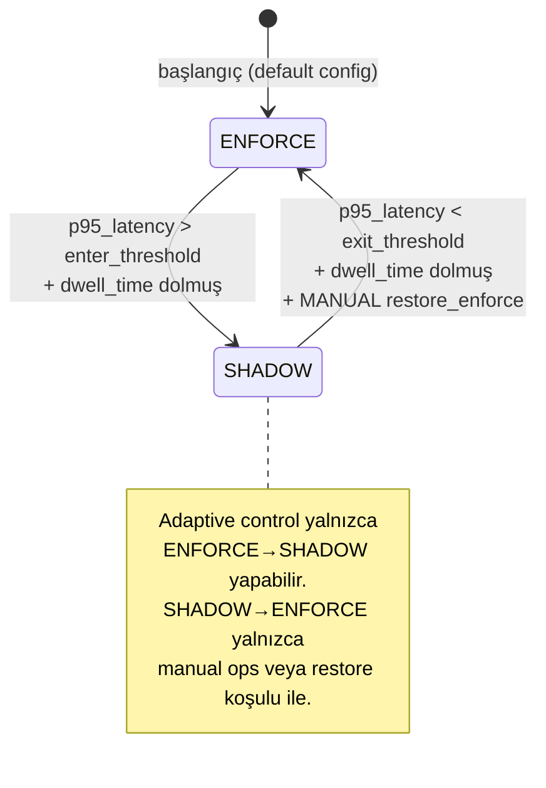
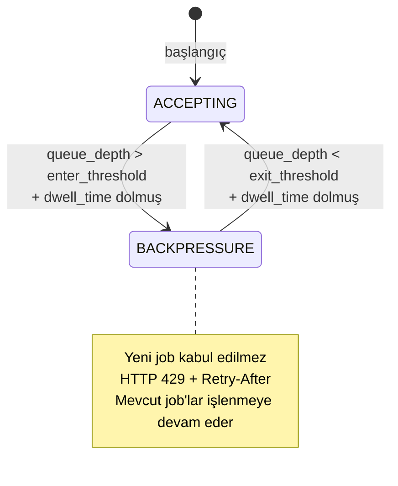

# Tasarım Dokümanı — SLO-Aware Adaptive Control

## Genel Bakış

SLO-Aware Adaptive Control, mevcut runtime guard ve PDF worker subsystem'lerini birleştiren bir feedback-loop kontrol düzlemi oluşturur. Sistem, gerçek zamanlı SLO metriklerinden (p95 latency, queue depth, error budget) yararlanarak iki ana koruyucu aksiyon alır:

1. **Guard Mode Downgrade**: p95 API latency SLO threshold'unu aştığında ENFORCE→SHADOW geçişi
2. **PDF Backpressure**: Queue depth threshold'u aştığında yeni job kabulünü durdurma (HTTP 429 + Retry-After)

Kontrol döngüsü deterministik bir öncelik sırası izler: KillSwitch > Manual Override > Adaptive Control > Default Config. Tüm kararlar monotonic-safe'dir (yalnızca downgrade, asla otomatik upgrade). Oscillation, hysteresis band (ayrı enter/exit threshold) ve minimum dwell time ile önlenir.

### Mevcut Bileşenlerle Entegrasyon

```
┌─────────────────────────────────────────────────────────────────┐
│                    Adaptive Control Plane                        │
│                                                                 │
│  ┌──────────────┐   ┌──────────────┐   ┌───────────────────┐   │
│  │Metrics_       │──▶│SLO_Evaluator │──▶│Adaptive_          │   │
│  │Collector      │   │(mevcut)      │   │Controller         │   │
│  └──────┬───────┘   └──────────────┘   └────────┬──────────┘   │
│         │                                        │              │
│         │  telemetry                    Control_Signal           │
│         │                                        │              │
│  ┌──────▼───────┐                      ┌────────▼──────────┐   │
│  │Guard_Decision │◀─────────────────────│Decision_Engine    │   │
│  │(mevcut)       │   switch_to_shadow   │(priority ladder)  │   │
│  └──────────────┘                      └────────┬──────────┘   │
│                                                  │              │
│  ┌──────────────┐                      ┌────────▼──────────┐   │
│  │PDF_Job_Store  │◀─────────────────────│Backpressure_      │   │
│  │(mevcut)       │   stop_accepting     │Controller         │   │
│  └──────────────┘                      └───────────────────┘   │
│                                                                 │
│  ┌──────────────┐                                               │
│  │KillSwitch     │──▶ Priority Level 1 (hard override)          │
│  │Manager(mevcut)│                                              │
│  └──────────────┘                                               │
└─────────────────────────────────────────────────────────────────┘
```

### v1 Kısıtları (Bağlayıcı)

- Monotonic-safe: yalnızca downgrade, asla otomatik enforcement artırma
- Guard: yalnızca ENFORCE→SHADOW (OFF modu kapsam dışı)
- PDF Backpressure: HTTP 429 + Retry-After, HOLD semantiği (hard block)
- Canonical SLO sinyalleri: `p95 API latency over 5m sliding window`, `p95 PDF render duration over 5m sliding window`
- Error budget: `allowed_errors = (1 - SLO_target) × window_duration × request_rate`, rolling 30-day window
- Telemetry-insufficient: min N sample, bucket coverage ≥ 80%, source_stale kontrolü
- Tie-breaker: `subsystem_id → metric_name → tenant_id` (lexicographic)
- Hysteresis: ayrı enter/exit threshold + minimum dwell time

---

## Mimari (Architecture)

### Sinyal Pipeline

Telemetri verisi aşağıdaki pipeline'dan geçerek kontrol kararına dönüşür:

```
Telemetry Ingestion → Windowing → Quantile/Histogram Calc → Budget Eval → Decision
```

```mermaid
flowchart LR
    A[MetricsMiddleware<br/>Guard_Decision<br/>PDF_Job_Store] -->|raw samples| B[Metrics_Collector]
    B -->|MetricSample[]| C[SLO_Evaluator]
    C -->|SloEvalResult[]| D[Error_Budget_Calculator]
    D -->|BudgetStatus| E[Decision_Engine]
    E -->|Control_Signal| F{Priority Ladder}
    F -->|1. KillSwitch| G[No-op]
    F -->|2. Manual Override| G
    F -->|3. Adaptive| H[Guard_Decision / PDF_Job_Store]
    F -->|4. Default| I[Config defaults]
```

### State Machine

Adaptive Controller iki bağımsız state machine yönetir:

#### Guard Subsystem State Machine



#### PDF Subsystem State Machine



### Kontrol Döngüsü (Control Loop)

Her `control_loop_interval_seconds` periyodunda:

```python
def control_loop_tick(now_ms: int) -> list[ControlSignal]:
    # 1. Telemetri yeterliliği kontrolü
    if is_telemetry_insufficient():
        emit_alert("telemetry_insufficient")
        return []  # no-op

    # 2. Metrik toplama
    samples = metrics_collector.collect_all()

    # 3. SLO değerlendirme
    eval_results = slo_evaluator.evaluate_all(samples, now_ms)

    # 4. Error budget hesaplama
    budget_status = error_budget_calculator.evaluate(eval_results)

    # 5. Karar üretme (priority ladder)
    signals = decision_engine.decide(budget_status, now_ms)

    # 6. Hysteresis + dwell time filtresi
    filtered = hysteresis_filter.apply(signals, now_ms)

    # 7. Uygulama + audit
    for signal in filtered:
        apply_signal(signal)
        emit_control_decision_event(signal)

    return filtered
```

### Decision Engine: 4-Level Priority Ladder

```
Level 1: KillSwitch (hard)     → Aktifse: adaptive control askıya alınır
Level 2: Manual Override (ops) → Aktifse: ilgili subsystem için no-op
Level 3: Adaptive Control      → SLO-based otomatik kararlar
Level 4: Default Config        → Yapılandırma varsayılanları
```

Aynı seviyede birden fazla sinyal varsa deterministik tie-breaker:
1. `subsystem_id` lexicographic (guard < pdf)
2. `metric_name` lexicographic
3. `tenant_id` lexicographic

---

## Bileşenler ve Arayüzler (Components and Interfaces)

### 1. Metrics_Collector

Mevcut `MetricsMiddleware`, `Guard_Decision` ve `PDF_Job_Store` kaynaklarından metrik sample'ları toplar ve `SLO_Evaluator` ile uyumlu `MetricSample` formatında sunar.

```python
@dataclass(frozen=True)
class SourceHealth:
    source_id: str
    last_sample_ms: int
    is_stale: bool  # control_loop_interval süresince veri gelmemişse True

class MetricsCollector:
    """Birden fazla kaynaktan metrik toplayan bileşen."""

    def __init__(self, control_loop_interval_ms: int):
        self._sources: dict[str, list[MetricSample]] = {}
        self._last_seen: dict[str, int] = {}
        self._interval_ms = control_loop_interval_ms

    def ingest(self, source_id: str, sample: MetricSample) -> None:
        """Yeni sample ekle, son görülme zamanını güncelle."""
        ...

    def get_samples(self, source_id: str, window_start_ms: int, window_end_ms: int) -> list[MetricSample]:
        """Belirli pencere içindeki sample'ları döndür."""
        ...

    def get_all_samples(self, window_start_ms: int, window_end_ms: int) -> list[MetricSample]:
        """Tüm kaynaklardan pencere içi sample'ları birleştir."""
        ...

    def check_health(self, now_ms: int) -> list[SourceHealth]:
        """Her kaynak için stale durumunu kontrol et."""
        ...
```

### 2. Error_Budget_Calculator

Error budget'ı `allowed_errors = (1 - SLO_target) × window_duration × request_rate` formülüyle hesaplar. Rolling 30-day window kullanır.

```python
@dataclass(frozen=True)
class ErrorBudgetConfig:
    metric: str           # "5xx_rate" | "block_rate" | "snapshot_failure_rate" | "failed_jobs_rate"
    window_seconds: int   # rolling window (default: 30 * 86400)
    slo_target: float     # e.g. 0.999
    burn_rate_threshold: float  # e.g. 2.0 (2x normal burn)

@dataclass(frozen=True)
class BudgetStatus:
    subsystem_id: str     # "guard" | "pdf"
    metric: str
    budget_total: float
    budget_consumed: float
    budget_remaining_pct: float
    burn_rate: float
    is_exhausted: bool
    is_burn_rate_exceeded: bool

class ErrorBudgetCalculator:
    def __init__(self, configs: list[ErrorBudgetConfig]):
        self._configs = configs

    def evaluate(self, samples: list[MetricSample], now_ms: int) -> list[BudgetStatus]:
        """Her subsystem için error budget durumunu hesapla."""
        ...
```

### 3. Telemetry_Sufficiency_Checker

Telemetri verisinin karar almak için yeterli olup olmadığını kontrol eder.

```python
@dataclass(frozen=True)
class SufficiencyConfig:
    min_samples: int              # varsayılan: window / control_loop_interval * 0.8
    min_bucket_coverage_pct: float  # varsayılan: 0.80
    check_source_stale: bool      # varsayılan: True

@dataclass(frozen=True)
class SufficiencyResult:
    is_sufficient: bool
    sample_count: int
    required_samples: int
    bucket_coverage_pct: float
    stale_sources: list[str]
    reason: str  # "" if sufficient, else explanation

class TelemetrySufficiencyChecker:
    def __init__(self, config: SufficiencyConfig):
        self._config = config

    def check(self, samples: list[MetricSample], source_health: list[SourceHealth]) -> SufficiencyResult:
        """Telemetri yeterliliğini değerlendir."""
        ...
```

### 4. Decision_Engine

Priority ladder ve tie-breaker ile deterministik kontrol kararları üretir.

```python
class SignalType(str, Enum):
    SWITCH_TO_SHADOW = "switch_to_shadow"
    RESTORE_ENFORCE = "restore_enforce"
    STOP_ACCEPTING_JOBS = "stop_accepting_jobs"
    RESUME_ACCEPTING_JOBS = "resume_accepting_jobs"

class PriorityLevel(int, Enum):
    KILLSWITCH = 1
    MANUAL_OVERRIDE = 2
    ADAPTIVE_CONTROL = 3
    DEFAULT_CONFIG = 4

@dataclass(frozen=True)
class ControlSignal:
    signal_type: SignalType
    subsystem_id: str       # "guard" | "pdf"
    metric_name: str        # tetikleyen metrik
    tenant_id: str          # etkilenen tenant ("*" = all in allowlist)
    trigger_value: float
    threshold: float
    priority: PriorityLevel
    correlation_id: str
    timestamp_ms: int

class DecisionEngine:
    def __init__(self, killswitch: KillSwitchManager, config: AdaptiveControlConfig):
        self._killswitch = killswitch
        self._config = config

    def decide(
        self,
        budget_statuses: list[BudgetStatus],
        eval_results: list[SloEvalResult],
        now_ms: int,
    ) -> list[ControlSignal]:
        """Priority ladder + tie-breaker ile kararlar üret."""
        ...

    def _apply_tie_breaker(self, signals: list[ControlSignal]) -> list[ControlSignal]:
        """subsystem_id → metric_name → tenant_id lexicographic sıralama."""
        return sorted(signals, key=lambda s: (s.subsystem_id, s.metric_name, s.tenant_id))
```

### 5. Hysteresis_Filter

Oscillation önleme: ayrı enter/exit threshold, dwell time ve cooldown period.

```python
@dataclass
class HysteresisState:
    last_transition_ms: int = 0
    last_signal_ms: int = 0
    current_mode: str = ""
    transition_history: list[tuple[int, str, str]] = field(default_factory=list)  # (ts, from, to)

class HysteresisFilter:
    def __init__(self, config: AdaptiveControlConfig):
        self._config = config
        self._states: dict[str, HysteresisState] = {}  # key: subsystem_id

    def apply(self, signals: list[ControlSignal], now_ms: int) -> list[ControlSignal]:
        """Dwell time ve cooldown kontrolü uygula; geçersiz sinyalleri filtrele."""
        ...

    def detect_oscillation(self, subsystem_id: str) -> bool:
        """Son N karar içinde M'den fazla geçiş varsa True."""
        ...
```

### 6. Adaptive_Controller (Orkestratör)

Tüm bileşenleri birleştiren ana kontrol döngüsü.

```python
class AdaptiveControllerState(str, Enum):
    RUNNING = "running"
    FAILSAFE = "failsafe"
    SUSPENDED = "suspended"  # tüm kaynaklar stale

class AdaptiveController:
    def __init__(
        self,
        config: AdaptiveControlConfig,
        metrics_collector: MetricsCollector,
        slo_evaluator: SloEvaluator,
        budget_calculator: ErrorBudgetCalculator,
        decision_engine: DecisionEngine,
        hysteresis_filter: HysteresisFilter,
        sufficiency_checker: TelemetrySufficiencyChecker,
        guard_decision: GuardDecision,
        pdf_job_store: PdfJobStore,
    ):
        ...

    def tick(self, now_ms: int) -> list[ControlSignal]:
        """Tek bir control loop iterasyonu çalıştır."""
        ...

    def apply_signal(self, signal: ControlSignal) -> None:
        """Control signal'i ilgili subsystem'e uygula."""
        ...

    @property
    def state(self) -> AdaptiveControllerState:
        ...
```

### 7. Allowlist_Manager

Adaptive control'ün etki alanını sınırlayan allowlist yönetimi.

```python
@dataclass(frozen=True)
class AllowlistEntry:
    tenant_id: str          # "*" = all tenants
    endpoint_class: str     # endpoint sınıfı veya "*"
    subsystem_id: str       # "guard" | "pdf" | "*"

class AllowlistManager:
    def __init__(self, entries: list[AllowlistEntry]):
        self._entries = frozenset(entries)

    def is_in_scope(self, tenant_id: str, endpoint_class: str, subsystem_id: str) -> bool:
        """Hedefin allowlist kapsamında olup olmadığını kontrol et."""
        ...

    def update(self, new_entries: list[AllowlistEntry], actor: str, now_ms: int) -> None:
        """Allowlist'i güncelle ve audit log üret."""
        ...

    @property
    def is_empty(self) -> bool:
        return len(self._entries) == 0
```

### 8. Control_Decision_Event (Audit)

Her mod geçişinde üretilen yapılandırılmış event.

```python
@dataclass(frozen=True)
class ControlDecisionEvent:
    event_id: str           # UUID
    correlation_id: str     # control loop correlation
    reason: str             # tetikleyen SLO/metrik
    previous_mode: str      # önceki mod
    new_mode: str           # yeni mod
    subsystem_id: str       # "guard" | "pdf"
    transition_timestamp_ms: int
    trigger_metric: str
    trigger_value: float
    threshold: float
    burn_rate: float | None
    actor: str              # "adaptive_control" | "manual_override" | "killswitch"
```

---

## Veri Modelleri (Data Models)

### AdaptiveControlConfig

Tüm yapılandırma parametrelerini merkezi olarak tutan model. `GuardConfig` ile tutarlı şekilde environment variable'lardan yüklenir.

```python
@dataclass
class AdaptiveControlConfig:
    # ── Control Loop ──
    control_loop_interval_seconds: int = 30

    # ── Guard Subsystem Thresholds ──
    p95_latency_enter_threshold: float = 2.0    # seconds
    p95_latency_exit_threshold: float = 1.0     # seconds (< enter)

    # ── PDF Subsystem Thresholds ──
    queue_depth_enter_threshold: int = 50
    queue_depth_exit_threshold: int = 20        # < enter

    # ── Error Budget ──
    error_budget_window_seconds: int = 30 * 86400  # 30 days rolling
    guard_slo_target: float = 0.999
    pdf_slo_target: float = 0.999
    burn_rate_threshold: float = 2.0

    # ── Hysteresis & Timing ──
    dwell_time_seconds: int = 600               # 10 minutes
    cooldown_period_seconds: int = 300           # 5 minutes
    oscillation_window_size: int = 10            # son N karar
    oscillation_max_transitions: int = 3         # M geçiş → oscillation

    # ── Telemetry Sufficiency ──
    min_sample_ratio: float = 0.8               # window / interval * ratio
    min_bucket_coverage_pct: float = 0.80

    # ── Allowlist ──
    targets: list[AllowlistEntry] = field(default_factory=list)

    # ── Canonical SLO Signals (v1 bağlayıcı) ──
    guard_slo_query: str = "histogram_quantile(0.95, rate(http_request_duration_seconds_bucket[5m]))"
    pdf_slo_query: str = "histogram_quantile(0.95, rate(pdf_render_duration_seconds_bucket[5m]))"

    def validate(self) -> list[str]:
        """Yapılandırma doğrulaması. Hata listesi döndürür (boş = geçerli)."""
        errors = []
        if self.p95_latency_exit_threshold >= self.p95_latency_enter_threshold:
            errors.append("exit_threshold must be < enter_threshold for latency")
        if self.queue_depth_exit_threshold >= self.queue_depth_enter_threshold:
            errors.append("exit_threshold must be < enter_threshold for queue_depth")
        if not (0 < self.guard_slo_target <= 1.0):
            errors.append("guard_slo_target must be in (0, 1]")
        if not (0 < self.pdf_slo_target <= 1.0):
            errors.append("pdf_slo_target must be in (0, 1]")
        if self.dwell_time_seconds <= 0:
            errors.append("dwell_time_seconds must be > 0")
        if self.cooldown_period_seconds <= 0:
            errors.append("cooldown_period_seconds must be > 0")
        if self.control_loop_interval_seconds <= 0:
            errors.append("control_loop_interval_seconds must be > 0")
        if self.burn_rate_threshold <= 0:
            errors.append("burn_rate_threshold must be > 0")
        return errors
```

### Metrik Tanımları

| Metrik Adı | Tip | Label'lar | Açıklama |
|---|---|---|---|
| `adaptive_control_loop_duration_seconds` | Histogram | — | Control loop iterasyon süresi |
| `adaptive_control_signal_total` | Counter | `signal_type` | Üretilen sinyal sayısı |
| `adaptive_control_state` | Gauge | `subsystem`, `state` | Mevcut subsystem durumu |
| `adaptive_guard_mode_transition_total` | Counter | `from_mode`, `to_mode`, `reason` | Guard mod geçiş sayısı |
| `adaptive_pdf_backpressure_active` | Gauge | — | Backpressure aktif mi (0/1) |
| `adaptive_pdf_jobs_rejected_total` | Counter | — | Backpressure nedeniyle reddedilen job sayısı |
| `adaptive_cooldown_active` | Gauge | `subsystem` | Cooldown aktif mi (0/1) |
| `adaptive_oscillation_detected_total` | Counter | `subsystem` | Oscillation tespit sayısı |
| `adaptive_control_decision_total` | Counter | `reason`, `from_mode`, `to_mode` | Karar event sayısı |
| `adaptive_control_failsafe` | Counter | `reason` | Fail-safe geçiş sayısı |
| `adaptive_error_budget_remaining_pct` | Gauge | `subsystem`, `metric` | Kalan error budget yüzdesi |
| `adaptive_telemetry_insufficient_total` | Counter | `subsystem`, `reason` | Telemetri yetersizliği sayısı |

### Control_Decision_Event JSON Schema

```json
{
  "event_id": "uuid-v4",
  "correlation_id": "loop-iteration-uuid",
  "reason": "p95_latency_exceeded",
  "previous_mode": "enforce",
  "new_mode": "shadow",
  "subsystem_id": "guard",
  "transition_timestamp_ms": 1700000000000,
  "trigger_metric": "p95_api_latency_5m",
  "trigger_value": 2.5,
  "threshold": 2.0,
  "burn_rate": 3.1,
  "actor": "adaptive_control"
}
```

---
