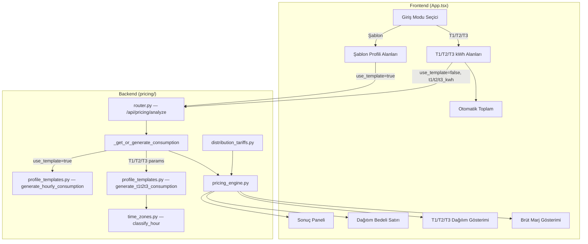

# Design Document: T1/T2/T3 Giriş Modu

## Overview

Risk Analizi paneline gerçek T1/T2/T3 kWh giriş modu eklenmesi. Mevcut şablon profili moduna ek olarak, kullanıcının fatura/CK bilgisindeki Gündüz (T1), Puant (T2), Gece (T3) kWh değerlerini doğrudan girebilmesi ve bu değerlerden ay bazlı dinamik saatlik tüketim profili üretilmesi sağlanacaktır.

**Temel tasarım kararları:**

1. **T1/T2/T3 modu şablon modunu override eder** — `_get_or_generate_consumption()` fonksiyonunda yeni bir dal eklenir; `use_template=false` + T1/T2/T3 parametreleri verildiğinde şablon yerine T1/T2/T3 profil üretici kullanılır.
2. **T1+T2+T3 toplamı aylık tüketim olarak kabul edilir** — Ayrı bir `monthly_kwh` parametresi gerekmez.
3. **Saat sayısı ay bazlı dinamik hesaplanır** — 744 saat sabit değildir: 28 gün → 672 saat, 30 gün → 720 saat, 31 gün → 744 saat. `calendar.monthrange()` ile dönemin gün sayısı belirlenir.
4. **T1/T2/T3 saat sayıları gün sayısına göre çarpılarak hesaplanır** — T1_hours = gün × 11, T2_hours = gün × 5, T3_hours = gün × 8.
5. **Round-trip doğrulaması zorunludur** — Üretilen profilin T1/T2/T3 toplamları girilen değerlere eşit olmalıdır (±0.1% tolerans, floating point hataları için).
6. **Şablon modu geriye uyumlu kalır** — Mevcut `use_template=true` davranışı değişmez.
7. **Dağıtım bedeli frontend'de ayrı kalem olarak gösterilir** — Backend'den dönen `distribution_amount_tl` ve `distribution_unit_price` alanları kullanılır. Gerilim seviyesi (AG/OG) parametre olarak alınır, v1'de tek zamanlı dağıtım bedeli uygulanır.
8. **Brüt marj formülü** — `Brüt Marj = Satış Fiyatı - (PTF + YEKDEM + Dağıtım Bedeli)`. Tüm maliyet kalemleri dahildir.
9. **API öncelik sırası kesin ve değiştirilemez:**
   - Priority 1: t1_kwh/t2_kwh/t3_kwh (override — fatura verisi varsa esas alınır)
   - Priority 2: template (şablon profili)
   - Priority 3: DB historical (müşteri geçmiş profili)

**v2 Roadmap (future enhancement):**
- Hafta içi / hafta sonu (weekday/weekend) ağırlıklandırma desteği — Pazar günü puant etkisi düşer, sanayi profilleri farklılaşır. v1'de uniform dağıtım uygulanır.

## Architecture



**Veri akışı:**
1. Kullanıcı giriş modunu seçer (Şablon veya T1/T2/T3)
2. T1/T2/T3 modunda: kWh değerleri girilir → frontend toplam hesaplar → API'ye `use_template=false` + `t1_kwh`, `t2_kwh`, `t3_kwh` gönderilir
3. Backend `_get_or_generate_consumption()` T1/T2/T3 dalına girer → `generate_t1t2t3_consumption()` çağrılır
4. Profil üretici `classify_hour()` kullanarak her saati T1/T2/T3'e eşler, kWh'ı eşit dağıtır
5. Analiz sonuçları (time_zone_breakdown, distribution, gross_margin) frontend'e döner

## Components and Interfaces

### Backend Bileşenleri

#### 1. `generate_t1t2t3_consumption()` — Yeni fonksiyon (`profile_templates.py`)

T1/T2/T3 kWh değerlerinden ay bazlı dinamik saatlik tüketim profili üretir.

```python
def generate_t1t2t3_consumption(
    t1_kwh: float,
    t2_kwh: float,
    t3_kwh: float,
    period: str,  # "YYYY-MM"
) -> list[ParsedConsumptionRecord]:
    """T1/T2/T3 kWh değerlerinden saatlik tüketim profili üret.

    Saat sayısı ay bazlı dinamik hesaplanır:
    - 28 gün → 672 saat, 30 gün → 720 saat, 31 gün → 744 saat
    - calendar.monthrange(year, month) ile gün sayısı belirlenir

    Dağıtım mantığı (v1: uniform — hafta içi/sonu ayrımı yok):
    - Her gün için classify_hour(h) ile saat→dilim eşleştirmesi yapılır
    - T1 saatleri: 06:00–16:59 (günde 11 saat) → her saat = T1_kWh / (gün_sayısı × 11)
    - T2 saatleri: 17:00–21:59 (günde 5 saat)  → her saat = T2_kWh / (gün_sayısı × 5)
    - T3 saatleri: 22:00–05:59 (günde 8 saat)  → her saat = T3_kWh / (gün_sayısı × 8)

    Round-trip garantisi: sum(T1 saatleri) ≈ t1_kwh (±0.1% tolerans)

    NOT: v1'de uniform dağıtım uygulanır. v2'de weekday/weekend
    ağırlıklandırma eklenecektir (Pazar puant etkisi düşer).

    Args:
        t1_kwh: Gündüz tüketimi (kWh), >= 0
        t2_kwh: Puant tüketimi (kWh), >= 0
        t3_kwh: Gece tüketimi (kWh), >= 0
        period: Dönem (YYYY-MM formatı)

    Returns:
        ParsedConsumptionRecord listesi (gün_sayısı × 24 kayıt)
        - 28 gün → 672 kayıt
        - 30 gün → 720 kayıt
        - 31 gün → 744 kayıt

    Raises:
        ValueError: Geçersiz dönem formatı veya tüm değerler sıfır
    """
```

**Tasarım kararı:** Bu fonksiyon `db` parametresi almaz — saf bir hesaplama fonksiyonudur. `classify_hour()` kullanarak saat→dilim eşleştirmesi yapar, böylece T1/T2/T3 saat tanımları tek bir yerde (`time_zones.py`) yönetilir.

**Deterministic garantisi:** Aynı input (t1_kwh, t2_kwh, t3_kwh, period) her zaman aynı profili üretir. Fonksiyon hiçbir rastgele veya zamana bağlı değer kullanmaz.

**Residual fix (artık düzeltme):** Floating point bölme sonrası `round(value, 4)` ile yuvarlanan saatlik değerlerin toplamı, girilen zone kWh'ından sapabilir. Bu sapmayı sıfırlamak için her zone'un son saatine residual (artık) eklenir:
```python
# Her zone için:
hourly_kwh = round(zone_kwh / zone_total_hours, 4)
distributed_total = hourly_kwh * zone_total_hours
residual = zone_kwh - distributed_total
# Son saate residual eklenir → tam round-trip garantisi
last_hour_record.consumption_kwh += residual
```
Bu sayede küçük sapmalar birikip rapor ile fatura arasında tutarsızlık oluşturmaz.

#### 2. `AnalyzeRequest` model güncellemesi (`models.py`)

```python
class AnalyzeRequest(BaseModel):
    # ... mevcut alanlar ...
    
    # Yeni T1/T2/T3 alanları
    t1_kwh: Optional[float] = Field(
        default=None, ge=0,
        description="Gündüz (T1) tüketimi (kWh). use_template=false ile birlikte kullanılır.",
    )
    t2_kwh: Optional[float] = Field(
        default=None, ge=0,
        description="Puant (T2) tüketimi (kWh). use_template=false ile birlikte kullanılır.",
    )
    t3_kwh: Optional[float] = Field(
        default=None, ge=0,
        description="Gece (T3) tüketimi (kWh). use_template=false ile birlikte kullanılır.",
    )
    voltage_level: Optional[str] = Field(
        default="og",
        description="Gerilim seviyesi: 'ag' (Alçak Gerilim) veya 'og' (Orta Gerilim). Dağıtım bedeli hesaplamasında kullanılır.",
    )
```

#### 3. `_get_or_generate_consumption()` güncellemesi (`router.py`)

```python
def _get_or_generate_consumption(
    db: Session,
    period: str,
    customer_id: Optional[str],
    use_template: Optional[bool],
    template_name: Optional[str],
    template_monthly_kwh: Optional[float],
    # Yeni parametreler
    t1_kwh: Optional[float] = None,
    t2_kwh: Optional[float] = None,
    t3_kwh: Optional[float] = None,
) -> list[ParsedConsumptionRecord]:
    """Tüketim verisi al: T1/T2/T3'den, şablondan veya DB'den.
    
    ⚠️ KRİTİK: Öncelik sırası kesin ve değiştirilemez:
    1. T1/T2/T3 parametreleri (use_template=false + t1/t2/t3_kwh) — fatura verisi override
    2. Şablon (use_template=true + template_name + template_monthly_kwh)
    3. DB'den müşteri profili (customer_id)
    
    Bu sıra değişirse sistem hatalı fiyatlama üretir.
    """
```

**Öncelik mantığı:** T1/T2/T3 parametreleri verildiğinde (`use_template=false` ve en az biri > 0), şablon modu devre dışı kalır. Bu, Requirement 4.4'ü karşılar.

#### 4. `AnalyzeResponse` model güncellemesi (`models.py`)

Mevcut `AnalyzeResponse` zaten `time_zone_breakdown` ve `pricing.total_gross_margin_tl` alanlarını içeriyor. Ek alan gerekmez — frontend bu mevcut alanları kullanır.

### Frontend Bileşenleri

#### 5. Giriş Modu Seçici (App.tsx)

```typescript
// Yeni state
type InputMode = 'template' | 't1t2t3';
const [inputMode, setInputMode] = useState<InputMode>('template');
const [t1Kwh, setT1Kwh] = useState<number>(0);
const [t2Kwh, setT2Kwh] = useState<number>(0);
const [t3Kwh, setT3Kwh] = useState<number>(0);
const [voltageLevel, setVoltageLevel] = useState<'ag' | 'og'>('og');
```

Segmented control (radio button grubu) ile iki mod arasında geçiş:
- **Şablon Profili**: Mevcut şablon seçimi + aylık kWh alanları (değişiklik yok)
- **Gerçek T1/T2/T3**: Üç ayrı kWh giriş alanı + otomatik toplam

#### 6. T1/T2/T3 kWh Giriş Alanları (App.tsx)

- Üç sayısal input: "Gündüz / T1 (kWh)", "Puant / T2 (kWh)", "Gece / T3 (kWh)"
- Türkçe sayı formatı desteği (mevcut `parseNumber`/`formatNumber` fonksiyonları kullanılır)
- Otomatik toplam hesaplama: `totalKwh = t1Kwh + t2Kwh + t3Kwh`
- Validasyon: Tümü sıfır/boş ise analiz butonu disabled + uyarı mesajı

#### 7. API İstek Güncellemesi (api.ts)

```typescript
export interface PricingAnalyzeRequest {
  // ... mevcut alanlar ...
  
  // Yeni T1/T2/T3 alanları
  t1_kwh?: number;
  t2_kwh?: number;
  t3_kwh?: number;
  voltage_level?: 'ag' | 'og';  // Gerilim seviyesi, varsayılan: 'og'
}
```

T1/T2/T3 modunda `pricingAnalyze()` çağrısı:
```typescript
pricingAnalyze({
  period: normalizedPeriod,
  multiplier: multiplier,
  use_template: false,
  t1_kwh: t1Kwh,
  t2_kwh: t2Kwh,
  t3_kwh: t3Kwh,
  template_monthly_kwh: t1Kwh + t2Kwh + t3Kwh,
  voltage_level: voltageLevel,  // 'ag' veya 'og'
  // ... diğer parametreler
});
```

#### 8. Dağıtım Bedeli Gösterimi (App.tsx)

Risk paneli sonuç bölümünde yeni satır:
```
Dağıtım Bedeli (OG): X.XX TL/kWh × Y kWh = Z.ZZ TL
```

**Dağıtım bedeli hesaplama kuralları (v1):**
- Gerilim seviyesi (AG/OG) parametre olarak alınır — varsayılan: OG
- Tek zamanlı dağıtım bedeli uygulanır (zaman dilimli dağıtım v2'de)
- Mevcut `distribution_tariffs.py` ve `tariff_simulator.py` modülleri backend tarafında kullanılmaya devam eder
- 2026 Nisan ve sonrası dönemler için güncel EPDK tarife tablosu kullanılır

Backend'den dönen `supplier_cost` ve `weighted_prices.total_consumption_kwh` ile hesaplanır.

#### 9. T1/T2/T3 Dağılım Gösterimi (App.tsx)

Backend'den dönen `time_zone_breakdown` verisi kullanılarak:
```
T1: 5.000 kWh (%45,5) | T2: 3.000 kWh (%27,3) | T3: 3.000 kWh (%27,3)
```

Puant risk uyarıları:
- T2 ≥ %40: ⚠️ "Puant tüketim oranı yüksek — enerji maliyeti artabilir"
- T2 ≥ %55: 🔴 "Kritik puant yoğunlaşması — fiyatlama riski yüksek"

#### 10. Brüt Marj Gösterimi (App.tsx)

Backend'den dönen `pricing.total_gross_margin_tl` alanı:
- Pozitif → yeşil renk
- Negatif → kırmızı renk + "Zarar" etiketi

**Brüt Marj Formülü (kesin tanım):**
```
Brüt Marj = Satış Fiyatı - (PTF + YEKDEM + Dağıtım Bedeli)
```
Tüm maliyet kalemleri (PTF, YEKDEM, dağıtım) dahildir. Bu formül değişirse sistem yanlış rapor üretir.

## Data Models

### Backend Request/Response Değişiklikleri

**AnalyzeRequest (genişletilmiş):**

| Alan | Tip | Zorunlu | Açıklama |
|------|-----|---------|----------|
| `t1_kwh` | `float` | Hayır | Gündüz (T1) tüketimi, kWh. `ge=0` |
| `t2_kwh` | `float` | Hayır | Puant (T2) tüketimi, kWh. `ge=0` |
| `t3_kwh` | `float` | Hayır | Gece (T3) tüketimi, kWh. `ge=0` |
| `voltage_level` | `str` | Hayır | Gerilim seviyesi: `"ag"` veya `"og"`. Varsayılan: `"og"`. Dağıtım bedeli hesaplamasında kullanılır. |

**Validasyon kuralları:**
- `use_template=false` ve `t1_kwh + t2_kwh + t3_kwh > 0` → T1/T2/T3 modu
- `use_template=false` ve `t1_kwh + t2_kwh + t3_kwh == 0` → HTTP 422 hata
- `use_template=true` → mevcut şablon modu (T1/T2/T3 alanları yoksayılır)
- `use_template=None` ve T1/T2/T3 alanları verilmişse → T1/T2/T3 modu

**AnalyzeResponse (değişiklik yok):**

Mevcut response yapısı zaten gerekli tüm alanları içeriyor:
- `time_zone_breakdown`: T1/T2/T3 dağılım bilgisi
- `pricing.total_gross_margin_tl`: Brüt marj
- `supplier_cost`: Tedarikçi maliyet özeti
- `weighted_prices.total_consumption_kwh`: Toplam tüketim

### Profil Üretim Veri Akışı

```
⚠️ Saat sayısı ay bazlı DİNAMİK hesaplanır:
  Şubat 2024 (artık yıl): 29 gün → 696 saat
  Şubat 2025:              28 gün → 672 saat
  Nisan 2026:              30 gün → 720 saat
  Ocak 2026:               31 gün → 744 saat

Girdi: t1_kwh=5000, t2_kwh=3000, t3_kwh=3000, period="2026-04"

Hesaplama (Nisan = 30 gün):
  T1_hours = 30 × 11 = 330 saat → T1 saatlik = 5000 / 330 = 15.1515 kWh
  T2_hours = 30 × 5  = 150 saat → T2 saatlik = 3000 / 150 = 20.0000 kWh
  T3_hours = 30 × 8  = 240 saat → T3 saatlik = 3000 / 240 = 12.5000 kWh

Çıktı: 720 kayıt (30 × 24), her kayıt (date, hour, consumption_kwh)

Round-trip doğrulama (±0.1% tolerans):
  sum(T1 saatleri) = 15.1515 × 330 = 5000.00 ✓
  sum(T2 saatleri) = 20.0000 × 150 = 3000.00 ✓
  sum(T3 saatleri) = 12.5000 × 240 = 3000.00 ✓

Brüt Marj hesaplama:
  Brüt Marj = Satış Fiyatı - (PTF + YEKDEM + Dağıtım Bedeli)
```

**NOT (v1 kısıtı):** Uniform dağıtım uygulanır — hafta içi ve hafta sonu ayrımı yapılmaz. v2'de weekday/weekend ağırlıklandırma eklenecektir.


## Correctness Properties

*A property is a characteristic or behavior that should hold true across all valid executions of a system — essentially, a formal statement about what the system should do. Properties serve as the bridge between human-readable specifications and machine-verifiable correctness guarantees.*

### Property 1: Per-zone round-trip (Partition Fidelity)

*For any* valid T1, T2, T3 kWh values (each ≥ 0, total > 0) and *for any* valid period (YYYY-MM), when `generate_t1t2t3_consumption()` produces a profile, the sum of consumption values for hours classified as T1 by `classify_hour()` SHALL equal the input `t1_kwh` within ±0.1% relative tolerance (floating point hataları için), AND the sum for T2 hours SHALL equal `t2_kwh` within ±0.1%, AND the sum for T3 hours SHALL equal `t3_kwh` within ±0.1%.

**Validates: Requirements 9.1, 9.2, 9.3, 3.2, 3.3, 3.4, 3.5**

### Property 2: Record count invariant

*For any* valid period (YYYY-MM) and *for any* valid T1/T2/T3 kWh values, the generated profile SHALL contain exactly `days_in_month(period) × 24` records.

**Validates: Requirements 9.5, 3.1**

### Property 3: Non-negative output invariant

*For any* valid T1, T2, T3 kWh values (each ≥ 0) and *for any* valid period, every record in the generated profile SHALL have `consumption_kwh ≥ 0`.

**Validates: Requirements 3.6**

### Property 4: Zone classification consistency

*For any* generated profile record with `(date, hour, consumption_kwh)`, applying `classify_hour(hour)` SHALL return the same time zone that was used to determine that record's consumption value during generation. Specifically: if `classify_hour(hour) == T1`, then `consumption_kwh` equals `t1_kwh / (days × 11)`; if T2, equals `t2_kwh / (days × 5)`; if T3, equals `t3_kwh / (days × 8)`.

**Validates: Requirements 9.4, 3.7**

### Property 5: Peak warning threshold correctness

*For any* T1, T2, T3 kWh values where total > 0, the T2 consumption percentage is `t2_kwh / (t1_kwh + t2_kwh + t3_kwh) × 100`. If this percentage ≥ 55, a critical warning SHALL be present. If this percentage ≥ 40 (but < 55), a standard warning SHALL be present. If < 40, no peak warning SHALL be present.

**Validates: Requirements 7.3, 7.4**

### Property 6: Auto-total computation

*For any* three non-negative numbers T1, T2, T3, the displayed total SHALL equal `T1 + T2 + T3` exactly.

**Validates: Requirements 2.3, 2.4**

### Property 7: Turkish number format round-trip

*For any* non-negative number with up to 2 decimal places, formatting it in Turkish locale (dot as thousands separator, comma as decimal) and then parsing it back SHALL produce the original number.

**Validates: Requirements 2.6**

### Property 8: Determinism

*For any* valid T1, T2, T3 kWh values and *for any* valid period, calling `generate_t1t2t3_consumption()` twice with the same arguments SHALL produce identical output (same records in same order with same consumption_kwh values). The function is pure — no randomness, no time-dependency, no side effects.

**Validates: Design constraint (deterministic guarantee)**

### Property 9: Residual fix exactness

*For any* valid T1, T2, T3 kWh values and *for any* valid period, after residual fix is applied, the per-zone sum SHALL equal the input kWh value EXACTLY (not approximately) — i.e., `sum(zone_hours) == zone_kwh` with zero floating point error, because the residual absorbs all rounding difference into the last hour of each zone.

**Validates: Design constraint (residual fix), Requirements 9.1, 9.2, 9.3**

## Error Handling

| Hata Durumu | Kaynak | HTTP Kodu | Hata Mesajı | Kullanıcı Etkisi |
|-------------|--------|-----------|-------------|------------------|
| T1+T2+T3 = 0 | Backend | 422 | `"Toplam tüketim sıfır olamaz. En az bir zaman diliminde tüketim giriniz."` | Analiz çalışmaz |
| T1/T2/T3 < 0 | Backend (Pydantic) | 422 | `"t1_kwh: ensure this value is greater than or equal to 0"` | Otomatik validasyon |
| Geçersiz dönem | Backend | 422 | `"Geçersiz dönem formatı: 'X'. Beklenen: YYYY-MM"` | Analiz çalışmaz |
| Piyasa verisi yok | Backend | 404 | `"X dönemi için piyasa verisi bulunamadı."` | Mevcut davranış korunur |
| YEKDEM verisi yok | Backend | 404 | `"X dönemi için YEKDEM bedeli bulunamadı."` | Mevcut davranış korunur |
| Tüm alanlar boş/sıfır | Frontend | — | `"En az bir zaman diliminde tüketim giriniz"` uyarısı + buton disabled | Analiz tetiklenemez |
| Negatif değer girişi | Frontend | — | Input `min=0` ile engellenir | Giriş kabul edilmez |
| Sayısal olmayan giriş | Frontend | — | `parseNumber()` ile 0'a dönüşür | Geçersiz giriş temizlenir |

**Geriye uyumluluk hata yönetimi:**
- `use_template=true` ile gelen isteklerde T1/T2/T3 alanları yoksayılır — mevcut hata davranışı korunur
- T1/T2/T3 alanları verilmeden `use_template=false` gönderilirse, mevcut `missing_consumption_data` hatası döner

## Testing Strategy

### Property-Based Testing (PBT)

Bu özellik property-based testing için uygundur çünkü:
- `generate_t1t2t3_consumption()` saf bir fonksiyondur (girdi → çıktı, yan etkisiz)
- Giriş uzayı geniştir (T1/T2/T3 × dönem kombinasyonları)
- Round-trip ve invariant özellikleri evrenseldir

**PBT Kütüphanesi:** Hypothesis (Python, backend) + fast-check (TypeScript, frontend)

**Konfigürasyon:** Her property testi minimum 100 iterasyon çalıştırılacaktır.

**Backend Property Testleri (Hypothesis):**

| Test | Property | Min İterasyon | Tag |
|------|----------|---------------|-----|
| `test_per_zone_round_trip` | Property 1 | 100 | `Feature: t1t2t3-input-mode, Property 1: Per-zone round-trip` |
| `test_record_count_invariant` | Property 2 | 100 | `Feature: t1t2t3-input-mode, Property 2: Record count invariant` |
| `test_non_negative_output` | Property 3 | 100 | `Feature: t1t2t3-input-mode, Property 3: Non-negative output invariant` |
| `test_zone_classification_consistency` | Property 4 | 100 | `Feature: t1t2t3-input-mode, Property 4: Zone classification consistency` |

**Frontend Property Testleri (fast-check):**

| Test | Property | Min İterasyon | Tag |
|------|----------|---------------|-----|
| `test_auto_total_computation` | Property 6 | 100 | `Feature: t1t2t3-input-mode, Property 6: Auto-total computation` |
| `test_turkish_number_round_trip` | Property 7 | 100 | `Feature: t1t2t3-input-mode, Property 7: Turkish number format round-trip` |

**Property 5 (Peak warning thresholds):** Backend unit test ile doğrulanır — frontend'de threshold kontrolü yapılır, ancak veri backend'den geldiği için integration test olarak ele alınır.

### Unit Tests (Example-Based)

| Test | Kapsam | Açıklama |
|------|--------|----------|
| `test_t1t2t3_mode_basic` | Backend | T1=5000, T2=3000, T3=3000, period=2026-04 → 720 kayıt, doğru toplamlar |
| `test_t1t2t3_zero_total_error` | Backend | T1=0, T2=0, T3=0 → HTTP 422 |
| `test_t1t2t3_single_zone` | Backend | T1=10000, T2=0, T3=0 → sadece T1 saatlerinde tüketim |
| `test_template_mode_unchanged` | Backend | use_template=true → mevcut davranış korunur |
| `test_t1t2t3_overrides_template` | Backend | use_template=false + T1/T2/T3 → şablon yoksayılır |
| `test_february_leap_year` | Backend | Şubat 2024 (artık yıl) → 29 × 24 = 696 kayıt |
| `test_february_non_leap` | Backend | Şubat 2025 → 28 × 24 = 672 kayıt |
| `test_30_day_month` | Backend | Nisan 2026 → 30 × 24 = 720 kayıt |
| `test_31_day_month` | Backend | Ocak 2026 → 31 × 24 = 744 kayıt |
| `test_dynamic_zone_hours` | Backend | T1_hours = gün×11, T2_hours = gün×5, T3_hours = gün×8 doğrulaması |
| `test_voltage_level_ag_og` | Backend | AG vs OG dağıtım bedeli farkı |
| `test_gross_margin_formula` | Backend | Brüt Marj = Satış - (PTF + YEKDEM + Dağıtım) doğrulaması |
| `test_peak_warning_40pct` | Backend/Frontend | T2 %40 → uyarı gösterilir |
| `test_peak_warning_55pct` | Backend/Frontend | T2 %55 → kritik uyarı gösterilir |
| `test_gross_margin_negative_display` | Frontend | Negatif marj → kırmızı + "Zarar" |
| `test_gross_margin_positive_display` | Frontend | Pozitif marj → yeşil |
| `test_distribution_fee_display` | Frontend | Dağıtım bedeli ayrı satır olarak gösterilir |
| `test_input_mode_selector_default` | Frontend | Varsayılan mod = "Şablon Profili" |
| `test_mode_switch_clears_results` | Frontend | Mod değişikliği → sonuçlar temizlenir |

### Integration Tests

| Test | Kapsam | Açıklama |
|------|--------|----------|
| `test_analyze_endpoint_t1t2t3` | API | POST /api/pricing/analyze with T1/T2/T3 → 200 + tüm alanlar mevcut |
| `test_analyze_endpoint_template_backward_compat` | API | POST with use_template=true → mevcut yanıt yapısı korunur |
| `test_api_priority_t1t2t3_overrides_template` | API | T1/T2/T3 + template params birlikte → T1/T2/T3 öncelikli |
| `test_api_priority_template_overrides_db` | API | template + customer_id birlikte → template öncelikli |
| `test_tariff_period_selection` | Frontend | Nisan 2026 dönemi → 2026 EPDK tarifeleri uygulanır |
| `test_gross_margin_includes_all_costs` | API | Brüt marj = Satış - (PTF + YEKDEM + Dağıtım) doğrulaması |
