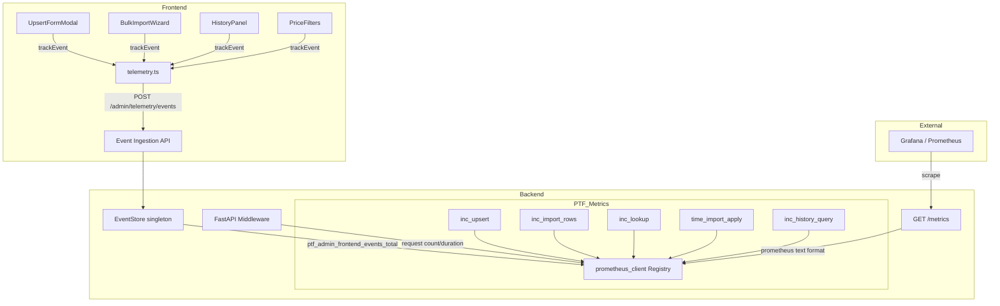

# Design Document: Telemetry Unification

## Overview

Mevcut `PTFMetrics` sınıfındaki in-memory sayaçlar `prometheus_client` kütüphanesi ile değiştirilir. Aynı public API (`inc_upsert()`, `inc_import_rows()`, `inc_lookup()`, `time_import_apply()`, `snapshot()`, `reset()`) korunarak backward compatibility sağlanır. Yeni `GET /metrics` endpoint'i Prometheus text format ile Grafana scraping desteği sunar. Ek olarak `history_query_total/duration` ve genel `api_request_total/duration` metrikleri eklenir.

Frontend tarafında hafif bir `telemetry.ts` modülü oluşturulur. Kullanıcı aksiyonları (upsert, bulk import, history, filter) fire-and-forget pattern ile `POST /admin/telemetry/events` endpoint'ine gönderilir. Backend bu event'leri payload olarak saklamaz; yalnızca per-event_name aggregate counter'ları artırır ve Prometheus counter olarak expose eder.

## Architecture



### Migrasyon Stratejisi

1. `PTFMetrics.__init__()` içinde `prometheus_client.CollectorRegistry()` oluşturulur (global registry yerine instance-level registry — test izolasyonu için)
2. Her metrik `Counter` veya `Histogram` olarak bu registry'ye kaydedilir
3. Mevcut `inc_*()` metotları, `prometheus_client` counter'larının `.inc()` / `.labels().inc()` metotlarını çağırır
4. `snapshot()` metodu, registry'den değerleri okuyarak mevcut dict formatını döndürür
5. `reset()` metodu, yeni bir registry oluşturarak tüm metrikleri sıfırlar (prometheus_client'ın `unregister` + `re-register` pattern'i yerine daha temiz)
6. `GET /metrics` endpoint'i, singleton instance'ın registry'sini kullanarak `generate_latest()` çağırır

### Middleware Yaklaşımı

Genel HTTP request metrikleri için FastAPI middleware kullanılır. Middleware her request'te:
- `ptf_admin_api_request_total{endpoint, method, status_class}` counter'ını artırır (status_code → status_class normalization: 2xx/3xx/4xx/5xx/0xx)
- `ptf_admin_api_request_duration_seconds{endpoint}` histogram'ına süreyi observe eder
- `/metrics` endpoint'i kendisi bu metriklerden hariç tutulur (infinite recursion önlemi)

#### Endpoint Label Normalization (High-Cardinality Önlemi)

`endpoint` label'ı **route template** olmalıdır, raw `request.url.path` değil. Aksi halde `/admin/market-prices/2025-01`, `/admin/market-prices/2025-02` gibi path param'lar ayrı label üretir ve Prometheus'ta cardinality patlar.

3-Seviyeli Fallback Stratejisi:
- **Level 1 (preferred):** `request.scope.get("route").path` → route template (ör. `/admin/market-prices/{period}`)
- **Level 2 (no route match):** Sanitized path bucket — ilk 2 segment korunur, geri kalanı `*` ile değiştirilir (ör. `/admin/market-prices/*`)
- **Level 3 (404 / unmatched):** `unmatched:/admin/market-prices/*` formatı — ilk 2 segment + `*`

Bu strateji:
- Normal request'lerde route template kullanır (en düşük cardinality)
- Route match olmayan ama bilinen path'lerde sanitized bucket kullanır
- 404'lerde `unmatched:` prefix'i ile ayrıştırır

#### Label Policy (Hard Rules)

Aşağıdaki değerler label olarak **YASAKTIR** (high-cardinality):
- `period`, `price_type` değerleri (ör. "2025-01")
- `user_id`, `updated_by`, `actor_id`
- `error_message`, `change_reason`, `source_note`
- Query parameter değerleri

İzin verilen label'lar (low-cardinality):
- `status`: "provisional" | "final" (2 değer)
- `outcome`: "accepted" | "rejected" (2 değer)
- `hit`: "true" | "false" (2 değer)
- `method`: "GET" | "POST" | "PUT" | "DELETE" (4-5 değer)
- `status_class`: "2xx" | "3xx" | "4xx" | "5xx" | "0xx" (5 değer — exact code yerine class-level normalization)
- `endpoint`: route template (sınırlı sayıda endpoint)
- `event_name`: allowlisted event names (sınırlı)

## Components and Interfaces

### Backend Components

#### 1. Refactored `PTFMetrics` Class (`backend/app/ptf_metrics.py`)

```python
from prometheus_client import Counter, Histogram, CollectorRegistry, generate_latest

class PTFMetrics:
    def __init__(self, registry: CollectorRegistry | None = None) -> None:
        self._registry = registry or CollectorRegistry()
        
        # Existing metrics (migrated to prometheus_client)
        self._upsert_total = Counter(
            "ptf_admin_upsert_total", "Upsert operations",
            labelnames=["status"], registry=self._registry,
        )
        self._import_rows_total = Counter(
            "ptf_admin_import_rows_total", "Import row outcomes",
            labelnames=["outcome"], registry=self._registry,
        )
        self._import_apply_duration = Histogram(
            "ptf_admin_import_apply_duration_seconds",
            "Import apply operation duration",
            registry=self._registry,
        )
        self._lookup_total = Counter(
            "ptf_admin_lookup_total", "Lookup operations",
            labelnames=["hit", "status"], registry=self._registry,
        )
        
        # New metrics (Requirement 3)
        self._history_query_total = Counter(
            "ptf_admin_history_query_total", "History query operations",
            registry=self._registry,
        )
        self._history_query_duration = Histogram(
            "ptf_admin_history_query_duration_seconds",
            "History query duration",
            registry=self._registry,
        )
        self._api_request_total = Counter(
            "ptf_admin_api_request_total", "HTTP request count",
            labelnames=["endpoint", "method", "status_class"],
            registry=self._registry,
        )
        self._api_request_duration = Histogram(
            "ptf_admin_api_request_duration_seconds",
            "HTTP request duration",
            labelnames=["endpoint"], registry=self._registry,
        )
        
        # Frontend event counter (Requirement 6)
        self._frontend_events_total = Counter(
            "ptf_admin_frontend_events_total", "Frontend telemetry events",
            labelnames=["event_name"], registry=self._registry,
        )

    # Existing public API preserved
    def inc_upsert(self, status: str) -> None: ...
    def inc_import_rows(self, outcome: str, count: int = 1) -> None: ...
    def inc_lookup(self, hit: bool, status: str | None = None) -> None: ...
    def observe_import_apply_duration(self, duration_seconds: float) -> None: ...
    def time_import_apply(self) -> Generator[None, None, None]: ...
    
    # New methods
    def inc_history_query(self) -> None: ...
    def observe_history_query_duration(self, duration_seconds: float) -> None: ...
    def time_history_query(self) -> Generator[None, None, None]: ...
    def inc_api_request(self, endpoint: str, method: str, status_code: int) -> None: ...
    def observe_api_request_duration(self, endpoint: str, duration: float) -> None: ...
    def inc_frontend_event(self, event_name: str) -> None: ...
    
    # Backward compat
    def snapshot(self) -> dict: ...
    def reset(self) -> None: ...
    
    # Prometheus exposition
    def generate_metrics(self) -> bytes: ...

    @property
    def registry(self) -> CollectorRegistry: ...
```

#### 2. Metrics Endpoint (`backend/app/main.py`)

```python
@app.get("/metrics")
async def prometheus_metrics():
    """
    GET /metrics — Prometheus text exposition format.
    No authentication required (standard for metrics scraping).
    """
    from .ptf_metrics import get_ptf_metrics
    from fastapi.responses import Response
    
    metrics_output = get_ptf_metrics().generate_metrics()
    return Response(
        content=metrics_output,
        media_type="text/plain; version=0.0.4; charset=utf-8",
    )
```

#### 3. Request Metrics Middleware (`backend/app/metrics_middleware.py`)

```python
from starlette.middleware.base import BaseHTTPMiddleware
import time
import re

def _sanitize_path(path: str) -> str:
    """Sanitize path to first 2 segments + wildcard for low cardinality."""
    segments = [s for s in path.split("/") if s]
    if len(segments) <= 2:
        return path
    return "/" + "/".join(segments[:2]) + "/*"

class MetricsMiddleware(BaseHTTPMiddleware):
    async def dispatch(self, request, call_next):
        if request.url.path == "/metrics":
            return await call_next(request)
        
        start = time.monotonic()
        response = await call_next(request)
        duration = time.monotonic() - start
        
        from .ptf_metrics import get_ptf_metrics
        metrics = get_ptf_metrics()
        
        # 3-level endpoint label normalization
        route = request.scope.get("route")
        if route:
            # Level 1: route template
            endpoint = route.path
        elif response.status_code == 404:
            # Level 3: unmatched with sanitized bucket
            endpoint = f"unmatched:{_sanitize_path(request.url.path)}"
        else:
            # Level 2: sanitized path bucket
            endpoint = _sanitize_path(request.url.path)
        
        method = request.method
        metrics.inc_api_request(endpoint, method, response.status_code)
        metrics.observe_api_request_duration(endpoint, duration)
        
        return response
```

#### 4. Event Ingestion Endpoint (`backend/app/main.py`)

```python
from pydantic import BaseModel
from typing import List, Optional

EVENT_NAME_PREFIX = "ptf_admin."  # Allowlist prefix
MAX_BATCH_SIZE = 100

class TelemetryEvent(BaseModel):
    event: str
    properties: dict = {}
    timestamp: str  # ISO 8601

class TelemetryEventsRequest(BaseModel):
    events: List[TelemetryEvent]

@app.post("/admin/telemetry/events")
async def ingest_telemetry_events(
    body: TelemetryEventsRequest,
):
    """
    POST /admin/telemetry/events — Frontend event ingestion.
    
    Auth: YOK (bilinçli istisna). Endpoint yalnızca counter artırır,
    başka write/read yapmaz. Risk profili GET /metrics ile aynı sınıfta.
    Rate limit: 60 req/dk/IP (spam şişirme önlemi).
    
    Scope kilidi:
    - Yalnızca ptf_admin_frontend_events_total counter'ını artırır
    - Başka hiçbir write/read yapmaz
    - Payload saklanmaz, geri okunmaz
    
    Label policy:
    - Tek label: event_name (allowlist'ten)
    - properties asla label'a dönüştürülmez
    
    Operasyonel görünürlük:
    - Request başına tek INFO satırı: accepted/rejected + distinct event_name'ler
    - Event bazlı log yok
    """
```

#### 5. EventStore Singleton (`backend/app/event_store.py`)

Counter-only tasarım: event payload saklanmaz, yalnızca per-event_name sayaçlar tutulur.

```python
import threading
import logging
from typing import Dict

logger = logging.getLogger(__name__)

class EventStore:
    """
    Counter-only event store. Payload saklamaz — yalnızca
    per-event_name accepted/rejected sayaçları tutar.
    
    PII/secret sızıntı riski yok çünkü properties hiçbir yerde persist edilmez.
    """
    def __init__(self) -> None:
        self._counters: Dict[str, int] = {}  # event_name → count
        self._total_accepted: int = 0
        self._total_rejected: int = 0
        self._lock = threading.Lock()
    
    def increment(self, event_name: str) -> None:
        """Increment counter for an accepted event."""
        with self._lock:
            self._counters[event_name] = self._counters.get(event_name, 0) + 1
            self._total_accepted += 1
    
    def increment_rejected(self) -> None:
        """Increment rejected counter."""
        with self._lock:
            self._total_rejected += 1
    
    def get_counters(self) -> Dict[str, int]:
        """Return copy of per-event_name counters."""
        with self._lock:
            return dict(self._counters)
    
    def get_totals(self) -> Dict[str, int]:
        """Return total accepted and rejected counts."""
        with self._lock:
            return {"accepted": self._total_accepted, "rejected": self._total_rejected}
    
    def reset(self) -> None:
        """Clear all counters (for testing)."""
        with self._lock:
            self._counters.clear()
            self._total_accepted = 0
            self._total_rejected = 0

_store = EventStore()

def get_event_store() -> EventStore:
    return _store
```

### Frontend Components

#### 6. `telemetry.ts` Module (`frontend/src/market-prices/telemetry.ts`)

```typescript
const TELEMETRY_ENDPOINT = '/admin/telemetry/events';
const FLUSH_INTERVAL_MS = 2000;
const MAX_BATCH_SIZE = 20;
const MAX_BUFFER_SIZE = 200;  // Hard limit — drop oldest when exceeded

interface TelemetryEvent {
  event: string;
  properties: Record<string, unknown>;
  timestamp: string;
}

let eventBuffer: TelemetryEvent[] = [];
let flushTimer: ReturnType<typeof setTimeout> | null = null;

export function trackEvent(
  event: string,
  properties: Record<string, unknown> = {},
): void {
  // Buffer overflow protection: drop oldest events
  if (eventBuffer.length >= MAX_BUFFER_SIZE) {
    const dropCount = eventBuffer.length - MAX_BUFFER_SIZE + 1;
    eventBuffer = eventBuffer.slice(dropCount);
    console.warn(`[telemetry] Buffer overflow, dropped ${dropCount} oldest events`);
  }

  eventBuffer.push({
    event,
    properties,
    timestamp: new Date().toISOString(),
  });

  if (eventBuffer.length >= MAX_BATCH_SIZE) {
    flush();
  } else if (!flushTimer) {
    flushTimer = setTimeout(flush, FLUSH_INTERVAL_MS);
  }
}

async function flush(): Promise<void> {
  if (flushTimer) {
    clearTimeout(flushTimer);
    flushTimer = null;
  }
  if (eventBuffer.length === 0) return;

  const batch = [...eventBuffer];
  eventBuffer = [];

  try {
    // No auth required — endpoint is unauthenticated by design
    await fetch(TELEMETRY_ENDPOINT, {
      method: 'POST',
      headers: { 'Content-Type': 'application/json' },
      body: JSON.stringify({ events: batch }),
    });
  } catch (err) {
    // Fire-and-forget: discard failed batch, no retry
    console.warn('[telemetry] Failed to send events, batch discarded:', err);
  }
}
```

#### 7. Hook Entegrasyonları

Mevcut hook'lara `trackEvent()` çağrıları eklenir. Örnek pattern:

```typescript
// useUpsertMarketPrice.ts içinde
import { trackEvent } from '../telemetry';

// submit fonksiyonu içinde:
trackEvent('ptf_admin.upsert_submit', { period, price_type, status });

// success callback'te:
trackEvent('ptf_admin.upsert_success', { action: result.action });

// error handler'da:
trackEvent('ptf_admin.upsert_error', { error_code: err.error_code });
```

## Data Models

### Prometheus Metric Registry

| Metric Name | Type | Labels | Description |
|-------------|------|--------|-------------|
| `ptf_admin_upsert_total` | Counter | `status` | Upsert işlem sayısı |
| `ptf_admin_import_rows_total` | Counter | `outcome` | Import satır sonuçları |
| `ptf_admin_import_apply_duration_seconds` | Histogram | — | Import apply süresi |
| `ptf_admin_lookup_total` | Counter | `hit`, `status` | Lookup işlem sonuçları |
| `ptf_admin_history_query_total` | Counter | — | History sorgu sayısı |
| `ptf_admin_history_query_duration_seconds` | Histogram | — | History sorgu süresi |
| `ptf_admin_api_request_total` | Counter | `endpoint`, `method`, `status_class` | HTTP request sayısı |
| `ptf_admin_api_request_duration_seconds` | Histogram | `endpoint` | HTTP request süresi |
| `ptf_admin_frontend_events_total` | Counter | `event_name` | Frontend event sayısı |

### TelemetryEvent Schema

```json
{
  "event": "ptf_admin.upsert_submit",
  "properties": {
    "period": "2025-01",
    "price_type": "PTF",
    "status": "provisional"
  },
  "timestamp": "2025-01-15T10:30:00.000Z"
}
```

### Event Ingestion Request/Response

```json
// Request: POST /admin/telemetry/events
{
  "events": [
    { "event": "ptf_admin.upsert_submit", "properties": {...}, "timestamp": "..." },
    { "event": "ptf_admin.upsert_success", "properties": {...}, "timestamp": "..." }
  ]
}

// Response: 200 OK
{
  "status": "ok",
  "accepted_count": 2,
  "rejected_count": 0
}
```


## Correctness Properties

*A property is a characteristic or behavior that should hold true across all valid executions of a system — essentially, a formal statement about what the system should do. Properties serve as the bridge between human-readable specifications and machine-verifiable correctness guarantees.*

### Property 1: Prometheus output validity and completeness

*For any* sequence of metric increments (upsert, import_rows, lookup, history_query, api_request, frontend_event), the `GET /metrics` endpoint output SHALL be valid Prometheus text exposition format AND SHALL contain all registered metric names with the `ptf_admin_` prefix.

**Validates: Requirements 1.1, 1.4**

### Property 2: Snapshot round-trip correctness

*For any* sequence of metric increments via `inc_upsert()`, `inc_import_rows()`, `inc_lookup()`, and `observe_import_apply_duration()`, calling `snapshot()` SHALL return a dictionary where each counter value equals the sum of all increments for that label combination, and the duration tracker count and total match the observed values.

**Validates: Requirements 2.5**

### Property 3: Reset clears all metrics

*For any* sequence of metric increments followed by `reset()`, calling `snapshot()` SHALL return a dictionary where all counter values are zero and all duration tracker counts and totals are zero.

**Validates: Requirements 2.6**

### Property 4: HTTP request metrics tracking

*For any* HTTP request to a non-`/metrics` endpoint, the middleware SHALL increment `ptf_admin_api_request_total` with the correct `endpoint`, `method`, and `status_class` labels (where `status_class` is the HTTP status code normalized to class level: 2xx/3xx/4xx/5xx/0xx), AND SHALL observe a positive duration in `ptf_admin_api_request_duration_seconds` with the correct `endpoint` label.

**Validates: Requirements 3.3, 3.4**

### Property 5: Event construction correctness

*For any* event name (non-empty string) and properties object, calling `trackEvent()` SHALL produce a `TelemetryEvent` with the provided `event` name, the provided `properties`, and a valid ISO 8601 `timestamp`.

**Validates: Requirements 4.2**

### Property 6: Event batching behavior

*For any* sequence of N rapid `trackEvent()` calls where N < MAX_BATCH_SIZE, all N events SHALL be sent in a single HTTP POST after the flush interval elapses.

**Validates: Requirements 4.5**

### Property 7: Event ingestion increments counters for valid events

*For any* batch of valid `TelemetryEvent` objects sent to `POST /admin/telemetry/events`, the `EventStore` counter for each event_name SHALL be incremented by the number of events with that name, and the response `accepted_count` SHALL equal the number of valid events in the batch.

**Validates: Requirements 6.1, 6.2, 6.6**

### Property 8: Partial batch acceptance

*For any* batch containing a mix of valid and invalid events, the `Event_Ingestion_API` SHALL accept all valid events and reject all invalid events, where `accepted_count + rejected_count` equals the total batch size.

**Validates: Requirements 6.5**

### Property 9: Frontend event Prometheus counter

*For any* batch of accepted events, the `ptf_admin_frontend_events_total` Prometheus counter SHALL be incremented by the count of accepted events, grouped by `event_name` label.

**Validates: Requirements 6.7**

## Error Handling

| Senaryo | Davranış |
|---------|----------|
| `prometheus_client` registry hatası | Log error, `/metrics` 500 döner |
| `/metrics` endpoint — normal çalışma | 200, Prometheus text format |
| `trackEvent()` — HTTP POST başarısız | `console.warn`, batch discard edilir, retry yok (fire-and-forget) (Req 4.4, 4.7) |
| `trackEvent()` — network tamamen kapalı | Batch discard edilir, `console.warn` loglanır |
| `trackEvent()` — buffer overflow | En eski event'ler drop edilir, `console.warn` loglanır (Req 4.6) |
| `POST /admin/telemetry/events` — geçersiz event | Skip, `rejected_count` artır, diğer event'ler işlenmeye devam eder (Req 6.5) |
| `POST /admin/telemetry/events` — bilinmeyen event prefix | Skip, `rejected_count` artır (Req 6.9) |
| `POST /admin/telemetry/events` — batch > 100 event | 400 Bad Request (Req 6.8) |
| `POST /admin/telemetry/events` — boş array | 200, `accepted_count: 0` (Req 6.4) |
| `POST /admin/telemetry/events` — auth eksik | N/A — endpoint auth gerektirmez (bilinçli istisna, bkz. Known Limitation) |
| `POST /admin/telemetry/events` — rate limit aşımı | 429 Too Many Requests (60 req/dk/IP) |
| Middleware — `/metrics` endpoint'i | Middleware skip eder (infinite recursion önlemi) |
| `snapshot()` — prometheus_client okuma hatası | Fallback olarak sıfır değerler döner |
| `reset()` — yeni registry oluşturma | Eski registry garbage collected, yeni registry temiz başlar |

## Backend Checkpoint — Contracts, Policies & Known Limitations

### Telemetry Endpoint Contract

| Özellik | Değer |
|---------|-------|
| Path | `POST /admin/telemetry/events` |
| Auth | Yok (bilinçli istisna — bkz. Security) |
| Payload | `{ events: [{ event, properties, timestamp }] }` |
| Allowlist | `event` alanı `ptf_admin.` prefix'i ile başlamalı |
| Batch limit | ≤ 100 event/request, aşarsa 400 |
| Rate limit | 60 req/dk/IP, aşarsa 429 |
| Partial batch | Valid event'ler kabul, invalid'ler skip + `rejected_count` |
| Logging | Request başına tek INFO satırı: `accepted=N rejected=M distinct_events=K` + reject_reasons (event name'ler loglanmaz — PII/garbage riski) |
| Response | `{ status, accepted_count, rejected_count }` |

#### Event Name Validation Rules

| Kural | Değer | Rejection Reason |
|-------|-------|------------------|
| Prefix | `ptf_admin.` ile başlamalı | `UNKNOWN_PREFIX` |
| Max uzunluk | 100 karakter | `NAME_TOO_LONG` |
| Charset | `^[a-z0-9._]+$` (ASCII slug: lowercase + digits + dot + underscore) | `INVALID_CHARSET` |
| Properties key limit | ≤ 20 key | `TOO_MANY_PROPS` |

Büyük harf, boşluk, tire, unicode, özel karakterler reddedilir. Properties değerleri inspect edilmez, saklanmaz, label'a dönüştürülmez.

#### Dedupe Policy

Dedupe **bilinçli olarak yoktur**. Fire-and-forget semantiği gereği retry'lar counter'ları şişirebilir. Kabul edilebilir trade-off: basitlik > kesinlik. Counter'lar zaten aggregate/trend amaçlı kullanılır, exact count kritik değil.

### EventStore Contract

| Özellik | Değer |
|---------|-------|
| Tasarım | Counter-only — event payload saklanmaz |
| Thread safety | `threading.Lock` ile korunur |
| Singleton | Module-level `_store` instance |
| Reset | `reset()` çağrısında tüm counter'lar sıfırlanır (test-only) |
| Persistence | Yok — process restart'te sıfırlanır |

### Prometheus Labels Policy

| Label | Değer alanı | Cardinality |
|-------|-------------|-------------|
| `status` | provisional, final | 2 |
| `outcome` | accepted, rejected | 2 |
| `hit` | true, false | 2 |
| `method` | GET, POST, PUT, DELETE | 4–5 |
| `status_class` | 2xx, 3xx, 4xx, 5xx, 0xx | 5 |
| `endpoint` | Route template (sınırlı) | ~15–20 |
| `event_name` | Allowlisted ptf_admin.* names | ~10 |

**YASAK label'lar** (high-cardinality): period, price_type değerleri, user_id, error_message, query parameter değerleri, exact HTTP status code.

**status_class normalization**: `status_code // 100` → `"{N}xx"`. Exact code log/trace tarafına aittir.

### Security & Abuse Mitigation

- **No-auth gerekçesi**: Endpoint yalnızca Prometheus counter artırır. Payload saklanmaz, geri okunmaz. Risk profili `GET /metrics` ile eşdeğer.
- **Rate limit**: 60 req/dk/IP — spam/inflation önlemi, güvenlik katmanı değil.
- **Allowlist**: Yalnızca `ptf_admin.` prefix'li event name'ler kabul edilir.
- **PII yasağı**: `properties` alanı hiçbir yerde persist edilmez, Prometheus label'a dönüştürülmez, loglanmaz. Yalnızca `event_name` (allowlist'ten) label olarak kullanılır.
- **Planned follow-up**: Admin Auth Hardening phase'inde session/bearer auth eklendiğinde bu endpoint de aynı auth umbrella'ya alınacak.

### Known Limitations

1. **Middleware exception path**: ~~`call_next()` exception fırlatırsa middleware metric kaydetmez~~ **ÇÖZÜLDÜ** — `try/except/finally` ile exception path'te `status_class="0xx"` (no response produced) ve duration observe edilir. Exception re-raise edilir, upstream davranış değişmez.
2. **EventStore persistence yok**: Process restart'te tüm counter'lar sıfırlanır. Prometheus scrape interval'ı içinde kaybedilen veri kabul edilebilir düzeyde.
3. **Rate limit in-memory**: Distributed deployment'ta IP bazlı rate limit node-local çalışır. Tek instance deployment için yeterli. **Rate limit key**: Yalnızca IP adresi (`request.client.host`), path dahil değil. 429 response'ları middleware tarafından `status_class="4xx"` olarak metrics'e yazılır.
4. **Pre-existing test failures** (telemetry-dışı): `test_market_price_admin_service` — 2 fail (audit-history kaynaklı, `db.add`/`db.commit` call count değişikliği). **ÇÖZÜLDÜ** — assertion'lar audit-history'nin best-effort 2-commit pattern'ini yansıtacak şekilde güncellendi. Bkz. `audit-history/design.md` Tutarlılık Politikası.

## Testing Strategy

### Property-Based Testing (Hypothesis — Python)

Proje zaten Hypothesis kullanıyor. Her property testi minimum 100 iterasyon çalıştırılır.

| Test | Property | Konfigürasyon |
|------|----------|---------------|
| `test_prometheus_output_valid` | Property 1 | `@given(random_metric_increments())` — Rastgele metrik artışları sonrası /metrics çıktısı valid Prometheus format |
| `test_snapshot_roundtrip` | Property 2 | `@given(random_metric_increments())` — Artışlar sonrası snapshot değerleri doğru |
| `test_reset_clears_all` | Property 3 | `@given(random_metric_increments())` — Reset sonrası tüm değerler sıfır |
| `test_request_metrics_tracking` | Property 4 | `@given(random_http_requests())` — Middleware doğru label'larla sayaç artırır |
| `test_event_ingestion_stores` | Property 7 | `@given(random_valid_event_batches())` — Tüm valid event'ler store edilir |
| `test_partial_batch_acceptance` | Property 8 | `@given(random_mixed_event_batches())` — Valid/invalid ayrımı doğru |
| `test_frontend_event_counter` | Property 9 | `@given(random_valid_event_batches())` — Prometheus counter doğru artırılır |

Her test, design property referansı ile tag'lenir:
```python
# Feature: telemetry-unification, Property 1: Prometheus output validity and completeness
```

### Property-Based Testing (fast-check — TypeScript)

Frontend property testleri için `fast-check` kütüphanesi kullanılır.

| Test | Property | Konfigürasyon |
|------|----------|---------------|
| `test_event_construction` | Property 5 | `fc.property(fc.string(), fc.dictionary())` — Event yapısı doğru |
| `test_event_batching` | Property 6 | `fc.property(fc.array(fc.string()))` — Batch davranışı doğru |

### Unit Testing

**Backend (pytest):**
- `PTFMetrics` — tüm mevcut testler refactored sınıf ile çalışmaya devam eder
- `/metrics` endpoint — 200 döner, Content-Type doğru, auth gerekmez
- `/metrics` endpoint — process metrics dahil
- `MetricsMiddleware` — `/metrics` kendisi hariç tutulur
- History endpoint — `history_query_total` ve `history_query_duration` artırılır
- `POST /admin/telemetry/events` — valid batch, empty batch, auth required, batch > 100 rejected, unknown event prefix rejected
- `EventStore` — increment, get_counters, get_totals, reset

**Frontend (vitest):**
- `trackEvent()` — event buffer'a eklenir
- `trackEvent()` — flush interval sonrası POST gönderilir
- `trackEvent()` — POST hatası console.warn ile loglanır, exception fırlatılmaz
- Hook entegrasyonları — her hook'ta doğru event name ve properties ile trackEvent çağrılır
- `useUpsertMarketPrice` — submit/success/error event'leri
- `useBulkImportPreview` / `useBulkImportApply` — start/complete/error event'leri
- `useAuditHistory` — history_open event'i
- `PriceFilters` — filter_change event'i

### Test Dosya Yapısı

```
backend/tests/test_ptf_metrics.py                    # Mevcut testler (refactored)
backend/tests/test_telemetry_properties.py            # Property-based tests
backend/tests/test_telemetry_events.py                # Event ingestion unit tests
backend/tests/test_metrics_middleware.py               # Middleware unit tests
frontend/src/market-prices/__tests__/telemetry.test.ts # Frontend telemetry tests
```
