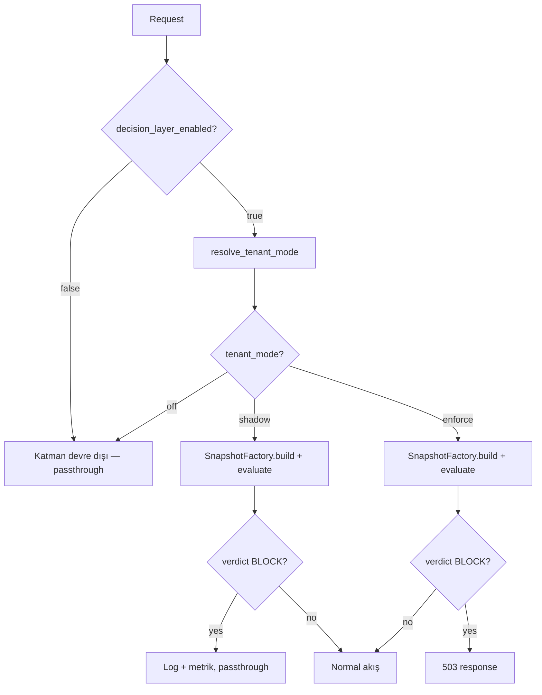

# Tasarım: Tenant-Level Guard Decision Override

## Genel Bakış

Mevcut Guard Decision Layer'ın global ON/OFF flag'inin üzerine tenant bazlı override yeteneği eklenir. Deterministik öncelik sırası: Global OFF → her şey kapalı; Global ON → tenant bazlı `shadow|enforce|off` mod çözümlemesi.

Config yüzeyi env var'lar ile başlar (mevcut `GuardConfig` pydantic-settings yapısına eklenir). Tenant mode çözümlemesi pure function olarak implement edilir; `tenant_id` snapshot'ın birinci sınıf parametresi olur.

Değişen dosyalar:
- `backend/app/guard_config.py` — yeni config alanları + JSON parse helpers
- `backend/app/guards/guard_decision.py` — TenantMode enum, resolve fonksiyonu, snapshot'a tenant_mode alanı
- `backend/app/guards/guard_decision_middleware.py` — tenant mode'a göre enforcement akışı
- `backend/tests/test_guard_decision.py` — yeni testler

## Mimari

### Öncelik Sırası (Deterministik)

```
1. Global OFF (decision_layer_enabled=false)
   → Katman tamamen devre dışı, tenant config değerlendirilmez

2. Global ON (decision_layer_enabled=true)
   → resolve_tenant_mode(tenant_id, config) → TenantMode
     a. tenant_id tenant_modes_map'te var → o tenant'ın modu
     b. tenant_id tenant_modes_map'te yok → default_mode
     c. tenant_id boş/None → "default" olarak ele alınır → default_mode
```

### Akış Diyagramı



### Bileşen Diyagramı

```
┌─────────────────────────────────────────────────────┐
│ GuardConfig (GÜNCELLENİR)                           │
│                                                     │
│  + decision_layer_default_mode: str                 │
│    ("shadow"|"enforce"|"off", default="shadow")     │
│  + decision_layer_tenant_modes_json: str            │
│    ('{"tenantA":"enforce","tenantB":"shadow"}')      │
│  + decision_layer_tenant_allowlist_json: str         │
│    ('["tenantA","tenantB"]')                         │
│                                                     │
│  + parse_tenant_modes() → dict[str, TenantMode]     │
│  + parse_tenant_allowlist() → frozenset[str]         │
└──────────────────────┬──────────────────────────────┘
                       │
                       ▼
┌─────────────────────────────────────────────────────┐
│ guard_decision.py (GÜNCELLENİR)                     │
│                                                     │
│  + TenantMode (shadow | enforce | off)              │
│  + resolve_tenant_mode(tenant_id, config) → mode    │
│  + sanitize_tenant_id(raw) → str                    │
│                                                     │
│  GuardDecisionSnapshot (GÜNCELLENİR)               │
│    + tenant_mode: TenantMode                        │
│                                                     │
│  SnapshotFactory.build() (GÜNCELLENİR)             │
│    - tenant mode çözümlemesi eklenir                │
│    - snapshot'a tenant_mode dahil edilir            │
└──────────────────────┬──────────────────────────────┘
                       │
                       ▼
┌─────────────────────────────────────────────────────┐
│ guard_decision_middleware.py (GÜNCELLENİR)          │
│                                                     │
│  _evaluate_decision():                              │
│    1. Global OFF → passthrough                      │
│    2. resolve_tenant_mode → tenant_mode             │
│    3. tenant_mode == off → passthrough              │
│    4. Build snapshot + evaluate                     │
│    5. tenant_mode == shadow → log+metrik, no block  │
│    6. tenant_mode == enforce → gerçek 503           │
│                                                     │
│  + sanitize_metric_tenant(tenant_id, allowlist)     │
│    → tenant_id veya "_other"                        │
└─────────────────────────────────────────────────────┘
```

## Bileşenler ve Arayüzler

### TenantMode Enum

```python
class TenantMode(str, Enum):
    SHADOW = "shadow"
    ENFORCE = "enforce"
    OFF = "off"
```

### resolve_tenant_mode (Pure Function)

```python
def resolve_tenant_mode(
    tenant_id: str | None,
    default_mode: TenantMode,
    tenant_modes: dict[str, TenantMode],
) -> TenantMode:
    """
    Deterministik tenant mod çözümlemesi.
    
    1. tenant_id boş/None → "default" olarak normalize et
    2. tenant_modes map'te ara
    3. Bulunamazsa → default_mode
    
    Pure function: side-effect yok, aynı input → aynı output.
    """
```

### sanitize_tenant_id (Pure Function)

```python
def sanitize_tenant_id(raw: str | None) -> str:
    """
    Tenant ID normalizasyonu.
    None veya boş string → "default"
    Aksi halde strip edilmiş değer.
    """
```

### GuardConfig Yeni Alanları

```python
# guard_config.py'ye eklenecek alanlar
decision_layer_default_mode: str = "shadow"
decision_layer_tenant_modes_json: str = ""
decision_layer_tenant_allowlist_json: str = ""
```

### Config Parse Helpers

```python
def parse_tenant_modes(raw_json: str) -> dict[str, TenantMode]:
    """
    JSON string → tenant modes map.
    Geçersiz JSON → boş dict + log (fail-open).
    Geçersiz mod değeri olan tenant'lar atlanır + log.
    """

def parse_tenant_allowlist(raw_json: str) -> frozenset[str]:
    """
    JSON string → tenant allowlist set.
    Geçersiz JSON → boş set + log (fail-open).
    """
```

### sanitize_metric_tenant

```python
def sanitize_metric_tenant(
    tenant_id: str,
    allowlist: frozenset[str],
) -> str:
    """
    Metrik label'ı için tenant ID sanitizasyonu.
    Allowlist'te varsa → tenant_id
    Yoksa → "_other"
    Boş allowlist → her zaman "_other"
    """
```

## Veri Modelleri

### TenantMode

```python
class TenantMode(str, Enum):
    SHADOW = "shadow"
    ENFORCE = "enforce"
    OFF = "off"
```

### GuardDecisionSnapshot (Güncelleme)

Mevcut frozen dataclass'a eklenen alan:

```python
@dataclass(frozen=True)
class GuardDecisionSnapshot:
    # ... mevcut alanlar ...
    tenant_mode: TenantMode  # YENİ — tenant bazlı çalışma modu
```

### Config Env Var Mapping

| Env Var | GuardConfig Alanı | Tip | Default | Açıklama |
|---------|-------------------|-----|---------|----------|
| `OPS_GUARD_DECISION_LAYER_DEFAULT_MODE` | `decision_layer_default_mode` | str | `"shadow"` | Global ON iken varsayılan mod |
| `OPS_GUARD_DECISION_LAYER_TENANT_MODES_JSON` | `decision_layer_tenant_modes_json` | str | `""` | Tenant → mode JSON map |
| `OPS_GUARD_DECISION_LAYER_TENANT_ALLOWLIST_JSON` | `decision_layer_tenant_allowlist_json` | str | `""` | Metrik allowlist JSON array |

### Tenant Modes JSON Formatı

```json
{
  "tenantA": "enforce",
  "tenantB": "shadow",
  "tenantC": "off"
}
```

### Tenant Allowlist JSON Formatı

```json
["tenantA", "tenantB"]
```

## Doğruluk Özellikleri (Correctness Properties)

*Bir özellik (property), sistemin tüm geçerli çalışmalarında doğru olması gereken bir davranış veya karakteristiktir — esasen, sistemin ne yapması gerektiğine dair biçimsel bir ifadedir. Özellikler, insan tarafından okunabilir spesifikasyonlar ile makine tarafından doğrulanabilir doğruluk garantileri arasındaki köprüdür.*

### Property 1: Global OFF Önceliği

*Her* tenant_id ve *her* tenant_modes_map konfigürasyonu için, `decision_layer_enabled=false` olduğunda `resolve_tenant_mode` çağrılmaz ve decision layer devre dışı kalır. Başka bir deyişle: global OFF durumunda tenant config'inin hiçbir etkisi yoktur.

**Validates: Requirements 1.1**

### Property 2: Tenant Çözümleme Determinizmi

*Her* tenant_id, *her* default_mode ve *her* tenant_modes_map için: (a) aynı parametrelerle iki kez çağrıldığında `resolve_tenant_mode` aynı sonucu döner; (b) tenant_id map'te varsa o tenant'ın modu döner; (c) tenant_id map'te yoksa default_mode döner.

**Validates: Requirements 2.1, 2.2, 2.3**

### Property 3: Fail-Open JSON Parse Güvenliği

*Her* rastgele string (geçerli veya geçersiz JSON) için, `parse_tenant_modes` ve `parse_tenant_allowlist` fonksiyonları hiçbir zaman exception fırlatmaz. Geçersiz JSON → boş map/set döner.

**Validates: Requirements 3.5, 4.1, 4.2, 4.3**

### Property 4: Geçersiz Mod Değeri Filtreleme

*Her* tenant_modes JSON map'i için, geçersiz mod değeri (`shadow`, `enforce`, `off` dışında) içeren tenant'lar sonuç map'inden çıkarılır; yalnızca geçerli mod değerine sahip tenant'lar korunur.

**Validates: Requirements 3.6**

### Property 5: Snapshot Tenant Mode Doğruluğu

*Her* geçerli config ve *her* tenant_id için, `SnapshotFactory.build()` tarafından üretilen snapshot'ın `tenant_mode` alanı, `resolve_tenant_mode(tenant_id, config)` ile aynı değeri içerir. Snapshot frozen olduğundan bu değer request boyunca değişmez.

**Validates: Requirements 5.1, 5.2, 6.4**

### Property 6: Metrik Tenant Sanitizasyonu

*Her* tenant_id ve *her* allowlist için: tenant_id allowlist'te ise `sanitize_metric_tenant` tenant_id döner; tenant_id allowlist'te değilse `"_other"` döner. Boş allowlist → her zaman `"_other"`.

**Validates: Requirements 8.1, 8.2, 8.3**

## Hata Yönetimi

| Durum | Davranış |
|-------|----------|
| `decision_layer_tenant_modes_json` geçersiz JSON | Boş map döner, log yazar, default mode uygulanır |
| `decision_layer_tenant_allowlist_json` geçersiz JSON | Boş set döner, log yazar, tüm tenant'lar `"_other"` |
| Tenant modes map'te geçersiz mod değeri | O tenant atlanır, log yazar, diğer tenant'lar korunur |
| `decision_layer_default_mode` geçersiz değer | Pydantic validator hata üretir, fallback config devreye girer |
| tenant_id None veya boş string | `"default"` olarak normalize edilir |
| `resolve_tenant_mode` exception | SnapshotFactory.build() fail-open (None döner) |
| Metrik emisyonu exception | Sessizce yutulur (mevcut pattern) |

## Test Stratejisi

### Property-Based Testing

Kütüphane: **Hypothesis** (Python)

Her property testi minimum 100 iterasyon ile çalıştırılır. Her test, tasarım dokümanındaki property numarasını referans eder.

```python
# Tag format örneği:
# Feature: tenant-enable, Property 1: Global OFF Önceliği
```

### Property Testleri

| Property | Test Açıklaması | Hypothesis Stratejisi |
|----------|-----------------|----------------------|
| P1 | Global OFF → tenant config etkisiz | `st.text()` tenant_id, `st.dictionaries()` tenant_modes |
| P2 | Tenant çözümleme determinizmi | `st.text()` tenant_id, `st.sampled_from(TenantMode)` default_mode |
| P3 | Fail-open JSON parse | `st.text()` rastgele string (geçersiz JSON dahil) |
| P4 | Geçersiz mod filtreleme | `st.dictionaries(st.text(), st.text())` mixed valid/invalid |
| P5 | Snapshot tenant_mode doğruluğu | `st.text()` tenant_id, geçerli config |
| P6 | Metrik tenant sanitizasyonu | `st.text()` tenant_id, `st.frozensets(st.text())` allowlist |

### Unit Testleri

Unit testler spesifik örnekler ve edge case'ler için:

1. tenantA=enforce, tenantB=shadow, default=off → doğru davranış
2. JSON bozuk → default mode
3. Boş/None tenant_id → "default" fallback
4. Middleware: tenant_mode=off → passthrough
5. Middleware: tenant_mode=shadow → log+metrik, no block
6. Middleware: tenant_mode=enforce → 503 on BLOCK
7. Config validator: geçersiz default_mode → hata
8. Allowlist: boş → tüm tenant'lar "_other"

### Dual Testing Yaklaşımı

- **Unit testler**: Spesifik örnekler, edge case'ler, middleware entegrasyonu
- **Property testler**: Evrensel özellikler, rastgele input'larla kapsamlı doğrulama
- Her iki yaklaşım birbirini tamamlar; unit testler somut bug'ları yakalar, property testler genel doğruluğu doğrular
