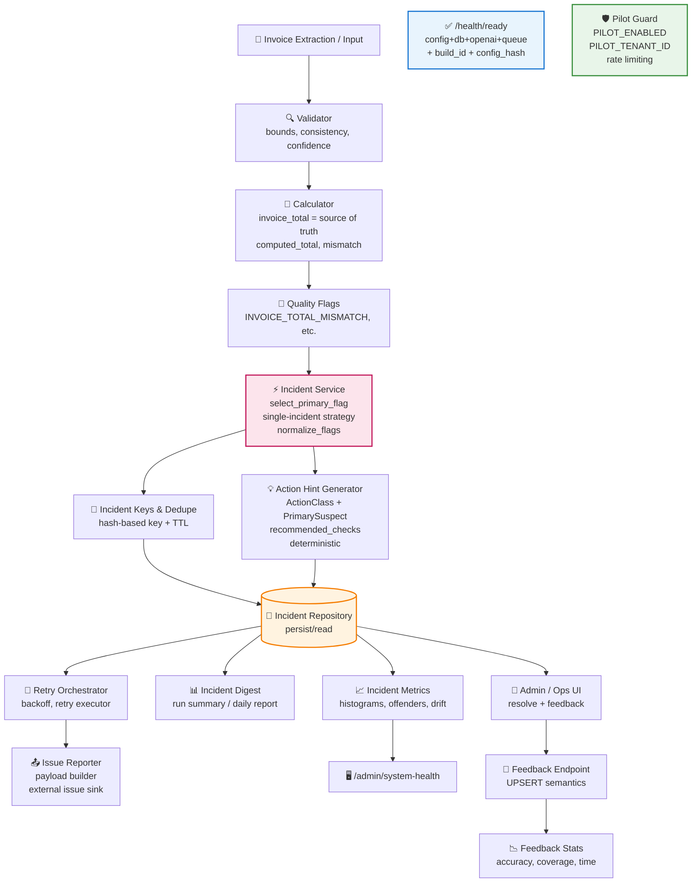

# Sistem Mimarisi

## Mermaid Diyagramı



---

## ASCII Diyagramı (Mermaid Desteklemeyen Ortamlar İçin)

```
┌─────────────────────────────────────────────────────────────────────────────┐
│                           INVOICE PROCESSING FLOW                            │
└─────────────────────────────────────────────────────────────────────────────┘

    ┌──────────────────┐
    │  Invoice Input   │
    │  (PDF/API/HTML)  │
    └────────┬─────────┘
             │
             ▼
    ┌──────────────────┐
    │    Validator     │  bounds, consistency, confidence
    └────────┬─────────┘
             │
             ▼
    ┌──────────────────┐
    │   Calculator     │  invoice_total = source of truth
    │                  │  computed_total, mismatch detection
    └────────┬─────────┘
             │
             ▼
    ┌──────────────────┐
    │  Quality Flags   │  INVOICE_TOTAL_MISMATCH, LOW_CONFIDENCE, etc.
    └────────┬─────────┘
             │
             ▼
┌────────────────────────────────────────────────────────────────────────────┐
│                         INCIDENT MANAGEMENT LAYER                           │
├────────────────────────────────────────────────────────────────────────────┤
│                                                                             │
│  ┌──────────────────┐    ┌──────────────────┐    ┌──────────────────┐     │
│  │ Incident Service │───▶│  Incident Keys   │───▶│   Repository     │     │
│  │ select_primary   │    │  hash-based      │    │   (SQLite/PG)    │     │
│  │ single-incident  │    │  dedupe + TTL    │    │                  │     │
│  └────────┬─────────┘    └──────────────────┘    └────────┬─────────┘     │
│           │                                               │               │
│           ▼                                               │               │
│  ┌──────────────────┐                                     │               │
│  │ Action Hint Gen  │                                     │               │
│  │ ActionClass      │                                     │               │
│  │ PrimarySuspect   │                                     │               │
│  │ deterministic    │                                     │               │
│  └──────────────────┘                                     │               │
│                                                           │               │
└───────────────────────────────────────────────────────────┼───────────────┘
                                                            │
                    ┌───────────────────────────────────────┼───────────────┐
                    │                                       │               │
                    ▼                                       ▼               ▼
           ┌──────────────┐                        ┌──────────────┐ ┌──────────────┐
           │    Retry     │                        │   Incident   │ │   Incident   │
           │ Orchestrator │                        │    Digest    │ │   Metrics    │
           │  backoff     │                        │ daily report │ │  histograms  │
           └──────┬───────┘                        └──────────────┘ └──────┬───────┘
                  │                                                        │
                  ▼                                                        ▼
           ┌──────────────┐                                       ┌──────────────┐
           │Issue Reporter│                                       │/admin/health │
           │payload build │                                       │system-health │
           └──────────────┘                                       └──────────────┘

┌─────────────────────────────────────────────────────────────────────────────┐
│                            FEEDBACK LOOP                                     │
├─────────────────────────────────────────────────────────────────────────────┤
│                                                                              │
│  ┌──────────────┐    ┌──────────────┐    ┌──────────────┐                   │
│  │  Admin UI    │───▶│   Feedback   │───▶│   Feedback   │                   │
│  │resolve+input │    │   Endpoint   │    │    Stats     │                   │
│  └──────────────┘    │UPSERT semant.│    │accuracy/time │                   │
│                      └──────────────┘    └──────────────┘                   │
│                                                                              │
└─────────────────────────────────────────────────────────────────────────────┘

┌─────────────────────────────────────────────────────────────────────────────┐
│                         SAFETY & OBSERVABILITY                               │
├─────────────────────────────────────────────────────────────────────────────┤
│                                                                              │
│  ┌──────────────────────────┐    ┌──────────────────────────┐               │
│  │     /health/ready        │    │      Pilot Guard         │               │
│  │  ┌────────────────────┐  │    │  ┌────────────────────┐  │               │
│  │  │ config validation  │  │    │  │ PILOT_ENABLED      │  │               │
│  │  │ db connectivity    │  │    │  │ PILOT_TENANT_ID    │  │               │
│  │  │ openai check       │  │    │  │ rate limiting      │  │               │
│  │  │ queue health       │  │    │  │ kill switch        │  │               │
│  │  │ build_id           │  │    │  └────────────────────┘  │               │
│  │  │ config_hash        │  │    │                          │               │
│  │  └────────────────────┘  │    │  ENV: PILOT_ENABLED=false│               │
│  └──────────────────────────┘    │  → instant disable       │               │
│                                  └──────────────────────────┘               │
│                                                                              │
└─────────────────────────────────────────────────────────────────────────────┘
```

---

## Bileşen Açıklamaları

### Core Processing

| Bileşen | Dosya | Sorumluluk |
|---------|-------|------------|
| Validator | `validator.py` | Bounds, consistency, confidence kontrolü |
| Calculator | `calculator.py` | invoice_total = source of truth, mismatch hesaplama |
| Quality Flags | `incident_service.py` | Flag normalizasyonu ve önceliklendirme |

### Incident Management

| Bileşen | Dosya | Sorumluluk |
|---------|-------|------------|
| Incident Service | `incident_service.py` | Primary flag seçimi, single-incident stratejisi |
| Incident Keys | `incident_keys.py` | Hash-based dedupe key üretimi |
| Action Router | `action_router.py` | S1/S2 routing, USER_FIX/RETRY/BUG_REPORT kararı |
| Repository | `incident_repository.py` | Persist/read operasyonları |

### Orchestration

| Bileşen | Dosya | Sorumluluk |
|---------|-------|------------|
| Retry Orchestrator | `retry_orchestrator.py` | Exponential backoff, retry scheduling |
| Retry Executor | `retry_executor.py` | Actual retry execution |
| Issue Reporter | `issue_reporter.py` | External issue sink entegrasyonu |

### Monitoring & Feedback

| Bileşen | Dosya | Sorumluluk |
|---------|-------|------------|
| Incident Digest | `incident_digest.py` | Günlük özet raporlama |
| Incident Metrics | `incident_metrics.py` | Histogramlar, top offenders, drift detection |
| Feedback Endpoint | `main.py` | UPSERT semantics ile feedback kayıt |

### Safety

| Bileşen | Dosya | Sorumluluk |
|---------|-------|------------|
| Pilot Guard | `pilot_guard.py` | Kill switch, tenant izolasyonu, rate limiting |
| Config | `config.py` | Tek kaynak threshold'lar, startup validation |
| Health Ready | `main.py` | Hazır/hazır değil health check |

---

## Veri Akışı Özeti

```
Invoice → Validate → Calculate → Flag → Incident → Route → Action
                                           │
                                           ├── USER_FIX → UI Alert
                                           ├── RETRY_LOOKUP → Schedule
                                           ├── BUG_REPORT → Issue Sink
                                           └── FALLBACK_OK → Auto-resolve
                                           
                                    Feedback ← Human Decision
```
