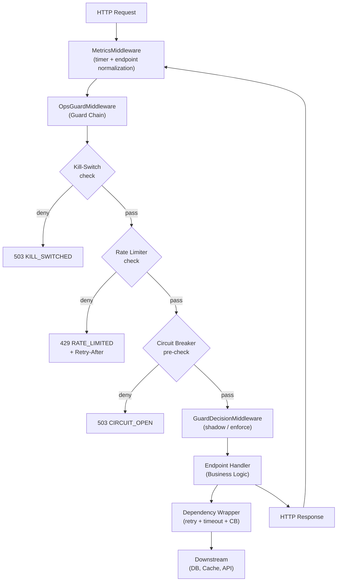
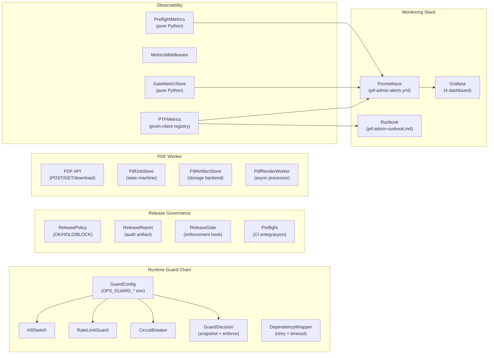
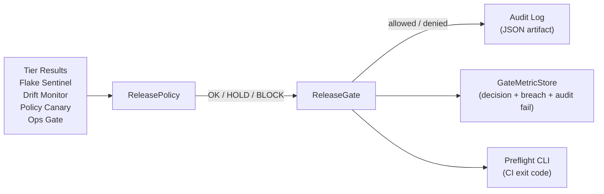
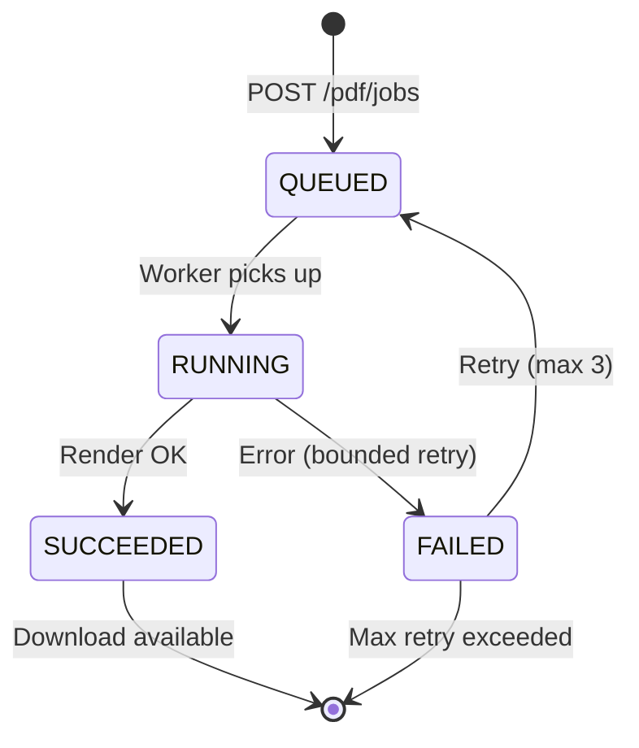

# PTF Admin — Mimari Genel Bakış

**Versiyon:** 1.0.0 · **Tarih:** 2026-02-19

---

## Sistem Özeti

PTF Admin, fatura analizi, piyasa fiyatı yönetimi ve PDF render işlemlerini kapsayan bir platform servisidir. Üzerine operasyonel koruma katmanı (guard chain), deterministik release governance ve derin gözlemlenebilirlik (observability) inşa edilmiştir.

Temel tasarım prensipleri:
- **Fail-closed** yüksek riskli yollar için (bulk import, write path)
- **Fail-open** standart okuma yolları için (operasyonel dayanıklılık)
- **Deterministik kararlar** — aynı girdi → aynı çıktı (guard, release, policy)
- **Feedback-first** — önce metrik yaz, sonra guard yaz, sonra alert bağla

---

## İstek Akışı (Request Flow)



Guard zinciri sırası sabittir (HD-2): **KillSwitch → RateLimiter → CircuitBreaker → Handler**. İlk deny kazanır; sonraki guard'lar değerlendirilmez.

---

## Alt Sistem Haritası



---

## Bileşen Detayları

### 1. Runtime Guard Chain

| Bileşen | Dosya | Görevi | Fail Modu |
|---------|-------|--------|-----------|
| GuardConfig | `guard_config.py` | Merkezi yapılandırma (Pydantic Settings) | Geçersiz config → fallback defaults + metrik |
| KillSwitch | `kill_switch.py` | Global/tenant/degrade mode kontrol | High-risk: fail-closed · Standard: fail-open |
| RateLimitGuard | `guards/rate_limit_guard.py` | Endpoint-kategori bazlı hız sınırlama | Fail-closed (HD-1) |
| CircuitBreaker | `guards/circuit_breaker.py` | Bağımlılık sağlık izleme (closed→open→half-open) | CB açık → 503 |
| GuardDecision | `guards/guard_decision.py` | İmmutable snapshot + sinyal değerlendirme | Shadow: log only · Enforce: 503 |
| DependencyWrapper | `guards/dependency_wrapper.py` | Retry + timeout + CB enforcement | Fail-open (DW-3) |
| OpsGuardMiddleware | `ops_guard_middleware.py` | Guard zinciri orkestrasyon | İlk deny kazanır |

**Endpoint Sınıfları:**
- `HIGH_RISK` (bulk import, apply) → guard hatası = **503 (fail-closed)**
- `STANDARD` (read, lookup, upsert) → guard hatası = **pass (fail-open)**

### 2. Release Governance



| Verdict | Exit Code | Override |
|---------|-----------|---------|
| OK | 0 | Gereksiz |
| HOLD + override | 0 | Uygulandı |
| HOLD (no override) | 1 | Sağlanmadı |
| BLOCK | 2 | İmkansız (ABSOLUTE) |

**Mutlak Bloklar** (override edilemez): `GUARD_VIOLATION`, `OPS_GATE_FAIL`

**R3 İnvariantı:** Audit yazılamadığında gate `allowed=False` döner — "kanıt yoksa izin yok."

### 3. PDF Worker



| Özellik | Değer |
|---------|-------|
| Template allowlist | `PDF_TEMPLATE_ALLOWLIST` env (prod zorunlu) |
| Payload limit | 256 KB (default) |
| Max retry | 3 |
| Artifact TTL | Configurable cleanup |
| Dedup | Aynı template+payload → mevcut job döner |

### 3.1 PDF Render Endpoint — Observability (PR-3)

`POST /generate-pdf-simple` endpoint'i Playwright tabanlı PDF render işlemini yönetir. Backpressure, timeout ve hata yolları aşağıdaki akışla enstrümante edilmiştir.

**İstek Akışı (4 Exit Path)**

```
Client
  │
  │ POST /generate-pdf-simple
  ▼
FastAPI handler
  │── t_total timer start
  │── semaphore acquire (timeout=2s)
  │     │
  │     ├─ TIMEOUT ──────────────────────────────────────► 429 + Retry-After: 5
  │     │   observe: acquire_seconds, requests_total{429},
  │     │            total_seconds, bytes(0)
  │     │   NOT observed: inflight, executor, overhead
  │     │
  │     └─ ACQUIRED
  │          │── inflight++ (gauge)
  │          │── run_in_executor(pdf-render pool, max=2)
  │          │     │
  │          │     ├─ EXECUTOR TIMEOUT (>30s) ──────────► 504
  │          │     │   observe: executor_seconds, total_seconds,
  │          │     │            overhead_seconds, bytes(0),
  │          │     │            requests_total{504}, errors_total{timeout}
  │          │     │
  │          │     └─ EXECUTOR OK
  │          │          │── bytes check
  │          │          │     │
  │          │          │     ├─ EMPTY (<10 bytes) ─────► 500
  │          │          │     │   observe: requests_total{500},
  │          │          │     │            errors_total{empty_pdf},
  │          │          │     │            total_seconds, overhead_seconds,
  │          │          │     │            bytes(0)
  │          │          │     │
  │          │          │     └─ VALID PDF ─────────────► 200
  │          │          │         observe: requests_total{200},
  │          │          │                  total_seconds, overhead_seconds,
  │          │          │                  bytes(actual_size)
  │          │          │
  │          │          └─ EXCEPTION ───────────────────► 500
  │          │              observe: requests_total{500},
  │          │                       errors_total{internal_error},
  │          │                       total_seconds, overhead_seconds,
  │          │                       bytes(0)
  │          │
  │          └── finally: inflight--, semaphore.release()
```

**Metrik Envanteri (8 metrik)**

| Metrik | Tip | Label | Açıklama |
|--------|-----|-------|----------|
| `ptf_admin_pdf_render_requests_total` | Counter | `status` ∈ {200, 429, 500, 504} | HTTP response sayacı |
| `ptf_admin_pdf_render_errors_total` | Counter | `reason` ∈ {empty_pdf, timeout, internal_error} | Gerçek hatalar (429 hariç — bilinçli rejection) |
| `ptf_admin_pdf_render_inflight` | Gauge | — | Aktif render sayısı (acquire → finally arası) |
| `ptf_admin_pdf_render_semaphore_acquire_seconds` | Histogram | — | Semaphore bekleme süresi (200 ve 429 dahil) |
| `ptf_admin_pdf_render_executor_seconds` | Histogram | — | Executor-internal render süresi (CPU/IO) |
| `ptf_admin_pdf_render_total_seconds` | Histogram | — | Uçtan uca istek süresi (entry → response) |
| `ptf_admin_pdf_render_overhead_seconds` | Histogram | — | `max(0, total - acquire - executor)` — informational, SLO/alert yok |
| `ptf_admin_pdf_render_bytes` | Histogram | — | PDF çıktı boyutu (200: gerçek, hata: 0) |

**Tasarım Notları**

- **Label boundedness:** `status` ve `reason` kapalı küme (frozenset). Geçersiz değerler sessizce reddedilir, metrik artmaz.
- **429 path scope:** 429'da sadece `acquire_seconds`, `requests_total`, `total_seconds`, `bytes` observe edilir. `inflight`, `executor_seconds`, `overhead_seconds` observe edilmez — executor çalışmadığı için anlamlı değer üretilemez.
- **Overhead clamp:** `overhead = max(0, total - acquire - executor)` — timer çözünürlüğü / scheduling noise nedeniyle negatif değer oluşabilir, `max(0, ...)` ile sıfıra clamp edilir.
- **Alert/Dashboard wiring:** PR-3 metrikleri henüz alert rule veya Grafana dashboard'a bağlanmamıştır. Bu bilinçli bir ertelemedir — alert eşikleri production baseline verisi gerektirir. Dashboard panelleri ve alert kuralları baseline toplama sonrası ayrı PR'da eklenecektir.

**PR-4 Açık Borç — SLO Query Alignment**

`backend/app/adaptive_control/config.py` içindeki `CANONICAL_PDF_SLO_QUERY`, `pdf_render_duration_seconds_bucket` referans eder. Bu isimde bir metrik Prometheus registry'de mevcut değildir. Etkilenen dosyalar:

| Dosya | Referans |
|-------|----------|
| `backend/app/adaptive_control/config.py` | `CANONICAL_PDF_SLO_QUERY` sabiti |
| `backend/tests/test_adaptive_config.py` | SLO query assertion (satır 265) |
| `.kiro/specs/slo-adaptive-control/design.md` | Config dataclass örneği |
| `.kiro/specs/slo-adaptive-control/requirements.md` | Req 2.3 canonical sinyal tanımı |
| `.kiro/specs/pdf-render-worker/requirements.md` | Req 5.2 metrik ismi |

PR-4 kararı: SLO hedefi `ptf_admin_pdf_render_total_seconds` (e2e kullanıcı deneyimi), kapasite tuning hedefi `ptf_admin_pdf_render_executor_seconds` (CPU/IO darboğazı).

### 4. Metrics & Telemetry

**Namespace:** Tüm metrikler `ptf_admin_` prefix'i kullanır.

| Kategori | Örnek Metrikler | Kaynak |
|----------|----------------|--------|
| API | `api_request_total{endpoint, method, status_class}` | MetricsMiddleware |
| Business | `upsert_total{status}`, `import_rows_total{outcome}` | Endpoint handlers |
| Guard | `killswitch_state{switch_name}`, `circuit_breaker_state{dependency}` | Guard bileşenleri |
| SLO | `slo_violation_total{slo_name}` | SLI calculator |
| PDF | `pdf_jobs_total{status}`, `pdf_queue_depth` | PDF API + Worker |
| PDF Render | `pdf_render_requests_total{status}`, `pdf_render_inflight`, `pdf_render_*_seconds` | Endpoint handler (PR-3) |
| Release Gate | `release_gate_decision_total{decision}` | GateMetricStore (pure Python) |
| Preflight | `release_preflight_verdict_total{verdict}` | PreflightMetrics (pure Python) |
| Frontend | `frontend_events_total{event_name}` | Event ingestion API |

**Label Politikası (HD-5):**
- `status_class`: 2xx/3xx/4xx/5xx/0xx (exact code YASAK)
- `endpoint`: route template (raw URL path YASAK)
- `dependency`: sabit enum (5 değer)
- `user_id`, `tenant_id`, `period` gibi yüksek kardinalite label'lar YASAK

### 5. Monitoring Stack

**Prometheus Alert Grupları** (`ptf-admin-alerts.yml`):

| Grup | Alert Sayısı | Kapsam |
|------|-------------|--------|
| `ptf-admin-alerts` | 8 | API hataları, latency, import kalitesi |
| `ptf-admin-preflight-guardrails` | 4 | Contract breach, BLOCK spike, telemetry write fail |
| `ptf-admin-ops-guard` | 7 | Kill-switch, CB, rate limit, SLO burn-rate |
| `ptf-admin-dependency-health` | 8 | Dependency timeout/failure/retry, CB open |
| `ptf-admin-guard-decision` | 3 | Snapshot build failure, block rate, silent layer |
| `ptf-admin-release-gate` | 3 | Contract breach, audit fail, DENY spike |
| `ptf-admin-pdf-worker` | 4+ | Queue unavailable, failure spike, stuck jobs |

**Grafana Dashboard'ları** (`monitoring/grafana/`):

| Dashboard | Paneller |
|-----------|---------|
| `ptf-admin-dashboard.json` | Golden signals, guard state, error taksonomisi |
| `pdf-worker-dashboard.json` | Job queue, success/failure, duration dağılımı |
| `preflight-dashboard.json` | Verdict dağılımı, override geçmişi |
| `release-gate-dashboard.json` | ALLOW/DENY trend, top deny reasons, breach count |

**Runbook:** `monitoring/runbooks/ptf-admin-runbook.md` — her P0/P1 alert için: belirti, hızlı tanı, müdahale, kurtarma, postmortem verisi.

---

## Middleware Yığını (Execution Order)

```
1. CORSMiddleware          — CORS headers
2. MetricsMiddleware       — Request count + duration + endpoint normalization
3. GuardDecisionMiddleware — Immutable snapshot + shadow/enforce (opsiyonel)
4. OpsGuardMiddleware      — KillSwitch → RateLimiter → CircuitBreaker
5. Endpoint Handler        — Business logic
```

---

## Dosya Haritası (Özet)

```
backend/app/
├── main.py                          # FastAPI app, middleware wiring, startup
├── ptf_metrics.py                   # Prometheus metrik registry (singleton)
├── metrics_middleware.py            # HTTP request metrics collection
├── ops_guard_middleware.py          # Guard chain orchestration
├── guard_config.py                  # Centralized guard config (Pydantic)
├── kill_switch.py                   # Kill-switch state + admin API
├── endpoint_normalization.py        # 3-level endpoint label fallback
├── pdf_api.py                       # PDF job endpoints
├── guards/
│   ├── guard_decision.py            # Snapshot factory + signal producers
│   ├── guard_decision_middleware.py  # Guard Decision Layer middleware
│   ├── circuit_breaker.py           # CB state machine
│   ├── rate_limit_guard.py          # Endpoint-category rate limiter
│   ├── dependency_wrapper.py        # Retry + timeout + CB wrapper
│   └── endpoint_dependency_map.py   # Endpoint → dependency mapping
├── services/
│   ├── pdf_job_store.py             # PDF job state persistence
│   └── pdf_artifact_store.py        # PDF file storage
└── testing/
    ├── release_policy.py            # Deterministic release decision
    ├── release_gate.py              # Enforcement + override validation
    ├── release_report.py            # Audit artifact generation
    ├── gate_metrics.py              # Release gate telemetry (pure Python)
    ├── preflight_metrics.py         # Preflight telemetry (pure Python)
    └── chaos_harness.py             # Fault injection framework

monitoring/
├── prometheus/ptf-admin-alerts.yml  # 37+ alert kuralı (7 grup)
├── grafana/                         # 4 dashboard JSON
└── runbooks/ptf-admin-runbook.md    # Operasyonel runbook
```

---

## Tasarım Kararları Referans Tablosu

| Karar | Değer | Gerekçe |
|-------|-------|---------|
| Guard sırası | KS → RL → CB | Devre dışı endpoint'e rate limit penceresi açılmamalı |
| High-risk fail modu | Fail-closed (503) | Kontrolsüz bulk write prod veriyi bozabilir |
| Standard fail modu | Fail-open | Read/tekil write durdurulmamalı |
| Release ABSOLUTE_BLOCK | Override edilemez | GUARD_VIOLATION + OPS_GATE_FAIL sözleşme ihlali |
| Audit fail → deny | R3 invariantı | Kanıt yoksa izin yok |
| Shadow → Enforce rollout | Güvenli geçiş | False positive tespiti sonra enforcement |
| Label cardinality budget | HD-5 tablosu | Prometheus'ta kardinalite patlaması önlemi |
| Config invalid → fallback | Asla reject etme | Reject prod'u config hatasında kilitler |

---

## Test Katmanları

| Katman | Araç | Kapsam |
|--------|------|--------|
| Unit | pytest | Bireysel bileşenler (guard, metrics, policy) |
| Property-Based | Hypothesis | Determinizm, monotoniklik, round-trip, cardinality |
| Integration | pytest + TestClient | Middleware wiring, E2E akışlar |
| Load | Custom harness | Concurrency, SLO doğrulama |
| Chaos | ChaosHarness | Fault injection (time, IO, split-brain) |
| Monitoring | pytest | Alert kuralları, dashboard yapısı, runbook kapsam |


---

## Prod Rollout Checklist

Detaylı checklist: [`monitoring/runbooks/ptf-admin-runbook.md` → "Prod Rollout Checklist"](../monitoring/runbooks/ptf-admin-runbook.md)

Özet deploy sırası:
1. **Monitoring önce** — Prometheus targets, Grafana dashboards, alert rules
2. **Worker önce** — PDF worker up, queue depth 0, Playwright stabil
3. **API sonra** — Backend deploy, `/health/ready` → 200, frontend deploy
4. **Shadow → Enforce** — 24 saat shadow data, false positive yok, sonra enforce

---

## Yük Testi Planı

Detaylı plan: [`monitoring/runbooks/ptf-admin-runbook.md` → "Yük Testi Planı"](../monitoring/runbooks/ptf-admin-runbook.md)

5 senaryo, 2 katman:

| Senaryo | Katman | Hedef |
|---------|--------|-------|
| S1: PDF Steady-State | k6 HTTP | p95 baseline, failure rate < %2 |
| S2: PDF Burst/Backlog | k6 HTTP | Queue drain davranışı, backlog alert |
| S3: PDF Retry Injection | k6 HTTP | Retry bounded (max 2), failure taxonomy |
| S4: API + Guard | In-process + k6 | Shadow/enforce latency impact, risk class |
| S5: Dependency Outage | In-process | CB open, rate limit, fail-open doğrulaması |

---

## Yük Testi Sonuç Raporu Şablonu

Detaylı şablon: [`monitoring/runbooks/ptf-admin-runbook.md` → "Yük Testi Sonuç Raporu Şablonu"](../monitoring/runbooks/ptf-admin-runbook.md)

Tek sayfalık go/no-go raporu: üstte karar + kabul kontrolleri, altta PDF metrikleri, guard metrikleri, alert gözlemleri, güvenilirlik kontrolleri (stuck/memory/TTL), ekler ve aksiyonlar.

k6 script'leri: [`k6/pdf_jobs.js`](../k6/pdf_jobs.js) (S1/S2/S3), [`k6/api_mix.js`](../k6/api_mix.js) (S4).
